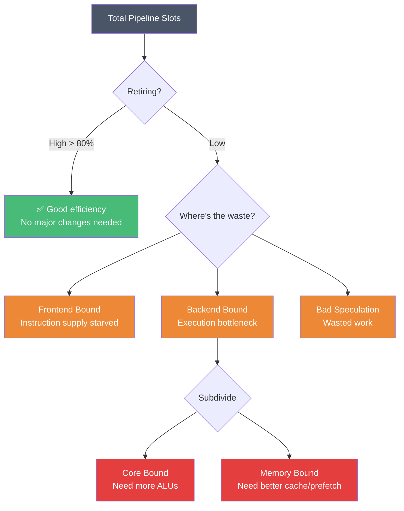
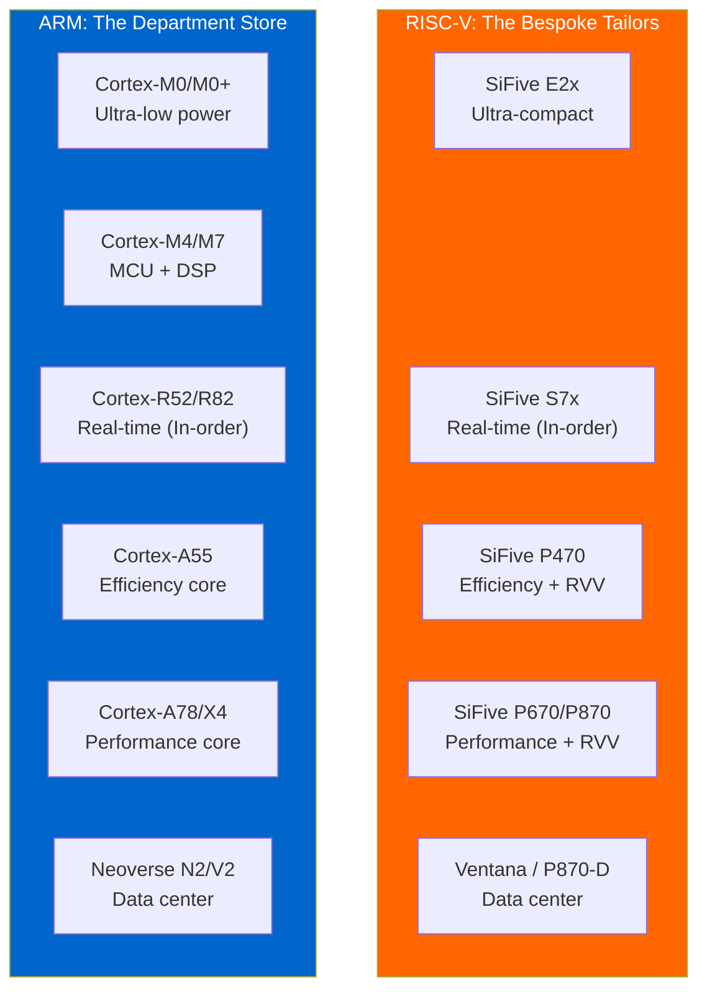
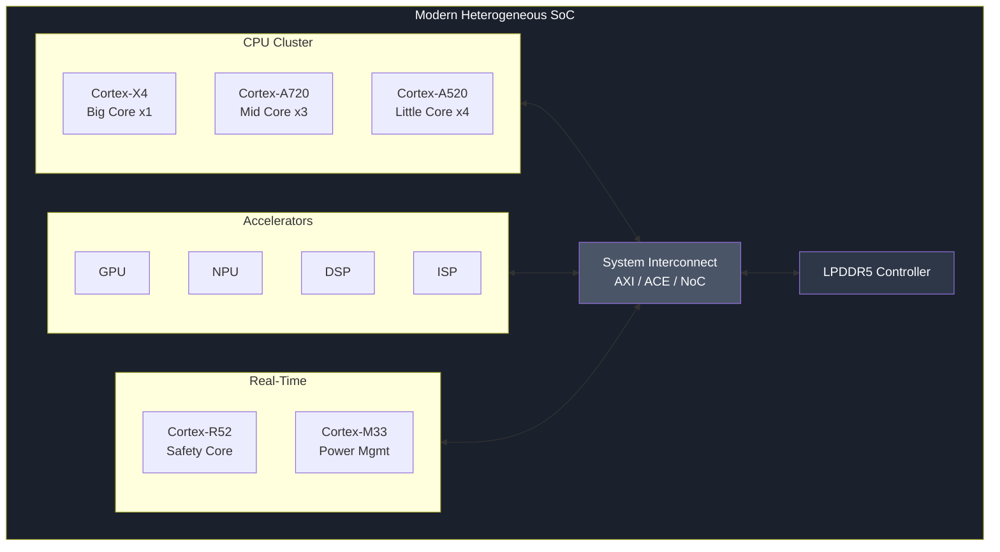

# Workload-Driven CPU Selection: The Architect as Tailor

**Author**: Danny Jiang
**Date**: 2026-02-25

---

## §1 Introduction: The Architect as Tailor

A few months ago, a colleague asked me for advice on their new project:

> "We're designing a Smart Speaker SoC. The boss wants us to use 'the best CPU core available.' Should we go with Cortex-X4?"

My answer surprised them: **No. Cortex-X4 would be a terrible choice.**

This reaction is common. We instinctively associate "best" with "most powerful." But in system architecture, this thinking leads to disaster.

### The Tailor's Wisdom

Think of a CPU architect as a **tailor**.

When a client walks into a tailor's shop, the tailor doesn't immediately reach for the most expensive Italian silk. Instead, they ask questions:

- *What's the occasion?* (A wedding suit differs from workout clothes)
- *What's your budget?* (Fabric cost must match the client's constraints)
- *What's your lifestyle?* (A construction worker needs durability, not delicacy)

Only after understanding the client's needs does the tailor select materials and cut the pattern.

**CPU selection works exactly the same way.**

A Smart Speaker spends 99% of its time waiting—waiting for wake-word detection, waiting for network responses, waiting for audio buffers to drain. Its workload is I/O-bound, not compute-bound. The Cortex-X4's massive out-of-order engine would sit idle most of the time, burning power and silicon area for performance that's never utilized.

A Cortex-A55—with one-third the area and one-fifth the power—would deliver identical user experience at a fraction of the cost.

The tailor's wisdom applies: **measure first, then cut**.

### Connecting to Previous Articles

In *Article 01: All Roads Lead to IPC*, we established that every microarchitecture feature exists to maximize IPC. Wider pipelines, deeper ROBs, sophisticated branch predictors—these are mechanisms to extract more instructions per cycle from sequential code.

In *Article 02: Heterogeneous System Architecture*, we expanded the view to multi-processor systems. When single-core IPC hits physical limits, we turn to heterogeneous computing: CPU + GPU + NPU + DSP.

This article bridges these concepts with a practical question: **Given a specific workload, how do you choose the right CPU core?**

We'll follow the tailor's three-step process:

| Step | Tailor's Action | Architect's Action |
|------|-----------------|-------------------|
| **§2 Measure** | Take the client's measurements | Profile workload "fingerprints" (TMAM, cache behavior, branch patterns) |
| **§3 Select Fabric** | Choose appropriate materials | Survey the CPU landscape (ARM vs RISC-V) |
| **§4 Cut & Fit** | Tailor the garment to the client | Match microarchitecture to five real-world scenarios |

By the end, you'll have a systematic framework for CPU selection—whether you're designing a touchpad controller or a data center server.

### The Extremes: Why One Size Cannot Fit All

Before diving into methodology, let's examine two extreme cases.

**Case 1: Neoverse V2 in a Touchpad Controller**

ARM Neoverse V2 is a data center powerhouse: 5-wide decode, 256-entry ROB, 1.5MB L2 cache. Now imagine putting this in a laptop touchpad controller—sampling sensors at 100Hz and sending HID reports over I2C.

| Resource | Neoverse V2 Provides | Touchpad Actually Needs |
|----------|---------------------|------------------------|
| ROB entries | 256 | ~8 |
| L2 Cache | 1.5MB | 4-8KB |
| Frequency | 3+ GHz | 50 MHz |
| Power | 5-15W | < 10mW |
| Die area | ~3mm² | 0.1mm² budget |

This is like wearing a three-piece Armani suit to a beach volleyball game. Expensive, uncomfortable, and utterly inappropriate.

**Case 2: Cortex-M0+ in a Database Server**

Conversely, imagine using ARM's smallest core—Cortex-M0+—as the main CPU in a PostgreSQL server. A query taking 10ms on Neoverse N2 would take **minutes** on M0+.

This is like showing up to a black-tie gala in flip-flops and a tank top. You'll be turned away at the door.

**The Lesson**

These extremes are obvious. The interesting questions live in the middle:

- Should your SSD controller use Cortex-R52 or Cortex-A55?
- Does your IoT gateway need RISC-V P470 or would U74 suffice?
- When does a mobile SoC justify Cortex-X series over more A-series cores?

A skilled tailor knows how to navigate these nuanced decisions. Let's learn their craft.

---

## §2 Measure: Profiling the Workload Fingerprint

Just as a tailor takes measurements before cutting fabric, an architect must profile the workload before selecting a CPU. You wouldn't cut a suit without knowing the client's chest size, arm length, and posture. Similarly, you shouldn't pick a CPU without understanding your workload's computational "fingerprint."

This section introduces the tools for taking those measurements.

### §2.1 TMAM: The Workload Health Report

Intel's **Top-Down Microarchitecture Analysis Method (TMAM)** is our primary diagnostic tool. Think of it as a comprehensive health report for your workload.

TMAM classifies every CPU cycle into one of four categories:

| Category | Meaning | Restaurant Analogy |
|----------|---------|-------------------|
| **Frontend Bound** | Backend is ready, but frontend can't supply instructions fast enough | Kitchen is ready, but prep station can't deliver ingredients |
| **Backend Bound** | Frontend supplies instructions, but backend is stalled | Ingredients are ready, but chefs are overwhelmed |
| **Bad Speculation** | Instructions were executed but discarded (branch misprediction) | Food was cooked but sent back—wasted effort |
| **Retiring** | Instructions successfully completed and committed | Dishes successfully served to customers |

Ideally, we want **Retiring as high as possible**—this means the CPU is doing useful work. Everything else represents inefficiency.

**Backend Bound** further subdivides into:
- **Core Bound**: Not enough execution units (ALUs, multipliers, dividers)
- **Memory Bound**: Waiting for data from memory (cache misses, DRAM latency)

#### TMAM Is a Decision Tree, Not Four Parallel Metrics

Here's a critical insight: **TMAM is not a dashboard of four independent numbers. It's a top-down diagnostic tree.**



The diagnostic logic works like a doctor's examination:

1. **Start at the top**: Is Retiring high (>80%)? If yes, congratulations—this CPU already fits this workload well. No major surgery needed.

2. **If Retiring is low**: Where are the cycles being wasted? Frontend Bound? Backend Bound? Bad Speculation?

3. **Drill down**: If Backend Bound is 50%, is it Core Bound (need more execution units) or Memory Bound (waiting for memory)?

To extend the restaurant analogy: **Core Bound** means you don't have enough chefs or stoves to cook the prepped ingredients. **Memory Bound** means your chefs are standing idle, waiting for ingredients to be fetched from a deep freezer (DRAM).

This "peel the onion" approach lets architects **quickly locate the bottleneck level** without drowning in hundreds of PMU counters. A doctor doesn't order a full-body MRI immediately—they check temperature and heart rate first, then decide whether deeper investigation is needed.

### §2.2 From Fingerprints to Hardware Knobs

Once you have the TMAM health report, the next step is translating diagnosis into prescription—mapping workload "fingerprints" to microarchitecture "knobs."

#### Fingerprint 1: Branchiness

**Question**: How branch-heavy is your code? How predictable are those branches?

**Metrics**:
- Branches per kilo-instructions (BPKI)
- Branch misprediction rate

**Hardware Knobs**:
- High branchiness + unpredictable → Invest in larger **BTB (Branch Target Buffer)** and sophisticated predictors (TAGE, Perceptron)
- Low branchiness → Simple predictor suffices; save the silicon for other features

#### Fingerprint 2: Cache Behavior

**Question**: Does your working set fit in cache? What's the miss rate at each level?

**Metrics**:
- L1/L2/L3 miss rates
- Memory bandwidth utilization

**Hardware Knobs**:
- High miss rates + streaming access → Invest in **prefetchers**
- High miss rates + random access → Larger caches or accept the latency and invest in **latency hiding** (bigger ROB)
- Low miss rates → Small caches suffice; save area

Understanding cache behavior requires knowing how your data structures map to cache lines—a topic I explore extensively in *[Data Structures in Practice](https://github.com/djiangtw/data-structures-in-practice-public)*.

#### Fingerprint 3: Stall Breakdown

**Question**: When the pipeline stalls, what's it waiting for?

**Metrics**:
- Cycles stalled on memory
- Cycles stalled on execution units
- Cycles stalled on dependencies

**Hardware Knobs**:
- Memory stalls dominant → Bigger ROB, more MSHRs, better prefetching
- Execution stalls dominant → Wider issue, more functional units
- Dependency stalls dominant → Better forwarding, speculative execution

### §2.3 Classical Performance Laws: The Mathematical Foundation

The tailor metaphor captures intuition, but architecture is ultimately engineering. Two classical laws provide the mathematical foundation for our decisions.

#### Roofline Model: Compute-Bound vs Memory-Bound

The Roofline Model, introduced by Williams et al. at Berkeley, visualizes the fundamental trade-off:

$$
\text{Attainable Performance} = \min(\text{Peak Compute}, \text{Peak Bandwidth} \times \text{Arithmetic Intensity})
$$

**Arithmetic Intensity** = FLOPs per byte of memory traffic.

- **Low arithmetic intensity** (e.g., memory streaming): Performance is **memory-bound**. Adding more ALUs won't help.
- **High arithmetic intensity** (e.g., dense matrix multiply): Performance is **compute-bound**. Memory bandwidth isn't the bottleneck.

**Architectural Implications**:
- Memory-bound workloads → Invest in cache hierarchy, prefetchers, memory bandwidth
- Compute-bound workloads → Invest in execution units, SIMD width, clock frequency

#### Little's Law: The Mathematics of Latency Hiding

Little's Law, originally from queueing theory, has profound implications for CPU design:

$$
L = \lambda \times W
$$

In CPU terms: **In-flight instructions = IPC × Memory Latency**

Let's work through an example. Suppose:
- Target IPC: 2 instructions/cycle
- Memory latency: 200 cycles (typical DRAM access)

To sustain 2 IPC while waiting for memory:

$$
\text{In-flight instructions} = 2 \times 200 = 400 \text{ entries}
$$

This is why data center cores like Neoverse V2 and Apple M-series have ROBs with 300-600 entries. It's not showing off—it's **mathematical necessity**.

> **Architecture is not intuition. Architecture is precise mathematics.**

When you can derive ROB size from Little's Law, diagnose bottlenecks with Roofline, and classify stalls with TMAM—you're no longer "guessing" which CPU to use. You're making **data-driven decisions**. If you want to master these diagnostic tools, I cover these performance analysis techniques comprehensively in *[Performance and Benchmarking](https://github.com/djiangtw/performance-and-benchmarking-public)*.

### §2 Summary: The Measurement Checklist

Before selecting a CPU, answer these questions:

| Question | Fingerprint | Hardware Knob |
|----------|-------------|---------------|
| Is my code branch-heavy? | Branchiness | BTB size, predictor sophistication |
| Does my working set fit in cache? | Cache behavior | Cache sizes, prefetcher aggressiveness |
| Am I compute-bound or memory-bound? | Roofline position | Execution width vs memory subsystem |
| How much latency must I hide? | Little's Law calculation | ROB size, MSHRs |

With these measurements in hand, we're ready to survey the fabric options.

---

## §3 Select Fabric: The CPU Landscape

With your workload's measurements in hand, the next question is: **What fabrics are available?**

In the embedded and server CPU market, two major players dominate: **ARM** and **RISC-V**. They represent fundamentally different business models and design philosophies.



- **ARM** is like a high-end department store: complete product lines, guaranteed quality, fixed pricing, mature after-sales support. You're buying "off-the-rack" suits—well-made, but limited customization.

- **RISC-V** is like a guild of independent tailors: some specialize in formal wear, others in sportswear, and some let you bring your own fabric. You're buying "bespoke services"—maximum flexibility, but requiring more integration effort.

Let's examine each ecosystem.

### §3.1 ARM's Hierarchy: The Department Store

ARM organizes its CPU portfolio into distinct "departments," each targeting specific market segments.

#### Cortex-M: The Basement Bargain Section

**Target**: Microcontrollers, sensors, wearables, IoT endpoints

| Core | Pipeline | Features | Typical Use |
|------|----------|----------|-------------|
| **M0/M0+** | 2-stage, In-order | Minimal gate count (~12K gates) | Touchpads, sensor hubs |
| **M4** | 3-stage, In-order | DSP extensions, optional FPU | Motor control, audio |
| **M7** | 6-stage, In-order | Branch prediction, cache | High-performance MCU |

**Design Philosophy**: *Less is more.* Every gate consumes power. For a device running on a coin cell battery for 10 years, the "best" CPU is the smallest one that meets requirements.

#### Cortex-R: The Safety & Real-Time Department

**Target**: SSD controllers, automotive ECUs, baseband processors, industrial control

| Core | Pipeline | Key Features | Typical Use |
|------|----------|--------------|-------------|
| **R52** | In-order, dual-issue | TCM, low-latency interrupts, **Dual-Core Lock-Step (DCLS)** | ADAS, SSD FTL |
| **R82** | In-order, 64-bit | Linux-capable, larger address space | 5G baseband, storage |

**Design Philosophy**: *Determinism is justice.* When your workload has hard real-time deadlines (microsecond-level interrupt response, power-loss protection sequences), predictability trumps peak performance.

#### Cortex-A: The Main Floor

**Target**: Smartphones, tablets, smart TVs, IoT gateways

| Core | Pipeline | Position | Typical Use |
|------|----------|----------|-------------|
| **A55** | 2-wide, light OoO | Efficiency core | Background tasks, always-on |
| **A78/A720** | 4-wide, deep OoO | Balanced core | Daily workloads |
| **X4/X925** | 8-wide, extreme OoO | Peak performance | App launch, gaming bursts |

**Design Philosophy**: *Experience is everything.* Mobile users want instant response when they tap, but also all-day battery life. This tension drives the Big.LITTLE architecture we'll explore in §4.

#### Neoverse: The Executive Suite

**Target**: Cloud servers, HPC, AI infrastructure

| Core | Position | Key Features |
|------|----------|--------------|
| **N2** | Scale-out | Balanced perf/watt, high core counts |
| **V2** | Scale-up | Maximum single-thread performance, SVE2 |
| **E2** | Edge servers | Efficiency-focused |

**Design Philosophy**: *TCO is truth.* In data centers, every watt of power and every square millimeter of silicon translates to operational cost. Architects optimize for throughput-per-dollar, not benchmark scores.

> **Reference**: ARM Neoverse V2 Platform Technical Overview; ARM Cortex-R52 Technical Reference Manual

### §3.2 RISC-V: The Bespoke Tailors' Guild

RISC-V offers a fundamentally different value proposition. The ISA is open—anyone can implement it without licensing fees. This has created a diverse ecosystem of vendors, each with different specializations.

#### SiFive: The Premium Tailor

SiFive, founded by the RISC-V inventors, offers the most mature commercial cores:

| Series | Target | Comparable to |
|--------|--------|---------------|
| **E2x** | Ultra-low power MCU | Cortex-M0+ |
| **S7x** | Real-time control | Cortex-R5/R8 |
| **P470** | Efficiency applications | Cortex-A55 (**claimed 2× perf**) |
| **P670** | Performance applications | Cortex-A78 |
| **P870** | High-performance | Cortex-X2 / Zen 4c class |

The P-series cores include **RVV (RISC-V Vector Extension)**, providing SIMD capabilities competitive with ARM's SVE/SVE2.

> **Reference**: SiFive Performance P870 Product Brief

#### XiangShan: The Open-Source Artisan

XiangShan (香山) is an open-source high-performance RISC-V core developed by the Institute of Computing Technology, Chinese Academy of Sciences:

- **Nanhu (南湖)**: 6-wide OoO, ~10 SPECint2006/GHz
- **Kunminghu (昆明湖)**: Next-generation, targeting Neoverse N2-class performance

The significance: a fully open-source, high-performance core that anyone can study, modify, and manufacture.

> **Reference**: Xu, Y., et al. "Towards Developing High Performance RISC-V Processors Using Agile Methodology." *MICRO 2022*.

#### Ventana: The Data Center Specialist

Ventana Micro Systems targets the data center with a chiplet-based approach:

- **Veyron V1**: High-performance RISC-V core designed for server workloads
- **Chiplet strategy**: Customers can assemble their own server SoCs using Ventana chiplets

This lowers the barrier to building data center SoCs—you don't need to design a 10-billion-transistor chip from scratch.

> **Reference**: "Ventana Veyron V1: High-Performance RISC-V Processor for the Data Center," Hot Chips 2023

For readers wanting a deeper dive into RISC-V ISA, microarchitecture, and system integration, *[See RISC-V Run](https://github.com/djiangtw/see-riscv-run-public)* provides a comprehensive treatment.

### §3.3 Evaluation Axes: How to Compare Fabrics

When comparing CPU options, architects evaluate along four dimensions:

#### Axis 1: IPC and Perf/Watt

The most intuitive metric—but context matters.

- **Server workloads**: Prioritize **Perf/Watt** (performance per watt). Electricity is the dominant operational cost.
- **Mobile bursts**: Prioritize **peak IPC**. App launch must feel instant, even if it only lasts 500ms.

**Warning**: Benchmark IPC ≠ your workload's IPC. A core that excels on SPEC may struggle on your specific memory access patterns.

#### Axis 2: Perf/mm² (Area Efficiency)

For cost-sensitive markets (smart TVs, IoT gateways), **performance per square millimeter of silicon** is critical.

This explains why the humble Cortex-A55 ships in **orders of magnitude greater volume** than the flagship Cortex-X series. Most applications simply cannot afford the X-series' area cost, nor do they need its peak IPC. The A55 may well be one of the highest-volume 64-bit CPU cores in human history.

| Metric | Cortex-A55 (Efficiency) | Cortex-A78 (Performance) | Implication |
|--------|------------------------|-------------------------|-------------|
| **Decode Width** | 2-wide (light OoO) | 4-wide (deep OoO) | A55 handles background tasks fine |
| **Relative Area** | **~0.3×** | 1.0× | Same area fits 3-4 A55 cores |
| **Peak Power** | **< 0.5W** | 1.5W+ | Fanless design friendly |
| **Single-Core IPC** | ~0.6× | 1.0× | For I/O-bound workloads, gap is imperceptible |

For workloads that spend most of their time waiting on I/O, A55's IPC disadvantage is barely noticeable—but its area and power advantages are immediate.

#### Axis 3: Extensibility and Customization

This is RISC-V's greatest strength.

- **Standard extensions**: RVV (Vector), Zba/Zbb (Bit manipulation), Crypto
- **Custom extensions**: You can add workload-specific instructions

**Quantified Example: Audio DSP Custom Instructions**

Suppose you're designing a TWS (True Wireless Stereo) earbud SoC. The core workload is **Active Noise Cancellation (ANC)**. A simplified hot loop might look like:

```c
// Execute once per audio sample
for (int i = 0; i < N; i++) {
    int32_t tmp = coef[i] * delay_line[i];  // Multiply
    tmp = tmp >> 15;                         // Fixed-point scaling
    acc += tmp;                              // Accumulate
}
```

On standard RISC-V (or ARM Cortex-M4), each iteration requires **10-15 instructions**: loads, multiply, shift, accumulate, index update, branch...

With RISC-V custom instructions, you can design a single fused operation:

```
MAC_AQ  rd, rs1, rs2, rs3   // Multiply-Accumulate with Auto-Queue
// Function: rd = rd + (rs1 * rs2) >> rs3
// Simultaneously advances hardware delay-line queue
```

A single fused custom instruction **obliterates** the entire 12-instruction sequence. The results are transformative:

| Metric | Standard Instructions | Custom Instruction | Improvement |
|--------|----------------------|-------------------|-------------|
| Instructions per iteration | 12 | 1 | **12×** |
| Fetch/Decode power | Baseline | ~1/12 | **92% reduction** |
| Code size | Baseline | Much smaller | Lower I-cache pressure |

For ultra-compact scenarios (§4.1), this customization means: **smaller core, lower power, same performance**.

**However, there's no free lunch.**

When you invent a custom instruction, standard GCC/LLVM won't generate it automatically. You must:

- Write **inline assembly** or **intrinsic functions**
- Maintain a **compiler patch** or use vendor-provided toolchains
- Ensure future software updates don't break this custom code

This means your software becomes **deeply coupled to this specific hardware (Vendor Lock-in)**. If you later want to switch to a different RISC-V core, those custom instructions may be completely incompatible.

This is the "**ecosystem fragmentation**" cost of customization—you trade software portability for hardware efficiency. Architects must make this trade-off wisely.

This is the true value of RISC-V's "bespoke tailor" model—not "cheap," but "precisely fitted to your workload." But that bespoke suit? Only you can wear it.

> **Reference**: SiFive Custom Extensions Specification & Application Notes

#### Axis 4: Ecosystem Maturity

The "soft" factor that's easy to underestimate:

| Aspect | ARM | RISC-V |
|--------|-----|--------|
| **Compiler support** | GCC, LLVM, commercial compilers mature | GCC/LLVM good, some vendor extensions fragmented |
| **OS support** | Linux, RTOS, bare-metal all mature | Linux good, RTOS improving, enterprise software catching up |
| **Debug tools** | DS-5, Lauterbach, widespread | Growing but less mature |
| **Talent pool** | Large existing workforce | Smaller but growing |
| **Supply chain** | Mature multi-source | Emerging |

For products shipping in 2026, ARM's ecosystem maturity is a significant advantage. For 2028+ products, RISC-V's ecosystem gap may have largely closed.

### §3 Summary: ARM vs RISC-V at a Glance

| Dimension | ARM | RISC-V |
|-----------|-----|--------|
| **Business model** | License IP, pay royalties | Open ISA, implement freely |
| **Product line** | Complete hierarchy (M/R/A/Neoverse) | Diverse vendors, varying maturity |
| **Customization** | Limited (some Cortex-M custom instructions) | Extensive (custom extensions built into ISA philosophy) |
| **Ecosystem** | Mature | Rapidly maturing |
| **Best for** | Time-to-market, proven solutions | Cost optimization, workload-specific customization |

With fabric options understood, we're ready to cut and fit. The next section applies our framework to five real-world scenarios.

---

## §4 Cut & Fit: Five Design Scenarios

Now comes the tailor's true craft: **cutting the fabric to fit the client**.

We'll examine five archetypal scenarios spanning the full spectrum from microcontrollers to data centers. For each, we'll identify the workload fingerprint, derive the appropriate microarchitecture decisions, and recommend suitable CPU cores.

### §4.1 Ultra-Low Power: Touchpads, TWS Earbuds, Sensor Hubs

**Representative Products**: Laptop touchpads, TWS (True Wireless Stereo) earbuds, wearable sensors, smart home sensors

**The Constraints**

These devices share brutal constraints:

| Constraint | Typical Requirement |
|------------|---------------------|
| **Power budget** | < 10mW active, < 1µW standby |
| **Die area** | < 0.5mm² for the CPU |
| **Battery** | Coin cell (years of life) or energy harvesting |
| **Workload** | Simple control loops, sensor fusion, low-rate DSP |

**Workload Fingerprint**

- **Compute intensity**: Extremely low. Most time spent in sleep or waiting for interrupts.
- **Working set**: Tiny. Entire program fits in 16-64KB.
- **Branch behavior**: Simple, predictable loops.
- **Memory access**: Local SRAM only. No external DRAM.

**Microarchitecture Decisions**

| Knob | Decision | Rationale |
|------|----------|-----------|
| **Pipeline** | 2- to 3-stage, In-order | Every pipeline register costs power |
| **OoO** | ❌ Absolutely not | Zero benefit for simple loops; massive power cost |
| **Branch predictor** | None or trivial | Predictable loops don't need it |
| **Cache** | None | Working set fits in tightly-coupled memory |
| **FPU** | Optional, or fixed-point DSP | Depends on algorithm requirements |

**Representative CPUs**

- **ARM Cortex-M0+**: ~12K gates, the minimalist's choice
- **ARM Cortex-M4**: When you need DSP but not a full OS
- **SiFive E2x**: RISC-V equivalent, similar positioning

**Design Philosophy**

> In this scenario, **"less is more."** Every gate you add consumes leakage current. Every pipeline stage adds switching power. The "best" CPU is the **smallest one that meets functional requirements**—nothing more.

---

### §4.2 High-Bandwidth Real-Time: SSD Controllers, Baseband Processors

**Representative Products**: Enterprise SSD controllers, 5G baseband processors, automotive ADAS ECUs, industrial motor drives

**The Constraints**

| Constraint | Typical Requirement |
|------------|---------------------|
| **Interrupt latency** | < 1µs guaranteed |
| **Jitter** | Near-zero variance in execution time |
| **Throughput** | Handle millions of IOPS or Gbps of data |
| **Reliability** | Mission-critical; failures are unacceptable |

**Workload Fingerprint**

- **Determinism requirement**: Extreme. Hard real-time deadlines.
- **Interrupt density**: Very high. Thousands of interrupts per second.
- **Memory access**: Mostly TCM (Tightly Coupled Memory) for critical paths.
- **Branch behavior**: Moderate; control flow must be predictable.

**Why Out-of-Order Is Poison Here**

You might think: "SSD controllers need high performance. Why not use OoO?"

**The answer lies in jitter.**

OoO engines dynamically reorder instructions based on data dependencies. This maximizes throughput on average—but it means the **same code may take different cycle counts on different runs**.

For a database server, this variance is irrelevant—it averages out. But for an SSD controller executing a **Power Loss Protection (PLP)** sequence, variance is catastrophic.

> **In the world of hard real-time systems, being consistently average is far better than being occasionally brilliant but unpredictably slow.**

**Power Loss Protection: When Every Cycle Counts**

When power fails, an SSD has mere milliseconds (determined by capacitor holdup time) to:

1. Stop accepting new writes
2. Flush DRAM buffer to NAND flash
3. Update the FTL (Flash Translation Layer) mapping table
4. Ensure metadata consistency

If the CPU's execution time varies unpredictably, you might not complete this sequence before the capacitors drain. **Data loss ensues.**

| PLP Requirement | CPU Implication |
|-----------------|-----------------|
| Ultra-low interrupt latency | Must respond within tens of cycles |
| Deterministic execution | No OoO-induced timing variance |
| Critical code in TCM | No cache miss surprises during PLP |

This is why SSD controllers **deliberately reject OoO** in favor of deterministic In-order cores.

> **Reference**: JEDEC Standard JESD218: Solid-State Drive Requirements; Micheloni et al., *Inside NAND Flash Memories*, Springer 2010.

**Another Fingerprint: Functional Safety**

For automotive systems (ADAS, brake-by-wire), there's an additional critical fingerprint: **reliability and fault tolerance**.

When your workload is controlling brakes at 120 km/h, the requirement becomes:

> **Absolutely no undetected hardware errors.**

Threats include:
- **Cosmic rays (Single Event Upsets)**: High-energy particles flipping bits in registers or memory
- **EMI (Electromagnetic Interference)**: Industrial environments are electrically noisy
- **Manufacturing defects**: Aging or extreme temperatures causing circuit anomalies

Automotive and industrial safety standards (ISO 26262, IEC 61508) define strict safety levels (ASIL-A to ASIL-D). Achieving ASIL-D requires extremely low failure rates (<10 FIT, i.e., fewer than 10 failures per billion hours).

**The Hardware Knob: Dual-Core Lock-Step (DCLS)**

Two identical CPU cores run the same instructions with the same inputs. Every cycle, hardware compares their outputs. Any mismatch triggers immediate error handling—retry, failover, or safe shutdown.

```
┌─────────────┐     ┌─────────────┐
│   Core A    │     │   Core B    │
│  (Primary)  │     │  (Shadow)   │
└──────┬──────┘     └──────┬──────┘
       │                   │
       │   Same Input      │
       ▼                   ▼
┌─────────────────────────────────┐
│         Comparator              │
│   (Compare outputs each cycle)  │
└─────────────────────────────────┘
       │
       ▼
  Match → Continue normally
  Mismatch → Error handling / Safe mode
```

This explains why **Cortex-R52** has built-in DCLS support. It's not just a "fast" real-time core—it's a **safe** core.

| Fingerprint | Hardware Knob |
|-------------|---------------|
| Timing determinism (Jitter) | In-order Pipeline, TCM |
| Power Loss Protection | Ultra-low interrupt latency, TCM residency |
| Functional Safety (ASIL-D) | Dual-Core Lock-Step, ECC |

> **Reference**: ISO 26262: Road vehicles — Functional safety; ARM Cortex-R52 Safety Documentation

**Microarchitecture Decisions**

| Knob | Decision | Rationale |
|------|----------|-----------|
| **Pipeline** | 5- to 8-stage advanced In-order, possibly dual-issue | Higher throughput than M-series, but deterministic |
| **OoO** | ❌ No (or extremely lightweight) | Determinism > peak IPC |
| **Branch predictor** | Basic | Helpful but not critical |
| **Cache** | Small, fast I-Cache/D-Cache | Masks some latency, but don't depend on it |
| **TCM** | ✅ Essential | Critical code and data must have guaranteed access |
| **Interrupt handling** | Hardware-assisted fast context switch | Minimize interrupt latency |
| **Safety** | DCLS, ECC | For automotive/industrial applications |

**Representative CPUs**

- **ARM Cortex-R52**: The gold standard for safety-critical real-time
- **ARM Cortex-R82**: 64-bit, Linux-capable real-time core
- **SiFive S7x**: RISC-V real-time core with similar positioning

**Design Philosophy**

> In this scenario, **"determinism is justice."** You're not optimizing for peak benchmark scores. You're guaranteeing that **every single execution meets its deadline, every single time**. An SSD that occasionally loses data on power failure is worthless. A brake controller with unpredictable latency is dangerous.

---

### §4.3 Rich Embedded: Smart TVs, IoT Gateways, Routers

**Representative Products**: Smart TVs, set-top boxes, home routers, IoT gateways, industrial HMIs

**The Constraints**

| Constraint | Typical Requirement |
|------------|---------------------|
| **OS** | Full Linux with GUI |
| **Performance** | Smooth UI, 4K video decode (usually offloaded to hardware) |
| **Cost** | Extremely price-sensitive (consumer electronics margins) |
| **Power** | Moderate (5-15W for entire SoC) |

**Workload Fingerprint**

- **Compute pattern**: Bursty. UI rendering is intermittent; most time spent idle or waiting for I/O.
- **Working set**: Moderate (tens of MB), but largely I/O-bound.
- **Peak performance need**: Low. Video decode is handled by dedicated hardware.
- **OS overhead**: Linux, networking stacks, UI frameworks.

**The Economics of "Good Enough"**

For a Smart TV selling at razor-thin margins, every cent matters. The CPU choice is driven by one question: **What's the minimum silicon that delivers acceptable user experience?**

The answer is almost always an **efficiency core**: enough performance to keep the UI responsive, but minimal area and power overhead.

**Why Cortex-A55 Dominates This Segment**

As we noted in §3.3, the humble Cortex-A55 may be the highest-volume 64-bit CPU core in history. Here's why it's perfect for this segment:

| Attribute | Cortex-A55 | Why It Matters Here |
|-----------|------------|---------------------|
| **Area** | ~0.3× of A78 | Lower die cost |
| **Power** | < 0.5W | Fits in fanless thermal envelope |
| **IPC** | "Good enough" for I/O-bound workloads | UI never feels slow |
| **Ecosystem** | Mature Linux support | Minimizes software development risk |

For workloads that spend 90% of their time waiting for network packets or user input, the IPC difference between A55 and A78 is **imperceptible**—but the cost and power differences are immediate.

**Microarchitecture Decisions**

| Knob | Decision | Rationale |
|------|----------|-----------|
| **Pipeline** | 2-wide, light OoO | Balance performance and efficiency |
| **Cache** | Moderate L2 (128-256KB) | Enough for OS overhead |
| **Cluster** | 2-4 cores | Handle concurrent tasks (networking, UI, background services) |
| **Memory** | DDR4/LPDDR4 | Cost-optimized |

**Representative CPUs**

- **ARM Cortex-A55**: The ubiquitous choice
- **ARM Cortex-A53**: Previous generation, still shipping in volume
- **SiFive U74**: RISC-V alternative, Linux-capable
- **SiFive P470**: Higher performance RISC-V option with vector extension

**Design Philosophy**

> In this scenario, **"cost-effectiveness is king."** The goal isn't impressive benchmarks—it's delivering acceptable user experience at minimal silicon cost. Over-specifying the CPU is literally burning money.

---

### §4.4 Mobile Computing: Smartphones, Tablets

**Representative Products**: Flagship smartphones, tablets, ultrabooks

**The Constraints**

| Constraint | Typical Requirement |
|------------|---------------------|
| **Battery** | 4000-5000mAh, all-day life expected |
| **Thermal** | 3-5W sustained (no fan, thin chassis) |
| **Performance** | Instant app launch, smooth gaming |
| **User experience** | "Feels fast" is the ultimate metric |

**Workload Fingerprint**

This is the most schizophrenic workload in our catalog:

- **Burst pattern**: 99% idle/light, 1% full-throttle bursts
- **Peak demand**: App launch, camera processing, gaming—needs maximum IPC *right now*
- **Sustained demand**: Video playback, web browsing—needs efficiency
- **Working set**: Large (modern apps are bloated), requiring substantial cache/memory

**The Fundamental Contradiction**

Mobile users demand two incompatible things:

1. **"Never slow"**: When I tap an app, it must open *instantly*
2. **"Never dies"**: The battery should last all day

Meeting both requires peak performance capability *and* extreme efficiency—in the same device.

**Big.LITTLE: The Elegant Compromise**

ARM's Big.LITTLE (now evolved to DynamIQ) architecture addresses this contradiction:

- **Big cores (P-cores)**: Ultra-wide OoO, massive ROB, complex predictors. Maximum burst IPC.
- **LITTLE cores (E-cores)**: Efficient In-order or light OoO. Maximum perf/watt.

Typical configuration: 1-2 big cores + 4-6 little cores. When the user launches an app, big cores sprint at full power. When the screen is static, big cores power down and little cores handle background tasks.

The mathematical foundation? **Little's Law** again:

$$
\text{In-flight instructions} = \text{IPC} \times \text{Memory Latency}
$$

To achieve high IPC despite memory latency, you need a huge ROB (300-600 entries). But huge ROBs consume enormous power. Big.LITTLE's insight: **only pay this cost when necessary**.

**Dark Silicon: The Physics Behind Big.LITTLE**

Big.LITTLE isn't just a "power saving trick"—it's a response to a fundamental physical reality: **Dark Silicon**.

In 2011, Esmaeilzadeh et al. published a landmark paper at ISCA showing that as Moore's Law progresses, we can pack more transistors onto a chip—but **we cannot power them all simultaneously** without overheating.

> "By the 8nm generation, potentially over 50% of transistors must remain **powered off** at any given time to stay within thermal limits."

These unpowered transistors are "dark silicon"—you paid to fabricate them, but you can't use them all at once.

```
┌─────────────────────────────────────┐
│           Modern SoC                │
│  ┌─────┐ ┌─────┐ ┌─────┐ ┌─────┐   │
│  │ CPU │ │ GPU │ │ NPU │ │ DSP │   │
│  │ 🔥  │ │ ⬛  │ │ ⬛  │ │ ⬛  │   │
│  └─────┘ └─────┘ └─────┘ └─────┘   │
│  🔥 = Active (generating heat)      │
│  ⬛ = Dark (powered off to stay cool)│
└─────────────────────────────────────┘
```

For a smartphone SoC:
- Thermal limit: ~3-5W (fanless, thin chassis)
- Total transistor power if all active: ~15-20W
- Implication: **70-80% of transistors are "dark" at any moment**

Big.LITTLE's genius: **since we can't light up all circuits simultaneously, let's prepare two sets of circuits optimized for different scenarios**:

- **Big cores**: Area-hungry, power-hungry, IPC-rich—for short bursts
- **Little cores**: Area-compact, power-sipping, IPC-sufficient—for sustained work

This way, whether you need "fast" or "efficient," there's always an optimal circuit available. Dark Silicon transforms from "forced waste" into "strategic reserve."

Big.LITTLE doesn't just work around a physical limitation—**it turns a brutal constraint of physics into a brilliant architectural feature**.

> **Reference**: Esmaeilzadeh, H., et al. (2011). "Dark Silicon and the End of Multicore Scaling." *ISCA*.

**Why Apple Silicon Is So Wide**

Apple's M-series and A-series chips feature the widest consumer CPU cores in the industry: 8-wide decode, 600+ entry ROB. Why?

Apple's strategy: **invest extreme hardware resources for perceived "instant response."**

The 0.3 seconds to launch the camera app. The 0.2 seconds to unlock with Face ID. These fleeting moments define the user's perception of "this phone is fast."

Apple is willing to spend multiple times the silicon area for those few hundred milliseconds of experience. This is a **business decision**, not purely a technical one—not every company has Apple's brand premium to support this cost structure.

> **Reference**: "Apple M1 Microarchitecture Research," Anandtech, 2020; "Arm Cortex-X3 and Cortex-A715 Microarchitecture," Hot Chips 34, 2022

**Microarchitecture Decisions**

| Knob | Big Core (Cortex-X / Apple P-Core) | Little Core (Cortex-A5xx / Apple E-Core) |
|------|-----------------------------------|------------------------------------------|
| **Pipeline** | 6-8 wide, deep OoO | 2-4 wide, light OoO |
| **ROB** | 300-600 entries | 50-150 entries |
| **Branch Predictor** | Extreme (TAGE-class) | Moderate |
| **L2 Cache** | Private, large (512KB-1MB) | Shared or smaller |
| **Goal** | Maximum single-thread IPC | Maximum perf/watt |

**Representative CPUs**

- **ARM Cortex-X4 / X925**: ARM's flagship performance cores
- **ARM Cortex-A720 / A520**: Balanced and efficiency cores
- **Apple Firestorm / Avalanche**: Industry's widest consumer cores (not licensable)

**Design Philosophy**

> In this scenario, **"experience is everything."** The architect's challenge is the impossible: users want "always fast" *and* "never needs charging." Big.LITTLE is the current most elegant engineering compromise—**using the right core at the right time**.

---

### §4.5 Cloud & AI/HPC Infrastructure

**Representative Products**: Database servers (Redis, PostgreSQL), web servers, microservices, NPU/GPU host CPUs, HPC nodes

**The Constraints**

| Constraint | Typical Requirement |
|------------|---------------------|
| **Throughput** | Handle millions of requests/day |
| **Latency** | P99 latency targets (e.g., <10ms) |
| **TCO** | Total Cost of Ownership dominates decisions |
| **Memory** | TB-scale working sets |

**Workload Fingerprint**

Data center workloads are diverse, but many share these characteristics:

- **Memory-bound**: Working sets far exceed cache capacity. Cache misses are frequent.
- **Pointer-chasing**: Tree traversals, hash table lookups, linked list walks. These have **zero instruction-level parallelism**—each load depends on the previous.
- **High branch entropy**: Complex business logic with unpredictable branches.
- **Massive parallelism available**: Scale out across hundreds of cores.

**The Pointer-Chasing Problem**

Consider a B-tree lookup in a database:

```c
while (node != NULL && !found) {
    // Compare key with node entries
    // Decide which child to follow
    node = node->children[index];  // <- LOAD depends on previous iteration
}
```

Each iteration must wait for the previous load to complete. If memory latency is 200 cycles, and the tree has 4 levels, that's 800 cycles of **serial waiting**—no amount of OoO can parallelize this.

**Little's Law Applied to Data Center**

$$
\text{In-flight instructions} = \text{IPC} \times \text{Memory Latency}
$$

Target: 2 IPC, 200-cycle memory latency → Need **400 in-flight instructions**.

This is why data center cores like **Neoverse V2** have:
- 256+ entry ROB
- 128+ physical registers
- Dozens of MSHRs (Miss Status Holding Registers)

These aren't luxury features—they're **mathematical necessities** for hiding the latency gap between processor speed and DRAM access.

> **Architecture is not intuition. Architecture is precise mathematics.**

**Thread-Level Parallelism: The Scale-Out Strategy**

For pointer-chasing workloads, instruction-level parallelism within a single thread is limited. The alternative? **Thread-level parallelism**—running many independent requests concurrently.

This shifts the optimization target from "single-thread IPC" to "aggregate throughput across all cores."

| Strategy | Focus | Trade-off |
|----------|-------|-----------|
| **Scale-up** | Maximize single-core IPC | Expensive per core, diminishing returns |
| **Scale-out** | Maximize cores × modest IPC | Lower per-core cost, better aggregate throughput |

For database servers handling millions of independent queries, scale-out often wins. Why? Recall **Amdahl's Law** and **USL (Universal Scalability Law)** from *Article 02*: millions of independent web requests have almost zero serialization (*p* ≈ 1) and minimal cross-core coherence overhead (*κ* ≈ 0). In this specific scenario, throwing more modest cores at the problem is mathematically optimal.

Hence the preference for Neoverse N2 (more cores, lower per-core cost) over Neoverse V2 (fewer cores, higher per-core IPC) in many deployments.

**RISC-V in the Data Center**

RISC-V is making inroads into the data center:

- **XiangShan (香山)**: Open-source high-performance core, approaching Neoverse N1-class IPC
- **Ventana Veyron**: Commercial data center chiplet, designed for server assembly

RISC-V's advantages here:
- **Licensing**: No per-chip royalties
- **Customization**: Add workload-specific extensions (crypto, compression)
- **Chiplet-friendly**: Open ISA simplifies multi-vendor integration

Challenges remain:
- Software ecosystem maturity (especially enterprise software)
- Performance validation track record
- Supply chain maturity

> **Reference**: ARM Neoverse V2 Platform Technical Overview; Xu, Y., et al. "Towards Developing High Performance RISC-V Processors Using Agile Methodology." *MICRO 2022*; "Ventana Veyron V1," Hot Chips 2023

**Microarchitecture Decisions**

| Knob | Decision | Rationale |
|------|----------|-----------|
| **Pipeline** | 4- to 8-wide, deep OoO | Hide memory latency |
| **ROB** | 256-400+ entries | Little's Law demands it |
| **Branch Predictor** | Sophisticated (TAGE, Perceptron) | High branch entropy |
| **Cache** | Large L2/L3, aggressive prefetch | Mitigate memory wall |
| **SMT** | Often 2-way SMT | Better utilization during stalls |
| **Vector/SIMD** | SVE/SVE2 or RVV | Accelerate batch processing |

**Representative CPUs**

- **ARM Neoverse N2**: Scale-out server workhorse
- **ARM Neoverse V2**: Scale-up, maximum IPC
- **XiangShan (Nanhu/Kunminghu)**: Open-source RISC-V high-performance
- **Ventana Veyron V1**: Commercial RISC-V data center core

**Design Philosophy**

> In this scenario, **"TCO is truth."** Every watt of power, every square millimeter of silicon, translates directly to operational cost. The architect's mission: find the **optimal balance of throughput, power, and cost** in a complex multi-dimensional space.

---

## §5 Conclusion: From Single Core to Complex System

We've journeyed through the tailor's complete workflow: measuring the client (workload profiling), selecting fabric (ARM vs RISC-V landscape), and cutting to fit (five design scenarios). Now let's step back and see the bigger picture.

### Real-World SoCs: Multi-Core, Multi-Type

In the five scenarios above, we mostly focused on choosing **a single type of CPU core**. But real-world SoCs are far more complex—a single chip often contains **multiple types of cores working together**. Designing such heterogeneous systems requires understanding NUMA topology, coherence protocols, and offload decisions—topics covered in *System Design — An Architecture-Aware Approach*.



Let's look at three examples:

**Example 1: Flagship Smartphone SoC**

A modern flagship SoC (Qualcomm Snapdragon 8 Gen 3, MediaTek Dimensity 9300) might include:

| Core Type | Count | Role |
|-----------|-------|------|
| Cortex-X4 (Big) | 1 | App launch, gaming bursts |
| Cortex-A720 (Mid) | 3-5 | Daily tasks, multitasking |
| Cortex-A520 (Little) | 2-4 | Background services, standby |

And that's just the CPU. The same SoC also contains GPU, NPU, DSP, ISP, Modem—each optimized for specific workload types.

**Example 2: Enterprise SSD Controller**

An enterprise SSD controller might include:

| Core Type | Count | Role |
|-----------|-------|------|
| Cortex-R52 (Real-time) | 2-4 | NVMe command processing, FTL management, PLP |
| Cortex-M33 (Control) | 1-2 | Power management, thermal monitoring, LED control |
| Hardware Engines | Multiple | ECC, encryption, compression, LDPC decode |

The key insight: **different workloads are handled by different cores**. Time-critical NVMe processing goes to Cortex-R; power-sensitive background monitoring goes to Cortex-M; compute-intensive ECC/crypto goes to dedicated hardware.

**Example 3: Automotive ADAS SoC**

An autonomous driving SoC (NVIDIA Orin, Mobileye EyeQ) is even more complex:

| Core Type | Role |
|-----------|------|
| Cortex-A78AE (Application) | Linux, high-level decision logic |
| Cortex-R52 (Safety) | Vehicle control, ASIL-D functional safety |
| GPU / NPU | Deep learning inference (object detection, lane recognition) |
| DSP | Radar / LiDAR signal processing |

### The Framework: From Workload to Core Assignment

When facing such multi-core heterogeneous systems, architects can use this framework:

1. **Decompose workloads**: Break system tasks into independent workloads (UI processing, real-time control, AI inference, background monitoring)

2. **Analyze each workload's fingerprint**: Apply §2's methods to understand each workload's characteristics (latency-sensitive? determinism-required? compute-intensive?)

3. **Match core types**: Assign each workload to the most suitable core type:
   - **Require** determinism + low latency? → Assign Cortex-R / RISC-V real-time cores
   - **Need** low power + simple control? → Assign Cortex-M / RISC-V MCU cores
   - **Target** high performance + general compute? → Assign Cortex-A / RISC-V application cores
   - **Face** compute-intensive + regular patterns? → Offload to GPU / NPU / DSP / dedicated accelerators

4. **Design inter-core communication**: Determine how cores exchange data and synchronize (shared memory, mailboxes, hardware queues)

5. **Validate overall PPA**: Ensure the complete system meets power, area, and cost targets

### Preview: The Next Challenge—System Interconnect

When you put Cortex-A, Cortex-R, GPU, and NPU on the same SoC, we encounter the **USL coherence overhead (κ parameter)** challenge from *Article 02*:

> **How do these cores share data? How do they maintain cache coherence? When multiple masters compete for memory bandwidth, who yields?**

This is the domain of **system-level interconnect (Interconnect / Fabric)**—protocols like AXI, ACE, CHI, and NoC, each with different design trade-offs.

Selecting the right CPU is only the first step. **How to connect them without creating severe traffic jams** is the SoC architect's next battlefield. This will be the core topic of *Article 04: Heterogeneous SoC Design*.

### No "Best"—Only "Best Fit"

Let's return to the question from the beginning:

> "We're designing a Smart Speaker SoC. The boss wants 'the best CPU.' Should we use Cortex-X4?"

Now you can answer with confidence:

> "No. Cortex-X4's extreme IPC is designed for smartphone burst experiences. Our Smart Speaker needs Cortex-A55's cost-effectiveness—or, if we want to reduce long-term licensing costs, we might consider a RISC-V alternative like SiFive P470."

**The essence of architecture design is not pursuing extremes. It's finding the optimal solution within given constraints.**

This is the tailor's wisdom. **The best suit isn't the most expensive one—it's the one that fits.**

---

## References

### Textbooks

1. Hennessy, J. L., & Patterson, D. A. (2017). *Computer Architecture: A Quantitative Approach* (6th ed.). Morgan Kaufmann.
2. Patterson, D. A., & Hennessy, J. L. (2020). *Computer Organization and Design: The Hardware/Software Interface* (RISC-V Edition). Morgan Kaufmann.
3. Shen, J. P., & Lipasti, M. H. (2013). *Modern Processor Design: Fundamentals of Superscalar Processors*. Waveland Press.

### Performance Methodology

4. Yasin, A. (2014). "A Top-Down Method for Performance Analysis and Counters Architecture." *IEEE International Symposium on Performance Analysis of Systems and Software (ISPASS)*.
5. Williams, S., Waterman, A., & Patterson, D. (2009). "Roofline: An Insightful Visual Performance Model for Multicore Architectures." *Communications of the ACM*, 52(4), 65-76.
6. Little, J. D. C. (1961). "A Proof for the Queuing Formula: L = λW." *Operations Research*, 9(3), 383-387.

### Dark Silicon & Physical Limits

7. Esmaeilzadeh, H., Blem, E., St. Amant, R., Sankaralingam, K., & Burger, D. (2011). "Dark Silicon and the End of Multicore Scaling." *IEEE/ACM International Symposium on Computer Architecture (ISCA)*.

### ARM Documentation

8. ARM Ltd. *Cortex-M Series Technical Reference Manuals*.
9. ARM Ltd. *Cortex-R52 Technical Reference Manual & Safety Documentation*.
10. ARM Ltd. *Neoverse N2 Platform Whitepaper*.
11. ARM Ltd. *Neoverse V2 Platform Technical Overview*.
12. "Arm Cortex-X3 and Cortex-A715 Microarchitecture." *Hot Chips 34*, 2022.

### RISC-V & High-Performance Cores

13. SiFive Inc. *Performance P870/P670 Product Brief*.
14. SiFive Inc. *Custom Extensions Specification & Application Notes*.
15. Xu, Y., et al. (2022). "Towards Developing High Performance RISC-V Processors Using Agile Methodology." *IEEE/ACM International Symposium on Microarchitecture (MICRO)*.
16. "Ventana Veyron V1: High-Performance RISC-V Processor for the Data Center." *Hot Chips*, 2023.

### Storage & Safety Standards

17. JEDEC Standard JESD218: Solid-State Drive (SSD) Requirements and Endurance Test Method.
18. ISO 26262: Road vehicles — Functional safety.
19. Micheloni, R., Crippa, L., & Marelli, A. (2010). *Inside NAND Flash Memories*. Springer.

### Industry Analysis

20. "Apple M1 Microarchitecture Research." Anandtech, 2020.

### Related Books (Same Author)

21. Jiang, D. (2025). *[Data Structures in Practice: A Hardware-Aware Approach for System Software Engineers](https://github.com/djiangtw/data-structures-in-practice-public)*.
    - Deep dive into cache behavior and memory hierarchy, directly relevant to TMAM Backend Bound diagnosis.

22. Jiang, D. (2026). *[Performance and Benchmarking: Beyond the Bottleneck—From Classic Systems to Modern AI and HPC](https://github.com/djiangtw/performance-and-benchmarking-public)*.
    - Comprehensive guide to performance analysis, covering Roofline Model, TMAM, and performance modeling methodology.

23. Jiang, D. (2026). *System Design — An Architecture-Aware Approach*.
    - A thinking framework for systems engineers and architects who make design decisions in an era where classic hardware assumptions no longer hold. (Forthcoming)

24. Jiang, D. (2026). *[See RISC-V Run: A Comprehensive Guide to RISC-V Architecture](https://github.com/djiangtw/see-riscv-run-public)*.
    - Complete guide to RISC-V architecture, covering ISA, microarchitecture, RISC-V core implementations, and system integration.

---

## License

This article is licensed under [CC BY 4.0](https://creativecommons.org/licenses/by/4.0/).

**Source**: <https://github.com/djiangtw/tech-column-public>


