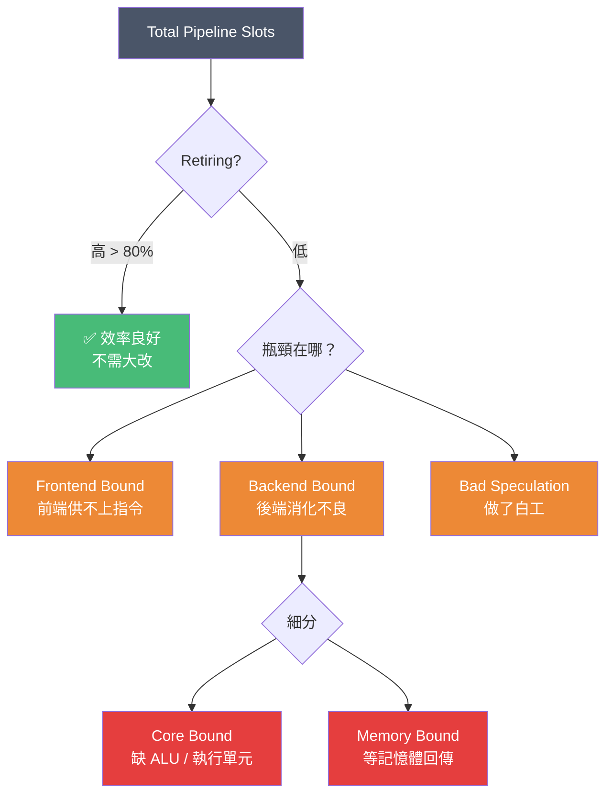
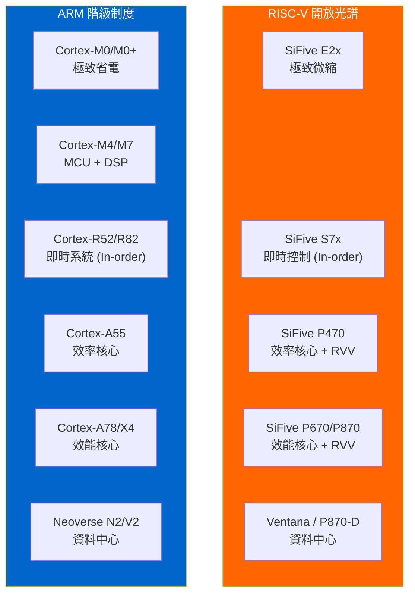
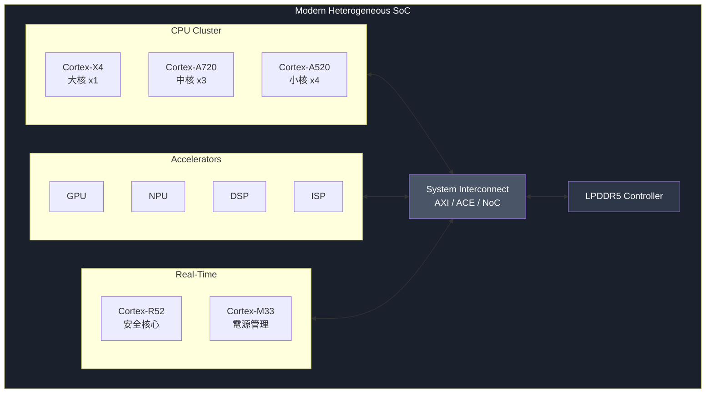

# 應用驅動的架構選型：如何為你的 Workload 挑選最合適的 CPU？

**作者**: Danny Jiang
**日期**: 2026-02-25

---

## §1 前言：沒有一顆 CPU 能打天下

在上一篇《異構系統架構：設計與效能》中，我們用六大效能法則拆解了 CPU、GPU、NPU、DPU 的分工邏輯。文章結尾，我留下了一個問題：

> 假設你已經決定需要一顆 CPU，那麼——該選哪一顆？

這個問題看似簡單，實際上卻讓很多工程師踩坑。

幾個月前，一位做智慧家電的朋友來問我：「我們要做一顆 Smart Speaker 的主控 SoC，老闆說『用最好的 CPU 核心』，我該選 Cortex-X 系列嗎？」

我反問他：「你的 workload 是什麼？」

他愣了一下：「就⋯⋯跑 Linux、播音樂、處理語音指令？」

我說：「那你大概不需要 Cortex-X。你需要的是 Cortex-A55——或者更便宜的 RISC-V 替代方案。」

這個對話反映了一個常見的誤解：**很多人以為「選 CPU」就是「選最強的」**。但架構設計的本質，從來不是追求極致性能，而是在給定的**功耗、面積、成本（PPA）**限制下，找到「剛剛好」的甜蜜點。

### 回顧：從 IPC 到異構，我們學到了什麼？

在《All Roads Lead to IPC》中，我們建立了第一個核心觀點：

> 所有 CPU 微架構設計，最後都只是在爭取一個指標——IPC。

Superscalar、Out-of-Order、Branch Predictor、Cache、ROB⋯⋯這些不是獨立的 feature，而是「為了提升 IPC 不得不發明的補救機制」。

但我們也學到，**IPC 的邊際成本遞增得很快**。要從 IPC 2.0 提升到 2.5，你可能需要把 ROB 從 256 entries 擴大到 512，功耗與面積隨之翻倍。

在《異構系統架構》中，我們進一步認識到：

> 單靠提升單一處理器的 IPC，已經無法滿足現代運算的需求。

於是我們學會了用 Amdahl's Law、Roofline、Little's Law 等工具，把任務拆解給 CPU、GPU、NPU、DPU。這是「向外擴展」的思維。

但今天，我們要**向內聚焦**：當你確定需要一顆 CPU 時，如何根據 workload 的特性，選擇最適合的微架構？

### 極端案例：為什麼一體適用行不通？

在深入方法論之前，讓我們看看兩個極端案例。

**案例一：把 Neoverse V2 塞進 Touchpad 控制器**

ARM Neoverse V2 是目前最強悍的伺服器級核心之一：5-wide decode、256-entry ROB、1.5MB L2 Cache。現在想像把它放進筆電的 Touchpad 控制器——以 100Hz 採樣感測器，透過 I2C 發送 HID 報告。

| 資源 | Neoverse V2 提供 | Touchpad 實際需要 |
|------|-----------------|------------------|
| ROB entries | 256 | ~8 |
| L2 Cache | 1.5MB | 4-8KB |
| 頻率 | 3+ GHz | 50 MHz |
| 功耗 | 5-15W | < 10mW |
| 晶片面積 | ~3mm² | 0.1mm² 預算 |

這就像穿著三件式 Armani 西裝去打沙灘排球——昂貴、不舒適、完全不合適。

**案例二：用 Cortex-M0+ 跑資料庫伺服器**

反過來，想像用 ARM 最小的核心 Cortex-M0+ 作為 PostgreSQL 伺服器的主 CPU。一個在 Neoverse N2 上只需 10ms 的查詢，在 M0+ 上可能需要**數分鐘**。

這就像穿著夾腳拖和背心去參加黑領帶晚宴——你連門都進不了。

**教訓**

這些極端案例顯而易見。有趣的問題藏在中間地帶：

- 你的 SSD 控制器該用 Cortex-R52 還是 Cortex-A55？
- 你的 IoT 閘道器需要 RISC-V P470 還是 U74 就夠了？
- 什麼時候手機 SoC 該用 Cortex-X 系列，而不是更多 A 系列核心？

一位技藝精湛的裁縫師知道如何處理這些細緻的決策。讓我們來學習他們的技藝。

### 架構師 = 裁縫師

這篇文章的核心比喻是：**架構師是一位裁縫師**。

你不是去百貨公司買最貴的西裝，而是根據客人的身材（workload 特性）、場合（應用場景）、預算（PPA 限制），量身剪裁一套最合適的衣服。

- **量身**：先用 TMAM、Roofline、Little's Law 等工具，分析 workload 的「體檢報告」。
- **選布料**：認識 ARM 與 RISC-V 兩大陣營的 CPU 譜系，了解每種核心的定位與取捨。
- **剪裁**：針對五大經典場景，展示如何做出截然不同、但各自合理的微架構決策。

本文不會教你怎麼寫 `perf stat` 指令，也不會深入 Branch Predictor 的 TAGE 演算法——那些是後續專題的內容。我們要做的，是建立一套**「從 workload 指紋推導微架構選擇」的決策框架**。

準備好了嗎？讓我們從「量身」開始。

---

## §2 量身：沒有 Profile，就沒有 Design

在裁縫店裡，師傅接到新客人的第一件事，不是拿出最貴的布料，而是拿出皮尺——量身。

架構設計也是一樣。在選擇 CPU IP 之前，你必須先回答一個問題：**我的 workload 長什麼樣子？**

這不是一個模糊的感覺題，而是可以被量化的。這一節，我們會介紹一套「體檢報告」的方法論，幫助你把 workload 的特徵轉化為具體的微架構需求。

### §2.1 Workload 指紋與 TMAM

想像你是一位醫生，病人走進診間說：「我不舒服。」你不會直接開藥，而是先做一系列檢查：量血壓、測心跳、驗血、照 X 光。這些檢查結果組成一份「體檢報告」，讓你判斷問題出在心臟、肺部、還是腸胃。

對 CPU 架構師來說，**TMAM（Top-Down Microarchitecture Analysis Method）** 就是這份體檢報告。

TMAM 是 Intel 在 2014 年提出的效能分析框架。它的核心思想是：**把 CPU 的效能瓶頸歸類為四大主軸**，讓工程師快速定位問題，而不是在上百個 PMU 計數器裡大海撈針。

這四大分類是：

| 分類 | 定義 | 白話解釋 |
|------|------|----------|
| **Frontend Bound** | 後端有空，但前端供不上指令 | 處理器的「嘴巴」不夠大，食物送太慢 |
| **Backend Bound** | 前端送來指令，但後端卡住了 | 處理器的「腸胃」消化不良 |
| **Bad Speculation** | 執行了指令，但發現是錯的，必須丟棄 | 處理器做了「白工」 |
| **Retiring** | 指令成功完成，寫回架構狀態 | 真正有用的工作 |

理想情況下，我們希望 **Retiring 越高越好**——這代表處理器的每個 cycle 都在做有意義的事。但現實中，各種瓶頸會讓 Retiring 比例下降。

讓我用一個簡單的比喻：

> 把 CPU 想像成一家餐廳。Frontend 是廚房備料區，Backend 是廚師烹飪區，Bad Speculation 是做錯被退回的菜，Retiring 是成功上桌的菜。
>
> 如果備料太慢（Frontend Bound），廚師就會閒著等。如果廚師不夠或爐子不夠（Backend Bound - Core Bound），備好的料會堆積。如果食材從冷凍庫拿出來太慢（Backend Bound - Memory Bound），整條產線都會停擺。

**Backend Bound** 還可以進一步細分為：
- **Core Bound**：執行單元不足，例如 ALU 被佔滿、除法器太少
- **Memory Bound**：等待記憶體回傳資料，Cache Miss 導致的停頓

#### TMAM 是一棵決策樹，不是四個平行指標

這裡有一個關鍵的思維方式：**TMAM 不是讓你同時看四個數字，而是由上往下「剝洋蔥」**。

診斷流程像這樣：

```
                    ┌─────────────────┐
                    │   Total Slots   │
                    └────────┬────────┘
                             │
              ┌──────────────┴──────────────┐
              ▼                              ▼
       ┌─────────────┐                ┌─────────────┐
       │  Retiring   │                │   Stalled   │
       │  (有效工作)  │                │  (被浪費)    │
       └─────────────┘                └──────┬──────┘
                                             │
                    ┌────────────────────────┼────────────────────────┐
                    ▼                        ▼                        ▼
             ┌─────────────┐          ┌─────────────┐          ┌─────────────┐
             │  Frontend   │          │   Backend   │          │    Bad      │
             │   Bound     │          │    Bound    │          │ Speculation │
             └─────────────┘          └──────┬──────┘          └─────────────┘
                                             │
                                    ┌────────┴────────┐
                                    ▼                 ▼
                             ┌───────────┐     ┌───────────┐
                             │   Core    │     │  Memory   │
                             │   Bound   │     │   Bound   │
                             └───────────┘     └───────────┘
```

下圖以 Mermaid 呈現同樣的決策樹，方便視覺化理解：



架構師的診斷邏輯是：

1. **先看頂層**：Retiring 佔比高嗎？如果 Retiring 已經 > 80%，恭喜你，這顆 CPU 對這個 workload 已經很合適，不需要大改。

2. **如果 Retiring 低**：那 70% 的 cycle 被浪費在哪裡？是 Frontend Bound、Backend Bound、還是 Bad Speculation？

3. **再往下鑽**：如果 Backend Bound 佔 50%，那是 Core Bound（缺 ALU）還是 Memory Bound（等記憶體）？

這種「由上往下」的診斷方式，讓架構師可以**快速定位瓶頸層級**，而不是在上百個 PMU 計數器裡迷路。正如醫生不會一開始就做全身 MRI，而是先量體溫、聽心跳，再決定要不要進一步檢查。

這個分類法的價值在於：**它直接指向你該投資什麼硬體資源**。

### §2.2 從數據到硬體旋鈕

有了 TMAM 的體檢報告，下一步是把診斷結果轉化為「處方」——也就是微架構的設計決策。

我把這個過程叫做「**Workload 指紋 → 硬體旋鈕**」的映射。

#### 指紋 1：Branchiness（分支密集度）

**問題**：你的程式有多少分支？分支的可預測性如何？

**觀察指標**：
- 每千條指令的分支數（Branches per Kilo Instructions）
- 分支預測錯誤率（Branch Misprediction Rate）

**硬體旋鈕**：
- 如果 Branchiness 高且難預測 → 投資更大的 **BTB（Branch Target Buffer）** 與更精密的預測器（如 TAGE）
- 如果 Branchiness 低或高度可預測 → 簡單的預測器就夠了，省下面積給其他單元

**實例**：
- 資料庫的 B-tree 查詢：分支密集、難預測 → 需要強大的分支預測器
- 多媒體解碼的主迴圈：分支少、高度規律 → 簡單預測器即可

#### 指紋 2：Cache Miss Rate 與 Working Set

**問題**：你的程式需要多少資料？這些資料能塞進 Cache 嗎？

**觀察指標**：
- L1/L2/L3 Cache Miss Rate
- Working Set Size（活躍資料量）

**硬體旋鈕**：
- 如果 Working Set 小（< 數百 KB）→ 小 Cache 就夠，甚至可以用 TCM（Tightly Coupled Memory）
- 如果 Working Set 中等（數 MB）→ 需要適當的 L2/L3 階層

理解 Cache 行為，需要知道你的資料結構如何映射到 Cache Line——這正是《[Data Structures in Practice](https://github.com/djiangtw/data-structures-in-practice-public)》一書中深入探討的主題。
- 如果 Working Set 巨大（數十 MB 以上）→ 再大的 Cache 都塞不下，必須靠 **Prefetcher** 與 **MLP（Memory-Level Parallelism）** 來掩蓋延遲

**實例**：
- Touchpad 控制器：Working Set 幾 KB → 不需要 Cache，直接用 SRAM
- 資料庫伺服器：Working Set 數 GB → L3 再大也不夠，必須靠激進預取

#### 指紋 3：IPC 與 Stall Breakdown

**問題**：你的程式 IPC 卡在哪裡？是前端、後端、還是錯誤推測？

**觀察指標**：
- 實測 IPC vs 理論峰值 IPC
- TMAM 的四大分類比例

**硬體旋鈕**：
- Frontend Bound 主導 → 加寬 Fetch/Decode 頻寬、加大 I-Cache 與 BTB
- Core Bound 主導 → 增加執行單元數量、加寬 Issue Width
- Memory Bound 主導 → 加大 Cache、增加 MSHRs、強化 Prefetcher、擴大 ROB 以挖掘 MLP
- Bad Speculation 主導 → 投資更精密的分支預測器

這就是「量身」的核心：**不是盲目堆硬體，而是根據瓶頸對症下藥**。

### §2.3 與經典效能定律對齊

在做這些決策時，我們可以借用《異構系統架構》中介紹的幾個經典定律，把直覺轉化為定量分析。

#### Roofline Model：算力 vs 頻寬的羅盤

Roofline Model 幫助我們判斷：**workload 是 Compute Bound 還是 Memory Bound？**

- 如果 workload 落在「屋頂」的斜坡上（Memory Bound）→ 加更多 ALU 沒用，應該投資記憶體頻寬或 Cache
- 如果 workload 落在「屋頂」的平坦區（Compute Bound）→ 加更多執行單元或 SIMD/Vector 擴展

**對架構選型的意義**：
- Memory Bound workload（如資料庫、圖計算）→ 選擇具備大 L3、強 Prefetcher 的核心
- Compute Bound workload（如科學計算、AI 推論）→ 選擇具備寬 SIMD/Vector（SVE、RVV）的核心

#### Little's Law：延遲與並行度的數學必然

Little's Law 告訴我們：

$$
L = \lambda \times W
$$

其中 $L$ 是系統中的平均請求數，$\lambda$ 是吞吐量，$W$ 是平均延遲。

套用到 CPU 設計：

$$
\text{In-Flight Instructions} = \text{IPC} \times \text{Memory Latency}
$$

這揭示了一個殘酷的事實：**如果記憶體延遲是 200 cycles，而你想維持 IPC = 2，那你的 ROB 至少要能容納 400 條指令**。

這就是為什麼伺服器級核心（如 Neoverse V2、Apple M 系列）的 ROB 動輒 300–600 entries——不是為了炫技，而是數學上的必然。

> **架構設計不是玄學，而是精密的數學計算。**

當你能用 Little's Law 推導出 ROB 大小、用 Roofline 判斷瓶頸所在、用 TMAM 診斷 cycle 去了哪裡——你就不再是「憑感覺」選 CPU，而是「憑數據」做決策。如果你想更系統化地掌握這些效能分析技術，我在《[Performance and Benchmarking](https://github.com/djiangtw/performance-and-benchmarking-public)》一書中有完整的數學推導與實戰案例。

**對架構選型的意義**：
- 高延遲環境（DRAM 為主）+ 追求高 IPC → 必須選擇大 ROB 的 Wide OoO 核心
- 低延遲環境（TCM / SRAM 為主）→ 小 ROB 甚至 In-order 就夠了

### 小結：量身的 Checklist

在選擇 CPU IP 之前，先問自己這些問題：

| 問題 | 對應指紋 | 影響的硬體旋鈕 |
|------|----------|----------------|
| 分支多嗎？難預測嗎？ | Branchiness | BTB、Branch Predictor 複雜度 |
| 資料量多大？Cache 夠用嗎？ | Working Set / Miss Rate | L2/L3 容量、Prefetcher |
| IPC 卡在前端、後端、還是記憶體？ | TMAM 分類 | Fetch 寬度、執行單元、ROB |
| 是 Compute Bound 還是 Memory Bound？ | Roofline 位置 | ALU/SIMD vs Cache/Bandwidth |
| 記憶體延遲多高？需要多大的 ROB？ | Little's Law | ROB 大小、OoO 視窗 |

完成這份「體檢報告」之後，你就有了清楚的需求規格。下一步，是去「布料店」挑選合適的 CPU IP。

---

## §3 選布料：ARM 百貨公司 vs RISC‑V 客製裁縫店

有了 workload 的體檢報告，接下來要回答：**市場上有哪些「布料」可以選？**

目前嵌入式與伺服器 CPU 市場的兩大主角是 **ARM** 與 **RISC-V**。它們代表了兩種截然不同的商業模式與設計哲學。下圖展示了兩大陣營從低功耗到高效能的架構光譜：



- **ARM** 像一家高級百貨公司：產品線完整、品質有保證、價格固定、售後服務成熟。你買的是「成衣」，規格清楚，但客製化空間有限。
- **RISC-V** 像一群獨立裁縫店的聯盟：有的專做西裝、有的專做運動服、有的讓你自己帶布料來。你買的是「訂製服務」，彈性極高，但需要更多的整合能力。

讓我們逐一認識這兩個陣營的產品譜系。

### §3.1 ARM 的階級制度

ARM 的產品線有著清晰的「階級制度」，從微瓦（µW）到百瓦（W）全面覆蓋。根據 ARM 官方技術白皮書，我們可以把它分為三大家族：

#### Cortex-M 系列：極致微縮的守護者

**定位**：微控制器（MCU）、深度嵌入式應用

**代表核心**：Cortex-M0+、M4、M33、M85

**微架構特徵**：
- 極簡 2–3 級 In-order 流水線
- 無 Cache（或僅有極小的 I-Cache）
- 無 OoO、無複雜分支預測
- 功耗：µW ~ mW 級別

**設計取捨**：Cortex-M 刻意捨棄所有「高級」微架構特性，換取極低的面積（< 0.01 mm²）、極低的功耗、以及極高的時間確定性（Determinism）。對於 Touchpad、TWS 藍牙耳機、感測器節點這類應用，**可預測性比峰值 IPC 更重要**。

> **參考**：ARM Cortex-M Series Technical Reference Manuals

#### Cortex-R 系列：即時系統的中流砥柱

**定位**：高頻寬即時控制、儲存控制器、車用安全

**代表核心**：Cortex-R52、R82

**微架構特徵**：
- 5–8 級 Advanced In-order 流水線
- 部分高階款支援 Dual-issue 或輕量 OoO
- 強調 TCM（Tightly Coupled Memory）與低中斷延遲
- 功耗：mW ~ W 級別

**設計取捨**：Cortex-R 的核心價值是**確定性與即時性**。SSD 控制器每秒要處理數十萬個 I/O 命令，5G Baseband 必須在硬性時限內完成訊號處理。這些場景排斥複雜的 OoO 引擎，因為 OoO 會引入不可預測的指令調度延遲（Jitter）。

> **參考**：ARM Cortex-R82 Processor Technical Reference Manual

#### Cortex-A 與 Neoverse 系列：從手機到資料中心

**定位**：行動裝置、Rich Embedded、伺服器、HPC

**代表核心**：
- **Cortex-A**：A55（高效能小核）、A78/A715（中核）、X3/X4（大核）
- **Neoverse**：N2（Scale-out 伺服器）、V2（HPC/AI）、E2（邊緣網路）

**微架構特徵**：
- 中等到超寬的 OoO 流水線（4-wide ~ 8-wide decode）
- 大型 ROB（200–600 entries）
- 精密的分支預測器與多層 Cache
- 支援 SVE/SVE2 向量擴展
- 功耗：1W ~ 250W

**設計取捨**：這個家族內部又有明顯的分層：

| 子系列 | 目標市場 | 核心策略 |
|--------|----------|----------|
| **Cortex-A55/A510** | 小核、背景任務 | 極致 Perf/mm²，省面積 |
| **Cortex-A78/A715** | 中核、日常任務 | 均衡 PPA |
| **Cortex-X3/X4** | 大核、爆發效能 | 極致單核 IPC，不計代價 |
| **Neoverse N2** | Scale-out 伺服器 | Perf/Watt 最大化，核心密度 |
| **Neoverse V2** | HPC / AI Host | 單核極限 IPC + SVE2 |

ARM 在 Hot Chips 34 的發表中展示了 Cortex-X3 與 A715 的微架構細節：X3 擁有 6-wide decode、超過 300 entries 的 ROB、以及激進的預取器，目的是在手機的短暫 Burst 視窗內榨取最高 IPC。

> **參考**：
> - ARM Neoverse N2 Platform Whitepaper
> - ARM Neoverse V2 Platform Technical Overview
> - "Arm Cortex-X3 and Cortex-A715 Microarchitecture," Hot Chips 34, 2022

### §3.2 RISC-V 的開放光譜

相較於 ARM 的「百貨公司」模式，RISC-V 更像是一個**開放的生態系**。ISA 本身是開源的，任何人都可以設計自己的核心。這導致了百花齊放的局面——從 µW 級的 MCU 到對標 Neoverse 的資料中心核心都有。

讓我們看幾個代表性的 RISC-V 核心：

#### SiFive：商業化的先驅

**SiFive Essential 系列**（E2、S2、U7 等）：
- 定位：對標 Cortex-M/R 的嵌入式核心
- 特色：高度可配置，客戶可以裁剪 ISA 擴展、調整流水線深度
- 優勢：比 ARM 更低的授權成本，更高的客製化彈性

**SiFive Performance 系列**（P550、P670、P870）：
- 定位：對標 Cortex-A78/A715 的中高階核心
- 特色：支援 OoO、RVV（RISC-V Vector Extension）
- 官方宣稱 P870 的 SPECint 效能接近 Cortex-A78 級別

> **參考**：SiFive Performance P870/P670 Product Brief

#### 香山（XiangShan）：開源的 IPC 追求者

香山是中國科學院計算技術研究所主導的開源高效能 RISC-V 核心專案。它的目標很明確：**用開源的方式，做到 Neoverse N 級別的 IPC**。

**南湖（Nanhu）架構**：
- 6-wide decode、激進的 OoO 引擎
- 大型 ROB（數百 entries）
- 激進的 L2 Prefetcher
- 在 SPEC CPU 2006 上展示了接近 Neoverse N1 的 IPC

香山的價值不只是效能數字，更在於**它是完全開源的**。這意味著你可以閱讀它的 RTL 程式碼，理解每一個微架構決策背後的原因——這對於教育與研究有極大的價值。

> **參考**：
> - Xu, Y., et al. "Towards Developing High Performance RISC-V Processors Using Agile Methodology." MICRO 2022.
> - XiangShan GitHub Repository & Documentation

#### Ventana Veyron：Chiplet 時代的挑戰者

Ventana Micro 的 Veyron V1 是另一個有趣的案例。它的設計目標是**資料中心級 RISC-V**，但商業模式與眾不同：

- 不只賣核心 IP，而是賣整個 **Chiplet**
- 讓客戶用 Chiplet 拼裝出自己的伺服器 SoC
- 強調高時脈、大 L3 Cache、優異的 Perf/Watt

這種模式降低了打造資料中心級 SoC 的門檻——你不需要從零設計一顆百億電晶體的晶片，只需要整合別人已經做好的 Chiplet。

> **參考**："Ventana Veyron V1: High-Performance RISC-V Processor for the Data Center," Hot Chips 2023

想要深入了解 RISC-V 的 ISA、微架構與系統整合，《[See RISC-V Run](https://github.com/djiangtw/see-riscv-run-public)》提供了完整的介紹。

### §3.3 評估軸：如何比較這些「布料」？

面對這麼多選擇，架構師該如何評估？以下是四個核心維度：

#### 1. IPC 與 Perf/Watt

這是最直觀的效能指標，但要注意：**你需要的是「在你的 workload 上」的 IPC，不是 SPEC 跑分**。

- 伺服器看重 **Perf/Watt**（每瓦效能），因為電費是資料中心的主要成本
- 手機大核看重 **Burst IPC**，因為 App 啟動要快、但只會全速跑幾秒

#### 2. Perf/mm²（面積效率）

對於成本敏感的市場（Smart TV、IoT Gateway），**單位矽面積能榨出多少效能**是生死關鍵。

這解釋了為什麼 Cortex-A55 出貨量遠超 Cortex-X 系列——大多數應用根本不需要 X 系列的極致 IPC，但承受不起它的面積成本。

#### 3. 擴充性與客製化

這是 RISC-V 的最大優勢。

- **標準擴展**：RVV（Vector）、Zba/Zbb（Bit Manipulation）等
- **自定義擴展**：你可以為特定 workload 加入專用指令

ARM 也有一些客製化空間（如 Custom Instructions in Cortex-M），但遠不如 RISC-V 靈活。

**量化案例：音訊 DSP 的指令融合**

讓我們用一個具體的例子來說明客製指令的威力。

假設你在設計一顆 TWS 藍牙耳機的 SoC，核心 workload 是**主動降噪（ANC）**。ANC 演算法的熱點迴圈可能長這樣（簡化版）：

```c
// 每個樣本點執行一次
for (int i = 0; i < N; i++) {
    int32_t tmp = coef[i] * delay_line[i];  // 乘法
    tmp = tmp >> 15;                         // 定點數縮放
    acc += tmp;                              // 累加
}
```

在標準的 RISC-V（或 ARM Cortex-M4）上，這段迴圈的每次迭代可能需要 **10–15 條指令**：Load coef、Load delay_line、乘法、移位、累加、索引更新、分支⋯⋯

但如果你有 RISC-V 的客製指令能力，你可以設計一條專用指令：

```
MAC_AQ  rd, rs1, rs2, rs3   // Multiply-Accumulate with Auto-Queue
// 功能：rd = rd + (rs1 * rs2) >> rs3
// 同時自動推進 delay_line 的硬體佇列
```

這一條指令，取代了原本的 10–15 條指令。結果是：

| 指標 | 標準指令 | 客製指令 | 改善 |
|------|----------|----------|------|
| 每迭代指令數 | 12 | 1 | **12x** |
| Fetch/Decode 功耗 | 基準 | ~1/12 | **92% 降低** |
| Code Size | 基準 | 大幅縮小 | I-Cache 壓力降低 |

對於極致微縮場景（§4.1），這種客製化能力意味著：**你可以用更小的核心、更低的功耗，達到相同的效能目標**。

**然而，天下沒有白吃的午餐。**

當你發明了這條客製指令，標準的 GCC/LLVM 編譯器是不會自動生成它的。你必須：

- 手寫 **Inline Assembly** 或 **Intrinsic 函數**
- 維護專屬的 **Compiler Patch** 或使用廠商提供的工具鏈
- 確保未來的軟體更新不會破壞這些客製化程式碼

這意味著你的軟體程式碼將與這顆硬體**深度綁定（Vendor Lock-in）**。如果未來想換一顆不同的 RISC-V 核心，這些客製指令可能完全不相容。

這就是客製化帶來的「**生態碎片化**」代價——你用硬體效率換取了軟體的可攜性。架構師必須在這兩者之間做出明智的權衡。

這就是 RISC-V「客製裁縫店」的真正價值——不是「便宜」，而是「精準契合你的 workload」。但這件訂製西裝，只有你能穿。

> **參考**：SiFive Custom Extensions Specification & Application Notes

#### 4. 生態成熟度

這是 RISC-V 的弱項。

ARM 擁有：
- 成熟的 OS 支援（Linux、Android、RTOS）
- 優化過的編譯器（GCC、LLVM、商業編譯器）
- 完整的除錯工具鏈（DS-5、Trace）
- 龐大的軟體生態系

RISC-V 正在追趕，但仍有差距。選擇 RISC-V 意味著你需要承擔更多的軟硬體整合風險——這在某些場景是值得的（長期成本、客製化彈性），但在其他場景可能得不償失。

### 小結：選布料的 Checklist

| 評估維度 | ARM 優勢 | RISC-V 優勢 |
|----------|----------|-------------|
| 效能保證 | 成熟、可預測 | 依實作而異 |
| 面積/功耗選擇 | 產品線完整 | 可高度客製化 |
| 擴充性 | 有限 | 極高（自定義指令）|
| 生態成熟度 | 領先 | 追趕中 |
| 授權成本 | 較高（權利金）| 較低（開源 ISA）|
| 長期風險 | 單一供應商 | 生態碎片化風險 |

下一步，我們要把「體檢報告」（§2）與「布料選項」（§3）結合起來，看看在五個真實場景中，架構師是如何做出截然不同的選擇。

---

## §4 剪裁：五大經典場景的架構決策

現在，讓我們把前面學到的「量身」方法與「布料」知識結合起來，看看在真實世界中，架構師是如何為不同的應用場景做出截然不同的選擇。

我們會依照算力與成本光譜，從 **µW 級的 Touchpad** 一路走到 **百瓦級的資料中心**。你會發現：每個場景的「正確答案」都不一樣，而這正是架構設計的魅力所在。

### §4.1 極致微縮與功耗榨取（Ultra-Low Power & Deeply Embedded）

**代表應用**：Touchpad 控制器、LCD Driver IC、TWS 藍牙耳機、簡單感測節點

#### Workload 指紋

這類應用的 workload 有幾個鮮明特徵：

| 指紋 | 描述 |
|------|------|
| **Code Size** | 極小，通常 < 64 KB |
| **分支行為** | 簡單、高度可預測 |
| **記憶體存取** | Working Set 幾 KB，全部放得進 SRAM |
| **執行模式** | 「睡覺 → 醒來 → 做一點事 → 回去睡覺」|

#### 關鍵限制條件

這個場景的限制條件極為嚴苛：

1. **Leakage Power（漏電流）**：設備 99% 時間在睡眠，靜態功耗決定電池壽命
2. **Wake-up Latency（喚醒延遲）**：從睡眠到執行第一條指令，必須在微秒級內完成
3. **Area Cost（面積成本）**：整顆 IC 可能只有 1–2 mm²，CPU 面積預算極低
4. **BOM Cost（物料成本）**：價格極度敏感，每一分錢都斤斤計較

#### 微架構決策

面對這樣的指紋與限制，架構師的選擇非常明確：

| 微架構旋鈕 | 決策 | 理由 |
|------------|------|------|
| **Pipeline** | 2–3 級 Simple In-order | 最小面積、最低功耗、最高確定性 |
| **OoO** | ❌ 完全不要 | OoO 的面積與功耗代價太高，且 workload 根本用不到 |
| **Branch Predictor** | ❌ 極簡或無 | 分支少且可預測，複雜預測器是浪費 |
| **Cache** | ❌ 不要 | Working Set 小到可以全部放進 SRAM/TCM，Cache 的 Tag 佔面積且引入不確定性 |
| **Memory** | SRAM / ROM / TCM | 零等待週期、確定性高 |

#### 代表性 CPU IP

- **ARM Cortex-M0+**：業界最普及的極簡核心，面積 < 0.01 mm²（成熟製程）
- **ARM Cortex-M33**：加入 TrustZone 安全擴展，適合需要安全功能的 IoT
- **RISC-V RV32E**：只有 16 個暫存器（而非標準的 32 個），極致壓縮面積
- **SiFive E2 系列**：商業化的 RISC-V 極簡核心，可高度配置

#### 設計哲學

> 在這個場景，**「少即是多」**。每多一個電晶體，都是對功耗與成本的傷害。架構師的價值不在於加東西，而在於知道**什麼不該加**。

---

### §4.2 高頻寬即時系統（High-Bandwidth Real-Time）

**代表應用**：SSD Controller、Camera ISP 協同控制、5G / Wi-Fi Baseband、車用 ADAS 控制器

#### Workload 指紋

這類應用的 workload 看起來很不一樣：

| 指紋         | 描述                             |
| ---------- | ------------------------------ |
| **中斷頻率**   | 極高，每秒數十萬次                      |
| **DMA 依賴** | 資料搬運主要靠 DMA，CPU 負責控制面          |
| **時間限制**   | 硬性死線（Hard Deadline），必須在固定時間內完成 |
| **執行模式**   | 持續運作，但每個任務都很短                  |

#### 關鍵限制條件

1. **Interrupt Latency（中斷延遲）**：從中斷觸發到 ISR 開始執行，必須極短（< 數十 cycles）
2. **Jitter（執行抖動）**：處理時間必須高度可預測，不能忽快忽慢
3. **Sustained Bandwidth（持續頻寬）**：配合 DMA 與硬體加速器，維持穩定的資料吞吐
4. **Power Loss Protection（斷電保護）**：這是與電池供電產品截然不同的關鍵需求
5. **功耗**：比場景 1 寬鬆，但仍需控制在數瓦以內

#### 為什麼 Power Loss Protection 影響 CPU 選型？

與手機、TWS 等電池供電的產品不同，SSD Controller 面臨一個獨特的挑戰：**隨時可能斷電**。

當使用者拔掉電源線、或資料中心發生電力故障時，SSD 必須在極短的時間窗口內（通常只有數毫秒，由電容儲能決定）完成以下動作：

1. **停止接收新的寫入命令**
2. **將 DRAM Buffer 中的髒資料刷入 NAND Flash**
3. **更新 FTL（Flash Translation Layer）映射表**
4. **確保元數據一致性**

這個過程對 CPU 有嚴苛的要求：

| 要求 | 對 CPU 的影響 |
|------|---------------|
| **極低的中斷響應延遲** | 斷電偵測中斷必須在數十 cycles 內被處理 |
| **確定性的執行時間** | PLP 流程必須在已知的時間內完成，不能有意外的 Cache Miss 或分支預測錯誤導致的延遲 |
| **關鍵路徑的程式碼駐留** | PLP 相關的 ISR 與 FTL 更新程式碼必須放在 TCM，避免從外部記憶體載入的延遲 |

這進一步強化了「排斥複雜 OoO」的設計決策。OoO 引擎的動態調度會引入不可預測的執行時間變異，而在 PLP 場景中，**每一個 cycle 的變異都可能導致資料遺失**。

根據 JEDEC 的企業級 SSD 規範（JESD218），企業級 SSD 必須在 Power Fail 後保證資料完整性。這使得 SSD Controller 的 CPU 選型幾乎必然走向 Cortex-R 或具備類似確定性的 RISC-V 核心。

> **參考**：
> - JEDEC Standard JESD218: Solid-State Drive (SSD) Requirements and Endurance Test Method
> - Micheloni, R., Crippa, L., & Marelli, A. (2010). *Inside NAND Flash Memories*. Springer.

#### 為什麼 OoO 在這裡是「毒藥」？

你可能會想：「SSD Controller 需要高效能，為什麼不用 OoO？」

**答案藏在 Jitter 裡。**

OoO 引擎的本質是「動態調度」——它會根據資料相依性，自動調整指令的執行順序。這對於榨取 IPC 很有幫助，但也意味著**同一段程式碼，每次執行的 cycle 數可能不同**。

對於資料庫伺服器，這無所謂——反正是統計平均。但對於 SSD Controller，這是致命的：

- NAND Flash 的 tPROG（寫入時間）有嚴格的時序要求
- 如果 CPU 的響應時間忽快忽慢，可能導致資料損毀或效能抖動
- 5G Baseband 的訊號處理有硬性時限，錯過就是丟封包

因此，這個場景**刻意排斥 OoO**，選擇確定性更高的 In-order 設計。

#### 另一個指紋：Functional Safety（功能安全）

除了「時間確定性」之外，某些高頻寬即時系統還有另一個關鍵指紋：**可靠性與容錯**。

這在車用系統中尤為重要。當 workload 是一台時速 120 公里的自駕車的煞車控制時，「正確性」的要求變得極端嚴苛：

> **絕對不能發生未被偵測到的硬體錯誤。**

這類錯誤的來源包括：
- **宇宙射線（Single Event Upset, SEU）**：高能粒子打翻記憶體或暫存器中的 Bit
- **電磁干擾（EMI）**：工業環境中的電磁雜訊
- **製程缺陷**：老化或極端溫度導致的電路異常

為了應對這些威脅，車用與工業安全標準（如 ISO 26262、IEC 61508）定義了嚴格的功能安全等級（ASIL-A 到 ASIL-D）。達到最高等級 ASIL-D 需要極低的失效率（< 10 FIT，即每十億小時少於 10 次失效）。

**對應的「硬體旋鈕」是什麼？**

答案是 **Dual-Core Lock-Step (DCLS，雙核鎖步)**：

```
┌─────────────┐     ┌─────────────┐
│   Core A    │     │   Core B    │
│  (Primary)  │     │  (Shadow)   │
└──────┬──────┘     └──────┬──────┘
       │                   │
       │   Same Input      │
       ▼                   ▼
┌─────────────────────────────────┐
│         Comparator              │
│   (每個 cycle 比對輸出)          │
└─────────────────────────────────┘
       │
       ▼
  結果相同 → 正常執行
  結果不同 → 立即報錯、進入安全模式
```

兩顆完全相同的 CPU 核心，跑同樣的指令、收同樣的輸入。每個 cycle，硬體比對兩顆核心的輸出。一有不同，立刻觸發錯誤處理——可能是重試、切換到備援系統、或讓車輛進入安全停車模式。

這解釋了為什麼 **Cortex-R52** 會內建 DCLS 支援——它不只是一顆「快」的即時核心，更是一顆「安全」的核心。

| 指紋 | 對應的硬體旋鈕 |
|------|----------------|
| 時間確定性（Jitter） | In-order Pipeline、TCM |
| 斷電保護（PLP） | 極低中斷延遲、TCM 駐留 |
| 功能安全（ASIL-D） | Dual-Core Lock-Step、ECC |

> **參考**：
> - ISO 26262: Road vehicles — Functional safety
> - ARM Cortex-R52 Safety Documentation & Technical Reference Manual

#### 微架構決策

| 微架構旋鈕 | 決策 | 理由 |
|------------|------|------|
| **Pipeline** | 5–8 級 Advanced In-order，可能 Dual-issue | 比場景 1 更高的頻率與吞吐，但保持確定性 |
| **OoO** | ❌ 不要（或僅極輕量） | 確定性比峰值 IPC 更重要 |
| **Branch Predictor** | 基礎款 | 有幫助但不需要太複雜 |
| **Cache** | 小而快的 I-Cache / D-Cache | 掩蓋部分延遲，但不依賴它 |
| **TCM** | ✅ 必備 | 關鍵程式碼與資料放進 TCM，保證零等待 |
| **中斷處理** | 硬體輔助的快速 Context Switch | 降低中斷延遲 |

#### 代表性 CPU IP

- **ARM Cortex-R52**：車用安全等級（ASIL-D），雙核 Lock-step 支援
- **ARM Cortex-R82**：64-bit、支援 Linux，適合複雜的儲存控制器
- **SiFive S7 / U7 系列**：RISC-V 的即時控制核心

> **參考**：ARM Cortex-R Series Programmer's Guide

#### 設計哲學

> 在這個場景，**「確定性即正義」**。IPC 的微小提升，遠不及一次時序違規帶來的災難。架構師要做的，是在足夠的效能基礎上，**極大化可預測性**。

---

### §4.3 Rich Embedded：數位家庭與 IoT Gateway

**代表應用**：Smart TV、Set-top Box、Smart Speaker、IoT Gateway、工業 HMI

#### Workload 指紋

這類應用開始變得「豐富」起來：

| 指紋 | 描述 |
|------|------|
| **作業系統** | 跑完整的 Linux 或 Android |
| **多工** | UI 渲染、網路協議棧、多媒體解碼、背景服務同時運行 |
| **分支行為** | 中等複雜度，OS 排程帶來不可預測性 |
| **記憶體存取** | Working Set 數 MB ~ 數十 MB |

#### 關鍵限制條件

1. **BOM Cost（物料成本）**：消費電子市場競爭激烈，晶片必須便宜
2. **Thermal Limit（散熱限制）**：通常無風扇設計，TDP 限制在 2–5W
3. **UI Responsiveness（介面反應）**：使用者期望流暢的操作體驗
4. **功能完整性**：必須支援 MMU、多核、標準外設

#### 微架構決策

這個場景的核心哲學是：**「夠用就好，但要便宜」**。

| 微架構旋鈕 | 決策 | 理由 |
|------------|------|------|
| **Pipeline** | Entry-level OoO 或高效能 In-order | 追求 Perf/mm² 最佳化 |
| **OoO** | ✅ 輕量級 | OS 多工需要 OoO 來掩蓋不規則的記憶體延遲 |
| **Branch Predictor** | 基礎到中等 | 成本與效益的平衡點 |
| **Cache** | 標準 L1 + 共享 L2 | 必備，但不需要太大 |
| **核心數** | 2–4 核 | 處理多工，提升整體吞吐 |
| **MMU** | ✅ 必備 | 跑 Linux/Android 的基本要求 |

#### 為什麼 Cortex-A55 是這個場景的王者？

ARM Cortex-A55 可能是人類歷史上出貨量最大的 64-bit CPU 核心之一。它的成功秘訣很簡單：

- **面積小**：相比 Cortex-A78，A55 的面積只有約 1/3
- **功耗低**：適合無風扇設計
- **效能夠用**：對於 UI、網路、多媒體等任務綽綽有餘
- **成本優勢**：對於 Smart TV 這種毛利極低的產品，省下的每一分錢都是利潤

讓我們用數據來感受這個差距：

| 指標 | Cortex-A55（效率核心） | Cortex-A78（效能核心） | 決策意義 |
|------|------------------------|------------------------|----------|
| **Decode Width** | 2-wide（輕量 OoO） | 4-wide（深 OoO） | A55 足以應付背景任務 |
| **相對面積** | **~0.3x** | 1.0x | 同樣面積可塞 3–4 顆 A55 |
| **峰值功耗** | **< 0.5W** | 1.5W+ | 無風扇設計的首選 |
| **單核 IPC** | ~0.6x | 1.0x | 對於 I/O bound workload，差距不明顯 |

對於 Smart TV、IoT Gateway 這類「大部分時間在等 I/O」的場景，A55 的 IPC 劣勢幾乎感受不到，但面積與功耗的優勢卻是立竿見影的。

當然，如果你想要更多彈性或更低的授權成本，RISC-V 陣營的 SiFive U74 或 Performance P270 也是可行的選項。

#### 代表性 CPU IP

- **ARM Cortex-A53 / A55**：業界標準的高效能小核
- **ARM Cortex-A510**：A55 的繼任者，效能與能效進一步提升
- **SiFive U74 / Performance P270**：RISC-V 陣營的對應產品

#### 設計哲學

> 在這個場景，**「性價比即王道」**。你不需要極致 IPC，但需要在有限的面積與功耗預算內，跑起完整的 OS 與應用。架構師的任務是找到**「剛好夠用」的甜蜜點**。

---

### §4.4 行動計算：Handset / Tablet

**代表應用**：智慧型手機、平板電腦

#### Workload 指紋

行動計算的 workload 有一個獨特的特徵：**極端的動態範圍**。

| 指紋 | 描述 |
|------|------|
| **互動模式** | 間歇性的高強度 Burst（開 App、滑網頁）+ 長時間的低負載待機 |
| **延遲敏感度** | 使用者感知延遲（App 啟動、觸控響應）極度敏感 |
| **分支行為** | 複雜，JavaScript / JIT 帶來不可預測的分支 |
| **記憶體存取** | Working Set 中等到大（數十 MB ~ 數百 MB）|

#### 關鍵限制條件

1. **Burst IPC**：開 App 的那 0.5 秒，需要極高的單核效能
2. **Thermal Wall（熱牆）**：手機機身散熱極限約 3–5W，全速只能跑幾秒
3. **Battery Life（電池壽命）**：使用者期望一整天的續航
4. **EPI（Energy per Instruction）**：每一條指令的能耗都影響電池

#### Big.LITTLE：行動運算的經典解法

面對這種「短時間要很快、長時間要很省」的矛盾需求，業界發展出了 **Big.LITTLE（或 DynamIQ）** 異構架構：

- **大核（Big / P-Core）**：超寬 OoO、巨大 ROB、複雜預測器，追求極致 Burst IPC
- **小核（LITTLE / E-Core）**：高效能 In-order 或輕量 OoO，追求極致 Perf/Watt

典型的配置是 1–2 顆大核 + 4–6 顆小核。當使用者點開 App 時，大核全速運轉；當畫面靜止時，大核關閉，小核接手。

這個架構的數學基礎來自我們在 §2.3 提到的 **Little's Law**：

$$
\text{In-Flight Instructions} = \text{IPC} \times \text{Memory Latency}
$$

要在高延遲環境下維持高 IPC，你需要巨大的 ROB。但巨大的 ROB 極度耗電。Big.LITTLE 的解法是：**只在需要的時候付出這個代價**。

#### Dark Silicon：Big.LITTLE 背後的物理必然

Big.LITTLE 不只是一個「省電技巧」，它更是應對 **Dark Silicon（暗矽效應）** 的終極策略。

什麼是 Dark Silicon？

隨著摩爾定律的推進，我們可以在同樣大小的晶片上塞入越來越多的電晶體。但有一個殘酷的物理現實：**電晶體的密度增長速度，遠快於我們散熱能力的增長**。

2011 年，Esmaeilzadeh 等人在 ISCA 上發表了一篇極具影響力的論文，指出：

> 「到了 8nm 世代，一顆晶片上可能有超過 50% 的電晶體**必須處於關閉狀態**，否則晶片會過熱燒毀。」

這些被迫關閉的電晶體區域，就是 **Dark Silicon**——你花錢把它們製造出來，但大部分時間不能用。

```
┌─────────────────────────────────────┐
│           Modern SoC                │
│  ┌─────┐ ┌─────┐ ┌─────┐ ┌─────┐   │
│  │ CPU │ │ GPU │ │ NPU │ │ DSP │   │
│  │ 🔥  │ │ ⬛  │ │ ⬛  │ │ ⬛  │   │
│  └─────┘ └─────┘ └─────┘ └─────┘   │
│  🔥 = Active (發熱中)               │
│  ⬛ = Dark (關閉以控制溫度)          │
└─────────────────────────────────────┘
```

對於手機 SoC，這個問題更加嚴峻：
- 散熱極限約 3–5W（無風扇、薄機身）
- 但晶片上的電晶體如果全速運轉，可能需要 15–20W
- 因此，**任何時刻都有 70–80% 的電晶體處於 Dark 狀態**

Big.LITTLE 的精妙之處在於：**既然我不能同時點亮所有核心，那我就準備兩套不同取向的電路**。

- **大核**：面積大、功耗高、IPC 強——用於短時間的 Burst
- **小核**：面積小、功耗低、IPC 夠用——用於長時間的背景任務

這樣，無論當前需要「快」還是「省」，總有一套電路是最適合的。Dark Silicon 從「被迫浪費」變成了「策略性備援」。

> **參考**：
> - Esmaeilzadeh, H., et al. (2011). "Dark Silicon and the End of Multicore Scaling." *IEEE/ACM International Symposium on Computer Architecture (ISCA)*.

#### 微架構決策

| 微架構旋鈕 | 大核（Cortex-X / Apple P-Core） | 小核（Cortex-A5xx / Apple E-Core） |
|------------|--------------------------------|-----------------------------------|
| **Pipeline** | 6–8 wide 超寬 OoO | 4-wide 中等 OoO 或 In-order |
| **ROB** | 300–600 entries | 50–150 entries |
| **Branch Predictor** | 極複雜（TAGE 等級） | 中等複雜度 |
| **L2 Cache** | 獨立、大容量（512KB–1MB） | 共享或較小 |
| **目標** | 極致單核 IPC | 極致 Perf/Watt |

#### 為什麼 Apple Silicon 的大核這麼寬？

Apple M 系列與 A 系列晶片的大核（Firestorm / Avalanche）以「業界最寬」著稱：8-wide decode、超過 600 entries 的 ROB。為什麼？

因為 Apple 的策略是：**用極端的硬體投資，換取使用者感知的「瞬間響應」**。

開啟相機 App 的那 0.3 秒、解鎖 Face ID 的那 0.2 秒——這些瞬間的體驗差異，決定了使用者對「這支手機快不快」的主觀感受。Apple 願意為這幾百毫秒的體驗，投入數倍的矽面積。

這是一個商業決策，不是純技術決策。不是每家公司都有 Apple 的品牌溢價來支撐這種成本結構。

> **參考**：
> - "Apple M1 Microarchitecture Research," Anandtech, 2020
> - "Arm Cortex-X3 and Cortex-A715 Microarchitecture," Hot Chips 34, 2022

#### 代表性 CPU IP

- **ARM Cortex-X4 / X3**：ARM 陣營的極致大核
- **ARM Cortex-A720 / A520**：中核與小核
- **Apple Firestorm / Avalanche**：業界最寬的消費級核心（不對外授權）

#### 設計哲學

> 在這個場景，**「體驗即一切」**。架構師要解決的矛盾是：使用者想要「永遠很快」又「永遠不用充電」。Big.LITTLE 是目前最優雅的工程妥協——**在對的時間，用對的核心**。

---

### §4.5 雲端與 AI/HPC 基礎設施（Cloud & AI Infrastructure）

**代表應用**：Redis / PostgreSQL / MySQL、Web 伺服器、微服務、NPU/GPU 的 Host CPU、HPC 節點

#### Workload 指紋

資料中心的 workload 是另一個極端：

| 指紋 | 描述 |
|------|------|
| **Pointer-Chasing** | 資料庫查詢、圖遍歷等，大量不規則的記憶體存取 |
| **Working Set** | 巨大，數十 GB ~ TB 級別 |
| **分支行為** | 極難預測（查表、hash lookup、虛擬函數呼叫）|
| **多租戶** | 同一顆 CPU 跑數十個 VM 或 Container，頻繁 Context Switch |
| **執行模式** | 7x24 持續運轉，追求穩定的吞吐量 |

#### 關鍵限制條件

1. **Throughput / TCO**：每瓦吞吐量決定電費、每核心吞吐量決定機架密度
2. **Memory Bandwidth**：資料中心級的 Memory Wall
3. **Scalability**：支援 NUMA、CXL、多 Socket 擴展
4. **可靠性**：ECC、RAS 功能是基本要求

#### 為什麼資料中心需要最大的 ROB？

讓我們重新回顧 Little's Law：

$$
\text{In-Flight Instructions} = \text{IPC} \times \text{Memory Latency}
$$

資料中心的記憶體延遲有多高？

- L3 Cache Hit：~40 cycles
- DRAM Access：~200 cycles
- 跨 NUMA Node：~300+ cycles
- CXL 擴展記憶體：~400+ cycles

如果你的目標 IPC 是 2，而平均記憶體延遲是 200 cycles，那你需要的 ROB 大小是：

$$
2 \times 200 = 400 \text{ entries}
$$

這就是為什麼 Neoverse V2、香山「南湖」、Apple M 系列的 ROB 都在 300–600 entries 的範圍——這不是設計師愛炫技，而是**數學上的必然**。

#### 從 Pointer-Chasing 到 MLP

資料庫的經典瓶頸是 **Pointer-Chasing**：

```
node = head;
while (node != null) {
    // 處理 node
    node = node->next;  // 每次都要等前一次的 Load 完成
}
```

這種程式碼的 ILP（指令級並行）極低，因為每一次 `node->next` 都依賴前一次的結果。

傳統的 OoO 引擎很難加速這種程式碼。但如果程式中有**其他獨立的 Load 指令**（例如同時處理多個查詢），一個夠大的 ROB 可以讓這些 Load 同時 in-flight，挖掘出 **MLP（Memory-Level Parallelism）**。

這解釋了為什麼資料中心核心需要：
- 極大的 ROB：讓更多指令同時 in-flight
- 激進的 Prefetcher：提前把資料拉進 Cache
- 大容量 L3 Cache：減少 DRAM 存取頻率

#### 微架構決策

| 微架構旋鈕 | 決策 | 理由 |
|------------|------|------|
| **Pipeline** | 6–8 wide 超寬 OoO | 挖掘 ILP 與 MLP |
| **ROB** | 300–600 entries | 掩蓋記憶體延遲 |
| **Branch Predictor** | 極複雜（TAGE + BTB 加大） | 資料庫的分支極難預測 |
| **L3 Cache** | 超大（32–64 MB 共享） | 減少 DRAM 存取 |
| **Prefetcher** | 激進、多層次 | 提前拉取資料 |
| **Vector ISA** | SVE / SVE2 / RVV | AI 推論、加密、壓縮加速 |
| **記憶體介面** | DDR5 / HBM / CXL | 突破 Memory Wall |

#### Scale-out vs Scale-up：兩種策略

資料中心有兩種 CPU 策略：

| 策略 | 代表核心 | 核心哲學 |
|------|----------|----------|
| **Scale-out（橫向擴展）** | Neoverse N2、Ampere Altra | 很多「夠強」的核心，極致 Perf/Watt |
| **Scale-up（縱向擴展）** | Neoverse V2、Intel Xeon | 較少「極強」的核心，極致單核 IPC |

選擇取決於你的 workload：

- **Web 伺服器、微服務**：每個請求都很輕量，適合 Scale-out（塞更多核心）
- **資料庫、HPC**：單執行緒效能很重要，適合 Scale-up（單核更強）

#### RISC-V 在資料中心的機會

RISC-V 正在積極進軍資料中心市場：

- **香山（XiangShan）**：開源的高效能核心，IPC 接近 Neoverse N1
- **Ventana Veyron**：商業化的資料中心 Chiplet，可拼裝出完整的伺服器 SoC

RISC-V 在資料中心的優勢是：
- **授權成本**：沒有每顆晶片的權利金
- **客製化**：可以為特定 workload 加入專用擴展（如加密、壓縮）
- **Chiplet 友善**：開放的 ISA 讓 Chiplet 整合更容易

但挑戰也很明確：
- 軟體生態仍在追趕（尤其是企業級軟體）
- 效能驗證需要更多時間
- 供應鏈成熟度不如 ARM / x86

> **參考**：
> - ARM Neoverse V2 Platform Technical Overview
> - Xu, Y., et al. "Towards Developing High Performance RISC-V Processors Using Agile Methodology." MICRO 2022.
> - "Ventana Veyron V1," Hot Chips 2023

#### 代表性 CPU IP

- **ARM Neoverse N2**：Scale-out 伺服器的主流選擇
- **ARM Neoverse V2**：HPC / AI 的高效能選擇
- **香山 XiangShan（南湖/昆明湖）**：開源的高效能 RISC-V
- **Ventana Veyron V1**：商業化的 RISC-V 資料中心核心

#### 設計哲學

> 在這個場景，**「TCO 即真理」**。資料中心的每一瓦電力、每一平方毫米矽面積，都要換算成營運成本。架構師的任務是在這個複雜的多維空間中，找到**吞吐量、功耗、成本的最佳平衡點**。

---

## §5 結語：從單一核心到複雜系統

下圖展示了一顆現代異構 SoC 的典型組成——多種核心透過系統互聯共享資源：



### 真實世界的 SoC：多核心、多類型

在前面的五個場景中，我們大多聚焦於「選擇哪一種 CPU 核心」。但真實世界的 SoC 往往更加複雜——**一顆晶片上可能同時存在多種不同類型的核心**。設計這樣的異構系統需要理解 NUMA 拓撲、Coherence Protocol 與 Offload 決策——這些主題在《System Design — An Architecture-Aware Approach》中有詳細討論。

讓我們看幾個例子：

#### 例 1：智慧型手機 SoC

一顆現代旗艦手機 SoC（如 Qualcomm Snapdragon 8 Gen 3 或 MediaTek Dimensity 9300）的 CPU 子系統可能包含：

| 核心類型 | 數量 | 角色 |
|----------|------|------|
| Cortex-X4（大核） | 1 | 處理 App 啟動、遊戲等極限負載 |
| Cortex-A720（中核） | 3–5 | 處理日常任務、多工 |
| Cortex-A520（小核） | 2–4 | 處理背景服務、待機時的輕量任務 |

這還只是 CPU 部分。同一顆 SoC 上還有 GPU、NPU、DSP、ISP、Modem⋯⋯每一個都是針對特定 workload 優化的專用引擎。

#### 例 2：SSD Controller SoC

一顆企業級 SSD Controller 可能包含：

| 核心類型 | 數量 | 角色 |
|----------|------|------|
| Cortex-R52（即時核心） | 2–4 | 處理 NVMe 命令、FTL 管理、PLP |
| Cortex-M33（控制核心） | 1–2 | 處理電源管理、溫度監控、LED 控制 |
| 專用硬體引擎 | 多個 | ECC、加密、壓縮、LDPC 解碼 |

這裡的關鍵洞察是：**不同的 workload 由不同的核心處理**。即時性要求高的 NVMe 命令處理交給 Cortex-R；功耗敏感的背景監控交給 Cortex-M；計算密集的 ECC/加密交給專用硬體。

#### 例 3：車用 ADAS SoC

一顆自動駕駛 SoC（如 NVIDIA Orin 或 Mobileye EyeQ）的組成更為複雜：

| 核心類型 | 角色 |
|----------|------|
| Cortex-A78AE（應用核心） | 執行 Linux、處理高層決策邏輯 |
| Cortex-R52（安全核心） | 處理車輛控制、符合 ASIL-D 功能安全要求 |
| GPU / NPU | 執行深度學習推論（物件偵測、車道辨識）|
| DSP | 處理 Radar / LiDAR 訊號 |

這種複雜系統的架構設計，已經超越了「選哪一顆 CPU」的範疇，進入了**「如何在一顆 SoC 上分配不同核心的角色與資源」**的領域。

### 思考框架：從 Workload 到 Core Assignment

面對這種多核心異構系統，架構師可以用以下框架來思考：

1. **拆解 Workload**：把系統的工作拆解為多個獨立的 workload（如 UI 處理、即時控制、AI 推論、背景監控）

2. **分析每個 Workload 的指紋**：用 §2 的方法，分析每個 workload 的特性（延遲敏感？確定性要求？計算密集？）

3. **匹配核心類型**：根據指紋，把 workload 分配給最適合的核心類型：
   - 確定性 + 低延遲 → Cortex-R / RISC-V 即時核心
   - 低功耗 + 簡單控制 → Cortex-M / RISC-V MCU 核心
   - 高效能 + 通用計算 → Cortex-A / RISC-V 應用核心
   - 計算密集 + 規律性高 → GPU / NPU / DSP / 專用加速器

4. **設計核心間通訊**：決定核心之間如何交換資料與同步

5. **驗證整體 PPA**：確保整個系統的功耗、面積、成本符合產品目標

### 下一篇預告：系統級互聯的交通大戰

當你把 Cortex-A、Cortex-R、GPU、NPU 放在同一顆 SoC 上時，我們又會遇到《02 篇：異構系統架構》中提到的 **USL 一致性開銷（κ 參數）** 的挑戰：

> **這些核心如何共享資料？如何維持 Cache 一致性？當多個 Master 同時搶奪記憶體頻寬時，誰該讓誰？**

這就是 **系統級互聯（Interconnect / Fabric）** 要解決的問題——AXI、ACE、CHI、NoC 等協定，各自有不同的設計取捨。

選對 CPU 只是第一步。**如何把它們連起來而不產生嚴重的交通阻塞**，才是 SoC 架構師的下一個戰場。這將是我們在《04 篇：異構 SoC 設計》中深入探討的主題。

這個框架呼應了我們在《異構系統架構》中建立的觀點：**現代系統設計是一場多維度的優化問題**，而 CPU 選型只是其中一個維度。

### 沒有「最強」，只有「最適合」

讓我們回到文章開頭的那個問題：

> 「我們要做 Smart Speaker 的主控 SoC，老闆說『用最好的 CPU 核心』，我該選 Cortex-X 系列嗎？」

現在你應該能自信地回答：

> 「不，Cortex-X 的極致 IPC 是為了手機的 Burst 體驗而設計的。我們的 Smart Speaker 需要的是 Cortex-A55 的性價比——或者，如果我們想降低長期授權成本，可以考慮 RISC-V 的替代方案。」

**架構設計的本質，不是追求極致，而是在給定限制條件下找到最適合的解**。

這就是裁縫師的智慧。

### 銜接後續篇章

這篇文章建立了「從 workload 指紋推導 CPU 選型」的決策框架。但故事還沒結束：

- **下一篇（04）**：當 CPU 選定之後，如何在一顆 SoC 上分配 CPU、GPU、NPU 的面積與權力？這是 SoC 級的異構設計決策。

- **後續專題**：
  - **效能診斷與 Trace 深潛**：如何用 PMU、perf、QEMU Trace 等工具，實際測量 workload 的指紋？
  - **Branch Predictor 專題**：TAGE、Perceptron 等預測演算法的原理與取捨
  - **Cache Hierarchy 專題**：多層 Cache 的設計決策、Coherency 協定、Prefetcher 策略
  - **OoO 引擎專題**：ROB、Wakeup/Select、Register Renaming 的電路與時序限制

這些專題會把我們今天「點到為止」的概念，展開成完整的技術深潛。

---

## 參考資料

### 經典教科書

1. Hennessy, J. L., & Patterson, D. A. (2017). *Computer Architecture: A Quantitative Approach* (6th Edition). Morgan Kaufmann.

2. Patterson, D. A., & Hennessy, J. L. (2020). *Computer Organization and Design: The Hardware/Software Interface* (RISC-V Edition). Morgan Kaufmann.

3. Shen, J. P., & Lipasti, M. H. (2013). *Modern Processor Design: Fundamentals of Superscalar Processors*. Waveland Press.

### 效能分析方法論

4. Yasin, A. (2014). "A Top-Down Method for Performance Analysis and Counters Architecture." *IEEE International Symposium on Performance Analysis of Systems and Software (ISPASS)*.

5. Williams, S., Waterman, A., & Patterson, D. (2009). "Roofline: An Insightful Visual Performance Model for Multicore Architectures." *Communications of the ACM*, 52(4), 65-76.

6. Little, J. D. C. (1961). "A Proof for the Queuing Formula: L = λW." *Operations Research*, 9(3), 383-387.

### Dark Silicon 與物理極限

7. Esmaeilzadeh, H., Blem, E., St. Amant, R., Sankaralingam, K., & Burger, D. (2011). "Dark Silicon and the End of Multicore Scaling." *IEEE/ACM International Symposium on Computer Architecture (ISCA)*.

### ARM 架構

8. ARM Ltd. *Cortex-M Series Technical Reference Manuals*.

9. ARM Ltd. *Cortex-R52 Technical Reference Manual & Safety Documentation*.

10. ARM Ltd. *Neoverse N2 Platform Whitepaper*.

11. ARM Ltd. *Neoverse V2 Platform Technical Overview*.

12. "Arm Cortex-X3 and Cortex-A715 Microarchitecture." *Hot Chips 34*, 2022.

### RISC-V 架構

13. SiFive Inc. *Performance P870/P670 Product Brief*.

14. SiFive Inc. *Custom Extensions Specification & Application Notes*.

15. Xu, Y., et al. (2022). "Towards Developing High Performance RISC-V Processors Using Agile Methodology." *IEEE/ACM International Symposium on Microarchitecture (MICRO)*.

16. "Ventana Veyron V1: High-Performance RISC-V Processor for the Data Center." *Hot Chips*, 2023.

### 儲存與安全標準

17. JEDEC Solid State Technology Association. *JESD218: Solid-State Drive (SSD) Requirements and Endurance Test Method*.

18. ISO 26262: Road vehicles — Functional safety.

19. Micheloni, R., Crippa, L., & Marelli, A. (2010). *Inside NAND Flash Memories*. Springer.

### 產業分析

20. "Apple M1 Microarchitecture Research." Anandtech, 2020.

### 相關書籍（同作者）

21. Jiang, D. (2025). *[Data Structures in Practice: A Hardware-Aware Approach for System Software Engineers](https://github.com/djiangtw/data-structures-in-practice-public)*.
    - 深入探討 Cache 行為與 Memory Hierarchy，與 TMAM Backend Bound 診斷直接相關

22. Jiang, D. (2026). *[Performance and Benchmarking: Beyond the Bottleneck—From Classic Systems to Modern AI and HPC](https://github.com/djiangtw/performance-and-benchmarking-public)*.
    - 效能分析完整指南，涵蓋 Roofline Model、TMAM 與效能建模方法論

23. Jiang, D. (2026). *System Design — An Architecture-Aware Approach*.
    - 為系統工程師與架構師打造的思考框架，專為傳統硬體假設不再成立的時代而設計（尚未出版）

24. Jiang, D. (2026). *[See RISC-V Run: A Comprehensive Guide to RISC-V Architecture](https://github.com/djiangtw/see-riscv-run-public)*.
    - RISC-V 架構完整指南，涵蓋 ISA、微架構、RISC-V 核心實作與系統整合

---

## 版權聲明

本文採用 [CC BY 4.0](https://creativecommons.org/licenses/by/4.0/) 授權。

**出處**: <https://github.com/djiangtw/tech-column-public>

