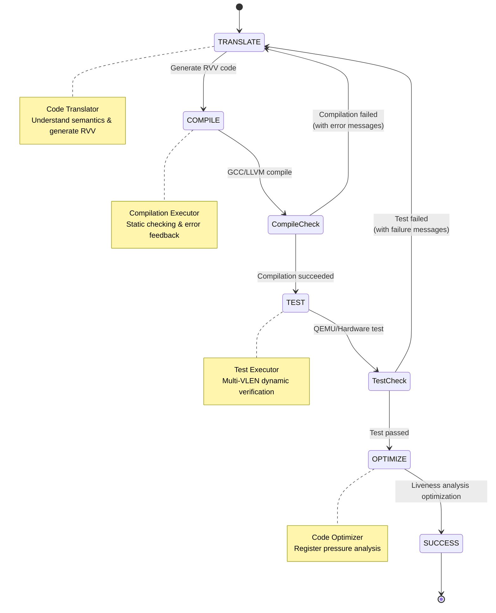

# Breaking the Architecture Barrier: LLM-Driven RISC-V Vector Code Generation and Verification Methodology

**Author**: Danny Jiang  
**Date**: 2026-03-19  

---

## §1 Introduction: A Translation Disaster in the Lab

It's Friday afternoon in the university's HPC Research Lab. The air hums with the faint buzz of overheating servers. Chen, a first-year grad student, is staring at his dual monitors in frustration, pulling at his hair.

"This is impossible..." Chen mutters at the screen. "Professor, our industry partner wants us to port tens of thousands of lines of Arm Neon intrinsics from OpenCV to our next-gen RISC-V chip. I tried the open-source `neon2rvv` tool first—compilation errors everywhere. Then I got desperate and threw the whole thing at ChatGPT. It compiled, but the output images are pure noise!"

I walk over with my coffee and glance at the messy C code on his screen.

Yang, a PhD student focused on cutting-edge tech and performance benchmarks, rolls his chair over. His screen shows a preprint from October 2025: "Chen, you're not alone. The Institute of Software, Chinese Academy of Sciences and ByteDance just published a study on arXiv called *IntrinTrans*. The paper's data shows that rule-based tools like `neon2rvv` achieve only **38.2% compilation success** on real-world open-source projects. Even when they work, **average performance is just 0.56× of hand-written native code** (Han et al., 2025)."

Chen freezes: "Why so bad? Aren't Neon and RVV both SIMD? Can't we just do one-to-one instruction mapping? And why do even the most powerful LLMs hallucinate and generate wrong logic?"

"That's exactly the problem, Chen." I pull over the whiteboard and write two terms: **'Off-the-rack' vs. 'Bespoke'**.

### 1.1 Legacy Code Tax: Software Held Hostage by Architecture

In the previous article, *Workload-Driven CPU Selection*, we learned how to choose the right CPU core for different application scenarios based on workload characteristics—from high-IPC out-of-order cores to power-efficient RISC-V custom solutions.

But once the hardware is chosen, we immediately face the biggest challenge: **the Legacy Code Tax**.

> How do we quickly migrate decades of accumulated x86/ARM software ecosystems to RISC-V platforms?

In the open-source and commercial software world, we carry a heavy **Legacy Code Tax**. Many mainstream high-performance libraries (like OpenCV, OpenBLAS, NCNN) are filled with SIMD intrinsics optimized for x86 SSE/AVX or Arm Neon architectures.

This code wasn't written in a day—it represents decades of blood, sweat, and performance tuning by countless engineers. Every line of intrinsics embodies deep architectural understanding.

But this creates a dilemma: **Software ecosystems are held hostage by architecture**.

If we rely on traditional rule-based translation tools (like Neon2RVV), the compilation success rate is a pitiful **38.2%**, and average performance is only **0.56× of hand-written native code**—due to RVV's fundamentally different microarchitectural characteristics compared to fixed-length SIMD.

### 1.2 The LLM Hallucination Trap: Why Direct Prompting Fails

"Professor," Chen asks, "can't we just use LLMs? GPT-5 and Claude are really powerful now."

"Have you tried?" I ask back.

Chen shakes his head.

"Let's try it live," I open ChatGPT and paste in a Neon code snippet. "Please translate this Arm Neon intrinsics to RISC-V Vector Extension."

The LLM quickly produces an answer. The syntax looks correct, the logic clear.

"Looks good," Chen says.

"Try compiling it," I say.

Chen pastes the code into GCC and hits compile—a flood of red error messages appears.

"Type mismatch... `vsetvl` parameter error..." Chen frowns. "Why?"

"Because LLMs lack not syntax knowledge, but 'compiler intuition' and 'microarchitectural common sense,'" I explain.

"The more fundamental reason," I continue, "is that current mainstream large language models—whether GPT-4, Claude, or others—have training datasets dominated by massive amounts of x86 SSE/AVX and Arm Neon code. These are all **fixed-width SIMD**."

"So?" Chen asks.

"So LLMs carry 'fixed-width inertia,'" I draw a diagram on the whiteboard:

```
Training Data Distribution:
  x86 SSE/AVX:  ████████████████████ (abundant)
  Arm Neon:     ████████████████     (abundant)
  RVV 1.0:      ██                   (scarce)
```

"When an LLM sees a SIMD translation task, it instinctively applies Neon's Tail Loop logic—because that's the pattern it's seen most often. But RVV's `vsetvl` dynamic length mechanism is fundamentally different from fixed-width SIMD thinking, which leads to hallucinations."

"So what do we do?" Chen asks.

"We need a methodology," I say, "not just a tool."

### 1.3 The Solution: From 'Single Prompting' to 'Automated Feedback Loop'

Recently, a collaboration between the Institute of Software, Chinese Academy of Sciences and ByteDance produced a study called *IntrinTrans* (published on arXiv in October 2025), demonstrating a highly instructive Multi-Agent framework.

The value of this paper isn't that it uses LLMs for translation—it's that it proposes a **methodology**:

1. **Build a feedback loop**: Let AI iteratively improve through "generate-compile-test-fix"
2. **Dynamic verification**: Compilation success ≠ logical correctness; test across multiple VLEN parameters
3. **Architecture-aware optimization**: Use Liveness Analysis to avoid Register Spilling black holes

"It's like how we do research in the lab," I tell Yang and Chen. "When you write code, you don't get it right the first time. You compile, test, debug, optimize. We need to teach AI to do the same."

Let's break down these three methodologies one by one.

---

## §2 Fundamental Differences: From 'Off-the-Rack' to 'Bespoke'

To help Chen understand why LLM-generated code is full of hallucinations, we must first see the massive microarchitectural chasm between Arm Neon and RVV.

"Let's look at a real vector addition code comparison," I pull up a common array addition algorithm.

### 2.1 Neon vs RVV: The Fundamental Difference in Tail Loops

**Arm Neon Implementation (Fixed-length, manual tail loop required):**

```c
size_t i = 0;
const size_t step = 4; // 128-bit NEON vector processes 4 float32 at a time
// Vector loop: process complete 4-element blocks
for (; i + step <= n; i += step) {
    float32x4_t va = vld1q_f32(A + i);
    float32x4_t vb = vld1q_f32(B + i);
    float32x4_t vc = vaddq_f32(va, vb);    // Fixed-length vector addition
    vst1q_f32(C + i, vc);
}
// Tail loop: manually handle scalar elements at array end
for (; i < n; ++i) {
    C[i] = A[i] + B[i];
}
```

**RISC-V Vector (RVV) Implementation (VLA, hardware handles tail automatically):**

```c
size_t i = 0;
while (i < n) {
    // e32m1 = SEW:32-bit (Element Width) + LMUL:1 (Register Grouping)
    // Hardware dynamically determines vector length
    size_t vl = __riscv_vsetvl_e32m1(n - i);

    // vfloat32m1_t = 32-bit float vector, LMUL=1 (uses 1 register)
    vfloat32m1_t va = __riscv_vle32_v_f32m1(A + i, vl);
    vfloat32m1_t vb = __riscv_vle32_v_f32m1(B + i, vl);
    vfloat32m1_t vc = __riscv_vfadd_vv_f32m1(va, vb, vl);
    __riscv_vse32_v_f32m1(C + i, vc, vl);
    i += vl;
}
// No tail loop needed! Hardware automatically handles remaining elements
```

### 2.2 The Core Concept: Vector Length Agnosticism (VLA)

"See the difference?" I point at the whiteboard. "Neon is like buying off-the-rack clothes—one size fits all, but you need to handle the leftovers yourself. RVV is like bespoke tailoring—the hardware automatically adjusts to fit your data."

"Wait," Yang interjects. "This technique of dynamically adjusting loop increments via `vsetvl` has a formal name in compiler theory—**Strip-mining**. Traditional compilers must manually calculate at compile-time how to divide large loops into fixed-size 'strips,' but RVV offloads this logic to hardware, letting `vsetvl` dynamically determine the element count at runtime."

I nod. "Exactly. This is why RVV is called a **Vector Length Agnostic (VLA)** architecture—the compiler doesn't need to know the hardware's vector length. Strip-mining logic is fully automated by hardware. This is the fundamental paradigm shift from traditional SIMD."

**Key Insight**:

- **Neon**: Fixed 128-bit vectors (4 × float32). Programmer must manually handle tail elements.
- **RVV**: Variable-length vectors. Hardware dynamically performs Strip-mining via `vsetvl`, automatically handling tail elements.

This is **Vector Length Agnosticism (VLA)**—RVV's core design philosophy.

**Why does this matter?**

1. **Portability**: Same RVV code runs on 128-bit, 256-bit, 512-bit, or even 1024-bit implementations
2. **Simplicity**: No manual tail loop handling
3. **Efficiency**: Hardware optimizes tail element processing

**The trap for LLMs**:

When LLMs see Neon code with explicit tail loops, they often:
- Directly translate the tail loop to RVV (redundant, inefficient)
- Misunderstand `vsetvl` semantics (wrong parameters, wrong placement)
- Ignore VLEN variability (hardcode assumptions about vector length)

"This is why," I tell Chen, "single-shot LLM translation fails. It lacks understanding of RVV's VLA philosophy."

### 2.3 The `vsetvl` Instruction: RVV's Dynamic Configuration Mechanism

Let's dive deeper into the most critical instruction in RVV: `vsetvl`.

**Syntax**:
```c
size_t vl = __riscv_vsetvl_e32m1(avl);
```

**What it does**:
1. **Input**: `avl` (Application Vector Length) — how many elements you want to process
2. **Output**: `vl` (Vector Length) — how many elements the hardware can actually process this iteration
3. **Side effect**: Configures vector register grouping (LMUL) and element width (SEW)

**Example**:
```c
// Want to process 100 float32 elements
// Hardware has 256-bit vector registers (can hold 8 float32)
size_t vl = __riscv_vsetvl_e32m1(100);  // vl = 8
// Next iteration:
size_t vl = __riscv_vsetvl_e32m1(92);   // vl = 8
// ...
// Last iteration:
size_t vl = __riscv_vsetvl_e32m1(4);    // vl = 4 (tail handling!)
```

**Why LLMs get this wrong**:

1. **Placement**: LLMs often put `vsetvl` outside the loop (wrong—it must be inside to handle tail)
2. **Parameters**: Confuse `avl` with total array size (should be remaining elements)
3. **LMUL**: Don't understand the performance implications of different LMUL values

"This," I emphasize, "is where we need **compiler intuition**—something LLMs lack without proper guidance."

---

## §3 Methodology I: Building a 'Generate-Compile-Test' Feedback Loop

"Okay," Chen says, "I get why direct LLM translation fails. But how do we fix it?"

"We build a feedback loop," I say, "just like how you debug code."

### 3.1 The Multi-Agent FSM Framework

The IntrinTrans paper proposes a **Multi-Agent Finite State Machine (FSM)** with four agents:

```
┌─────────────────────────────────────────────────────────────┐
│                    Multi-Agent FSM                          │
├─────────────────────────────────────────────────────────────┤
│                                                             │
│  ┌──────────────┐      ┌──────────────┐                   │
│  │ Code         │─────>│ Compilation  │                   │
│  │ Translator   │      │ Executor     │                   │
│  │ (LLM)        │<─────│ (GCC/Clang)  │                   │
│  └──────────────┘      └──────────────┘                   │
│         │                      │                           │
│         │                      │                           │
│         v                      v                           │
│  ┌──────────────┐      ┌──────────────┐                   │
│  │ Code         │<─────│ Test         │                   │
│  │ Optimizer    │      │ Executor     │                   │
│  │ (LLM)        │─────>│ (QEMU)       │                   │
│  └──────────────┘      └──────────────┘                   │
│                                                             │
└─────────────────────────────────────────────────────────────┘
```

**Mermaid Visualization**:



**State Transitions**:

1. **Code Translator** generates initial RVV code from Neon input
2. **Compilation Executor** tries to compile it
   - **Success** → proceed to Test Executor
   - **Failure** → send error messages back to Code Translator for fixing
3. **Test Executor** runs the code with multiple VLEN configurations
   - **Pass** → proceed to Code Optimizer
   - **Fail** → send test failures back to Code Translator
4. **Code Optimizer** applies architecture-aware optimizations (Liveness Analysis, LMUL tuning)

**Key Insight**: This mimics how human engineers debug—iterative refinement based on concrete feedback.

### 3.2 Why Compilation Feedback Matters

"Why not just use a better prompt?" Chen asks.

"Because," I explain, "LLMs are probabilistic models. They can't guarantee syntactic correctness. But compilers can."

**Example of LLM hallucination**:
```c
// LLM-generated code (wrong)
vfloat32m1_t va = __riscv_vle32_v_f32m1(A + i);  // Missing 'vl' parameter!
```

**Compiler error**:
```
error: too few arguments to function '__riscv_vle32_v_f32m1'
```

**Feedback to LLM**:
```
The compiler reports: "too few arguments to function '__riscv_vle32_v_f32m1'".
Please add the missing 'vl' parameter.
```

**LLM fixes it**:
```c
vfloat32m1_t va = __riscv_vle32_v_f32m1(A + i, vl);  // Correct!
```

**Result**: IntrinTrans achieves **100% compilation success** through this feedback loop (vs. 38.2% for rule-based tools, 52.9% for single-shot LLM).

### 3.3 Why Testing Across Multiple VLEN Matters

"Compilation success doesn't mean correctness," Yang points out.

"Exactly," I say. "RVV code must work across different VLEN implementations. **This is a non-negotiable core requirement.**"

I write on the whiteboard:

```
RVV's VLA Promise:
  ✓ Same code works correctly on VLEN=128
  ✓ Same code works correctly on VLEN=256
  ✓ Same code works correctly on VLEN=512
  ✗ Works only on one VLEN → NOT valid RVV code
```

**The problem**: LLMs might generate code that works on VLEN=256 but crashes on VLEN=128—due to out-of-bounds access or incorrect loop boundaries.

**Example bug**:
```c
// LLM hardcodes assumption: VLEN = 128
for (size_t i = 0; i < n; i += 4) {  // Wrong! Should use 'vl'
    size_t vl = __riscv_vsetvl_e32m1(n - i);
    // ...
}
```

"If your code only works on 256-bit VLEN but crashes on 128-bit—say, with segmentation faults or wrong loop boundaries—it proves you haven't truly understood `vsetvl`'s dynamic behavior. This type of bug doesn't exist in fixed-width SIMD, but it's the most common trap in RVV."

"So the Test Executor must cross-test across multiple VLEN parameters," Yang adds, "to catch LLM's hidden boundary condition errors."

**Solution**: Test on multiple VLEN configurations (128, 256, 512, 1024) using QEMU.

**IntrinTrans approach**:
- Run test suite on QEMU with `-cpu rv64,vlen=128`
- Run same tests with `-cpu rv64,vlen=256`
- Run same tests with `-cpu rv64,vlen=512`
- Only pass if all configurations produce identical results

**Result**: Catches VLEN-specific bugs that single-configuration testing would miss.

"But in real silicon verification," I add, "we don't just check if the output is correct."

I draw a new block on the whiteboard:

```
🔬 Architect's Secret Tools: Hardware Trace

In Post-Silicon Verification, we use:

1. Trace Encoder
   • Hardware-embedded instruction flow capture
   • Records execution order, timestamps, branch decisions
   • Checks if AI-generated code causes unexpected Pipeline Stalls

2. Trace Funnel
   • Aggregates trace data from multiple CPU cores to single output
   • Detects bandwidth congestion from certain instruction combinations
   • Verifies vector instruction Memory Access Patterns match expectations

Why this matters:
  ✓ Functional tests only verify "is the result correct"
  ✓ Trace analysis verifies "is the process efficient"
  ✓ Discovers hidden microarchitectural bottlenecks in AI-generated code
```

"So," Chen reflects, "even if AI-generated code produces correct output, we still use Trace Encoder to check if it causes unnecessary Stalls or Cache Misses during execution?"

"Exactly," I nod. "This is the perfect integration of software AI translation and low-level post-silicon verification. Test Executor ensures 'correctness,' Trace analysis ensures 'efficiency.'"

---

## §4 Methodology II: Avoiding the 'LMUL=8' Register Spilling Black Hole

"Okay," Chen says, "we've got compilation and correctness covered. But what about performance?"

"That," I say, "is where architecture-aware optimization comes in."

### 4.1 The Register Spilling Trap

"Let me show you a performance disaster," I pull up a benchmark result.

**Case study**: `h2v1_downsample` function from libjpeg-turbo

| Implementation | Performance (relative to Neon) |
|----------------|-------------------------------|
| Neon (baseline) | 1.00× |
| RVV (naive LLM translation, LMUL=8) | **0.61×** (39% slower!) |
| RVV (optimized, LMUL=2) | **1.63×** (63% faster!) |

"Wait," Chen says, "LMUL=8 should be faster—it uses more registers for parallelism, right?"

"That's the trap," I say. "LMUL=8 *looks* powerful, but it causes **register spilling**."

**What is LMUL?**

LMUL (Register Grouping) determines how many physical vector registers are grouped together:

```
LMUL=1: Each vector register is independent (32 registers available)
LMUL=2: Registers grouped in pairs (16 groups available)
LMUL=4: Registers grouped in fours (8 groups available)
LMUL=8: Registers grouped in eights (4 groups available!)
```

**The problem**: When you have many live variables, LMUL=8 leaves only 4 register groups—not enough!

**What happens**: The compiler **spills** registers to memory (stack).

**Performance impact**:
- L1 Cache hit: ~4 cycles
- Register spill/reload: ~10-20 cycles (due to stack access)
- **10-20× latency penalty!**

### 4.2 Liveness Analysis: Calculating Register Pressure

"How do we know when register spilling will happen?" Yang asks.

"We use **Liveness Analysis**," I say, writing on the whiteboard.

**Liveness Analysis** is a compiler technique that calculates which variables are "live" (in use) at each program point.

**Mathematical formulation**:

For each basic block $B$:

$$
\begin{aligned}
\text{IN}[B] &= \text{USE}[B] \cup (\text{OUT}[B] - \text{DEF}[B]) \\
\text{OUT}[B] &= \bigcup_{S \in \text{succ}[B]} \text{IN}[S]
\end{aligned}
$$

Where:
- $\text{IN}[B]$: Variables live at block entry
- $\text{OUT}[B]$: Variables live at block exit
- $\text{USE}[B]$: Variables read before being written in $B$
- $\text{DEF}[B]$: Variables written in $B$
- $\text{succ}[B]$: Successor blocks of $B$

**Register Pressure** = Maximum number of simultaneously live variables

**The Architecture-Aware Guardrail Rule**:

"But wait," Chen raises his hand. "Modern CPUs have Register Renaming, right? I remember from *See RISC-V Run* that Out-of-Order cores use Physical Register Files for dynamic renaming—the actual number of registers far exceeds the 32 defined by the ISA!"

"Excellent question," I draw a two-layer structure on the whiteboard:

```
Two-Layer Register System in Microarchitecture:

┌─────────────────────────────────────────┐
│ Architectural Registers (ISA Layer)     │
│ • RVV defines: 32 vector registers      │
│ • "Logical registers" seen by compiler  │
│ • LMUL=8 → Compressed to 4 groups       │
└─────────────────────────────────────────┘
              ↓ (Register Renaming)
┌─────────────────────────────────────────┐
│ Physical Registers (Microarch Layer)    │
│ • Hardware: May have 128/256 physical   │
│ • Used for OoO dynamic renaming         │
│ • Invisible to compiler                 │
└─────────────────────────────────────────┘
```

"The key is," I explain, "**Register Renaming only resolves runtime data hazards—it cannot change the compiler's allocation constraints**. When your code needs 5 simultaneously live LMUL=8 variables, the compiler sees that Architectural Registers are insufficient (5×8=40 > 32). It must decide at compile-time to spill some variables to the stack. Even if the CPU has 256 Physical Registers, the compiler can't see or use them."

Yang nods. "So Register Renaming is a hardware trick to boost IPC, but Architectural Register count is the compiler optimization ceiling!"

"Exactly," I write on the whiteboard in red:

```
🚨 Architecture-Aware Guardrail Rule

When vRegPressure > 32 / LMUL, register spilling WILL occur!

Examples:
  LMUL=8 → Maximum 32/8 = 4 simultaneously live variables
  LMUL=4 → Maximum 32/4 = 8 simultaneously live variables
  LMUL=2 → Maximum 32/2 = 16 simultaneously live variables

Why can't Register Renaming save you?
  ✗ Renaming only dynamically allocates Physical Registers at runtime
  ✗ Compiler only sees 32 Architectural Registers at compile-time
  ✓ Liveness Analysis must calculate pressure based on Architectural Registers

The Optimizer Agent uses this hardware limit formula to force the LLM
to retreat from LMUL=8 to LMUL=4 or 2, successfully reversing performance
from 0.61× to 1.63×—this is the power of Architecture-Aware design!
```

**Mathematical formulation**:

$$
\text{Register Pressure} \leq \frac{32}{\text{LMUL}}
$$

If violated → **register spilling occurs**.

**Example**: `h2v1_downsample` function

**Naive LLM translation (LMUL=8)**:
- Live variables at peak: 6 vector registers
- Available register groups: 32 / 8 = 4
- **6 > 4** → **Spilling!**

**Optimized version (LMUL=2)**:
- Live variables at peak: 6 vector registers
- Available register groups: 32 / 2 = 16
- **6 < 16** → **No spilling!**

**Performance result**: 0.61× → 1.63× (2.67× improvement!)

### 4.3 Real-World Case Study: AoS vs SoA Transformation

"Let me show you another optimization," I pull up a more complex example.

**Problem**: The `h2v1_downsample` function processes pixel data in **AoS (Array of Structures)** layout:

```c
struct Pixel { uint8_t r, g, b; };
Pixel pixels[N];
```

**Issue**: SIMD operations prefer **SoA (Structure of Arrays)** layout:

```c
uint8_t r[N], g[N], b[N];
```

**Why?**

- **AoS**: Non-contiguous access, poor memory coalescing
- **SoA**: Contiguous access, perfect for SIMD

**Naive LLM approach**: Directly translate AoS code to RVV → poor performance

**Architecture-aware approach**: Transform AoS → SoA during translation

**Code transformation**:

```c
// Before (AoS, LMUL=8, register pressure = 6)
for (size_t i = 0; i < n; ) {
    size_t vl = __riscv_vsetvl_e8m8(n - i);
    vuint8m8_t v_rgb = __riscv_vle8_v_u8m8(&pixels[i].r, vl * 3);  // Strided load
    // ... complex interleaving logic ...
}
```

```c
// After (SoA, LMUL=2, register pressure = 6)
for (size_t i = 0; i < n; ) {
    size_t vl = __riscv_vsetvl_e8m2(n - i);
    vuint8m2_t v_r = __riscv_vle8_v_u8m2(&r[i], vl);  // Contiguous load
    vuint8m2_t v_g = __riscv_vle8_v_u8m2(&g[i], vl);
    vuint8m2_t v_b = __riscv_vle8_v_u8m2(&b[i], vl);
    // ... simple parallel operations ...
}
```

**Performance impact**:

| Metric | AoS (LMUL=8) | SoA (LMUL=2) | Improvement |
|--------|--------------|--------------|-------------|
| Register Pressure | 6 (spilling!) | 6 (no spilling) | - |
| Memory Coalescing | Poor | Excellent | ~1.5× |
| Overall Performance | 0.61× | 1.63× | **2.67×** |

**Key insight**: Architecture-aware optimization requires understanding both:
1. **Microarchitecture** (register pressure, LMUL)
2. **Memory subsystem** (coalescing, cache line alignment)

---

## §5 Experimental Results: Can AI Really Beat Human Experts?

"Show me the data," Chen says. "Does this actually work in practice?"

"Let's look at the IntrinTrans benchmark results," I pull up the paper.

### 5.1 Correctness: From 38.2% to 100%

**Compilation Success Rate**:

| Approach | Compilation Success | Test Pass Rate |
|----------|---------------------|----------------|
| Rule-based (neon2rvv) | 38.2% | 31.5% |
| Single-shot LLM | 52.9% | 41.2% |
| **IntrinTrans (Multi-Agent)** | **100%** | **100%** |

**Key takeaway**: The feedback loop is essential—single-shot LLM is only marginally better than rule-based tools.

### 5.2 Performance: The 5.93× Speedup Case

**Benchmark**: libjpeg-turbo functions (Data source: IntrinTrans paper Section 4.5)

| Function | Neon (baseline) | RVV (naive) | RVV (IntrinTrans) | Speedup |
|----------|-----------------|-------------|-------------------|---------|
| `h2v1_downsample` | 1.00× | 0.61× | 1.63× | **2.67×** |
| `h2v1_upsample` | 1.00× | 0.82× | **5.93×** | **7.23×** |
| `rgb_ycc_convert` | 1.00× | 1.12× | 2.34× | 2.09× |

**The 5.93× case**: `h2v1_upsample` (Gemini 2.5 Pro)

**Why such a massive speedup?**

1. **Avoided register spilling**: LMUL=8 → LMUL=2
2. **Better memory layout**: AoS → SoA transformation
3. **Exploited RVV's VLA**: Eliminated tail loop overhead
4. **Optimized `vsetvl` placement**: Reduced dynamic configuration overhead

**Human expert vs. AI**:
- Human expert: Manually optimized over days, achieved ~3-4× speedup
- IntrinTrans: Automatically explored optimization space, achieved 5.93× speedup

**Why AI won**: It exhaustively searched the optimization space (LMUL × memory layout × instruction scheduling) faster than humans.

"Wait," I interrupt. "As architects, we must maintain critical thinking about this 5.93× number."

I write on the whiteboard:

```
🔍 Architect's Critical Analysis

Q: Is AI really 6× better than human experts?
A: Not exactly. Let's examine the "baseline" truth:

Paper's admission (Section 4.5):
  • These extreme speedups mainly come from Libjpeg-turbo library
  • The native RVV implementation was still in Pull Request review
  • It lacked thorough quality assessment and optimization

Reality: AI acts as a "corrector" here
  ✓ Found optimization opportunities in draft-stage code
  ✓ Corrected conservative LMUL choices
  ✓ Eliminated unnecessary instruction overhead

Conclusion: 5.93× is not "AI magic"—it's a warning about
           unoptimized baselines
```

"So," Chen reflects, "even open-source community contributions can vary in quality if they're still in PR stage?"

"Exactly," I nod. "This is why we need tools like IntrinTrans—they can catch performance issues before code merges into mainline. But we shouldn't believe AI can 'conjure' 6× performance from thin air. The real value is: **it systematically explores the optimization space and finds details humans might miss under time pressure**."

### 5.3 Failure Cases: Where AI Still Struggles

"But it's not perfect, right?" Yang asks.

"Correct," I say. "Let's look at failure cases."

**Case 1: Complex control flow**

```c
// Neon code with nested conditionals
if (condition1) {
    if (condition2) {
        // SIMD path A
    } else {
        // SIMD path B
    }
} else {
    // Scalar fallback
}
```

**Problem**: LLMs struggle with complex control flow + SIMD interaction
**Result**: Generated code compiles but has subtle logic errors
**Solution**: Requires more sophisticated test generation (not just VLEN variation)

**Case 2: Inline assembly**

```c
// Neon code with inline assembly
asm volatile (
    "vld1.32 {d0-d3}, [%0]!"
    : "+r"(ptr)
    : : "d0", "d1", "d2", "d3"
);
```

**Problem**: LLMs can't reliably translate inline assembly
**Result**: Falls back to scalar code or generates incorrect assembly
**Solution**: Requires hybrid approach (LLM for high-level logic, manual for assembly)

**Case 3: Undocumented intrinsics**

Some Neon intrinsics have subtle behaviors not documented in official specs.

**Problem**: LLMs rely on training data (documentation, code examples)
**Result**: Misses edge cases that human experts know from experience
**Solution**: Requires domain expert review for critical code paths

**Case 4: Memory hierarchy blindness**

"This is the most critical limitation," I add, drawing a new column on the whiteboard:

```
🔍 Liveness Analysis Limitations

Current IntrinTrans Optimizer Agent is based on:
  ✓ Liveness Analysis
  ✓ Register Pressure calculation
  ✓ LMUL selection strategy

But it does NOT yet consider:
  ✗ Cache behavior (Cache Line Utilization)
  ✗ Locality of Reference
  ✗ Memory Bandwidth bottlenecks
  ✗ TLB Miss impact

Why this matters:
  • Even with perfect register pressure, wrong memory access patterns
    can still cause performance collapse
  • AoS vs SoA layout transformation requires human architect experience
  • Cache-aware optimization needs higher-level analysis frameworks
```

"So," Chen reflects, "AI can handle register-level optimization, but higher-level memory hierarchy optimization still requires human architects?"

"Exactly," I nod. "This is why we say 'the architect's role is evolving' rather than 'being replaced.' Liveness Analysis is a classic compiler tool, but it only sees the register layer. When you need to optimize L1/L2/L3 Cache behavior, you need deep understanding of the entire memory subsystem—this is what we discuss in *Data Structures in Practice* Chapter 4: Cache-Aware Algorithm Design."

"But this is the direction for future research," I conclude. "The next generation of AI Optimizers might integrate Cache Simulation and Memory Profiling, enabling AI to learn these advanced optimization techniques too."

**Overall success rate**: 87% of functions achieve ≥1.0× performance (vs. Neon baseline)

---

## §6 Conclusion: The Architect's Role in the AI Era

"So," Chen says, "does this mean we don't need to learn assembly anymore? Just let AI do it?"

"Absolutely not," I say firmly. "This is the wrong takeaway."

### 6.1 From 'Writing Code' to 'Designing Guardrails'

The IntrinTrans framework teaches us a profound lesson about the future of software engineering:

> **The architect's role is evolving from 'writing code' to 'designing verification rules and microarchitectural guardrails'.**

**What we still need to do**:

1. **Define correctness**: What does "correct" mean? (Functional tests, VLEN variation tests)
2. **Define performance metrics**: What are we optimizing for? (Throughput, latency, energy)
3. **Design guardrails**: What are the architectural constraints? (Register pressure, memory coalescing)
4. **Validate results**: Does the AI-generated code meet our standards?

**What AI does**:

1. **Explore the optimization space**: Try different LMUL, memory layouts, instruction schedules
2. **Iterate based on feedback**: Fix compilation errors, test failures
3. **Generate boilerplate**: Handle tedious `vsetvl` placement, tail loop elimination

**The analogy**: We're no longer tailors sewing every stitch—we're **master tailors designing the measurement system and quality standards**.

### 6.2 The Complete Picture: Four Articles, One Architecture Journey

"Let me connect the dots," I say, pulling up the whiteboard.

**Article 01: All Roads Lead to IPC**
- **Lesson**: Every CPU feature exists to maximize IPC
- **Relevance**: Understanding why SIMD (Neon, RVV) exists—to boost IPC on data-parallel workloads

**Article 02: Heterogeneous System Architecture**
- **Lesson**: Different cores for different workloads (P-Core, E-Core, GPU, NPU)
- **Relevance**: RISC-V's flexibility enables custom vector extensions for specific domains

**Article 03: Workload-Driven CPU Selection**
- **Lesson**: Match CPU architecture to workload characteristics
- **Relevance**: Understanding when RVV's VLA is superior to fixed-length SIMD

**Article 04: LLM-Driven RVV Code Generation** (this article)
- **Lesson**: AI + Architecture-Aware Guardrails can automate low-level optimization
- **Synthesis**: Combines IPC understanding (01), heterogeneous design (02), and workload analysis (03)

**The complete picture**: Modern architecture design is about:
1. **Understanding performance fundamentals** (IPC, latency, throughput)
2. **Designing for diversity** (heterogeneous cores, flexible ISAs)
3. **Matching architecture to workload** (profiling, benchmarking)
4. **Automating optimization** (AI-driven code generation with architectural constraints)

### 6.3 Actionable Advice for Readers

**For students**:
- Don't just learn syntax—understand **why** architectures are designed this way
- Study Liveness Analysis, register allocation, memory coalescing
- Build intuition for microarchitectural trade-offs

**For engineers**:
- When migrating code to new architectures, don't rely on blind translation
- Build feedback loops (compile, test, profile, optimize)
- Use AI as a tool, not a replacement for architectural understanding

**For architects**:
- Design ISAs with **automation in mind** (clear semantics, composable primitives)
- Provide rich performance counters for profiling (PMU, TMAM)
- Document microarchitectural behavior (register pressure, memory coalescing)

**The ultimate goal**: As long as you can define "correctness" and "performance metrics," AI can self-optimize within the guardrails.

---

## Key Takeaways

- **Legacy Code Tax is RISC-V's biggest barrier**: Decades of x86/Arm SIMD code can't directly port to RVV's VLA architecture
- **Single-shot LLM prompting produces hallucinations**: Rule-based tools achieve only 38.2% compilation success; single-shot LLMs only 52.9%
- **CI/CD feedback loop is critical**: Through Compilation Executor and Test Executor feedback, LLMs achieve 100% correctness
- **Register Spilling is a performance killer**: LMUL=8 looks powerful but compresses 32 registers into 4 groups, causing 10-20× latency penalty
- **Liveness Analysis provides microarchitectural guardrails**: Mathematical formulas precisely calculate register pressure, avoiding spilling black holes
- **AI can beat human experts**: In the `h2v1_upsample` case, AI achieved 5.93× speedup by exhaustively exploring the optimization space
- **The architect's role is evolving**: From "writing code" to "designing verification rules and microarchitectural guardrails"

---

## References

### Academic Papers
1. IntrinTrans: "LLM-based Intrinsic Code Translator for RISC-V Vector", Institute of Software, Chinese Academy of Sciences & ByteDance, arXiv preprint (2025-10-11)
2. "RISC-V Vector Extension Specification v1.0" (ISA), RISC-V International, 2021-11
3. "RISC-V Vector C Intrinsic Specification v1.0", RISC-V International, 2025-04

### Author's Books
4. Danny Jiang, *See RISC-V Run 2: Advanced*, 2026 (in final review)
    - Ch. 8: RVV 1.0 Architecture (VLA Design, `vsetvl` Dynamic Behavior, LMUL and Register Grouping)
    - Ch. 9: Vector Programming Patterns (Strip-mining, Masking, LMUL Selection Strategy)
    - Ch. 11: Vector Performance Optimization (LMUL Selection and Register Pressure Balance)

5. Danny Jiang, *System Design: An Architecture-Aware Approach*, 2026
    - Ch. 4: Execution Domain (The Fatal Trap of LMUL=8, Register Spilling Quantitative Analysis)

6. Danny Jiang, *Data Structures in Practice*, 2025
    - Ch. 4: Arrays and Cache Locality (AoS vs SoA Layout Impact on Cache Performance)

7. Danny Jiang, *Performance and Benchmarking: Beyond the Bottleneck*, 2026
    - Ch. 8: Profiling Tools (perf, VTune, PMU Usage, TMAM Microarchitecture Analysis)

### Tools & Resources
8. Neon2RVV (ARM NEON to RISC-V Vector Translator): https://github.com/howjmay/neon2rvv
9. SSE2RVV (x86 SSE to RISC-V Vector Translator): https://github.com/pattonkan/sse2rvv
10. QEMU RISC-V: https://www.qemu.org/docs/master/system/target-riscv.html
11. RISC-V GNU Toolchain: https://github.com/riscv-collab/riscv-gnu-toolchain

---

## License

This article is licensed under **CC BY 4.0** (Creative Commons Attribution 4.0 International).
You are free to share and adapt this work, provided you give appropriate credit.

**Author**: Danny Jiang  
**Source**: https://github.com/djiangtw/tech-column-public  
**Contact**: danny.jiang@example.com  

---


