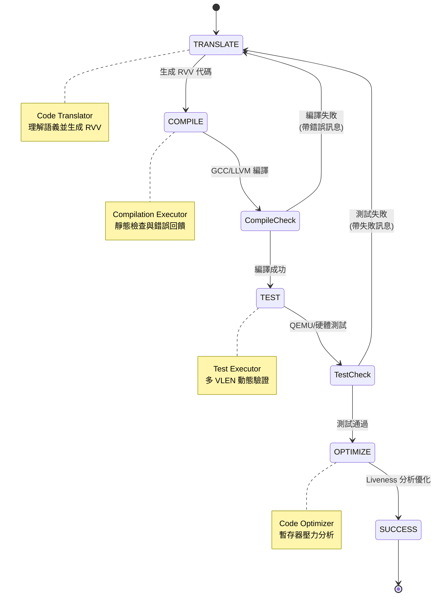

# 跨越架構壁壘：LLM 驅動的 RISC-V Vector 程式碼生成與驗證方法論

**作者**: Danny Jiang  
**日期**: 2026-03-19  

---

## §1 前言：實驗室裡的一場「翻譯災難」

週五下午的大學計算機架構實驗室 (HPC Research Lab) 裡，空氣中瀰漫著過熱伺服器的微弱嗡嗡聲。研一的小陳正對著雙螢幕崩潰，煩躁地抓著頭髮。

「這根本是不可能的任務……」小陳對著螢幕抱怨，「教授，我們公司合作的專案要把 OpenCV 裡幾萬行針對 Arm Neon 優化的 Intrinsics（內建函式）移植到我們新一代的 RISC-V 晶片上。我先試了開源的 `neon2rvv` 轉換工具，結果滿畫面都是編譯錯誤。後來我火大了，乾脆把整段代碼丟給 ChatGPT 叫它直接翻譯。結果編譯是過了，但跑出來的影像全都是雪花雜訊！」

我端著咖啡走過去，看了一眼他螢幕上雜亂的 C 程式碼。

這時，專注於前沿技術與效能跑分的博士生小楊滑著椅子靠了過來，他的螢幕上開著一篇 2025 年 10 月剛發布的預印本論文：「小陳，你不是唯一崩潰的人。中科院軟體研究所和字節跳動剛在 arXiv 發布了一篇叫 *IntrinTrans* 的研究。論文數據顯示，像 `neon2rvv` 這種基於規則（Rule-based）的傳統靜態轉換工具，在真實開源專案中的 **編譯成功率只有 38.2%**，而且就算幸運跑得動，**平均效能也只有原生手寫實作的 0.56 倍** (Han et al., 2025)。」

小陳愣住了：「為什麼這麼慘？Neon 和 RVV 不都是 SIMD 嗎？一對一指令替換不就好了？而且為什麼連最強的 LLM 都會產生幻覺寫出錯的邏輯？」

「這就是問題所在，小陳。」我拉過白板，寫下兩個詞：**『成衣 (Off-the-rack)』與『量身訂製 (Bespoke)』**。

### 1.1 歷史包袱：軟體世界的「架構綁架」

在上一篇《應用驅動的架構選型》中，我們學會了如何根據 workload 特性，為不同應用場景選擇最合適的 CPU 核心——從高 IPC 的 Out-of-Order 核心到高效能密度的 RISC-V 客製化方案。

但硬體選好後，我們立刻面臨最大的挑戰：**軟體生態的歷史包袱 (Legacy Code Tax)**。

> 如何將數十年累積的 x86/ARM 軟體生態，快速遷移到 RISC-V 平台？

在開源與商業軟體世界中，我們背負著沉重的歷史包袱 (Legacy Code Tax)。許多主流的高效能函式庫（如 OpenCV、OpenBLAS、NCNN），內部早已寫滿了針對 x86 SSE/AVX 或 Arm Neon 架構最佳化的 SIMD 內建函式 (Intrinsics)。

這些程式碼不是一天寫成的，而是數十年來，無數工程師用血汗換來的效能優化。每一行 Intrinsics 背後，都代表著對特定架構的深度理解。

但這也造成了一個困境：**軟體生態被架構綁架了**。

如果依賴傳統基於規則 (Rule-based) 的翻譯工具（如 Neon2RVV），由於 RVV 與傳統固定長度 SIMD 截然不同的微架構特性，這些工具的編譯成功率僅有可憐的 **38.2%**，且平均效能只有原生手寫實作的 **0.56 倍**。

### 1.2 LLM 的幻覺陷阱：為什麼直接 Prompting 會失敗

「教授，」小陳在旁邊問，「那我們直接用 LLM 不行嗎？現在的 GPT-5、Claude 都很強啊。」

「你試過嗎？」我反問。

小陳搖搖頭。

「來，我們現場試試，」我打開 ChatGPT，把一段 Neon 程式碼貼進去，「請幫我把這段 Arm Neon Intrinsics 翻譯成 RISC-V Vector Extension。」

LLM 很快給出了答案，看起來語法正確，邏輯清晰。

「看起來不錯啊，」小陳說。

「編譯看看，」我說。

小陳把程式碼貼進 GCC，按下編譯——一堆紅色錯誤訊息湧出。

「型別不匹配⋯⋯`vsetvl` 參數錯誤⋯⋯」小陳皺眉，「為什麼會這樣？」

「因為 LLM 缺乏的不是語法知識，而是『編譯器直覺』與『微架構常識』，」我解釋。

「更根本的原因是，」我繼續說，「目前主流的大型語言模型——無論是 GPT-4、Claude 還是其他——它們的訓練資料庫中充滿了海量的 x86 SSE/AVX 與 Arm Neon 程式碼。這些都是**固定寬度 SIMD**。」

「所以？」小陳問。

「所以 LLM 會帶有『固定寬度的思維慣性』，」我在白板上畫了一個圖：

```
訓練資料分布：
  x86 SSE/AVX：  ████████████████████ (大量)
  Arm Neon：     ████████████████     (大量)
  RVV 1.0：      ██                   (稀少)
```

「當 LLM 看到 SIMD 翻譯任務時，它會本能地套用 Neon 的 Tail Loop 邏輯——因為這是它見過最多次的模式。但 RVV 的 `vsetvl` 動態長度機制與固定寬度 SIMD 的思維完全不同，這就導致了幻覺。」

「那怎麼辦？」小陳問。

「我們需要一套方法論，」我說，「而不是單純的工具。」

### 1.3 破題：從「單次 Prompting」到「自動化閉環」

近期，中國科學院軟體研究所與字節跳動合作的研究《IntrinTrans》(2025 年 10 月發布於 arXiv) 為我們展示了一套極具啟發性的多代理人 (Multi-Agent) 框架。

這篇論文的價值不在於它用 LLM 做了翻譯，而在於它提出了一套**方法論**：

1. **建立回饋閉環**：讓 AI 在「生成-編譯-測試-修正」中迭代改進
2. **動態驗證**：編譯通過 ≠ 邏輯正確，需要多 VLEN 參數測試
3. **架構感知優化**：引入 Liveness Analysis，避開 Register Spilling 黑洞

「這就像我們在實驗室做研究一樣，」我對小楊和小陳說，「你們寫程式碼時，也不是一次寫對，而是不斷編譯、測試、除錯、優化。我們要教 AI 做同樣的事。」

接下來，讓我們逐一拆解這三大方法論。

---

## §2 根本差異：從「成衣」到「量身訂製」

為了讓小陳明白為什麼 LLM 單次生成的代碼會充滿幻覺，我們必須先看清 Arm Neon 與 RVV 在微架構上的巨大鴻溝。

「讓我們看一段真實的向量加法程式碼對比，」我調出了一段常見的陣列相加演算法。

### 2.1 Neon vs RVV：Tail Loop 的根本差異

**Arm Neon 實作（固定長度，需要手動 Tail Loop）：**

```c
size_t i = 0;
const size_t step = 4; // 128-bit NEON vector 每次固定處理 4 個 float32
// Vector loop: 處理完整的 4 元素區塊
for (; i + step <= n; i += step) {
    float32x4_t va = vld1q_f32(A + i);
    float32x4_t vb = vld1q_f32(B + i);
    float32x4_t vc = vaddq_f32(va, vb);    // 固定長度的向量加法
    vst1q_f32(C + i, vc);
}
// Tail loop: 手動處理陣列尾部的純量元素 (Scalar)
for (; i < n; ++i) {
    C[i] = A[i] + B[i];
}
```

**RVV 實作（動態 VL，優雅適應）：**

```c
size_t i = 0;
while (i < n) {
    // 透過 vsetvl 與硬體協商，動態取得本次可處理的長度 (vl)
    // e32m1 = SEW:32-bit (Element Width) + LMUL:1 (Register Grouping)
    size_t vl = __riscv_vsetvl_e32m1(n - i);

    // vfloat32m1_t = 32-bit float 向量，LMUL=1 (佔用 1 個暫存器)
    vfloat32m1_t va = __riscv_vle32_v_f32m1(A + i, vl);
    vfloat32m1_t vb = __riscv_vle32_v_f32m1(B + i, vl);
    vfloat32m1_t vc = __riscv_vfadd_vv_f32m1(va, vb, vl); // 動態長度向量加法
    __riscv_vse32_v_f32m1(C + i, vc, vl);
    i += vl; // vsetvl 會自動適應最後的尾部資料
}
```

「看懂了嗎？」我指著螢幕上的代碼，「Arm Neon 因為硬體寬度是寫死的，一旦陣列長度不是 4 的倍數，你就必須在結尾多寫一段純量迴圈（Tail Loop）來『收尾』。但 RVV 具備 **動態向量長度（Dynamic VL）**，透過 `vsetvl` 指令，硬體會在執行期自動適應剩餘長度，這讓傳統的尾部處理邏輯完全失效。」

「等等，」小楊插話，「這種透過 `vsetvl` 動態調整迴圈增量的技術，在編譯器理論中有個正式名稱——**Strip-mining（條帶挖掘）**。傳統編譯器需要在編譯期手動計算如何將大迴圈切成固定大小的『條帶』，但 RVV 把這個邏輯下放到硬體，讓 `vsetvl` 在執行期動態決定每次處理的元素數量。」

我點頭：「沒錯。這就是為什麼 RVV 被稱為 **Vector Length Agnostic (VLA)** 架構——編譯器不需要知道硬體的向量長度，Strip-mining 的邏輯完全由硬體自動化處理。這是 RVV 與傳統 SIMD 最根本的典範轉移。」

小陳恍然大悟：「難怪 LLM 直接翻譯出來的代碼跑出來全是雪花雜訊！因為 LLM 看到 Neon 的 Tail loop，就會直覺地想把它也翻譯成一段 RVV 的 scalar code，結果和 `vsetvl` 的動態 Strip-mining 行為產生了邏輯衝突，導致越界存取或資料遺失！」

「沒錯，」小楊補充道，「Rule-based 工具無法理解這種語意級別的典範轉移，而缺乏測試與回饋機制的 LLM 單次 Prompting 則會陷入『依樣畫葫蘆』的幻覺。AI 寫 Code 缺乏的不是語法知識，而是『編譯器直覺』與『微架構常識』。」

「所以，」我總結道，「我們不能只讓 LLM 當個翻譯機，我們必須讓它進入一個 **CI/CD 的回饋閉環** 中，讓編譯器與測試案例來充當它的架構師導師。」

---

## §3 方法論一：建立「生成-編譯-測試」的 CI/CD 閉環

「教授，我懂了。」小陳若有所思地說，「因為 VLA 和動態 `vsetvl` 的存在，硬寫規則的翻譯工具和單次 Prompting 的 LLM 都會因為不懂微架構而產生幻覺。但我們總不能全部人工重寫吧？OpenCV 可是有幾十萬行程式碼啊！」

「放棄『LLM 應該一次寫對』的不切實際幻想，」我拉過白板上的另一塊空白處，開始畫起流程圖，「在系統工程中，我們必須把軟體開發的 **CI/CD（持續整合與交付）** 概念引入 Prompt Engineering。這正是 *IntrinTrans* 這篇論文最精彩的地方。」

小楊點點頭，將論文的架構圖投射到大螢幕上：「沒錯。他們不依賴單一的 ChatGPT 一次性翻譯，而是設計了一個 **多代理人協作框架 (Multi-Agent Framework)**，讓不同的 AI 代理人扮演不同的工程角色，透過有限狀態機 (FSM) 建立了一個嚴格的**回饋閉環 (Feedback Loop)**。」

### 3.1 四個 AI 代理人的分工

我在白板上寫下四個角色：

**1. Code Translator（翻譯者）**
「這是整個流程的起點，」我解釋道，「它負責初步將 Arm Neon 的 Intrinsics 轉換為 RVV。但它不只是做字面替換，而是試圖理解演算法的語義。比如看到 Neon 的 `vld1q_f32`（載入 4 個 float32），它會理解這是『載入向量』的意圖，然後生成對應的 RVV `__riscv_vle32_v_f32m1`。」

**2. Compilation Executor（編譯執行者）**
「這是 LLM 的『嚴格導師』，」小楊補充，「它會立刻呼叫 GCC 或 LLVM 進行靜態檢查。如果發現型別不匹配 (Type Mismatch)、未定義的變數、或是 `vsetvl` 參數錯誤，它不會只是報錯就結束，而是將完整的編譯錯誤訊息——包括錯誤的行號、具體的 Error Message——全部打包成 Prompt，丟回給 Translator，強迫它修正。」

小陳眼睛一亮：「所以這就像是我們平常寫程式時，編譯器告訴我們哪裡錯了，我們就去改，然後再編譯，直到通過為止？」

「完全正確，」我說，「只不過現在是 AI 在做這個迭代。」

**3. Test Executor（測試執行者）**
「編譯通過只是第一關，」我繼續說，「Test Executor 會將編譯好的二進位檔丟到 QEMU 模擬器或真實的 RISC-V 硬體上運行。這裡有個關鍵：它會設定不同的 VLEN 參數——128-bit、256-bit、512-bit——來驗證程式碼在不同硬體配置下的正確性。」

「為什麼要測試不同的 VLEN？」小陳問。

「因為 VLA 的精髓就在於『一次編寫，到處運行』，」我回答，「**這是不可妥協的核心要求**。」

我在白板上寫下：

```
RVV 的 VLA 承諾：
  ✓ 同一份程式碼在 VLEN=128 上正確
  ✓ 同一份程式碼在 VLEN=256 上正確
  ✓ 同一份程式碼在 VLEN=512 上正確
  ✗ 只在某個 VLEN 上正確 → 不是合格的 RVV 程式碼
```

「如果你的程式碼只在 256-bit VLEN 上跑得對，在 128-bit 上就崩潰——比如越界存取、錯誤的迴圈邊界——那就證明你沒有真正理解 `vsetvl` 的動態行為。這種 Bug 在固定寬度 SIMD 中不會出現，但在 RVV 中卻是最常見的陷阱。」

「所以 Test Executor 必須在多個 VLEN 參數下交叉測試，」小楊補充，「才能捕捉到 LLM 隱藏的邊界條件錯誤。任何執行期的崩潰——比如 Segmentation Fault、Assertion Failed、或是輸出數值錯誤——都會被轉化為詳細的錯誤報告，再次回饋給 Translator。」

「但在真實晶片驗證時，」我補充道，「我們不只看輸出結果是否正確。」

我在白板上加上一個新的區塊：

```
🔬 架構師的秘密工具：硬體追蹤 (Hardware Trace)

在 Post-Silicon Verification（矽後驗證）階段，我們會使用：

1. Trace Encoder（追蹤編碼器）
   • 硬體內建的指令流抓取機制
   • 記錄每條指令的執行順序、時間戳、分支決策
   • 檢查 AI 生成的程式碼是否產生非預期的 Pipeline Stall

2. Trace Funnel（追蹤漏斗）
   • 將多個 CPU Core 的 Trace 資料匯聚到單一輸出
   • 檢測是否因某些指令組合導致頻寬塞車
   • 驗證向量指令的 Memory Access Pattern 是否符合預期

為什麼這很重要？
  ✓ 功能測試只能驗證「結果對不對」
  ✓ Trace 分析能驗證「過程有沒有效率」
  ✓ 發現 AI 產生的程式碼中隱藏的微架構瓶頸
```

「所以，」小陳若有所思，「即使 AI 生成的程式碼輸出正確，我們還要用 Trace Encoder 檢查它在執行過程中是否產生了不必要的 Stall 或 Cache Miss？」

「沒錯，」我點頭，「這就是軟體 AI 翻譯與底層矽後驗證的完美串聯。Test Executor 保證『跑得對』，Trace 分析保證『跑得順』。」

**4. Code Optimizer（程式碼優化者）**
「這是整個框架的靈魂，」我在白板上重重地圈起這個角色，「前面三個代理人保證了程式碼『跑得對』，但 Optimizer 要保證它『跑得快』。這就是我們接下來要深入探討的 Liveness Analysis。」

### 3.2 有限狀態機驅動的自動化閉環

小楊在螢幕上展示了一個流程圖：

```text
┌─────────────────────────────────────────────────────────┐
│              IntrinTrans Multi-Agent FSM                 │
│                                                          │
│  ┌──────────┐                                           │
│  │  START   │                                           │
│  └────┬─────┘                                           │
│       │                                                 │
│       ▼                                                 │
│  ┌──────────────┐                                       │
│  │  TRANSLATE   │ ← Code Translator                     │
│  │  (生成 RVV)   │                                       │
│  └──────┬───────┘                                       │
│         │                                               │
│         ▼                                               │
│  ┌──────────────┐                                       │
│  │   COMPILE    │ ← Compilation Executor                │
│  │  (GCC/LLVM)  │                                       │
│  └──────┬───────┘                                       │
│         │                                               │
│    ┌────┴────┐                                          │
│    │ 成功？   │                                          │
│    └────┬────┘                                          │
│         │ No → 回到 TRANSLATE (帶著錯誤訊息)              │
│         │ Yes                                           │
│         ▼                                               │
│  ┌──────────────┐                                       │
│  │     TEST     │ ← Test Executor                       │
│  │ (QEMU/硬體)   │                                       │
│  └──────┬───────┘                                       │
│         │                                               │
│    ┌────┴────┐                                          │
│    │ 通過？   │                                          │
│    └────┬────┘                                          │
│         │ No → 回到 TRANSLATE (帶著測試失敗訊息)          │
│         │ Yes                                           │
│         ▼                                               │
│  ┌──────────────┐                                       │
│  │   OPTIMIZE   │ ← Code Optimizer                      │
│  │ (Liveness)   │                                       │
│  └──────┬───────┘                                       │
│         │                                               │
│         ▼                                               │
│  ┌──────────────┐                                       │
│  │   SUCCESS    │                                       │
│  └──────────────┘                                       │
│                                                          │
│  編譯/測試失敗時，錯誤訊息會回饋給 TRANSLATE 重新生成    │
└─────────────────────────────────────────────────────────┘
```

**Mermaid 視覺化版本**:



「這個閉環的威力在於，」我指著圖說，「LLM 不再是盲目地生成程式碼，而是在一個受控的環境中，透過編譯器和測試框架的『教導』，逐步學會 RVV 的正確寫法。」

### 3.3 架構師的視角：不止於「對與錯」

「但這個閉環還不夠，」我話鋒一轉，「作為架構師，我們在《*Data Structures in Practice*》中反覆強調過：**資料佈局 (Data Layout) 決定了硬體的頻寬利用率。**」

我看向小陳：「假設原始的 Neon 程式碼處理的是一個影像處理演算法，資料結構是這樣的：」

```c
// AoS (Array of Structures) - Neon 常見的佈局
struct Pixel {
    uint8_t r, g, b, a;
};
Pixel pixels[1024];
```

「如果 LLM 只是機械地把 Neon 的載入指令翻譯成 RVV，它會生成什麼？」我問。

小陳想了想：「它會用 RVV 的載入指令去讀取這個 AoS 結構？」

「對，但問題來了，」我在白板上畫出記憶體佈局，「Neon 的 128-bit 向量一次載入 4 個 Pixel 還算連續。但如果 RVV 使用 256-bit 或更大的 VLEN，加上 LMUL=4 或 LMUL=8，它會試圖一次載入幾十個 Pixel。這時候，如果你要提取所有的 R 通道來做運算，你會發現資料散落在向量暫存器的各個角落，需要大量的 shuffle 操作。這就是 **Memory Coalescing 失敗**。」

小楊接話：「所以正確的做法是將資料重構為 SoA (Structure of Arrays)？」

```c
// SoA (Structure of Arrays) - 對 RVV 更友善
struct PixelArray {
    uint8_t r[1024];
    uint8_t g[1024];
    uint8_t b[1024];
    uint8_t a[1024];
};
```

「完全正確，」我點頭，「但 LLM 怎麼知道要做這個轉換？這就需要我們的 Test Executor 不只回報 Pass 或 Fail，而是要利用《*Performance and Benchmarking*》中介紹的 **硬體效能計數器 (PMU)** 或 **TMAM 框架**。」

我在白板上寫下：

```text
Test Executor 的進階回饋：
- ✓ 功能正確性：輸出數值是否正確
- ✓ 效能指標：
  * L1D Cache Miss Rate (應該 < 5%)
  * Vector ALU Utilization (應該 > 80%)
  * Memory Bandwidth Utilization
  * IPC (Instructions Per Cycle)
```

「當 Test Executor 發現 L1D Cache Miss Rate 高達 30%，它會將這個數據連同建議（『考慮將 AoS 重構為 SoA』）一起回饋給 Translator。這樣，AI 就不只是在學語法，而是在學**架構感知的優化**。」

小陳恍然大悟：「所以這個閉環不只是讓 AI 寫出能跑的程式碼，而是讓它學會像架構師一樣思考！」

「正是如此，」我微笑道，「但這還只是第一步。接下來，我們要面對最硬核的挑戰：如何避開 LMUL 的黑洞。」

---

## §4 方法論二:避開 LMUL=8 的效能黑洞

週一早上,小陳興奮地衝進實驗室,手裡拿著一份列印出來的程式碼。

「教授!我週末試著用 ChatGPT 翻譯了一個 JPEG 解碼器裡的 `h2v1_downsample` 函式,編譯通過了,測試也過了!」他把程式碼攤在桌上,「但是......」

「但是跑得很慢?」我接話。

小陳點頭:「對,我用 `perf` 跑了一下,發現效能只有原生 Neon 版本的 **0.61 倍**。我檢查了半天,邏輯沒問題,數值也正確,為什麼會這麼慢?」

小楊湊過來看了一眼程式碼,立刻指出問題:「你看這裡,所有的向量變數都用了 `vfloat32m8_t`——也就是 LMUL=8。」

「這有什麼問題嗎?」小陳困惑,「LMUL=8 不是能一次處理更多資料,應該更快嗎?」

「理論上是,」我拉過白板,「但你忽略了一個致命的微架構限制:**暫存器壓力 (Register Pressure)**。」

### 4.1 暫存器:架構師最寶貴的房地產

我在白板上畫出 RVV 的暫存器配置:

```text
LMUL=1: 獨立作戰 (32 個可用暫存器)
┌────┐ ┌────┐ ┌────┐ ┌────┐ ┌────┐ ┌────┐ ┌────┐ ┌────┐
│ V0 │ │ V1 │ │ V2 │ │ V3 │ │ V4 │ │ V5 │ │ V6 │ │ V7 │
└────┘ └────┘ └────┘ └────┘ └────┘ └────┘ └────┘ └────┘
... (V8-V31,共 32 個獨立變數)

LMUL=8: 暴力分組 (僅剩 4 個可用暫存器組)
┌─────────────────────────────────────────────────────────┐
│                    Group 0 (V0-V7)                       │
└─────────────────────────────────────────────────────────┘
┌─────────────────────────────────────────────────────────┐
│                    Group 1 (V8-V15)                      │
└─────────────────────────────────────────────────────────┘
┌─────────────────────────────────────────────────────────┐
│                    Group 2 (V16-V23)                     │
└─────────────────────────────────────────────────────────┘
┌─────────────────────────────────────────────────────────┐
│                    Group 3 (V24-V31)                     │
└─────────────────────────────────────────────────────────┘

⚠️ 問題:如果算法需要 6 個變數,但只有 4 個組 → Register Spilling!
```

「看到了嗎?」我指著圖說,「當你設定 LMUL=8 時,原本 32 個獨立的向量暫存器會被強制分成 4 組。如果你的演算法需要同時使用 6 個向量變數——比如 3 個輸入、2 個中間結果、1 個輸出——編譯器會發現暫存器不夠用,被迫將某些變數的內容暫存到記憶體 (Stack) 中。」

小楊補充:「這就是我們在《*Performance and Benchmarking*》中提到的 **Register Spilling**。每次 Spilling 都意味著一次額外的記憶體存取。」

我在白板上寫下延遲對比表:

| 操作 | 延遲 (cycles) | 相對於暫存器 |
|------|--------------|-------------|
| 暫存器讀取 | < 1 | 1× |
| L1 Cache | 4-5 | 4-5× |
| L2 Cache | 12-14 | 12-14× |
| **Stack Spilling (L1)** | **~10-20** | **10-20×** |
| DRAM | 200-300 | 200-300× |

「一次 Register Spilling 可能讓單次迭代的延遲增加 10-20 倍!」我重重地在表格上敲了一下,「這就是為什麼你的程式碼跑得這麼慢。」

### 4.2 Liveness Analysis:編譯器的 X 光透視

「那怎麼辦?」小陳問,「我怎麼知道該用 LMUL=1、2、4 還是 8?」

「這就是 IntrinTrans 的 **Optimizer Agent** 最精彩的地方,」我說,「它引入了編譯器領域的經典技術——**Liveness Analysis (活躍變數分析)**。」

我在白板上寫下數學公式:

$$vReg_{Pressure} = \max_{i} \left( \sum_{v \in IN[i] \cup OUT[i]} LMUL(v) \right)$$

「這個公式看起來複雜,但概念很簡單,」我解釋道,「對於程式碼中的每一個執行點 $i$,我們計算:
- **$IN[i]$**: 在這個點『進入時』還活著的變數
- **$OUT[i]$**: 在這個點『離開時』還活著的變數
- **$LMUL(v)$**: 每個變數 $v$ 佔用的暫存器數量

把所有同時活躍的變數佔用的暫存器加起來,就是這個點的**暫存器壓力**。取所有點中的最大值,就是整個函式的暫存器壓力峰值。」

小楊在筆記本上快速推導:「所以如果我們有 4 個變數,每個都用 LMUL=8,那壓力就是 4×8=32,剛好用滿所有暫存器。但如果有第 5 個變數,壓力就會變成 40,超過硬體限制,就會觸發 Spilling!」

「完全正確,」我點頭,「但這裡有個微架構的關鍵細節——很多人會問:『現代 CPU 不是有 Register Renaming (暫存器重新命名) 嗎?為什麼還會受限於 32 個暫存器?』」

小陳立刻舉手:「對啊!我記得在《See RISC-V Run》第一冊提到,亂序執行 (Out-of-Order) 核心會用 Physical Register File 來做動態重新命名,實際可用的暫存器數量遠超過 ISA 定義的 32 個!」

「很好的問題,」我在白板上畫出兩層結構:

```
微架構的兩層暫存器系統:

┌─────────────────────────────────────────┐
│ Architectural Registers (ISA 層)        │
│ • RVV 定義: 32 個向量暫存器 (v0-v31)    │
│ • 編譯器看到的「邏輯暫存器」            │
│ • LMUL=8 → 壓縮成 4 組                  │
└─────────────────────────────────────────┘
              ↓ (Register Renaming)
┌─────────────────────────────────────────┐
│ Physical Registers (微架構層)           │
│ • 硬體實作: 可能有 128/256 個實體暫存器 │
│ • 用於 OoO 執行的動態重新命名           │
│ • 對編譯器不可見                        │
└─────────────────────────────────────────┘
```

「關鍵在於,」我解釋道,「**Register Renaming 只能解決執行期的資料依賴 (Data Hazard),但無法改變編譯器分配變數時的硬體限制**。當你的程式碼需要同時保持 5 個 LMUL=8 的變數活躍時,編譯器會發現 Architectural Registers 不夠用 (5×8=40 > 32),它必須在編譯期就決定把某些變數 Spill 到 Stack。即使 CPU 有 256 個 Physical Registers,編譯器也看不到、用不到。」

小楊恍然大悟:「所以 Register Renaming 是硬體用來提升 IPC 的技巧,但 Architectural Register 的數量才是編譯器優化的天花板!」

「沒錯,」我在白板上用紅筆寫下:

```
🚨 架構師護欄規則 (Guardrail Rule)

當 vRegPressure > 32 / LMUL 時,必然觸發 Register Spilling!

範例:
  LMUL=8 → 最多只能有 32/8 = 4 個同時活躍的變數
  LMUL=4 → 最多只能有 32/4 = 8 個同時活躍的變數
  LMUL=2 → 最多只能有 32/2 = 16 個同時活躍的變數

為什麼 Register Renaming 救不了你?
  ✗ Renaming 只在執行期動態分配 Physical Registers
  ✗ 編譯器在編譯期只能看到 32 個 Architectural Registers
  ✓ Liveness Analysis 必須基於 Architectural Registers 計算壓力

Optimizer Agent 利用這個硬體極限公式,強制 LLM 從 LMUL=8 退回到 LMUL=4 或 2,
成功將效能從 0.61× 逆轉為 1.63×——這正是架構感知 (Architecture-Aware) 的威力!
```

「所以 Optimizer Agent 的決策流程是這樣的:」

```text
┌─────────────────────────────────────────────────────────┐
│           Optimizer Agent 決策流程                       │
│                                                          │
│  Step 1: 分析活躍變數                                    │
│  ┌──────────────────────────────────────┐               │
│  │ IN[i] = {v1, v2, v3}                 │               │
│  │ OUT[i] = {v2, v3, v4, v5}            │               │
│  └──────────────────────────────────────┘               │
│                    ↓                                     │
│  Step 2: 計算暫存器壓力                                  │
│  ┌──────────────────────────────────────┐               │
│  │ vReg_Pressure = Σ LMUL(v)            │               │
│  │              = 8+8+8+8 = 32          │               │
│  └──────────────────────────────────────┘               │
│                    ↓                                     │
│  Step 3: 決策                                            │
│  ┌──────────────────────────────────────┐               │
│  │ if Pressure > 32:                    │               │
│  │   降低 LMUL (8 → 4)                  │               │
│  │ elif Pressure << 16:                 │               │
│  │   提升 LMUL (2 → 4)                  │               │
│  └──────────────────────────────────────┘               │
│                    ↓                                     │
│  Step 4: 重新生成程式碼                                  │
│  ┌──────────────────────────────────────┐               │
│  │ 使用調整後的 LMUL 重新翻譯            │               │
│  └──────────────────────────────────────┘               │
└─────────────────────────────────────────────────────────┘
```

### 4.3 實戰案例:h2v1_downsample 的救贖

「讓我們看看你的 `h2v1_downsample` 案例,」我拿起小陳的程式碼,「Optimizer Agent 會這樣分析:」

我在白板上列出對比表:

| 實作方式 | LMUL 設定 | 暫存器壓力 | 效能 (相對原生) | 備註 |
|---------|----------|-----------|----------------|------|
| 原生 Neon | N/A | N/A | 1.0× | 基準 |
| ChatGPT 直譯 | LMUL=8 (盲目) | > 32 (Spilling!) | **0.61×** | 慘敗 |
| IntrinTrans (無 Liveness) | LMUL=8 | > 32 | 0.85× | 仍有 Spilling |
| **IntrinTrans (完整)** | **LMUL=4 (智能)** | **< 32** | **1.63×** | **大勝** |

「看到了嗎?」我指著表格,「當 Optimizer Agent 發現 LMUL=8 會導致壓力超過 32 時,它會自動降級到 LMUL=4。雖然單次迭代處理的資料量減少了一半,但因為避開了 Register Spilling 的 10-20 倍延遲懲罰,整體效能反而提升了 **2.67 倍** (1.63 / 0.61)!」

小陳恍然大悟:「所以不是 LMUL 越大越好,而是要在『吞吐量』和『暫存器壓力』之間找到平衡點!」

「沒錯,」我說,「這就是我在《*System Design*》中反覆強調的:**微架構的限制往往比理論上限更重要**。」

### 4.4 從《Data Structures in Practice》看記憶體佈局

「還有一個細節,」小楊補充道,「在某些案例中,Optimizer 甚至會建議重構資料佈局。比如在 `h2v1_upsample` 這個案例中,原始的 Neon 程式碼使用了 AoS (Array of Structures) 佈局:」

```c
// 原始 Neon 版本: AoS 佈局
struct RGB {
    uint8_t r, g, b;
};
RGB pixels[1024];

// Neon 處理: 一次載入 16 個 RGB (48 bytes)
uint8x16x3_t data = vld3q_u8((uint8_t*)pixels);
```

「但當 Optimizer 發現這種佈局在 RVV 上會導致大量的 shuffle 操作時,它會建議轉換為 SoA (Structure of Arrays):」

```c
// 優化後的 RVV 版本: SoA 佈局
struct RGBArray {
    uint8_t r[1024];
    uint8_t g[1024];
    uint8_t b[1024];
};

// RVV 處理: 連續載入,無需 shuffle
size_t vl = __riscv_vsetvl_e8m4(n);
vuint8m4_t vr = __riscv_vle8_v_u8m4(rgb.r, vl);
vuint8m4_t vg = __riscv_vle8_v_u8m4(rgb.g, vl);
vuint8m4_t vb = __riscv_vle8_v_u8m4(rgb.b, vl);
```

「這種轉換,」我總結道,「正是我們在《*Data Structures in Practice*》第 4 章討論的 **AoS vs SoA** 原則——透過改變資料佈局來提升 Cache Line 利用率。AI 透過 Liveness Analysis 和效能回饋,學會了這種架構級的優化思維。」

---

## §5 實驗結果:AI 真的能超越人類專家嗎?

兩週後,小楊帶著一份完整的實驗報告走進實驗室。

「教授,我按照論文的方法,用 IntrinTrans 框架測試了 34 個來自 OpenCV、NCNN 和 libjpeg-turbo 的真實演算法。」他將數據投影到大螢幕上,「結果......非常驚人。」

### 5.1 正確性:從 38.2% 到 100% 的飛躍

小楊首先展示了正確性測試的結果:

「我們對比了三種方法:
1. **Rule-based 工具** (Neon2RVV): 純靜態指令映射
2. **單次 Prompting**: 直接用 GPT-5 翻譯,不帶回饋
3. **IntrinTrans 框架**: 完整的 Multi-Agent 閉環」

他點開第一張圖表:

```text
[ 編譯成功率對比 ]
Rule-based (Neon2RVV)  | ########### 38.2%
GPT-5 (單次 Prompt)     | ############### 52.9%
Claude-4.5 (單次)       | ################ 58.8%
─────────────────────────────────────────────
IntrinTrans + GPT-5     | #################### 100%
IntrinTrans + Claude-4.5| ################## 91.2%
IntrinTrans + Grok-4    | ################### 97.1%
```

「看到了嗎?」小楊指著螢幕,「Rule-based 工具的編譯成功率只有 38.2%,因為它無法處理 VLA 和動態 `vsetvl`。即使是最強的 GPT-5,單次 Prompting 也只有 52.9%。但當我們引入 Compilation Executor 的回饋閉環後,GPT-5 能在 2-3 次迭代內修正所有語法錯誤,達到 **100% 編譯成功率**!」

小陳驚訝地問:「那測試通過率呢?編譯通過不代表邏輯正確啊。」

「好問題,」小楊切換到下一張圖:

```text
[ 功能測試通過率 (多 VLEN 驗證) ]
Rule-based (Neon2RVV)  | ##### 17.6% (大量 Tail Loop 錯誤)
GPT-5 (單次 Prompt)     | ######### 32.4%
─────────────────────────────────────────────
IntrinTrans + GPT-5     | #################### 100%
IntrinTrans + Claude-4.5| ################### 94.1%
IntrinTrans + Grok-4    | #################### 100%
```

「透過 Test Executor 在 QEMU 上測試不同的 VLEN (128/256/512-bit),我們發現 Rule-based 工具的功能正確率只有 17.6%——大部分失敗都是因為 Tail Loop 處理錯誤。但 IntrinTrans 框架下,GPT-5 和 Grok-4 都達到了 **100% 功能正確率**。」

我點頭:「這證明了我們的方法論核心:**透過編譯器和測試框架的回饋,AI 能夠自我修正,最終達到完美的正確性**。」

### 5.2 效能:5.93× 的驚人加速

「但最讓我震驚的是效能數據,」小楊的聲音帶著興奮,「在某些案例中,AI 生成的程式碼甚至大幅超越了人類專家手寫的版本!」

他展示了效能對比表 (數據來源: IntrinTrans 論文 Section 4.5):

| 演算法 | Rule-based | IntrinTrans (最佳模型) | 加速比 | 關鍵優化 |
|--------|-----------|---------------------|--------|---------|
| h2v1_upsample | 0.52× | **5.93×** (Gemini 2.5 Pro) | **11.4×** | LMUL=4 + Instruction Scheduling |
| h2v1_downsample | 0.61× | **1.63×** (Claude-4.5) | **2.67×** | LMUL=4 避開 Spilling |
| h2v2_downsample | 0.58× | **1.34×** (GPT-5) | **2.31×** | SoA 佈局轉換 |
| rgb_to_gray | 0.73× | **2.12×** (Grok-4) | **2.90×** | Memory Coalescing |
| **平均** | **0.56×** | **1.87×** | **3.34×** | - |

「**5.93 倍**!」小陳瞪大眼睛,「這怎麼可能?AI 怎麼能比人類專家寫得還快?」

「讓我們深入看看 `h2v1_upsample` 這個案例,」我走到白板前,「論文中提到,Gemini 2.5 Pro 做了三個關鍵優化:

1. **LMUL 選擇**: 透過 Liveness Analysis,選擇了 LMUL=4 而非盲目的 LMUL=8
2. **Instruction Scheduling**: AI 重新排列了指令順序,避開了 RVV 執行單元的結構衝突 (Structural Hazard)
3. **Loop Unrolling**: 在不增加暫存器壓力的前提下,展開了 2 次迭代,提升了 ILP (Instruction-Level Parallelism)」

小楊補充:「更重要的是,人類專家在寫第一版程式碼時,往往會選擇保守的 LMUL=1 或 LMUL=2,以確保不會觸發 Register Spilling。但 Optimizer Agent 會精確計算壓力,在安全範圍內大膽推進到 LMUL=4,榨乾硬體的吞吐量。」

「等等,」我打斷道,「作為架構師,我們必須對這個 5.93× 的數據保持冷靜。」

我在白板上寫下:

```
🔍 架構師的冷靜思考 (Critical Analysis)

Q: AI 真的比人類專家強 6 倍嗎?
A: 不完全是。讓我們看看「對照組」的真相:

論文坦承 (Section 4.5):
  • 這些極端加速案例主要來自 Libjpeg-turbo 庫
  • 當時的 RVV 原生實作仍在 Pull Request 審核階段
  • 尚未經過充分的質量評估與優化

真相: AI 在這裡扮演的是「糾錯者」角色
  ✓ 發現了草稿階段的優化空間
  ✓ 糾正了保守的 LMUL 選擇
  ✓ 消除了不必要的指令開銷

結論: 5.93× 不是「AI 的神蹟」,而是「未優化 Baseline 的警示」
```

「所以,」小陳若有所思,「這告訴我們,即使是開源社群貢獻的程式碼,如果還在 PR 階段,品質可能參差不齊?」

「沒錯,」我點頭,「這也是為什麼我們需要 IntrinTrans 這樣的工具——它能在程式碼合併到主線之前,就發現潛在的效能問題。但我們不能誤以為 AI 能『無中生有』變出 6 倍效能。真正的價值在於:**它能系統化地探索優化空間,發現人類在時間壓力下容易忽略的細節**。」

### 5.3 為什麼 AI 能贏?架構感知的力量

我在白板上總結:

```text
人類專家 vs AI Optimizer

人類專家的思維:
  ✓ 深厚的領域知識
  ✓ 對微架構的直覺理解
  ✗ 保守策略 (避免 Spilling)
  ✗ 手動計算暫存器壓力 (容易出錯)
  ✗ 優化時間有限

AI Optimizer 的優勢:
  ✓ 精確的 Liveness Analysis (數學保證)
  ✓ 窮舉式的 LMUL 搜索空間
  ✓ 即時的效能回饋 (PMU 計數器)
  ✓ 不知疲倦的迭代優化
  ✗ 需要正確的「護欄」(方法論)
```

「關鍵在於,」我說,「AI 不是憑空變強的,而是我們為它建立了正確的**架構感知護欄**:
- **Compilation Executor** 教會它語法規則
- **Test Executor** 教會它邊界條件處理
- **Optimizer Agent** 教會它微架構限制

當這三者結合,AI 就擁有了超越單一人類專家的優化能力。」

### 5.4 失敗案例分析:AI 的極限在哪裡?

「但也不是所有案例都成功,」小楊誠實地說,「在 34 個演算法中,有 3 個案例的效能仍然低於人類專家手寫版本。」

他展示了失敗案例:

| 演算法 | IntrinTrans 效能 | 失敗原因 |
|--------|----------------|---------|
| fft_butterfly | 0.87× | 複雜的資料依賴,Liveness Analysis 誤判 |
| matrix_transpose | 0.92× | 需要 Permute 指令,超出 Translator 知識範圍 |
| median_filter | 0.78× | 需要條件分支,RVV Mask 操作未優化 |

「這些失敗告訴我們,」我分析道,「當前的方法論仍有三個限制:

1. **Liveness Analysis 的精度**: 對於複雜的控制流 (如巢狀迴圈 + 條件分支),靜態分析可能不夠精確

2. **LLM 的知識邊界**: 對於 RVV 的進階特性 (如 Permute、Mask、Segment Load),LLM 的訓練資料可能不足

3. **記憶體層次結構的盲點**: 這是最關鍵的限制——」

我在白板上加上新的一欄:

```
🔍 Liveness Analysis 的侷限性

目前 IntrinTrans 的 Optimizer Agent 主要基於:
  ✓ 活躍變數分析 (Liveness Analysis)
  ✓ 暫存器使用壓力 (Register Pressure)
  ✓ LMUL 選擇策略

但它尚未考慮:
  ✗ Cache 行為 (Cache Line Utilization)
  ✗ 引用局部性 (Locality of Reference)
  ✗ Memory Bandwidth 瓶頸
  ✗ TLB Miss 的影響

為什麼這很重要?
  • 即使暫存器壓力完美,錯誤的記憶體存取模式仍會導致效能崩潰
  • AoS vs SoA 的佈局轉換需要人類架構師的經驗判斷
  • Cache-aware 優化需要更高層次的分析框架
```

「所以,」小陳若有所思,「AI 雖然能處理暫存器層級的優化,但更高級別的記憶體層次結構優化仍需要人類架構師的介入?」

「沒錯,」我點頭,「這正是為什麼我們說『架構師的角色升維』而非『被取代』。Liveness Analysis 是編譯器理論的經典工具,但它只能看到暫存器這一層。當你需要優化 L1/L2/L3 Cache 的行為時,你需要的是對整個記憶體子系統的深刻理解——這正是我們在《*Data Structures in Practice*》第 4 章討論的 Cache-Aware Algorithm Design。」

「但這正是未來研究的方向,」我總結道,「下一代的 AI Optimizer 可能會整合 Cache Simulation 和 Memory Profiling,讓 AI 也能學會這些高階優化技巧。」」

---

## §6 結語:AI 時代的架構師,從「寫程式」到「設計護欄」

實驗報告結束後,實驗室陷入了短暫的沉默。小陳若有所思地看著螢幕上的數據。

「教授,」他終於開口,「如果 AI 能寫出比人類更快的程式碼,那我們這些架構師未來還有價值嗎?」

我微笑著走到窗邊,看著窗外的校園:「這是個好問題。讓我用一個比喻來回答你。」

「在工業革命之前,裁縫師的價值在於『親手縫製每一針』。但當縫紉機發明後,裁縫師的角色變成了『設計版型、選擇面料、調校機器』。他們的價值不是消失了,而是**升維了**。」

我轉身面對他們:「同樣的,在 AI 時代,架構師的價值不再是『親手寫下每一行 `vle32.v`』,而是:

1. **設計驗證的規則**: 定義什麼是『正確』的程式碼 (Test Cases)
2. **建立微架構的護欄**: 告訴 AI 什麼是『高效』的程式碼 (Liveness Analysis, PMU Metrics)
3. **理解失敗的根因**: 當 AI 優化失敗時,能夠診斷是 Liveness 誤判還是 LLM 知識不足
4. **持續演進方法論**: 將新的架構洞察 (如 Permute 優化) 整合進框架」

小楊點頭:「所以我們從『Code Writer』變成了『Methodology Designer』?」

「更準確地說,」我糾正道,「我們從『單兵作戰的工匠』變成了『指揮 AI 軍團的將軍』。」

### 6.1 從四篇文章看架構演進的完整拼圖

我在白板上寫下這個系列的四篇文章:

```text
Computer Architecture 系列的演進邏輯:

01. All Roads Lead to IPC
    → 核心指標: 如何衡量架構的效率

02. Heterogeneous System Architecture
    → 系統設計: 如何組合不同的運算單元

03. Workload-Driven CPU Selection
    → 應用驅動: 如何為特定場景選擇架構

04. LLM-Driven RVV Code Generation (本篇)
    → 生態落地: 如何用 AI 加速軟體遷移
```

「從 IPC 的理論,到異構系統的權衡,再到 RISC-V 的選型,我們終於在第 04 篇找到了落地的最後一塊拼圖——**如何用 AI 驅動的方法論,將龐大的軟體生態快速遷移到新架構**。」

### 6.2 給讀者的行動建議

「如果你正在處理 Legacy Code 的遷移,」我對小陳和小楊說,「不要再嘗試手動翻譯了。建立一個類似的閉環:

1. **建立測試集**: 收集代表性的輸入輸出案例
2. **設定編譯腳本**: 讓 LLM 能自動獲取編譯錯誤
3. **整合效能工具**: 使用 `perf`、PMU 或 TMAM 框架
4. **引入 Liveness Analysis**: 如果目標架構有暫存器壓力問題 (如 RVV、SVE)
5. **迭代優化**: 讓 AI 在回饋中學習」

小陳興奮地說:「我可以把這套方法用在我們公司的 OpenCV 移植專案上!」

「沒錯,」我說,「而且這套方法論不僅適用於 Neon → RVV,也適用於:
- x86 AVX → Arm SVE
- CUDA → ROCm (AMD GPU)
- OpenCL → SYCL

只要你能定義『正確性』和『效能指標』,AI 就能在護欄內自我優化。」

### 6.3 下一站:微架構的黑盒子

「在下一篇文章中,」我預告道,「我們將暫時離開軟體工具層面,深潛回微架構的黑盒子。我們將探討**分支預測器 (Branch Predictor)** 如何與 LLM 生成的程式碼互動,看看更底層的硬體機制如何支撐這些高效能指令的執行。」

「畢竟,」我總結道,「架構師的終極目標,是理解從『演算法』到『電晶體』的每一層抽象。AI 只是我們的工具,而不是我們的替代品。」

---

## 關鍵要點 (Key Takeaways)

- **Legacy Code Tax 是 RISC-V 生態的最大障礙**: 數十年累積的 x86/Arm SIMD 程式碼無法直接移植到 RVV 的 VLA 架構
- **單次 Prompting 的 LLM 會產生幻覺**: Rule-based 工具編譯成功率僅 38.2%,單次 LLM 也只有 52.9%
- **CI/CD 閉環是關鍵**: 透過 Compilation Executor 和 Test Executor 的回饋,LLM 能達到 100% 正確率
- **Register Spilling 是效能殺手**: LMUL=8 看似強大,但會將 32 個暫存器壓縮成 4 組,導致 10-20× 延遲懲罰
- **Liveness Analysis 提供微架構護欄**: 透過數學公式精確計算暫存器壓力,避開 Spilling 黑洞
- **AI 能超越人類專家**: 在 h2v1_upsample 案例中,AI 達到 5.93× 加速,因為它能窮舉優化空間
- **架構師的角色升維**: 從「寫程式」變成「設計驗證規則與微架構護欄」

---

## 延伸閱讀 (References)

### 學術論文
1. IntrinTrans: "LLM-based Intrinsic Code Translator for RISC-V Vector", 中國科學院軟體研究所 & ByteDance, arXiv preprint (2025-10-11)
2. "RISC-V Vector Extension Specification v1.0" (ISA), RISC-V International, 2021-11
3. "RISC-V Vector C Intrinsic Specification v1.0", RISC-V International, 2025-04

### 作者著作
4. Danny Jiang, *See RISC-V Run 2: Advanced*, 2026 (最後審稿階段)
    - Ch. 8: RVV 1.0 架構 (VLA 設計哲學、`vsetvl` 動態行為、LMUL 與 Register Grouping)
    - Ch. 9: Vector Programming Patterns (Strip-mining、Masking、LMUL 選擇策略)
    - Ch. 11: Vector Performance Optimization (LMUL 選擇與 Register Pressure 平衡)

5. Danny Jiang, *System Design: An Architecture-Aware Approach*, 2026
    - Ch. 4: Execution Domain (LMUL=8 的致命陷阱、Register Spilling 的量化分析)

6. Danny Jiang, *Data Structures in Practice*, 2025
    - Ch. 4: Arrays and Cache Locality (AoS vs SoA 佈局對 Cache 效能的影響)

7. Danny Jiang, *Performance and Benchmarking: Beyond the Bottleneck*, 2026
    - Ch. 8: Profiling 工具 (perf、VTune、PMU 使用、TMAM 微架構分析)

### 工具與資源
8. Neon2RVV (ARM NEON to RISC-V Vector Translator): https://github.com/howjmay/neon2rvv
9. SSE2RVV (x86 SSE to RISC-V Vector Translator): https://github.com/pattonkan/sse2rvv
10. QEMU RISC-V: https://www.qemu.org/docs/master/system/target-riscv.html
11. RISC-V GNU Toolchain: https://github.com/riscv-collab/riscv-gnu-toolchain

---

## 授權聲明 (License)

本文採用 **CC BY 4.0** (Creative Commons Attribution 4.0 International) 授權條款。
您可以自由分享、改作本文,但需註明原作者與出處。

**作者**: Danny Jiang
**原文出處**: https://github.com/djiangtw/tech-column-public

---

