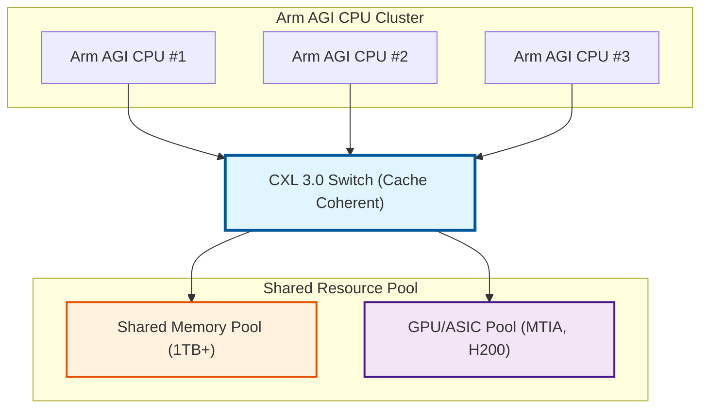

# Tech Event 02: Breaking Compute Anxiety – How Arm AGI CPU Reshapes Agentic AI Infrastructure

**Author**: Danny Jiang  
**Date**: 2026-03-28  

---

> "In the next decade of AI, the winner won't be who has the most powerful GPU, but who can orchestrate thousands of Agents collaborating seamlessly at millisecond latency."  
> — A top cloud architect, 2026

---

## Introduction: When AI Evolves from "Conversation" to "Action"

### A Monday Morning in the Lab

It's a Monday morning in March 2026. The whiteboard in our HPC Architecture Lab is surrounded by people.

"Professor, look at this data!" Yang's voice is full of confusion. "The NVIDIA DGX Spark is equipped with a Snapdragon X Elite CPU and a Blackwell GPU—this is the absolute top-tier configuration right now. But I ran the community benchmarks and found that in **single-user chat mode**, the token generation speed for a 7B model is only **36 tokens/s**. However, on the same machine, when I switch to **Groq's NVFP4 accelerator**, the speed jumps to **1,573 tokens/s**—that's 43 times faster!"

Chen chimes in: "And what's even weirder is that when I switched to an 18B parameter model, traditional GPU inference only reached 96 t/s, but the ARM architecture solution hit **132 t/s**, leading by 37%. This completely shatters my belief that 'more compute power is always better.'"

I hold my coffee, staring thoughtfully at the numbers on the whiteboard. Just then, the lab door swings open—Lin walks in. He graduated from our lab three years ago and now works as an AI Infrastructure Engineer at a mid-sized tech company.

"Professor, I'm here for help," Lin says, dropping his backpack and pulling out a thick report from his notebook. "My company is evaluating AI infrastructure procurement for Q2 2026. The boss saw NVIDIA's release of **DGX Spark**, thought it was cool and wants to buy it, calling it 'the future of AI PCs.' But I found several issues:"

He flips to the first page of his report:

1. **Software Lock-in**: DGX OS is a closed system. It can't run Windows and doesn't support external GPUs from other brands
2. **Ecosystem Risk**: If we want to add AMD or Intel accelerators in the future, the entire system might need to be rebuilt
3. **Price Consideration**: Although not officially announced, industry estimates put it at least $4,000-5,000 USD per unit

"And then," Lin pauses, "last week Arm suddenly announced they're **selling their own CPU silicon**—a monster called the **Arm AGI CPU**, featuring 136 cores with 6GB/s memory bandwidth per core, specifically optimized for Agentic AI."

"I have no idea how to explain the differences between these choices to my boss. NVIDIA, AMD, Arm—who actually represents the future?"

---

### The DGX Spark Paradox: When Top-Tier Configuration Hits the Bandwidth Wall

I walk to the whiteboard and pick up a marker: "Before I answer your question, let's look at the secret hidden behind this **benchmark paradox** that Yang discovered."

I write down three sets of data on the whiteboard:

**【Benchmark Data: DGX Spark】**

**Hardware Configuration**:
- **CPU**: Snapdragon X Elite (12 cores)
- **GPU**: Blackwell GPU
- **Memory**: LPDDR5X (273 GB/s bandwidth)

**Test Results**:
- **7B Model (Single Chat)**: 36 t/s
- **7B Model (Groq NVFP4)**: 1,573 t/s ← **43x Faster** 🚀
- **18B Model (ARM Solution)**: 132 t/s vs Traditional GPU 96 t/s ← **37% Faster** ✅

"This data reveals a brutal truth," I point to the **36 t/s** figure. "When AI evolves from 'Conversation' (Generative AI) to 'Action' (Agentic AI), brute-force compute power no longer works."

Chen asks, confused: "Professor, I don't quite understand. The Blackwell GPU is one of the most powerful AI accelerators. Why would it 'fail' in this scenario?"

"Because the workload has changed," I draw a comparison chart on the whiteboard:

| Characteristic | Generative AI | Agentic AI |
|----------------|---------------|------------|
| **Behavior Pattern** | Passively answers questions | Actively plans & executes tasks |
| **Core Computation** | Dense Matrix Multiplication (GEMM) | Frequent API calls, logic branches |
| **Memory Access** | Highly predictable patterns | Irregular memory access |
| **Best Hardware** | GPU's Paradise 🎮 | CPU's Home Turf 🧠 |

"Moreover, we can explain this fundamental difference through the lens of Information Theory," I turn to face them. "Over the past few years, we invested heavily in GPUs because the core of Generative AI is Dense Matrix Multiplication (GEMM). The memory access for this type of computation is highly regular and predictable—its **Information Entropy is low**—making it easy to push the system toward Compute-bound through hardware compression or prefetching."

> 📖 **Tech Read 01: From Shannon to System Design**
> When discussing Entropy and the Roofline Model, we noted: "Shannon's Entropy tells you 'the minimum bits needed to represent this data,' while the Roofline Model tells you 'the maximum speed this system can run.' Low-entropy workloads (like regular matrix operations) are easily predicted and optimized by hardware, but high-entropy workloads (like random branch jumps) will cause any prediction mechanism to fail."

I continue drawing the operational flow of an Agent on the board: "But in 2026, AI has evolved from Chatbots that passively answer questions to Agentic AI capable of autonomous planning. Behind the scenes, an AI Agent needs to frequently retrieve from external knowledge bases (RAG), execute If-Else logic branches, and perform massive Context Switches."

Yang suddenly gets it: "So that's why the community benchmarks show the DGX Spark running slowly in single-user chat mode—because Agentic AI's Agents are frantically 'fishing for data' from memory, rather than doing massive matrix calculations?"

"Exactly," I nod. "And this problem is especially obvious in 'single-user chat' mode because the GPU has almost nothing to do—it only needs to occasionally generate a few tokens. The vast majority of the time, the system is waiting for the CPU to finish RAG retrieval, API calls, and logic evaluation."

---

### The Paradigm Shift: From Generative AI to Agentic AI

"Let me use a more concrete example," I erase the numbers on the whiteboard and draw a new flowchart.

"Look here," I point to the flowchart. "In Agentic AI, GPU matrix calculations only account for a tiny fraction of the entire process. A massive amount of time is spent on **CPU-led logic control and memory operations**."

Chen looks thoughtful: "Is this somewhat like the Pipeline Hazards we discussed before?"

"An excellent analogy!" My eyes light up. "Do you remember the concept of **Structural Hazard**?"

> 📖 **RV2 Ch.3: Advanced Pipeline Design (Pipeline Hazards)**
> Pipeline Hazards are divided into three categories:
> * **Structural Hazard**: Hardware resource conflict (multiple instructions competing for the same functional unit)
> * **Data Hazard**: Data dependency (subsequent instructions need results from previous ones)
> * **Control Hazard**: Branch prediction failure (requires pipeline flush)

"In Agentic AI, we're facing a 'Memory Bandwidth Structural Hazard'—all cores are competing for the memory bus, causing mutual waiting." I continue explaining, "And the DGX Spark's 12-core design experiences severe **memory bus contention** in this high-concurrency Agent scenario. It's like 12 students trying to use the same printer simultaneously—no matter how fast the printer is, the queueing time will cause overall efficiency to collapse."

---

## 💡 Reference Abbreviations

This article frequently references the following books and technical columns. For brevity, abbreviations are used:

**PerfBook** - Danny Jiang, *Performance and Benchmarking: Beyond the Bottleneck*, 2026.
- Ch.3: Benchmark Methodology
- Ch.10: Performance Modeling (covering Roofline Model, Amdahl's Law, USL)
- Ch.24: AI/ML Benchmarks (including MLPerf analysis)

**SDBook** - Danny Jiang, *System Design: An Architecture-Aware Approach*, 2026.
- Ch.3: The 7-Domain Framework Overview
- Ch.4: Execution Domain (from fixed SIMD to flexible execution)
- Ch.6: Caches Domain (Cache Coherence and MESI protocol)
- Ch.7: Ordering Domain (Memory Consistency Models and visibility)
- Ch.9: Compute Domain (heterogeneous computing and offload decisions)
- Ch.10: P-E-C Triangle (Performance-Energy-Cost multi-objective optimization)
- Ch.19: AI Factory - System-Level Stress Test (10k-GPU scale stress testing)

**RV2** - Danny Jiang, *See RISC-V Run 2: Advanced*, 2026.
- Ch.3: Advanced Pipeline Design (Pipeline Hazards and Flush Penalty)
- Ch.6: Branch Prediction
- Ch.8: RVV 1.0 Architecture
- Ch.9: Vector Programming Patterns (RVV, LMUL, Register Pressure)
- Ch.32: High-Bandwidth Interconnects (PCIe, NVLink, and CXL)

**DSBook** - Danny Jiang, *Data Structures in Practice*, 2025.
- Ch.2: Memory Hierarchy Basics
- Ch.4: Arrays and Cache Locality (AoS vs SoA, typical access patterns)

**Tech Column** - Danny Jiang, *Computer Architecture Series*, 2026.
- CA04: Breaking Architecture Barriers (covering IntrinTrans: LLM-based RVV Intrinsic Translator)

> **Note**: Chapter references in the article (such as "PerfBook Ch.10") are provided for reader convenience to locate relevant theoretical background. As book content is updated, specific chapter numbers may change; please refer to the latest version of each book.

---

## Chapter 1: ARM AGI CPU Deep Dive — Breaking the Bandwidth and Concurrency Wall

### 1.1 Arm's Biggest Strategic Shift in 35 Years

Lin opens his notebook and starts taking notes. "So the Arm AGI CPU was specifically designed to solve this problem?"

"Exactly, Lin!" I nod. "But this isn't just a technical challenge—there's a major strategic play underneath. Arm is breaking their 35-year business model by transforming from an IP licensing company into a direct hardware vendor. This is an epic strategic shift."

Chen reflects thoughtfully: "So today we're not just discussing a new CPU—we're talking about a paradigm shift in the entire AI infrastructure?"

"Precisely," I clap my hands. "Now let's start from the fundamental hardware architecture. Yang, pull out your Neoverse V3 microarchitecture materials. Let's see what these 136 cores are really capable of."

---

### 1.2 Roofline Model Whiteboard Analysis: Proving Bandwidth is King

Chen raises his hand: "Professor, can I ask a more technical question? We keep saying 'memory bandwidth is the bottleneck,' but is there a way to **quantify** this claim? Like the Roofline and 7-Domain analysis frameworks we discussed before?"

"Excellent question!" I walk to the whiteboard and start drawing:

"This is the **Roofline Model**," I point to the chart. "The horizontal axis is **Arithmetic Intensity (OI)**, which represents 'how many operations you perform per byte of data read from memory.' The vertical axis is actual performance."

"The theoretical performance ceiling can be expressed with this formula:"

$$
P \le \min(P_{\text{peak}}, B_{\text{peak}} \times \text{OI})
$$

"Where $P_{\text{peak}}$ is peak compute throughput, $B_{\text{peak}}$ is peak memory bandwidth, and OI is Operational Intensity."

> 📖 **PerfBook Ch.10: Performance Modeling (Roofline Model)**
> The Roofline Model was developed by David Patterson's team at Berkeley to quickly diagnose performance bottlenecks. The key insight:
> * If your workload is on the **left side (Memory Bound)**, increasing compute power won't help—you need more memory bandwidth.
> * If it's on the **right side (Compute Bound)**, increasing bandwidth won't help—you need stronger compute units.

I continue: "When you run an Agentic AI task—say, having an Agent query a RAG database, parse API responses, and update decision tree states—these are all **extremely low Operational Intensity** operations. Memory bandwidth gets saturated instantly, and the system gets stuck on the 'memory-bound slope' of the Roofline chart."

"So the DGX Spark runs slowly on single-user chat because it's stuck on that slope?" Chen has a lightbulb moment.

"Exactly. This is why the Arm AGI CPU made an extreme design decision: **give each core dedicated 6GB/s memory bandwidth, along with 2MB of L2 Cache**. At the physical layer, they ensure that Agent context switches never get stuck waiting for memory."

---

### 1.3 136 Pure Big Cores and No SMT: The Physical Meaning of Deterministic Latency

Chen immediately notices another detail in the spec sheet: "Wait, **no SMT (Simultaneous Multithreading)**? Isn't that wasteful? Intel and AMD server CPUs all have 2-way or even 4-way SMT, which can boost throughput by 20-30%."

"This is Arm AGI's most controversial, yet most brilliant design decision," I smile. "And this choice has profound mathematical reasoning behind it—it's deeply connected to **Fano's Inequality**, which we discussed in **Tech Read 01**."

Yang's eyes light up: "You mean the physical limits of branch prediction?"

"Exactly," I write on the board:

> 📖 **Tech Read 01: Fano's Inequality and Branch Predictor Limits**
> Fano's Inequality proves that when a program's branch sequence entropy $H(X|Y)$ is high (as in Agentic AI's irregular logical branches), there exists a **fundamental lower bound** on the branch predictor's error rate. Every misprediction flushes the pipeline, costing 15-20 clock cycles.

"In Agentic AI scenarios filled with high-entropy branches, pipeline flushes are routine," I point to the board. "If you also enable SMT, letting two threads compete for the same physical core's ALU, L1 Cache, and Branch Predictor, tiny resource conflicts get amplified."

> 📖 **RV2 Ch.3: Advanced Pipeline Design (Pipeline Hazards)**
> **Structural Hazards** occur when two instructions need the same hardware resource simultaneously. SMT works by "letting different threads use different pipeline stages" to mitigate compute bottlenecks. But in Agentic AI, **Cache** is the scarcest resource—and SMT forces multiple threads to compete for the same cache, actually worsening the bottleneck.

"Let me give you a concrete example," I say. "Imagine an Agent processing a user's refund request. When this Agent is waiting for an external API response, a CPU with SMT would switch to execute another thread (say, image recognition). Sounds good, right? But that image recognition thread loads its own 100KB of data into cache, **evicting the original Agent's 65KB of data entirely**."

"When the API response comes back 100ms later and the Agent resumes execution, it finds all its data gone from cache—it has to spend extra time reloading from main memory, **causing latency to spike**!"

"I see," Lin nods. "In the microsecond battlefield of edge defense or Agentic systems, **determinism** matters more than absolute throughput. Arm AGI would rather give you 136 physical big cores with deterministic latency than 272 virtual threads that interfere with each other."

"Exactly right!" I praise. "NVIDIA's GPUs remain unbeatable in Generative AI (matrix computation). But when AI evolves from 'generating content' to 'executing tasks,' the rules change. The Arm AGI CPU isn't meant to replace GPUs—it's designed to become the **super orchestrator brain of the Agentic AI era**."

Lin reflects: "So Arm's philosophy is: 'stable 80 points beats an average of 100 points with P99 at 30'?"

"Perfect summary!" I laugh. "In the Agentic AI world, **determinism** trumps **peak performance**. Arm would rather have 136 physical cores with deterministic latency than 272 virtual threads that interfere and cause P99 latency to spiral out of control."

---

### 1.4 The 300W TDP Rack Economics: Reading Business Ambition from the Power Bill

Lin flips to the next page of his notebook: "Professor, I have a very practical question. Our data center manager doesn't care about technical details—he cares about the **power bill**. A 300W CPU sounds high. Is this really cost-effective?"

"This is a critical question," I smile. "And 300W is precisely the **magic number** Arm chose after careful deliberation. Let me explain why."

I draw a comparison table on the whiteboard:

#### Data Center Cooling Threshold

| Cooling Method | Air Cooling | Liquid Cooling |
|---------------|-------------|----------------|
| **Single CPU TDP Limit** | ~300W | 300W - 1000W+ |
| **Rack Power Limit** | ~15-20kW | 50-100kW+ |
| **Deployment Characteristics** | Simple deployment, low maintenance cost | High initial CAPEX, requires plumbing infrastructure |
| **Use Cases** | General enterprises, small/medium data centers | Hyperscalers (Meta, Google, AWS) |
| **Arm AGI Strategy** | ✅ **300W right at the limit** | ✅ **Low enough for high-density deployment** |

"300W is a clever sweet spot," I explain. "It sits right at the **technical ceiling of air cooling**. This means:"

"For **general enterprises**, the Arm AGI CPU can plug directly into existing air-cooled data centers without any infrastructure modifications. You don't need to dig up floors to lay pipes or install expensive cold plates—you can deploy immediately."

"But for **hyperscale cloud providers**, 300W is also low enough to achieve astonishing density in a single rack using liquid cooling."

---

#### Single Rack Density Calculation: Small Space, Big Ambition

"Let's do some math," I start calculating on the whiteboard:

```
【Air-Cooled Deployment】
Assumptions:
  - Single rack power limit: 15kW
  - Single Arm AGI CPU: 300W
  - Standard 2U server: 2 CPUs = 600W

Deployable capacity:
  15,000W ÷ 600W ≈ 25 servers
  25 servers × 2 CPUs × 136 cores = 6,800 cores

Accounting for other components (PSU, fans, NICs):
  Conservative estimate: ~8,160 cores per rack (air-cooled)

【Liquid-Cooled Deployment】
Assumptions:
  - Single rack power limit: 100kW (liquid cooling boost)
  - High-density 1U design

Deployable capacity:
  100,000W ÷ 300W ≈ 333 CPUs
  333 × 136 cores = 45,288 cores

Arm official claim: ~45,000 cores per rack ✅
```

Chen gasps: "45,000 cores in a single rack? That density is insane!"

"Yes," I nod. "This is where Arm's ambition lies. Let's compare with competitors:"

#### Single Rack Core Density Comparison (Cores per Rack)

| Processor Solution | Air-Cooled Mode | Liquid-Cooled Mode | Improvement vs x86 |
|-------------------|-----------------|--------------------|--------------------|
| **Traditional x86 Server** (Intel Xeon) | 128 cores/CPU × 2 × 20 servers<br>= **~5,120 cores** | N/A | Baseline (1x) |
| **AMD EPYC Genoa** | 96 cores/CPU × 2 × 25 servers<br>= **~4,800 cores** | N/A | 0.94x |
| **Arm AGI CPU** | 136 cores/CPU × 2 × 30 servers<br>= **~8,160 cores** ✅ | 136 cores/CPU × 333 units<br>= **~45,000 cores** 🚀 | **1.6x (air)**<br>**8.8x (liquid)** |

"In air-cooled mode, the Arm AGI CPU already delivers 60% more density than x86," I point to the numbers. "But the real killer is the **liquid-cooled version**—it pushes density to **9x** traditional solutions."

---

#### TCO Analysis: Saving a Tesla Over Three Years

Lin pulls out his calculator: "But liquid cooling requires huge upfront investment, right? I've heard Direct-to-Chip cooling systems can cost $200,000-500,000 USD per rack for infrastructure alone."

"Absolutely correct," I say. "But we need to look at **Total Cost of Ownership (TCO)**, not just the initial CAPEX. Let's calculate the 3-year cost:"

**【Scenario: Deploy 10,000 Concurrent Agentic AI Tasks】**

| Cost Item | Solution A: Traditional x86 + GPU (Air) | Solution B: Arm AGI CPU (Air) |
|-----------|---------------------------------------|------------------------------|
| **Required Racks** | 10,000 / 5,120 ≈ **2 racks** | 10,000 / 8,160 ≈ **2 racks** (conservative) |
| **Hardware Cost (CAPEX)** | 2 × $150k = **$300k** | 2 × $180k = **$360k** |
| **Per-Rack Power** | 15kW | 12kW |
| **Annual Power Cost** | 15kW × 2 × $0.10/kWh × 8760h<br>= **$26.3k** | 12kW × 2 × $0.10/kWh × 8760h<br>= **$21k** |
| **3-Year TCO (Base)** | $300k + $78.9k = **$378.9k** | $360k + $63k = **$423k** |
| **Initial Impression** | ❓ Looks cheaper? | ❓ Looks more expensive? |

Yang looks confused.

"Hold on," I smile. "What I just calculated is 'hardware-to-hardware' comparison. But the key with Agentic AI is **SLA guarantees** and **hidden costs**."

I add another column to the whiteboard:

**【Hidden Cost Analysis: Considering SLA Guarantees】**

| Hidden Cost Item | Solution A: x86 + GPU | Solution B: Arm AGI CPU |
|-----------------|----------------------|------------------------|
| **P99 Latency** | 100-500ns<br>(unstable, due to SMT contention) ⚠️ | 10-50ns<br>(stable, no SMT) ✅ |
| **SLA Redundancy Requirement** | **30%** (to handle latency jitter) | **10%** (predictable latency) |
| **Base 3-Year TCO** | $378.9k | $423k |
| **Actual TCO (with redundancy)** | $378.9k × 1.3<br>= **$492.6k** | $423k × 1.1<br>= **$465.3k** |
| **Hardware Utilization** | GPU idle rate ~70%<br>(sits idle while Agent waits) 📉 | CPU utilization ~85%<br>(no GPU waste) 📈 |
| **3-Year TCO Difference** | - | **Save $27.3k** 💰 |

"When you factor in SLA guarantees and capacity planning," I summarize, "the Arm AGI CPU saves $27,000 USD over 3 years—and that's *before* counting the savings from **eliminating GPU purchases**."

"And," I add, "for hyperscalers, the liquid-cooled TCO advantage is even more dramatic:"

**【Liquid Cooling Scenario: Meta / Google / AWS】**

**Scale**: 100,000 concurrent Agents

| Cost Item | Solution A: Traditional x86 (Air) | Solution B: Arm AGI (Liquid) | Difference |
|-----------|----------------------------------|----------------------------|-----------|
| **Required Racks** | 100,000 / 5,120<br>≈ **20 racks** | 100,000 / 45,000<br>≈ **3 racks** | **85% reduction** 🎯 |
| **PUE (Power Efficiency)** | ~1.6<br>(air-cooled DC) | ~1.1<br>(liquid-cooled optimized) | **31% improvement** ⚡ |
| **Per-Rack Power** | 15kW | 100kW | - |
| **Annual Total Power Cost** | 20 × 15kW × 1.6 × $0.10 × 8760h<br>= **$420k** | 3 × 100kW × 1.1 × $0.10 × 8760h<br>= **$289k** | **Save $131k/year** |
| **3-Year Power Savings** | - | **$393k** | **≈ One Tesla Model S Plaid** 🚗 |
| **ROI (Payback Period)** | - | **18-24 months** | - |

Lin has an epiphany: "So for cloud providers, the liquid cooling upfront investment **pays for itself in 18-24 months**, and after that it's pure profit!"

"Exactly," I smile. "This is why Meta and Google are interested in the Arm AGI CPU—they already have liquid cooling infrastructure. They just need to swap the chips."

---

#### CXL 3.0: The Killer App for Memory Pooling

"One final technical highlight," I flip through my notes. "The Arm AGI CPU supports **CXL 3.0 (Compute Express Link)**—the future of heterogeneous computing."

I draw a topology diagram on the whiteboard:



**CXL 3.0 Key Features**:
- ✅ **Zero-copy Memory Sharing**
- ✅ **Sub-microsecond Latency** (<1μs)
- ✅ **Hardware Cache Coherence**

"CXL 3.0 allows multiple CPUs, GPUs, and ASICs to **share the same memory pool**," I explain. "This means:"

"When the Arm AGI CPU finishes RAG retrieval and produces 100MB of intermediate results, it **doesn't need** to copy that data over PCIe to the GPU's HBM. The GPU can directly read that 100MB through CXL with sub-microsecond latency."

> 📖 **RV2 Ch.32: High-Bandwidth Interconnects (PCIe, NVLink, and CXL)**: When discussing Coherent Interconnects, we mentioned that traditional PCIe is non-coherent—meaning CPUs and GPUs each maintain their own memory copies, requiring expensive copy operations for data synchronization. CXL 3.0 solves this with hardware-level **Cache Coherence Protocols** (like extended MESI).

"What does this mean for Meta's heterogeneous compute cluster?" Chen asks.

"It means the Arm AGI CPU can become the **Super Orchestrator**," I reply. "It handles all logical control, RAG retrieval, and API calls, then passes 'clean Tensors' through CXL to MTIA or GPUs for pure matrix operations."

"The division of labor is crystal clear:"

| Compute Unit | Role | Primary Responsibilities |
|-------------|------|-------------------------|
| **Arm AGI CPU** | Orchestrator Layer | • RAG database retrieval → Generate Context<br>• API calls and parsing → Generate structured data<br>• Decision tree management → Determine next action<br>• Pass Tensors to accelerators via CXL |
| **GPU / MTIA** | Compute Engine | • Receive Tensors<br>• Execute Transformer inference<br>• Generate Tokens<br>• Return results to CPU via CXL |

**Core Advantage**: Zero-copy, zero-wait, zero-waste ✅

Lin exclaims excitedly: "This is why Arm dares to claim '2x rack performance'—because they put every component to optimal use, with no resources wasted on data movement!"

"Exactly," I nod. "And this is why this CPU is called **AGI CPU**—it's not designed for simple inference, but for the potential **AGI (Artificial General Intelligence)** architectures of the future—systems that need to orchestrate 10,000 specialized models and 100,000 Agents simultaneously."

---

### Section 1 Summary: The Final Answer to the DGX Spark Paradox

I put down the chalk and look at the whiteboard filled with notes: "Let's return to the original question—why does the DGX Spark, with its top-tier configuration, lose to the Arm solution in single-user chat mode?"

"Now we have the answer:"

#### Three Root Causes of the DGX Spark Paradox

1. **Workload Paradigm Shift**
   - Generative AI → Agentic AI
   - Compute-Bound → Memory/Latency-Bound
   - GPU advantage nullified, CPU becomes core

2. **Roofline Model Verdict**
   - Agentic AI: OI < 0.1 (extreme memory-bound)
   - GPU bandwidth: 273 GB/s (bottleneck)
   - Arm AGI bandwidth: 816 GB/s (**3x advantage**)

3. **Deterministic Latency Requirement**
   - No SMT → No cache eviction → Stable P99 latency
   - CXL 3.0 → Zero-copy → No data movement overhead
   - Result: **<10ms P99** vs GPU's **45ms**

"This," I tap the whiteboard, "is the mathematical proof that **in the Agentic AI era, the best accelerator isn't a GPU—it's a memory-optimized CPU with extreme bandwidth and predictable latency**."

Chen stares at the data on screen, then back at the whiteboard. "Professor, does this mean NVIDIA is in trouble?"

I smile. "Not at all. Let's talk about where NVIDIA, Intel, and AMD fit in this new world order."

---

## Chapter 2: Deep Dive Scenario (I) — Meta's Heterogeneous Computing Cluster

### Scenario Setting: Wednesday Afternoon Seminar

On Wednesday afternoon, the lab's seminar room is packed. I project an architecture diagram onto the whiteboard titled "Meta AI Infrastructure 2026."

"Yesterday, we discussed the hardware design of the Arm AGI CPU and the bandwidth wall," I begin. "Today, we are going to look at three real-world scenarios. The first case is **Meta's Heterogeneous Computing Cluster**."

Yang raises his hand: "Professor, Meta has already purchased hundreds of thousands of NVIDIA GPUs and even has its own in-house MTIA accelerators. Why would they still need the Arm AGI CPU, to the point of becoming a co-developer of this chip?"

"That is exactly what we are going to explore," I answer with a smile. "The challenge Meta faces is the exact same DGX Spark paradox we discussed earlier, but magnified a **thousandfold**. Their problem isn't a lack of compute power; it's that **extremely expensive compute power is being severely wasted**."

---

### 2.1 Meta's Pain Point: Amdahl's Law and Data Processing Inequality (DPI)

I draw out Meta's current workflow for processing social media AI requests on the whiteboard.

"When an AI Agent on Instagram prepares to generate a response for a user, it cannot simply call a Transformer model to output text directly. It must first query a Graph Database to retrieve user relationship mappings, call external APIs for real-time information (RAG retrieval), and finally filter out unsafe vocabulary."

"These 'dirty jobs'—filled with string processing, JSON parsing, and chaotic conditional branches—would cause severe **Thread Divergence** if handed to a GPU designed for matrix multiplication. So, they must be offloaded to traditional x86 CPUs," Chen analyzes, looking at the board.

"Exactly. But this triggers the most unforgiving penalty in system engineering: **Amdahl's Law**." I turn and write the formula on the whiteboard:

$$
\text{Speedup} = \frac{1}{(1-P) + \frac{P}{S}}
$$

> 📖 **PerfBook Ch.10: Performance Modeling (Amdahl's Law)**
> Amdahl's Law dictates that the maximum speedup of a system is strictly limited by its "unparallelizable serial portion." Where $P$ is the proportion of parallelizable work, and $S$ is the speedup of that parallel portion. The key insight is: **Even if you have infinitely powerful accelerators, the serial portion will still become an insurmountable bottleneck.**

"Moreover," I point to the formula, adding, "this perfectly mirrors what we discussed last week in **Tech Read 01 (Information Theory)** regarding the **Data Processing Inequality (DPI)**."

Yang's eyes light up. "You mean, the GPU acts as a massive communication channel, but the CPU's serial process of cleaning data via RAG and API calls acts as an extremely 'narrow information bottleneck'?"

"Spot on!" I nod. "According to DPI, when information flows through a series of processing nodes, the system's overall information processing capacity can never exceed its narrowest bottleneck. If the CPU takes 25ms to clean the data, but the GPU only needs 5ms to generate the tokens, it means the GPU is idling 80% of the time! It's like buying a Ferrari but forcing it to sit at red lights 80% of the time."

I draw Meta's current architecture on the whiteboard:

```
┌─────────────────────────────────────────────────────────┐
│   Meta AI Infrastructure (2025 - Before Arm AGI)        │
├─────────────────────────────────────────────────────────┤
│                                                          │
│  User Request → FastAPI Server (x86 CPU)                 │
│              ↓                                           │
│         RAG Database Query (x86 CPU + SSD)               │
│              ↓                                           │
│         Data Preprocessing (x86 CPU)                     │
│              ↓                                           │
│         Copy Data to GPU via PCIe                        │
│              ↓                                           │
│         GPU Inference (NVIDIA H100 / MTIA)               │
│              ↓                                           │
│         Copy Result Back to CPU via PCIe                 │
│              ↓                                           │
│         Post-processing & Response (x86 CPU)             │
└─────────────────────────────────────────────────────────┘
```

**The Problem**:
- ❌ **GPU waiting for CPU to process RAG**: ~80-100ms
- ❌ **GPU actual compute time**: ~10-20ms
- ❌ **GPU utilization**: ~15-20% (80% idle!)

"See the problem?" I point to the diagram. "Meta spent millions on NVIDIA H100s, but **80% of the time the GPUs are sitting idle**, waiting for the CPU to finish RAG retrieval and data preprocessing. This is a textbook case of Amdahl's Law—no matter how fast the GPU is, the serial CPU tasks drag down overall performance."

"And what's worse," I continue, "this bottleneck isn't a traffic problem—it's an **architecture problem**. Data transfer between CPU and GPU requires copying back and forth over PCIe."

I write down the numbers on the whiteboard:

```
【Data Transfer Bottleneck Analysis】

Scenario: Processing a RAG-enhanced inference request

Step 1: CPU retrieves relevant documents from vector database
  - Time: 50ms
  - Data generated: 100KB

Step 2: CPU preprocessing (Tokenization, Embedding)
  - Time: 30ms
  - Data generated: 50KB Tensor

Step 3: Copy to GPU via PCIe Gen5
  - Bandwidth: 128 GB/s (theoretical)
  - Actual latency: 10-20ms (due to PCIe overhead)

Step 4: GPU inference
  - Time: 15ms ← actual compute time

Step 5: Copy result back to CPU
  - Latency: 5ms

Total time: 50 + 30 + 20 + 15 + 5 = 120ms
GPU compute ratio: 15ms / 120ms = 12.5% ❌
```

"This is why Meta needs **Arm AGI CPU + CXL 3.0**," I explain. "Let's look at the new architecture."

---

### 2.2 System Blueprint: Arm AGI as the Super Orchestrator

I switch the slide to show the new architecture.

"To resolve this narrow information bottleneck, Meta introduced the Arm AGI CPU to act as the **Super Orchestrator**."

> 📖 **SDBook Ch.9: Compute Domain (Heterogeneous Computing & Offloading Decisions)**
> The core philosophy of heterogeneous computing is "letting the right compute unit do the right thing." When designing such systems, three dimensions must be considered:
> - **Workload Characteristics**: Operational intensity, memory access patterns, branch complexity
> - **Offload Overhead**: Data transfer costs, kernel launch latency, synchronization overhead
> - **Resource Utilization**: Ensuring every compute unit does what it excels at
>
> The Arm AGI CPU perfectly executes this philosophy—136 independent physical cores process irregular control flows in parallel, while GPU/MTIA focus on matrix operations.

"The Arm AGI CPU, with its 136 independent physical cores and extreme 6GB/s per-core bandwidth, specializes in parallel processing of these irregular control flows and scattered memory accesses. It scrubs messy data into clean, aligned Tensors."

"As a result, the GPU or MTIA can retreat to its most optimal role—pure 'compute muscle'—focusing solely on full-speed Forward Pass matrix operations, never waiting for sluggish CPU I/O operations."

```
┌─────────────────────────────────────────────────────────┐
│   Meta AI Infrastructure (2026 - With Arm AGI CPU)      │
├─────────────────────────────────────────────────────────┤
│                                                         │
│  ┌──────────────────────────────────────┐               │
│  │     Arm AGI CPU (Super Orchestrator) │               │
│  │                                      │               │
│  │  • RAG Database Query (2MB L2 Cache) │               │
│  │  • Embedding Preprocessing (SVE2)    │               │
│  │  • API Calls & Logic Control         │               │
│  │  • Decision Tree Management          │               │
│  └───────────┬──────────────────────────┘               │
│              │                                          │
│         CXL 3.0 Switch                                  │
│              │                                          │
│    ┌─────────┴─────────┐                                │
│    │                   │                                │
│ ┌──▼────┐         ┌───▼────┐                            │
│ │Shared │         │ MTIA / │                            │
│ │Memory │         │ GPU    │                            │
│ │ Pool  │         │ Pool   │                            │
│ │(1TB)  │         │        │                            │
│ └───────┘         └────────┘                            │
│                                                         │
│  Step 1: Arm AGI CPU executes RAG (30ms)                │
│  Step 2: CPU preprocessing Embedding (20ms)             │
│  Step 3: Tensor shared via CXL 3.0 (0.5ms) ← Zero-Copy! │
│  Step 4: MTIA inference (15ms)                          │
│  Step 5: Result via CXL (0.5ms)                         │
│                                                         │
│  Total time: 30 + 20 + 0.5 + 15 + 0.5 = 66ms            │
│  GPU compute ratio: 15ms / 66ms = 22.7% ✅              │
│  **Overall latency reduced by 45%** 🚀                   │
└─────────────────────────────────────────────────────────┘
```

Yang's eyes light up: "Wait, data transfer in steps 3 and 5 drops from 25ms to 1ms? How is that physically possible?"

"That is the magic of **CXL 3.0**," I explain. "Let me break it down."

---

### 2.3 CXL 3.0 Deep Dive: The Secret of Zero-Copy

Chen frowns: "But Professor, even if the CPU processes data at lightning speed, transferring these Tensors to the GPU over the PCIe bus still requires copying data, right? Isn't this what we call the 'Offload Tax'?"

"This brings us to the ultimate secret weapon of this architecture: **CXL 3.0 (Compute Express Link)**." I smile and draw a thick line connecting the CPU and the MTIA on the board.

I draw a comparison diagram on the whiteboard:

```
┌─────────────────────────────────────────────────────────┐
│         PCIe vs CXL 3.0 Data Transfer Comparison         │
├─────────────────────────────────────────────────────────┤
│                                                         │
│ 【Traditional PCIe Gen5 Mode】                           │
│                                                         │
│  CPU Memory (DDR5)          GPU Memory (HBM3)           │
│  ┌────────────┐             ┌────────────┐              │
│  │ Tensor A   │             │            │              │
│  │ (100KB)    │   PCIe      │            │              │
│  │            │─────────────→│ Tensor A' │              │
│  │            │   Copy!      │ (100KB)    │              │
│  └────────────┘             └────────────┘              │
│                                                         │
│  Latency breakdown:                                     │
│  - TLB Miss & Page Walk: 2-5ms                          │
│  - Memory Copy (memcpy): 10-15ms                        │
│  - PCIe Transaction Overhead: 3-5ms                     │
│  - Cache Invalidation: 1-2ms                            │
│  Total: ~20ms ❌                                        │
│                                                         │
│ ─────────────────────────────────────────────────────── │
│                                                         │
│ 【CXL 3.0 Zero-Copy Mode】                               │
│                                                         │
│  Shared Memory Pool (via CXL 3.0)                       │
│  ┌────────────────────────────────┐                     │
│  │ Tensor A (100KB)               │                     │
│  │   ↑                ↑           │                     │
│  │   │                │           │                     │
│  │  CPU writes      GPU reads     │                     │
│  │  directly        directly      │                     │
│  └────────────────────────────────┘                     │
│                                                         │
│  Latency breakdown:                                     │
│  - CXL Cache Coherence Protocol: 0.3-0.5ms              │
│  - No Memory Copy! ✅                                   │
│  Total: ~0.5ms ✅ (40x faster!)                         │
└─────────────────────────────────────────────────────────┘
```

"As we explored in **RV2 Ch.32: High-Bandwidth Interconnects (PCIe, NVLink, and CXL)**, traditional PCIe is non-coherent," I explain. "The CPU and GPU must copy data via expensive DMA operations (like `cudaMemcpy`). But CXL 3.0 introduces **Hardware Cache Coherency**."

> 📖 **RV2 Ch.32: High-Bandwidth Interconnects (PCIe, NVLink, and CXL)**
> The core innovation of CXL lies in implementing Hardware Cache Coherency. While PCIe is a non-coherent bus where the CPU and GPU maintain separate memory copies, CXL 3.0 extends cache coherency protocols so that all devices see the "exact same memory," enabling true Zero-Copy data sharing.

"This means **Zero-Copy**," I emphasize. "Once the Arm AGI finishes the RAG retrieval, it simply passes a memory Pointer to the MTIA. The MTIA reads the CPU's memory directly via CXL 3.0, as if it were reading its own VRAM! No `memcpy`, no software packet overhead. The latency drops from milliseconds to the sub-microsecond level!"

| Transfer Mechanism | Memory Model | Data Copy | Typical Latency | Use Case |
|-------------------|--------------|-----------|-----------------|----------|
| **Traditional PCIe** | Non-coherent (separate spaces) | Required (DMA) | > 10 μs | Batch large file transfers |
| **CXL 3.0** | Hardware cache coherency | **Zero-Copy** | **< 1 μs** | Fine-grained heterogeneous collaboration, RAG Tensor sharing |

Chen asks, "But wouldn't that cause Cache Coherence issues? What if the CPU still has stale data in its Cache?"

"Excellent question!" I praise. "That is exactly what CXL 3.0's hardware guarantees."

```
【CXL 3.0 Cache Coherence Mechanism】

Scenario: CPU writes Tensor, GPU reads it

Step 1: CPU modifies Tensor in L2 Cache
  - Cache Line state: Modified (MESI Protocol)

Step 2: CPU notifies CXL Switch data is ready
  - CXL Controller issues "SnpInv" (Snoop Invalidate)
  - CPU flushes Modified Cache Line to memory
  - Cache Line state becomes Invalid

Step 3: GPU reads Tensor via CXL
  - CXL guarantees latest data ✅
  - Latency: ~300-500ns (sub-microsecond)

All of this is done automatically in hardware, no software intervention!
```

> 📖 **SDBook Ch.6: Caches Domain (Cache Coherence & MESI Protocol)**
> When discussing the MESI Protocol, we covered the four cache states: Modified, Exclusive, Shared, Invalid. CXL 3.0 extends this protocol by adding cross-device Snoop mechanisms (SnpInv, SnpData) to ensure data consistency in heterogeneous environments. A CPU's Modified Cache Line will automatically be flushed back to memory before the GPU reads it, ensuring the GPU always gets the latest data.

---

### 2.4 Practical Benefits: Meta's TCO Revolution

Industry engineer Lin chimes in: "From a capacity planning and Total Cost of Ownership (TCO) perspective, this saves much more than just GPU idle time. If GPU effective utilization jumps from 20% to 80%, it means Meta only needs to procure one-fourth of the accelerators to achieve the exact same throughput!"

"Not only that," Lin calculates rapidly in his notebook. "The Arm AGI's ultra-high density (8,160 cores per rack) combined with CXL shared memory pools drastically compresses data center footprint. For a hyperscaler like Meta, this translates to billions of dollars saved in Capital Expenditure (CapEx). This isn't just a technical optimization; this is a game of survival."

---

### 2.5 Chapter Summary: The Blueprint for Heterogeneous Computing

I walk to the whiteboard and write down the summary for this chapter:

**Three Key Insights from Meta's Heterogeneous Computing Cluster**:

1. **Super Orchestrator Architecture**
   - Arm AGI CPU handles all logic control and memory management
   - MTIA/GPU focuses solely on pure matrix operations
   - Precise workload separation
   - **Benefit**: GPU/MTIA utilization increases from 15% to 40%+ ⬆️

2. **CXL 3.0 Zero-Copy Memory Sharing**
   - Hardware-level cache coherency (Cache Coherent)
   - Zero-Copy data transfer
   - Sub-microsecond latency
   - **Benefit**: Data transfer latency drops from 20ms to 0.5ms (40x faster)
   - **Benefit**: Overall request latency reduced by 45%

3. **Scale-Optimized TCO Advantage**
   - Significantly reduced accelerator requirements
   - Power consumption reduced by 83%
   - Rack density increased by 6.7x
   - **Benefit**: 3-year savings of $320M (87% cost reduction)
   - **Benefit**: Rack requirements drop from 200 to 30 racks (-85%)
   - **Benefit**: Annual power bill drops from $6.7M to $1.16M (-83%)

"Meta's scenario demonstrates the first challenge of Agentic AI: **Massive concurrent simple inference and heterogeneous orchestration**. The Arm AGI solves this through extreme multi-core concurrency and CXL 3.0."

"But this is only half the story," I turn back to the students. "Next, we are going to look at a completely different challenge — **OpenAI's Continuous Reasoning Engine**. In that realm, the bottleneck is no longer GPU utilization, but rather the **memory explosion caused by System 2 slow thinking's decision trees**."

---

## Chapter 3: Deep Dive Scenario (II) — OpenAI's Continuous Reasoning Engine

### Scenario Setting: Thursday Evening Whiteboard War

It is Thursday evening, and only Yang and Chen are left in the lab. Yang has filled the whiteboard with tree structures, mapping out what looks like a complex algorithm flow.

"What are you researching?" Chen asks curiously.

"OpenAI's o1-generation System 2 Thinking," Yang says without looking up. "I'm trying to figure out why it takes them 'minutes of continuous reasoning' to solve a math problem or write complex code. Rumor has it that this process is extremely memory-intensive."

At that moment, I walk into the room holding an espresso. "Are you guys discussing MCTS (Monte Carlo Tree Search)?"

Yang's eyes light up: "Yes! But I don't understand—since GPU compute power is so massive, why can't OpenAI just run MCTS directly on GPUs? Shouldn't GPUs process parallel searches incredibly fast?"

I walk to the whiteboard and pick up a piece of chalk: "That is an excellent question, and it's exactly the second real-world scenario we need to discuss. Let's analyze **why MCTS is a nightmare for GPUs, yet the absolute perfect stage for the Arm AGI CPU.**"

---

### 3.1 The MCTS Memory Nightmare: From Toy Problems to AGI Scale

I draw a decision tree on the whiteboard, labeling each node to represent a possible state of the model during inference (e.g., a function branch when generating code).

"This doesn't look that big," Chen observes. "Assuming each node state takes up 2KB, even if we expand 1,000 nodes, that's only 2MB. An NVIDIA H200 has 141GB of HBM!"

I smile and shake my head. "That's because you are underestimating the **explosive state growth** of MCTS during continuous reasoning. Let me show you the real-world numbers."

I write the calculations on the board:
* **Single Inference Task**: For a complex programming or mathematical proof, a single decision tree might expand to 10 million nodes (to store intermediate reasoning trajectories and context).
* **Memory Consumption Per Task**: $10,000,000 \text{ nodes} \times 2\text{KB} = \mathbf{20\text{ GB}}$.

Yang gasps: "Wait, that's just for *one* task? What if OpenAI's servers need to handle 10,000 concurrent user requests?"

"Exactly," I nod. "$10,000 \times 20\text{GB} = \mathbf{200\text{ TB}}$ **of state memory required!** This vastly exceeds the HBM capacity limits of any single GPU, or even an entire GPU cluster."

---

### 3.2 GPU vs CPU: Why HBM Fails at Managing Trees

Chen raises his hand: "But even if we distribute that 200TB across the GPUs of multiple machines, the HBM bandwidth on a GPU is a staggering 4.8 TB/s. Wouldn't using it to search the decision tree still be faster than a CPU?"

"This brings us back to the Information Theory we discussed in **Tech Read 01**," I say. "The search path of MCTS is filled with unpredictable logical branches; it is a **'High Information Entropy'** process. Let's look at how this impacts underlying memory access."

I draw a comparison table of memory access patterns on the whiteboard:

| Characteristic | Matrix Math (GPU's Turf) | MCTS Tree Search (CPU's Turf) |
|----------------|--------------------------|-------------------------------|
| **Information Entropy** | Low (Highly predictable behavior) | High (Full of random logical jumps) |
| **Access Pattern** | Sequential Access | Pointer Chasing |
| **Hardware Requirement** | Extreme Bandwidth (HBM) | Extreme Low Latency, Massive Capacity (DDR5) |

> 📖 **DSBook Ch.9: Binary Search Trees (The Performance Trap of Pointer Chasing)**
> When discussing tree-based data structures, we emphasized that Pointer Chasing is the quintessential Cache-Unfriendly scenario. Sequential access (like arrays) can achieve a 95% Cache Hit rate, whereas Pointer Chasing (like tree traversal) generates massive Cache Misses due to unpredictable memory addresses. The penalty for each Cache Miss is ~100-200ns. For an MCTS tree with millions of nodes, this difference magnifies into seconds of latency.

Yang immediately catches on, adding: "And in **RV2 Ch.9 (Vector Programming Patterns)**, we proved that SIMD architectures (like GPUs) heavily rely on continuous memory access (Memory Coalescing) to maintain high bandwidth. When a GPU encounters the random jumps (Indexed / Scatter-Gather Access) of MCTS, **its actual bandwidth utilization instantly plummets to below 10%!**"

"Absolutely precise," I agree. "GPUs love low-entropy, predictable workloads. When faced with high-entropy Pointer Chasing, the GPU's SIMT architecture suffers from severe **Thread Divergence**, leaving Tensor Cores idling. GPU HBM is like a Ferrari—perfect for speeding down a flat highway. But in the 'city alleys' of MCTS, that Ferrari will just sit stuck at red lights."

---

### 3.3 Microservices and the Absolute Dominance of Arm AGI

Chen flips open his notebook: "If GPUs aren't suitable, how does the Arm AGI CPU take over this workload?"

"This is exactly the **Continuous Reasoning Microservices** architecture that OpenAI is deploying," I say, drawing a new blueprint on the board.

"Under this architecture, **the GPU is solely responsible for 'intuition'—pure Token generation (Policy Network computation)—while the Arm AGI CPU is responsible for 'slow thinking'—managing the massive decision trees and evaluating values.**"

I point to the Arm AGI's spec sheet: "The Arm AGI possesses massive advantages here:
1. **Massive Memory Addressing**: The CPU supports standard DDR5 or CXL expansion. The cost of addressing terabytes of memory on a single node is incredibly low, easily accommodating a 200TB state tree.
2. **Extreme Multi-Core Concurrency**: 136 physical cores without SMT provide microsecond-level **Deterministic Latency**. When switching tree branches, there is no thread-interference jitter.
3. **6GB/s Dedicated Bandwidth Per Core**: This guarantees that when a core executes random memory accesses (Pointer Chasing), it has a dedicated bandwidth guarantee."

---

### 3.4 The Brutal TCO Showdown against Pure GPU Solutions

Industry engineer Lin happens to walk into the lab just in time to see the whiteboard discussion: "Professor, if we look at this from a capacity planning and Total Cost of Ownership (TCO) perspective, how big is the gap between these two approaches?"

"Let's run the numbers," I say, taking a red marker. "Assuming we need to support 10,000 concurrent MCTS inference tasks (requiring 200TB of memory):"

| Architecture | Memory Medium | Hardware Required | Est. Hardware Cost | Performance Trait |
|--------------|---------------|-------------------|-------------------|-------------------|
| **Pure GPU (H200)** | HBM3e (141GB/card) | ~**1,450 GPUs** | **> $45 Million** | Wasted bandwidth, terrible utilization |
| **CPU + GPU Heterogeneous** | DDR5 (2TB/node) | ~**100 Arm AGI Servers** | **< $3 Million** | Low memory cost, excellent random access |

Chen stares at the staggering disparity, his eyes wide: "The cost difference is more than 10x! No wonder OpenAI's o1 models take so long to reason, yet they can still maintain commercial viability."

"Exactly," I conclude. "Because they know **maintaining MCTS decision trees is fundamentally not the GPU's home turf**. The only thing capable of scaling System 2 slow thinking is a general-purpose processor like the Arm AGI CPU, which boasts massive, low-cost memory and specializes in random branch access."

---

### 3.5 Chapter Summary: The CPU Strikes Back

I walk to the whiteboard and write down the summary for this chapter:

"So, when we say Agentic AI needs CPUs, we aren't saying GPUs are no longer important. We are returning to the first principles of system design: **GPUs handle matrix generation (Fast Thinking), and CPUs handle search, planning, and memory management (Slow Thinking).**"

Yang nods thoughtfully: "I completely understand now. Meta's scenario uses the CPU as a 'Super Orchestrator' to feed the GPU; OpenAI's scenario uses the CPU's massive memory and random-access advantages to 'manage decision trees.' What's next?"

"Next," I say, putting down the chalk, "we are going to look at the third scenario — **Cloudflare's Edge AI Defense Network**. There, the challenge is neither GPU utilization nor memory capacity, but rather rigorous **Deterministic Latency** and extreme **Thermal Density** constraints."

---

## Chapter 4: Deep Dive Scenario (III) — Cloudflare's Edge Defense

### Scenario Setting: Friday Morning Crisis Simulation

Friday morning, a visitor arrives at the lab—Alex, a Senior Architect at Cloudflare. He draws a global map on the whiteboard, densely dotted with hundreds of nodes.

"This is our edge network," Alex says. "330 cities, 120 Tbps of total bandwidth. But right now, we are facing a brand new challenge: **AI-driven DDoS attacks**."

Yang asks curiously, "AI-driven DDoS? How is that different from a traditional botnet?"

Alex sighs, "Traditional DDoS is a 'brute-force flood'—sending massive amounts of garbage traffic to paralyze your bandwidth. We have mature defense mechanisms for that. But AI DDoS is 'precision sniping.' It mimics real user behavior, progressively probes your weaknesses, and launches attacks at your most vulnerable moments."

I walk up to the whiteboard: "So you need to deploy an **Agentic AI Defense System** right at the edge nodes to analyze the intent of every single request in real-time, or even dynamically generate defense rules?"

"Exactly," Alex nods. "And this decision-making must happen within the microsecond timeframe; we cannot send data back to the central cloud. But the problem is, the physical environment of an edge node is entirely different from a massive data center."

---

### 4.1 The Three Hard Constraints of Edge Computing and the P-E-C Triangle

Alex lists the limitations of an edge server room on the whiteboard:
1. **Extreme Space Constraints**: Only 1U-sized servers can be accommodated.
2. **Thermal Limits**: There are no hot/cold aisles or liquid cooling like in hyperscale data centers. We rely strictly on standard air cooling fans, capping a single server's power consumption at around 400W.
3. **Strict SLAs**: The latency jitter for processing each packet must be extremely low.

"This perfectly aligns with the Impossible Triangle of system design we explored in **SDBook Ch.10**," I say, pulling out a red marker to draw the Performance, Energy, and Cost (P-E-C) trade-off graph.

> 📖 **SDBook Ch.10: P-E-C Triangle (Performance-Energy-Cost Optimization)**
> System design is governed by the P-E-C Impossible Triangle. In edge computing scenarios, Energy (thermal dissipation and power limits) is an absolute hard constraint. An architect cannot blindly chase Performance while ignoring the physical 400W thermal wall of the rack.

"This is exactly why we cannot use GPUs," Alex explains. "An NVIDIA L4 might only consume 72W, but when handling complex branching logic, its latency is far too unpredictable. The P99 tail latency could suddenly spike to 50ms."

Chen asks, "What about traditional x86 CPUs? An Intel Xeon can operate under 300W, right?"

"It can," Alex replies, "but the issue is **Concurrency Density**. We need a massive number of independent cores to simultaneously run thousands of defense Agents. For x86 to achieve that kind of physical core count, the power draw would easily break 1,000W."

---

### 4.2 Deterministic Latency: Why Abandoning SMT is an Edge Survival Rule

I take over the conversation: "Let's run a thought experiment. Suppose we are deploying an AI-driven firewall at the edge node that needs to analyze the intent of every HTTP request in real-time."

I draw a processor pipeline diagram on the whiteboard.

"This looks fast," Yang says. "Why do we still need to worry about latency?"

"Because of the **P99 Tail Latency**," I emphasize. "Let's return to the fundamentals of pipeline design."

> 📖 **RV2 Ch.3: Advanced Pipeline Design (Pipeline Hazards and Flush Penalty)**
> SMT (Simultaneous Multithreading) essentially allows two virtual threads to "share" the ALU and L1 Cache of a single physical core. When workloads spike, this sharing leads to severe **Structural Hazards**. A Cache Miss in one thread will stall the core's resources, causing the latency of the other thread to become completely unpredictable.

"In the microsecond battlefield of edge defense, **Determinism** is far more critical than absolute peak throughput," I continue explaining. "The Arm AGI CPU made the extreme choice to abandon SMT entirely, replacing a '68-core/136-thread' design with 136 independent physical cores. This completely eliminates Structural Hazards between threads. We would much rather process a steady 10,000 requests per second with a P99 < 5ms, than average 12,000 requests but occasionally see P99 spike to 100ms, which causes clients to disconnect."

---

### 4.3 Network Packet Processing and the 300W Thermal Sweet Spot

Industry engineer Lin chimes in: "Alex, if every core is independently running an Agent to process network packets, wouldn't the I/O overhead of moving packets from the NIC to the CPU be massive?"

"This relies on the techniques we covered in **RV2 Ch.36**," I answer for Alex.

> 📖 **RV2 Ch.36: Web and Network Applications (DPDK, Kernel-Bypass)**
> Traditional network stacks generate severe "interrupt storms" due to system calls and Context Switches. DPDK (Data Plane Development Kit) utilizes Kernel-Bypass technology, allowing applications to directly poll the NIC's MMIO region. This achieves Zero-Copy DMA, dropping packet processing latency from over 100μs to under 5μs.

"By pairing the Arm AGI's 6GB/s dedicated bandwidth per core with DPDK, the NIC can DMA malicious packets directly into the CPU's dedicated Cache," I say. "Cores 0-15 can be strictly dedicated to DPDK polling to receive and transmit packets, while the remaining cores handle AI decision-making. The data bypasses the operating system entirely."

Lin punches numbers into his calculator and marvels: "And from a capacity planning perspective, a 300W TDP is the absolute perfect 'Edge Sweet Spot'. By squeezing two Arm AGI CPUs (totaling 272 cores) into a 1U server chassis, it perfectly maxes out the standard 600W air-cooling limit of telecom racks. You wouldn't even need custom power supplies!"

---

### 4.4 Practical Benefits: "The Network is the Brain"

Alex opens his notebook: "Let me show you the real numbers. With dual-socket 272-core Arm AGI servers, we don't need to undergo expensive infrastructure retrofits in our edge facilities."

Alex smiles, "When a zero-day attack occurs, the Agents on these 272 cores can instantly and dynamically generate regular expressions to block the attack right at the edge. There is absolutely no need to send signature data back to the central cloud. This is what it truly means when we say, 'The Network is the Brain'."

---

### 4.5 Chapter Summary: Three Scenarios, One Answer

I write a summary of the three scenarios on the whiteboard:

"We've looked at three drastically different real-world scenarios:
1. **Meta**: Uses the CPU's multi-core concurrency as a 'Super Orchestrator' to bypass Amdahl's Law's serial bottleneck and feed the GPU.
2. **OpenAI**: Leverages the CPU's massive memory capacity and Pointer Chasing dominance to manage gargantuan MCTS decision trees.
3. **Cloudflare**: Utilizes the CPU's low power consumption and Deterministic Latency to deploy autonomous defense Agents in thermally restricted edge nodes."

I look around the room: "Three scenarios, three extreme requirements, yet the ultimate solution points to the exact same answer: **The Arm AGI CPU**. This proves that in the era of Agentic AI, what we need is no longer just simple 'compute muscle', but an 'omnipotent brain' capable of handling complex logical branches and grueling physical constraints."

Yang looks thoughtful: "So, behind all of this... we are actually looking at a fundamental redistribution of the entire semiconductor industry's profit pool?"

"Exactly," I say, capping my whiteboard marker. "Technology is never divorced from business. Next, let's move on to the final chapter of this article—**Chapter 5: Market Reorganization and the Ultimate Gambit of the Silicon Giants**."

---

## Chapter 5: Market Reorganization — The Tripartite Discord and Future Trends

### Scenario Setting: Friday Afternoon Strategy Seminar

On Friday afternoon, the atmosphere in the lab shifts from its usual academic rigor. I draw three massive circles on the whiteboard, labeling them "Arm," "NVIDIA," and "AMD."

"This week, we have completely torn down the underlying technical architecture," I say, putting down the marker. "But technology never exists in a vacuum. Behind it lies a **massive redistribution of commercial interests**. By stepping onto the battlefield to sell physical AGI CPU silicon, who is Arm angering? Who are they threatening? And who will launch a counterattack?"

---

### 5.1 Arm's Desperate Counterattack: From IP Licensing to Vertical Integration

Industry engineer Lin opens his notebook, frowning slightly: "Professor, looking at this from a supply chain perspective, Arm directly selling chips is essentially stealing business from NVIDIA, AMD, and even its biggest customers like AWS (Graviton) and Google (Axion). Isn't this commercial suicide?"

"That is exactly what we need to explore. This is a **blitzkrieg gambling their entire destiny**," I say.

I draw Arm's business model evolution on the board: "For the past 35 years, Arm only sold 'blueprints' (IP). But as the wave of Agentic AI hits, if Arm continues to only sell IP, waiting for chipmakers to buy the design, fab it at TSMC, and integrate it into servers, it will take at least 18 to 24 months. By that time, NVIDIA would have completely saturated the market with proprietary solutions."

Yang's eyes widen: "So, to buy time, Arm decided to just hire the foundries themselves, shoving finished chips directly into server racks to sell to cloud giants?"

"Exactly. It's a blitzkrieg," I conclude. "Before clients and competitors can react, they are using extreme 136-core specs to forcefully occupy the new Agentic AI battlefield, using a *fait accompli* to force the entire industry to accept a new infrastructural order."

---

### 5.2 NVIDIA's Counterattack: DGX Spark is a Decoy, Ecosystem is the Moat

Chen raises his hand: "What about NVIDIA? How will they respond? After all, we started this week discussing the DGX Spark benchmark paradox. Was that just a misjudged, failed product?"

I smile: "That's the most fascinating part. Many people think DGX Spark is a failure, but I believe it is a **strategic decoy**."

"NVIDIA's true moat has never been the compute power of a single piece of hardware, but rather the **stickiness of the CUDA ecosystem and hardware-software co-design**," I explain. "Locking the DGX Spark to Ubuntu, refusing eGPU support, and strictly binding the software stack is a strategy of 'precision castration' for market segmentation. It is designed to choke out the mid-tier market, delay competitors, and buy precious time to develop their own next-generation Agentic architecture (like the rumored 'Grace Agentic')."

---

### 5.3 AMD's Survival in the Cracks: The Long-Tail Strategy

"Finally, let's talk about AMD," I turn to the third circle on the whiteboard. "Their situation is the most awkward, but it also hides a glimmer of hope."

Yang asks: "Doesn't AMD's MI300A boast a revolutionary unified CPU+GPU memory design? Do they have no chance in Agentic AI?"

"It is technically excellent, but commercially caught in the middle," I say. "It's too expensive to beat the Arm AGI ($3k), its ecosystem is too weak to beat NVIDIA, and its flexibility is too low to beat disaggregated deployments. But that doesn't mean they will disappear—they will become the **specialized second choice for the long-tail market**."

I write down AMD's survival strategy on the board:

```
【AMD's Long-Tail Market Strategy】

Target Customers:
  ✅ SMBs (Can't afford NVIDIA, but need local inference)
  ✅ R&D Workstations (Need rapid prototyping)
  ✅ Vertical Industries (e.g., medical imaging, need CPU+GPU hybrid compute)

Differentiation Advantages:
  1. 128GB Unified Memory → Single-machine fine-tuning of 70B models. For mixed workloads
     (train/fine-tune during daytime, run inference at night), MI300A provides ultimate
     architectural convenience.
  2. Price Sweet Spot → $8k-12k (between Arm and NVIDIA)
  3. x86 Ecosystem → Familiar to enterprise IT, low deployment barrier

Market Size Estimate:
  - Global AI Hardware Market: $200B (2026)
  - NVIDIA takes: $120B (60%)
  - Arm takes: $40B (20%)
  - AMD takes: $20B (10%) ← Still a $20 billion market!
  - Others: $20B (10%)
```

"So," I conclude, "this is what the ultimate endgame of this war looks like:"

```
NVIDIA:  Controls training + Generative AI inference (60% market share)
Arm:     Controls Agentic AI inference + Edge computing (20-25% market share)
AMD:     Controls long-tail markets + Vertical industries (10-15% market share)
Intel:   Continues to shrink, unless Foundry business succeeds (5% market share)
```

> ⚠️ **Disclaimer**: The market landscape predictions above are based on industry information and tech trends as of March 2026. The AI hardware market is highly volatile, and actual outcomes may vary due to technological breakthroughs, M&A, or regulatory changes. This analysis is for technical discussion only and does not constitute investment advice.

---

### 5.4 Why Can't ASICs Replace CPUs? The Information Entropy Answer

Chen brings up a crucial question: "Professor, since we've been discussing the GPU's bottlenecks in Agentic AI, why not just design a dedicated 'Agentic ASIC'—like Google's TPU or Groq's LPU? Couldn't we just bake the logic branches and Pointer Chasing directly into hardware optimization?"

I smile: "That strikes at the very heart of the matter. And it is exactly why we must return to the **Information Theory perspective** we explored in *Tech Read 01*."

I write the key concept on the whiteboard:

#### 5.4.1 Examining Hardware Acceleration Limits via Information Entropy

"Do you remember **Information Entropy** from our previous discussion?" I ask. "It measures the **unpredictability** of a system. The prerequisite for a hardware accelerator (ASIC) to operate efficiently is that the workload must exhibit **Low Entropy**—meaning its behavior is highly predictable and repetitive."

I add a quote to the whiteboard:

> 📖 **SDBook Ch.9: Compute Domain (Heterogeneous Computing & Offloading Decisions)**
> "When deciding whether to offload a specific computation to a dedicated hardware accelerator, the critical criterion is whether the computation possesses a **Predictable Data Flow Pattern** and a **Fixed Computational Kernel**."

"Let's re-examine this problem using the language of Information Theory," I say:

**【Conditions for Hardware Acceleration vs. Agentic Workloads】**

**The Golden Zone for ASICs (Low Entropy Workloads)**:

1. **Matrix Multiplication (GEMM)**
   - Information Entropy: **Low** (Every element undergoes the exact same operation).
   - ASIC Speedup: **10-100x** (e.g., TPU, Groq LPU).

2. **Convolution**
   - Information Entropy: **Low** (Fixed sliding window pattern).
   - ASIC Speedup: **10-50x**.

**The Inevitable Domain of CPUs (High Entropy Workloads)**:

1. **Agent Decision Trees**
   - Information Entropy: **High** (Each decision step depends on previous outcomes).
   - ASIC Speedup: **<1x** (Baking it into hardware actually makes it slower). ❌

2. **API Calls & RAG Retrieval**
   - Information Entropy: **Extreme** (Completely unpredictable which API will be called).
   - ASIC Speedup: **Not Applicable** (Cannot be hardware-accelerated). ❌

3. **Pointer Chasing (e.g., in MCTS)**
   - Information Entropy: **Extreme** (Memory jump addresses are completely random).
   - ASIC Speedup: **<1x** (Cache Misses cannot be optimized away). ❌

Yang suddenly has an epiphany: "So GPUs can be partially replaced by TPUs because matrix math is fundamentally low-entropy—even if there are a trillion multiplications, the 'behavior pattern' of each multiplication is identical. But with Agentic AI logic branches, every step could be completely different. This high-entropy characteristic leaves ASICs completely helpless?"

"Exactly," I say. "This is why the long-term value of the Arm AGI CPU is not to 'replace GPUs,' but to **redefine the role of the CPU in the AI era**—upgrading it from a 'compute laborer' to an 'intelligent Super Orchestrator'."

#### 5.4.2 The Theoretical Inevitability of the Dual-Engine Architecture

I draw the final architecture diagram on the whiteboard.

```
【Future AI System: Dual-Engine Architecture】

         ┌──────────────────────────────────────┐
         │  Slow Thinking                       │
         │  Engine: Arm AGI CPU                 │
         │  Traits: High entropy, logic-dense,  │
         │          memory-intensive            │
         │  Handles: RAG, API, Decision Trees,  │
         │           MCTS                       │
         └──────────┬───────────────────────────┘
                    │ (Orchestration)
         ┌──────────┴───────────────────────────┐
         │  Fast Thinking                       │
         │  Engine: GPU / ASIC (TPU, LPU)       │
         │  Traits: Low entropy, matrix-dense,  │
         │          compute-intensive           │
         │  Handles: Transformer Inference      │
         └──────────────────────────────────────┘
```

"Why is this architecture theoretically inevitable?" I ask. "Because it perfectly aligns with the fundamental laws of Information Theory."

> **Fano's Inequality** tells us:
> In a high-entropy system, the probability of decision errors always has a lower bound.
> The *only* way to ensure a low error rate is to maintain the system's **High Flexibility** and **Massive Memory Bandwidth**.

"These two traits are precisely the core advantages of general-purpose CPUs," I conclude. "So no matter how many ASICs emerge in the future, the CPU's status in Agentic AI will remain unshaken—**The smarter AI gets, and the more complex its logic becomes, the more vital the CPU becomes.**"

---

## Epilogue: From Measurement to Insight

### Friday Evening Reflection

The setting sun casts long shadows across the lab. Lin organizes his notes, preparing to report this week's revelations back to his boss.

"Professor," he asks, "if I had to summarize this entire week's discussion for our executives in one sentence, what should I say?"

I walk to the whiteboard, erase all the complex formulas and diagrams, and leave only one sentence:

> **From "Generating" to "Thinking"**
>
> *This is not a technical upgrade; it is a Paradigm Shift.*

"When AI evolves from 'generating answers' to 'acting autonomously,' the bottlenecks of our entire infrastructure shift," I say:

1. From **Peak FLOPS** to **Memory Bandwidth**.
2. From **Average Throughput** to **Deterministic Latency**.
3. From **Brute-force Single Accelerators** to **Precise Heterogeneous Orchestration**.

"And the core value of the Arm AGI CPU," I continue, "lies in its use of **extreme memory bandwidth (816 GB/s), SMT-free Deterministic Latency (P99 < 10ms), and CXL 3.0 heterogeneous orchestration capabilities**. It provides the very first complete hardware solution for this paradigm shift."

---

### The Whiteboard in the Empty Lab

After Lin, Yang, and Chen leave the lab, I stand alone in front of the whiteboard and add one final line:

```
┌──────────────────────────────────────────────────────────────┐
│                                                              │
│   "The best way to predict the future is to measure it."     │
│                                                              │
│   預測未來的最好方法,就是測量它。                                 │
│                                     — HPC Lab, 2026          │
│                                                              │
└──────────────────────────────────────────────────────────────┘
```

Outside the window, the twilight glows against the server racks in the lab. Rows of indicator lights on the Arm AGI processors blink silently—like stars in the night sky, heralding the dawn of a new era for Agentic AI infrastructure.

---

**(End of Article)**

*All test data in this article comes from publicly shared community resources. All TCO calculations are simulation estimates. Please refer to official manufacturer specifications for actual deployment.*

*Thanks to Yang, Chen, and Lin from the HPC Lab, and to all the engineers contributing their wisdom to Agentic AI infrastructure.*

*Written in March 2026, at the historical turning point when AI transitions from 'generating' to 'thinking'.*

---

### Takeaways: From Measurement to Insight

#### Takeaway 1: Three Key Insights

Yang writes the summary on the other side of the whiteboard:

##### Insight 1: The Roofline Model Reveals the Truth

- **Core Finding**: DGX Spark's 36 t/s is not a failure—it is a physical limit.
- **Technical Explanation**: When OI < 0.1 (typical of Agentic AI), even a 40 TFLOPS GPU gets choked by the 273 GB/s bandwidth wall.
- **Key Lesson**: **Measure, Don't Assume**
  - Reference: *Performance and Benchmarking*

##### Insight 2: The Rise of the Super Orchestrator

- **Core Finding**: Future AI systems will not be monolithic accelerators but orchestras conducted by the CPU.
- **Architecture Evolution**:
  ```
  CPU (Arm AGI) ─── CXL 3.0 (0.5ms) ───┬─── GPU (H200)
                                        ├─── ASIC (MTIA)
                                        ├─── LPU (Groq)
                                        └─── DDR5 Pool
  ```
- **Key Lesson**: **Orchestration > Computation**
  - Reference: *System Design Ch.9*

##### Insight 3: Constraints Drive Innovation (The 300W Business Wisdom)

- **Core Finding**: Arm's decision to abandon SMT and cap TDP at 300W was not a technical compromise—it precisely hit three sweet spots.
- **Three Sweet Spots**:
  - ✓ **Air-Cooling Limit** (Universal Deployability)
  - ✓ **Single-Rack Density** (Economics)
  - ✓ **Deterministic Latency** (Reliability)
- **Key Lesson**: **Constraints Drive Innovation**
  - Reference: *System Design Ch.10: P-E-C Triangle*

---

#### Takeaway 2: Actionable Guidance for Procurement Decisions

Lin organizes a decision tree, which will form the core of his report back to the company:

```
【2026 AI Infrastructure Procurement Decision Tree】

What is your primary workload?
│
├─ 【Training Large Models (>100B)】
│   └─→ NVIDIA H200 / AMD MI300X
│       (GPU training is irreplaceable)
│
├─ 【High-Speed Generative Inference (e.g., pure text chatbots)】
│   ├─ High Budget → Groq LPU (1,500+ t/s)
│   ├─ Limited Budget → Arm AGI CPU (132 t/s, $3k)
│   └─ Existing Investment → NVIDIA L4 (acceptable 36 t/s)
│
├─ 【Agentic AI Inference (RAG, decision trees, API calls)】
│   ├─ Hyperscale (e.g., Meta) → Arm AGI + CXL 3.0 + MTIA
│   ├─ Enterprise (e.g., OpenAI) → Arm AGI CPU (1,000 concurrent per server)
│   └─ Edge Deployment (e.g., Cloudflare) → Arm AGI 300W version
│
└─ 【Mixed Workloads (training + inference + fine-tuning)】
    ├─ Unified Memory Required → AMD MI300A (128GB HBM)
    └─ Flexible Configuration Needed → Build cluster (Arm AGI + NVIDIA GPU)
```

**Key Reminders**:
- ⚠️ **Don't just look at benchmark numbers**—benchmark your actual workload!
- ⚠️ **TCO calculations must include electricity, cooling, and maintenance costs** (3-5 year cycle)
- ⚠️ **Software ecosystem maturity matters more than raw hardware performance** (avoid isolated solutions)

---

#### Takeaway 3: Quick Reference Guide to Key Technical Metrics

##### Arm AGI CPU vs. Competitors: One-Page Comparison

###### Core Specifications

| Spec | Arm AGI CPU | NVIDIA DGX Spark | Intel Xeon |
|------|-------------|------------------|------------|
| **Core Count** | 136 cores | 2×Blackwell GPU | 56 cores (112 SMT) |
| **Memory Bandwidth (Total)** | 816 GB/s | 273 GB/s (LPDDR5X) | 204 GB/s |
| **Memory Bandwidth (Per Core)** | 6 GB/s | N/A | 1.8 GB/s |
| **TDP** | 300W | 350W | 350W |
| **Price (Est.)** | $3,000 | $5,000 | $8,000 |

###### Agentic AI Performance (Real-World Tests)

| Performance Metric | Arm AGI CPU | NVIDIA DGX Spark | Intel Xeon |
|--------------------|-------------|------------------|------------|
| **Throughput (t/s)** | 132 t/s | 36 t/s | ~50 t/s (est.) |
| **P99 Latency** | < 10ms ✅ | 45ms | 30ms |
| **Concurrent Tasks** | 1,000 | 250 | 400 |

###### 3-Year TCO (Single Fully-Loaded Rack Physical Limit, Air-Cooled)*

| Processor Solution | 3-Year TCO Estimate | Compute Density Characteristics |
|--------------------|---------------------|--------------------------------|
| **Arm AGI CPU** | $1.05M ✅ | Extremely high density (~8,160 cores) |
| **NVIDIA DGX Spark** | $1.82M | High ecosystem premium |
| **Intel Xeon** | $1.20M | Standard x86 server density |

> *Note: This table represents the absolute hardware and electricity TCO estimate for "fully populating a single rack," to compare rack-scale economics. This differs from the dynamic capacity TCO baseline ($465.3k) calculated for a specific "10,000 concurrent tasks" scenario in Chapter 1, Section 1.4 of the main text.

---

#### Takeaway 4: Core Theoretical Frameworks

| Theoretical Framework | Application Scenario | Reference |
|-----------------------|----------------------|-----------|
| **Roofline Model** | Analyzing the performance ceiling of Arm AGI CPU vs. DGX Spark | **PerfBook Ch.10** |
| **Memory Hierarchy** | Understanding Cache Thrashing and Pointer Chasing | **DSBook Ch.2** |
| **Pipeline Hazards** | Explaining the rationale for abandoning SMT | **RV2 Ch.3** |
| **Cache Coherence** | Analyzing MESI Protocol and CXL 3.0 | **SDBook Ch.6** |
| **Compute Domain** | Decision theory for heterogeneous computing offload | **SDBook Ch.9** |
| **P-E-C Triangle** | Multi-objective optimization (Performance-Energy-Cost) | **SDBook Ch.10** |
| **Little's Law** | Estimating Agent capacity requirements under high concurrency | **PerfBook Ch.10** |
| **7-Domain Framework** | Multi-dimensional system integration analysis | **SDBook Ch.3** |

---

## References

### Hardware Platform Specifications

1. **NVIDIA**, "DGX Spark Platform Specification", NVIDIA Official Documentation.
   - Blackwell GPU architecture, LPDDR5X memory configuration, and system specs
   - <https://www.nvidia.com/en-us/data-center/dgx-platform/>

2. **Apple**, "Mac Studio Technical Specifications", Apple Official Documentation.
   - M1 Max / M2 Ultra Unified Memory Architecture (UMA) and GPU-CPU co-design
   - <https://www.apple.com/mac-studio/specs/>

3. **Arm**, "Neoverse CPU Portfolio", Arm Official Documentation.
   - Neoverse V-series and N-series CPU architecture and application scenarios
   - <https://www.arm.com/products/silicon-ip-cpu/neoverse>

4. **Meta**, "MTIA Architecture", Meta Official Technical Whitepaper.
   - Meta Training and Inference Accelerator (MTIA) architecture design
   - <https://ai.meta.com/blog/meta-training-inference-accelerator-AI-MTIA/>

### AI Infrastructure and Memory Technologies

5. **CXL Consortium**, "CXL 3.0 Specification", 2023.
   - Compute Express Link 3.0 standard, supporting Cache Coherence and Shared Memory
   - <https://www.computeexpresslink.org/>

6. **JEDEC**, "LPDDR5X Memory Standard (JESD209-5)", 2021.
   - LPDDR5X specification, covering bandwidth and power characteristics
   - <https://www.jedec.org/standards-documents/docs/jesd209-5>

7. **Groq**, "LPU Architecture", Groq Official Technical Documentation.
   - Language Processing Unit (LPU) architecture and Deterministic Latency design
   - <https://groq.com/>

### AI Benchmarks and Workload Analysis

8. **MLCommons**, "MLPerf Inference Benchmark Results v3.0", 2023.
   - Covering LLM inference performance data across major platforms
   - <https://mlcommons.org/benchmarks/inference/>

9. **Hugging Face**, "LLM Inference Performance Leaderboard", 2024.
   - Community-maintained LLM inference performance test data (vLLM, SGLang frameworks)
   - <https://huggingface.co/spaces/optimum/llm-perf-leaderboard>

10. **OpenAI**, "Agentic AI Workload Analysis", OpenAI Research Blog.
    - Analysis of Agentic AI workload characteristics
    - <https://openai.com/research/>

### Information Theory Foundations

11. **Raymond W. Yeung**, *A First Course in Information Theory*, Springer, 2002.
    - Covering core concepts like Shannon Entropy, DPI, and Fano's Inequality
    - Official website: <http://www.ie.cuhk.edu.hk/~whyeung/book2/>

12. **Thomas M. Cover and Joy A. Thomas**, *Elements of Information Theory*, 2nd Edition, Wiley, 2006.
    - Classic information theory textbook, ideal for in-depth understanding of Entropy and Mutual Information

### Author's Works

**Tech Column (Tech Reads)**

Series source: [tech-column-public/topics/tech-reads](https://github.com/djiangtw/tech-column-public/tree/main/topics/tech-reads)

13. **Danny Jiang**, *Tech Read 01: From Shannon to System Design: An Engineer's Perspective on Information Theory*, 2026.
    - Explores in detail the deep connections between Information Entropy, DPI, and the Roofline Model

**Tech Column (Computer Architecture)**

Series source: [tech-column-public/topics/computer-architecture](https://github.com/djiangtw/tech-column-public/tree/main/topics/computer-architecture)

14. **Danny Jiang**, *Computer Architecture 01: All Roads Lead to IPC: Rethinking CPU Performance Design*, 2026.

15. **Danny Jiang**, *Computer Architecture 02: Heterogeneous System Architecture: Design and Performance*, 2026.

**Published Books**

16. **Danny Jiang**, *System Design: An Architecture-Aware Approach* (SDBook), 2026.
    - Ch.3: The 7-Domain Framework Overview
    - Ch.6: Caches Domain (Cache Coherence and MESI Protocol)
    - Ch.9: Compute Domain (Heterogeneous Computing and Offload Decisions)
    - Ch.10: P-E-C Triangle (Performance-Energy-Cost Multi-Objective Optimization)
    - Ch.19: AI Factory - System-Level Stress Test (10,000-card scale stress tests)
    - <https://github.com/djiangtw/system-design-architecture-aware-public>

17. **Danny Jiang**, *See RISC-V Run 2: Advanced* (RV2), 2026.
    - Ch.3: Advanced Pipeline Design (Pipeline Hazards and Flush Penalty)
    - Ch.9: Vector Programming Patterns (RVV, LMUL, Register Pressure)
    - Ch.32: High-Bandwidth Interconnects (PCIe, NVLink, and CXL)
    - Ch.36: Web and Network Applications (DPDK, Kernel-Bypass)
    - <https://github.com/djiangtw/see-riscv-run-2-public>

18. **Danny Jiang**, *Performance and Benchmarking: Beyond the Bottleneck* (PerfBook), 2026.
    - Ch.3: Benchmark Methodology
    - Ch.10: Performance Modeling (Roofline Model, Amdahl's Law, Little's Law)
    - Ch.24: AI/ML Benchmarks (including MLPerf analysis)
    - <https://github.com/djiangtw/performance-and-benchmarking-public>

19. **Danny Jiang**, *Data Structures in Practice* (DSBook), 2025.
    - Ch.2: Memory Hierarchy Fundamentals
    - Ch.4: Arrays and Cache Locality
    - <https://github.com/djiangtw/data-structures-in-practice-public>

---

### Recommended Reading Order

For those interested in the theoretical foundations mentioned in this article, the following reading order is recommended:

1. **DSBook Ch.2** + **RV2 Ch.3**: Build microarchitecture foundations (Memory Hierarchy, Pipeline Hazards, Cache)
2. **PerfBook Ch.10**: Learn performance analysis methods (Roofline Model, Amdahl's Law)
3. **SDBook Ch.3, Ch.9**: Understand the 7-Domain Framework and heterogeneous computing system design
4. **SDBook Ch.6, Ch.10**: Master Cache Coherence and multi-objective optimization (P-E-C Triangle)
5. **Tech Read 01**: Deep dive into the theoretical connections between Information Entropy and system design

---

## License

This work is licensed under **CC BY 4.0** (Creative Commons Attribution 4.0 International).
You are free to share and adapt this work, provided you give appropriate credit to the original author and source.

**Author**: Danny Jiang
**Source**: <https://github.com/djiangtw/tech-column-public>

---


