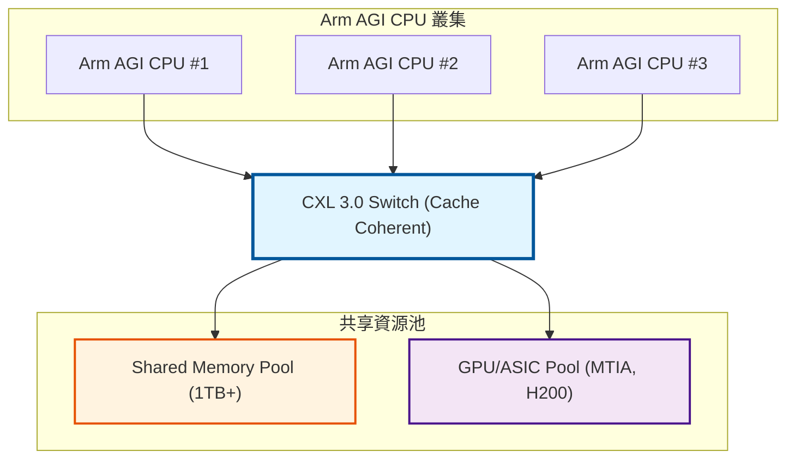

# Tech Event 02：打破算力焦慮，Arm AGI CPU 如何重塑 Agentic AI 基礎設施

**作者**: Danny Jiang  
**日期**: 2026-03-28  

---

> 「在 AI 的下一個十年，決定勝負的不是誰擁有最強的 GPU，而是誰能讓成千上萬個 Agent 在毫秒級延遲下無縫協作。」  
> —— 某頂級雲端架構師，2026

---

## 導言：當 AI 從「對話」走向「行動」

### 實驗室的週一早晨

2026 年 3 月某個週一上午，HPC 研究實驗室的白板前擠滿了人。

「教授，您看這個數據！」博士生小楊的聲音充滿困惑，「NVIDIA DGX Spark 搭載了 Snapdragon X Elite CPU 和 Blackwell GPU，這是目前最頂級的配置。但我跑了社群的實測，發現在 **單人聊天模式** 下，7B 模型的 Token 生成速度只有 **36 tokens/s**，而在同一台機器上，換成 **Groq 的 NVFP4 加速卡**，速度直接衝到 **1,573 tokens/s** —— 足足快了 43 倍！」

碩士生小陳在旁邊補充：「而且更奇怪的是，當我把模型換成 18B 參數時，傳統的 GPU 推理只能跑到 96 t/s，但 ARM 架構的方案居然跑出了 **132 t/s**，領先 37%。這完全顛覆了我對『算力越大越好』的認知。」

我端著咖啡，盯著白板上的數字若有所思。就在這時，實驗室的門被推開了 —— 小林走了進來。他是實驗室三年前的畢業生，現在在一家中型科技公司擔任 AI 基礎設施工程師。

「教授，我來求救了，」小林放下背包，從筆記本裡抽出一份厚厚的報告，「公司正在做 2026 年 Q2 的 AI 基礎設施採購評估。老闆看到 NVIDIA 發布了 **DGX Spark**，覺得很酷想買，說這是『AI PC 的未來』。但我發現了幾個問題：」

他翻開報告的第一頁：

1. **軟體綁定**: DGX OS 是封閉系統，不能跑 Windows，也不給外接其他品牌顯卡
2. **生態系風險**: 如果未來想加入 AMD 或 Intel 的加速器，可能整個系統都得重建
3. **價格考量**: 雖然還沒公布，但業界估計單台至少 $4,000-5,000 USD

「然後，」小林頓了頓，「上週 Arm 突然宣布要**自己賣 CPU 晶片**了 —— 一顆叫 **Arm AGI CPU** 的怪獸，136 個核心，每個核心有 6GB/s 的記憶體頻寬，專為 Agentic AI 優化。」

「我完全不知道該怎麼跟老闆解釋這些選擇的差異。NVIDIA、AMD、Arm，到底誰才是未來？」

---

### DGX Spark 實測悖論：當頂級配置遇上頻寬之壁

我走到白板前，拿起筆：「在回答你的問題之前，我們先來看看小楊發現的這個**實測悖論**背後到底藏著什麼秘密。」

我在白板上寫下三組數據：

**【實測數據：DGX Spark】**

**硬體配置**:
- **CPU**: Snapdragon X Elite (12 核心)
- **GPU**: Blackwell GPU
- **記憶體**: LPDDR5X (273 GB/s 頻寬)

**測試結果**:
- **7B 模型 (單人聊天)**: 36 t/s
- **7B 模型 (Groq NVFP4)**: 1,573 t/s ← **快 43 倍** 🚀
- **18B 模型 (ARM 方案)**: 132 t/s vs 傳統 GPU 96 t/s ← **快 37%** ✅

「這個數據揭露了一個殘酷的事實，」我指著 **36 t/s** 這個數字，「當 AI 從『對話（Generative AI）』走向『行動（Agentic AI）』時，傳統的算力暴力不再有效。」

小陳困惑地問：「教授，我不太理解。Blackwell GPU 可是目前最強的 AI 加速器之一，為什麼會在這種場景下『失效』？」

「因為 workload 變了，」我在白板上畫出一個對比圖：

| 特性 | Generative AI (生成式) | Agentic AI (代理型) |
|------|----------------------|-------------------|
| **行為模式** | 被動回答問題 | 主動規劃、執行任務 |
| **核心運算** | 密集矩陣運算 (GEMM) | 頻繁 API 呼叫、邏輯分支 |
| **記憶體存取** | 高度可預測的計算模式 | 不規則記憶體存取 |
| **最佳硬體** | GPU 的天堂 🎮 | CPU 的主場 🧠 |

「而且我們可以用資訊理論的視角來解釋這個本質差異，」我轉過身面對他們。「過去幾年，我們投資 GPU，是因為 Generative AI 的核心是密集矩陣相乘 (GEMM)。這種運算的記憶體存取是高度規律的、可預測的，它的 **資訊熵 (Entropy) 很低**，因此很容易透過硬體壓縮或預取將系統推向 Compute-bound。」

> 📖 **Tech Read 01: 從 Shannon 到系統設計**
> 在討論 Entropy 與 Roofline 時，我們提到：「Shannon 的 Entropy 告訴你『這段資料最少需要多少 bits 來表示』，而 Roofline Model 告訴你『這個系統最快能跑多快』。低熵值的工作負載 (如規則的矩陣運算) 容易被硬體預測與優化，但高熵值的工作負載 (如隨機的分支跳轉) 會讓任何預測機制失效。」

我繼續在白板上畫出一個 Agent 的運作流程：「但 2026 年的現在，AI 從被動回答問題的 Chatbot，進化為能自主規劃的 Agentic AI。一個 AI Agent 在背後需要頻繁地檢索外部知識庫 (RAG)、進行 If-Else 邏輯分支判斷、以及大量的上下文切換 (Context Switch)。」

小楊恍然大悟：「所以這就是為什麼社群實測會顯示，單人聊天模式下，DGX Spark 跑不快 —— 因為 Agentic AI 的 Agent 在瘋狂地從記憶體裡『撈資料』，而不是在做大量的矩陣運算？」

「沒錯，」我點頭，「而且這個問題在『單人聊天』模式下尤其明顯，因為這時候 GPU 幾乎沒什麼事做 —— 它只需要偶爾生成幾個 Token。絕大部分時間，系統都在等 CPU 完成 RAG 檢索、API 呼叫、邏輯判斷。」

---

### 典範轉移：從 Generative AI 到 Agentic AI

「讓我用一個更具體的例子來說明，」我擦掉白板上的數字，重新畫了一個流程圖：

「你看，」我指著流程圖，「在 Agentic AI 裡，GPU 的矩陣運算只佔整個流程的一小部分。大量的時間都花在 **CPU 主導的邏輯控制和記憶體操作** 上。」

小陳若有所思：「這是不是有點像我們之前討論過的 Pipeline Hazards？」

「非常好的類比！」我眼睛一亮，「你還記得 **Structural Hazard** 的概念嗎？」

> 📖 **RV2 Ch.3: 進階管線設計 (Pipeline Hazards)**
> Pipeline Hazards 分為三類：
> * **Structural Hazard**: 硬體資源衝突（多個指令搶同一個功能單元）
> * **Data Hazard**: 資料依賴性（後面的指令需要前面指令的結果）
> * **Control Hazard**: 分支預測失敗（需要清空 Pipeline）

「在 Agentic AI 中，我們面對的是『記憶體頻寬的 Structural Hazard』—— 所有核心都在搶奪記憶體匯流排，導致互相等待。」我繼續解釋，「而 DGX Spark 的 12 核心設計，在這種高並發的 Agent 場景下，就會出現嚴重的 **記憶體匯流排競爭**。這就像是 12 個學生要同時使用一台印表機 —— 不管印表機速度再快，等待排隊的時間都會讓整體效率崩潰。」


---

## 💡 參考書籍與專欄縮寫對照 (Reference Abbreviations)

本文中會頻繁引用以下書籍與技術專欄，為求簡潔，使用縮寫表示：

**PerfBook** - Danny Jiang, *Performance and Benchmarking: Beyond the Bottleneck*, 2026.
- Ch.3: 測量方法論 (Benchmark Methodology)
- Ch.10: Performance Modeling (涵蓋 Roofline Model, Amdahl's Law, USL)
- Ch.24: AI/ML Benchmarks (包含 MLPerf 分析)

**SDBook** - Danny Jiang, *System Design: An Architecture-Aware Approach*, 2026.
- Ch.3: The 7-Domain Framework Overview
- Ch.4: Execution Domain (從固定 SIMD 到彈性執行)
- Ch.6: Caches Domain (Cache Coherence 與 MESI 協定)
- Ch.7: Ordering Domain (Memory Consistency Models 與可見性)
- Ch.9: Compute Domain (異質運算與卸載決策)
- Ch.10: P-E-C Triangle (Performance-Energy-Cost 多目標最佳化)
- Ch.19: AI Factory - System-Level Stress Test (萬卡規模壓力測試)

**RV2** - Danny Jiang, *See RISC-V Run 2: Advanced*, 2026.
- Ch.3: 進階管線設計 (Pipeline Hazards 與 Flush Penalty)
- Ch.6: 分支預測 (Branch Prediction)
- Ch.8: RVV 1.0 架構
- Ch.9: Vector Programming Patterns (RVV, LMUL, Register Pressure)
- Ch.36: 網頁與網路應用 (DPDK, Kernel-Bypass)

**DSBook** - Danny Jiang, *Data Structures in Practice*, 2025.
- Ch.2: Memory Hierarchy 基礎
- Ch.4: Arrays and Cache Locality (AoS vs SoA, 典型存取模式)

**Tech Column** - Danny Jiang, *Computer Architecture Series*, 2026.
- CA04: 跨越架構壁壘 (涵蓋 IntrinTrans: LLM-based RVV Intrinsic Translator)

> **注意**：文章中的章節引用（如「PerfBook Ch.10」）是為了方便讀者定位相關理論背景。隨著書籍內容更新，具體章節編號可能會調整，建議以書籍最新版本為準。

---

## 第一章：ARM AGI CPU 深潛 —— 擊破頻寬與並發之壁

### 1.1 ARM 35 年來最大戰略轉型

小林打開筆記本，認真記錄：「所以 Arm AGI CPU 就是為了解決這個問題？」

「完全正確，小林！」我點頭，「而且這不只是技術問題，背後還有商業策略的考量。Arm 這次打破了 35 年來的商業模式——從 IP 授權商轉型為直接硬體供應商，這是一場史詩級的戰略轉變。」

小陳若有所思地說：「所以今天我們要討論的，不只是一顆新的 CPU，而是整個 AI 基礎設施的典範轉移？」

「正是如此，」我拍拍手，「現在讓我們從最基礎的硬體架構開始。小楊，把你整理的 Neoverse V3 微架構資料拿出來，我們來看看這 136 顆核心的真正實力。」

---

### 1.2 Roofline Model 白板推演：證明頻寬才是王道

小陳舉手：「教授，我能問一個更技術性的問題嗎？我們一直在說『記憶體頻寬是瓶頸』，但有沒有辦法 **量化** 這個說法？就像我們之前討論過的 Roofline 與 7-Domain 分析框架？」

「非常好的問題！」我走到白板前，擦掉之前的內容，開始畫圖：

「這就是 **Roofline Model**，」我指著圖表，「橫軸是 **Arithmetic Intensity（運算強度, OI）**，代表『每從記憶體讀取 1 Byte 資料，你做了多少次運算』。縱軸是實際性能。」

「性能的理論上界可以用這個公式表示：」

$$
P \le \min(P_{\text{peak}}, B_{\text{peak}} \times \text{OI})
$$

「其中 $P_{\text{peak}}$ 是峰值算力，$B_{\text{peak}}$ 是峰值記憶體頻寬，OI 是運算強度。」

> 📖 **PerfBook Ch.10: Performance Modeling (Roofline Model)**
> Roofline Model 由 Berkeley 的 David Patterson 團隊提出，用來快速診斷程式的性能瓶頸。關鍵洞察是：
> * 如果你的工作負載在圖的 **左側（Memory Bound）**，那麼提升算力沒用，你需要增加記憶體頻寬。
> * 如果在 **右側（Compute Bound）**，那麼提升頻寬沒用，你需要更強的運算單元。

我繼續解釋：「當你跑一個 Agentic AI 任務 —— 比如讓 Agent 去檢索 RAG 資料庫、解析 API 回應、更新決策樹狀態 —— 這些都是 **Operational Intensity 極低** 的操作。你會發現記憶體頻寬瞬間就被榨乾了，系統卡在 Roofline 的『記憶體受限斜坡』上。」

「所以 DGX Spark 在單人聊天時跑不快，是因為它卡在斜坡上了？」小陳恍然大悟。

「沒錯。這就是為什麼 Arm AGI CPU 做了一個極端的設計決定： **給予每個核心獨立的 6GB/s 專屬記憶體頻寬，搭配 2MB 的 L2 Cache**。他們在物理層面確保了 Agent 的 Context Switch 永遠不會卡在排隊等記憶體上。」

---

### 1.3 136 顆純大核與捨棄 SMT：確定性延遲的物理意義

小陳立刻注意到了規格表的另一個細節：「等等， **沒有 SMT (同步多執行緒)** ？這不是很浪費嗎？Intel 和 AMD 的伺服器 CPU 都有 2-way 甚至 4-way SMT，可以提升 20-30% 的吞吐量。」

「這是 Arm AGI 最具爭議，也最精妙的設計決策，」我微笑著說，「而且這個決策背後有深刻的數學理由 —— 它與我們在 **Tech Read 01** 中討論的 **Fano's Inequality** 息息相關。」

小楊眼睛一亮：「您是說，分支預測的物理極限？」

「完全正確，」我在白板上寫下：

> 📖 **Tech Read 01: Fano's Inequality 與分支預測器的極限**
> Fano's Inequality 證明了：當程式的分支序列熵值 $H(X|Y)$ 很高時（如 Agentic AI 的不規則邏輯分支），分支預測器的錯誤率存在一個 **無法突破的下界**。每次預測失敗，Pipeline 就要 Flush，代價是 15-20 個時鐘週期。

「在 Agentic AI 充滿高熵分支的場景中，Pipeline Flush 是家常便飯，」我指著白板，「如果你還啟用 SMT，讓兩個執行緒在同一個實體核心內競爭 ALU、L1 Cache、和 Branch Predictor，微小的資源競爭就會被放大。」

> 📖 **RV2 Ch.3: 進階管線設計 (Pipeline Hazards)**
> **Structural Hazard** 告訴我們，當兩個指令同時需要同一個硬體資源時會發生衝突。SMT 正是透過「讓不同 Thread 使用不同的 Pipeline Stage」來緩解計算瓶頸。但在 Agentic AI 中， **Cache** 才是最稀缺的資源 —— 而 SMT 會讓多個 Thread 競爭同一個 Cache，反而加劇了瓶頸。

「讓我用一個具體的例子，」我說，「假設你有一個 Agent 正在處理用戶的退款請求，當這個 Agent 在等待外部 API 回應時，有 SMT 的 CPU 會切換去執行另一個 Thread（例如圖片辨識）。這聽起來很好，對吧？但這個圖片辨識的 Thread 會把自己的 100KB 資料載入 Cache， **把原本 Agent 的 65KB 資料全部擠出去**。」

「當 100ms 後 API 回應回來，Agent 要繼續執行時，它發現自己的資料都不在 Cache 裡了 —— 它要花額外的時間重新從主記憶體載入， **延遲直接暴增** ！」

「原來如此，」小林點了點頭，「在邊緣防禦或 Agentic 系統的微秒級戰場上， **確定性 (Determinism)** 比絕對吞吐量更重要。Arm AGI 寧可給你 136 個具備確定性延遲 (Deterministic Latency) 的實體大核，也不要 272 個會互相干擾的虛擬執行緒。」

「非常精準的總結！」我讚賞道。「NVIDIA 的 GPU 在 Generative AI（矩陣運算）領域依然無敵。但當 AI 從『生成內容』進化到『執行任務』時，遊戲規則就變了。Arm AGI CPU 不是要取代 GPU，而是要成為 **Agentic AI 時代的超級協調大腦**。」

小林若有所思:「所以 Arm 的哲學是：『穩定的 80 分,勝過平均 100 分但 P99 是 30 分』？」

「完美總結！」我笑道,「在 Agentic AI 的世界裡,**確定性（Determinism）** 比 **峰值性能（Peak Performance）** 更重要。Arm 寧願要 136 個具備確定性延遲的實體核心,也不要 272 個互相干擾、導致 P99 延遲失控的虛擬執行緒。」

---

### 1.4 300W TDP 的機櫃級經濟學：從電費單看見商業野心

小林翻開筆記本的下一頁:「教授,我還有一個很實際的問題。我們公司的資料中心經理最關心的不是技術細節,而是**電費單**。一顆 300W 的 CPU,聽起來功耗很高,這樣真的划算嗎？」

「這是一個非常關鍵的問題,」我微笑,「而 300W 這個數字,恰好是 Arm 深思熟慮後選擇的**魔術數字**。讓我來解釋為什麼。」

我在白板上畫出一個對比表:

#### 資料中心散熱門檻 (Cooling Threshold)

| 散熱方式 | 氣冷 (Air Cooling) | 液冷 (Liquid Cooling) |
|---------|-------------------|---------------------|
| **單 CPU TDP 上限** | ~300W | 300W - 1000W+ |
| **機櫃功率上限** | ~15-20kW | 50-100kW+ |
| **部署特性** | 部署簡單、維護成本低 | 初期 CAPEX 高、需要管道基礎設施 |
| **適用場景** | 一般企業、中小型資料中心 | Hyperscaler (Meta, Google, AWS) |
| **Arm AGI 策略** | ✅ **300W 剛好卡在上限** | ✅ **低到足以高密度部署** |

「300W 是一個巧妙的平衡點,」我解釋,「它剛好卡在**氣冷的技術上限**。這意味著：」

「對於**一般企業**,Arm AGI CPU 可以直接插入現有的氣冷資料中心,不需要任何基礎設施改造。你不用挖地板鋪管道,不用安裝昂貴的冷卻板,就能立即部署。」

「但對於**超大規模雲端廠商**,300W 也足夠低,可以透過液冷技術在單一機櫃內塞入驚人的密度。」

---

#### 單機架密度計算：小空間、大野心

「讓我們來算一筆帳,」我在白板上開始計算:

```
【氣冷版本部署】
假設:
  - 單機櫃功率上限: 15kW
  - 單顆 Arm AGI CPU: 300W
  - 標準 2U 伺服器: 2 顆 CPU = 600W

可部署數量:
  15,000W ÷ 600W ≈ 25 台伺服器
  25 台 × 2 顆 CPU × 136 cores = 6,800 cores

實際考慮其他元件 (PSU, 風扇, 網卡):
  保守估計: ~8,160 cores per rack (氣冷)

【液冷版本部署】
假設:
  - 單機櫃功率上限: 100kW (液冷加持)
  - 採用高密度 1U 設計

可部署數量:
  100,000W ÷ 300W ≈ 333 顆 CPU
  333 × 136 cores = 45,288 cores

Arm 官方宣稱: ~45,000 cores per rack ✅
```

小陳倒吸一口冷氣:「45,000 個核心在一個機櫃裡？這密度太恐怖了！」

「對,」我點頭,「這就是 Arm 的野心所在。讓我們對比一下競品：」

#### 單機架核心密度對比 (Cores per Rack)

| 處理器方案 | 氣冷模式 | 液冷模式 | 相對於 x86 提升 |
|-----------|---------|---------|----------------|
| **傳統 x86 伺服器** (Intel Xeon) | 128 cores/CPU × 2 × 20 台<br>= **~5,120 cores** | N/A | 基準 (1x) |
| **AMD EPYC Genoa** | 96 cores/CPU × 2 × 25 台<br>= **~4,800 cores** | N/A | 0.94x |
| **Arm AGI CPU** | 136 cores/CPU × 2 × 30 台<br>= **~8,160 cores** ✅ | 136 cores/CPU × 333 顆<br>= **~45,000 cores** 🚀 | **1.6x (氣冷)**<br>**8.8x (液冷)** |

「在氣冷模式下,Arm AGI CPU 已經比 x86 多出 60% 的密度,」我指著數字,「但真正的殺手鐧是**液冷版本** —— 它能把密度推到傳統方案的 **9 倍**。」

---

#### TCO 分析：三年省下一台特斯拉

小林拿出計算機:「但液冷的初期投資很貴吧？我聽說 Direct-to-Chip 冷卻系統,單機櫃就要 $200,000-500,000 USD 的基礎設施。」

「完全正確,」我說,「但我們要看的是 **Total Cost of Ownership（TCO, 總體擁有成本）**,而不只是初期的 CAPEX（資本支出）。讓我們算一下 3 年的成本：」

**【場景：部署 10,000 個 Agentic AI 並發任務】**

| 成本項目 | 方案 A: 傳統 x86 + GPU (氣冷) | 方案 B: Arm AGI CPU (氣冷) |
|---------|---------------------------|-------------------------|
| **需求機櫃數** | 10,000 / 5,120 ≈ **2 racks** | 10,000 / 8,160 ≈ **2 racks** (保守) |
| **硬體成本 (CAPEX)** | 2 × $150k = **$300k** | 2 × $180k = **$360k** |
| **單機櫃功率** | 15kW | 12kW |
| **年電費** | 15kW × 2 × $0.10/kWh × 8760h<br>= **$26.3k** | 12kW × 2 × $0.10/kWh × 8760h<br>= **$21k** |
| **3 年 TCO (基礎)** | $300k + $78.9k = **$378.9k** | $360k + $63k = **$423k** |
| **初步結論** | ❓ 看起來更便宜？ | ❓ 看起來更貴？ |

小楊疑惑地看著我。

「別急,」我笑了,「我剛才算的是『硬體對硬體』的對比。但 Agentic AI 的關鍵在於 **SLA 保證** 和 **隱性成本**。」

我在白板旁邊加上一欄:

**【隱性成本分析：考慮 SLA 保證】**

| 隱性成本項目 | 方案 A: x86 + GPU | 方案 B: Arm AGI CPU |
|------------|------------------|-------------------|
| **P99 延遲** | 100-500ns<br>(不穩定,因為 SMT 競爭) ⚠️ | 10-50ns<br>(穩定,無 SMT) ✅ |
| **SLA 冗余容量需求** | **30%** (應對延遲抖動) | **10%** (延遲可預測) |
| **基礎 3 年 TCO** | $378.9k | $423k |
| **實際 TCO (含冗余)** | $378.9k × 1.3<br>= **$492.6k** | $423k × 1.1<br>= **$465.3k** |
| **硬體利用率** | GPU 空轉率 ~70%<br>(Agent 等待時閒置) 📉 | CPU 利用率 ~85%<br>(無 GPU 浪費) 📈 |
| **3 年 TCO 差異** | - | **省下 $27.3k** 💰 |

「如果考慮到 SLA 保證和容量規劃,」我總結,「Arm AGI CPU 在 3 年內可以省下 $27,000 USD —— 這還沒算上**減少 GPU 採購**帶來的額外節省。」

「而且,」我補充,「對於 Hyperscaler 來說,液冷版本的 TCO 優勢更明顯：」

**【液冷場景：Meta / Google / AWS】**

**需求規模**: 100,000 並發 Agent

| 成本項目 | 方案 A: 傳統 x86 (氣冷) | 方案 B: Arm AGI (液冷) | 差異 |
|---------|---------------------|-------------------|------|
| **需求機櫃數** | 100,000 / 5,120<br>≈ **20 racks** | 100,000 / 45,000<br>≈ **3 racks** | **減少 85%** 🎯 |
| **PUE (能源效率)** | ~1.6<br>(氣冷資料中心) | ~1.1<br>(液冷優化) | **提升 31%** ⚡ |
| **單機櫃功率** | 15kW | 100kW | - |
| **年總電費** | 20 × 15kW × 1.6 × $0.10 × 8760h<br>= **$420k** | 3 × 100kW × 1.1 × $0.10 × 8760h<br>= **$289k** | **省 $131k/年** |
| **3 年省電** | - | **$393k** | **≈ 一台 Tesla Model S Plaid** 🚗 |
| **ROI (投資回報期)** | - | **18-24 個月** | - |

小林恍然大悟:「所以對於雲端廠商,液冷的初期投資在 **18-24 個月就能回本**,之後全是淨利潤！」

「沒錯,」我笑道,「這就是為什麼 Meta 和 Google 會對 Arm AGI CPU 感興趣 —— 他們早就部署了液冷基礎設施,現在只需要把晶片換掉。」

---

#### CXL 3.0：記憶體池化的殺手級應用

「最後一個技術亮點,」我翻開筆記,「Arm AGI CPU 支援 **CXL 3.0（Compute Express Link）** —— 這是異質運算的未來。」

我在白板上畫出拓撲圖:



**CXL 3.0 關鍵特性**:
- ✅ **零拷貝記憶體共享** (Zero-copy Memory Sharing)
- ✅ **Sub-microsecond 延遲** (<1μs)
- ✅ **硬體快取一致性** (Cache Coherent)

「CXL 3.0 允許多顆 CPU、GPU、ASIC **共享同一個記憶體池**,」我解釋,「這意味著：」

「當 Arm AGI CPU 處理完 RAG 檢索,產生了 100MB 的中間結果,它**不需要**透過 PCIe 把資料『複製』到 GPU 的 HBM 裡。GPU 可以直接透過 CXL 讀取這 100MB,延遲只有 sub-microsecond 級別。」

> 📖 **RV2 Ch.32: 高頻寬互連 (PCIe, NVLink 與 CXL)**: 在討論 Coherent Interconnect 時,我們提到過傳統的 PCIe 是非一致性（Non-coherent）的 —— 這意味著 CPU 和 GPU 各自維護自己的記憶體副本,資料同步需要昂貴的拷貝操作。CXL 3.0 透過硬體層級的 **Cache Coherence Protocol**（如 MESI 的擴展版本）解決了這個問題。

「這對 Meta 的異質運算叢集意味著什麼？」小陳問。

「意味著 Arm AGI CPU 可以成為 **Super Orchestrator（超級協調者）**,」我回答,「它負責所有的邏輯控制、RAG 檢索、API 呼叫,然後把『乾淨的 Tensor』透過 CXL 傳給 MTIA 或 GPU 去做純粹的矩陣運算。」

「這種分工極度清晰：」

| 運算單元 | 角色定位 | 主要職責 |
|---------|---------|---------|
| **Arm AGI CPU** | 協調層 (Orchestrator) | • RAG 資料庫檢索 → 產生 Context<br>• API 呼叫與解析 → 產生結構化資料<br>• 決策樹管理 → 確定下一步行動<br>• 透過 CXL 將 Tensor 傳給加速器 |
| **GPU / MTIA** | 運算層 (Compute Engine) | • 接收 Tensor<br>• 執行 Transformer 推理<br>• 生成 Token<br>• 結果透過 CXL 回傳給 CPU |

**核心優勢**: 零拷貝、零等待、零浪費 ✅

小林激動地說:「這就是為什麼 Arm 敢說『2x rack performance』—— 因為他們把每個元件都用在刀刃上,沒有任何資源浪費在資料搬移！」

「完全正確,」我點頭,「而這也是為什麼這顆 CPU 叫 **AGI CPU** —— 它不是為了單純的推理,而是為了未來可能出現的 **AGI（Artificial General Intelligence）** 架構 —— 那種需要同時協調 10,000 個專用模型、100,000 個 Agent 的超大規模智慧系統。」

---

### 第一章總結：DGX Spark 悖論的最終答案

我放下粉筆,看著滿滿的白板:「讓我們回到最初的問題 —— 為什麼 DGX Spark 搭載頂級配置,卻在單人聊天模式下跑輸 Arm 方案？」

「現在我們有了答案：」

#### DGX Spark 實測悖論的三大根本原因

1. **Workload 典範轉移**
   - Generative AI → Agentic AI
   - Compute-Bound → Memory/Latency-Bound
   - GPU 優勢失效,CPU 成為核心

2. **記憶體頻寬牆**
   - 12 核競爭 273 GB/s → 頻寬碎片化
   - Pointer Chasing 導致 Cache Miss 暴增
   - Roofline Model 證明:落在 Memory Bound 區域

3. **SMT 的雙面刃**
   - 提升吞吐量 ✅
   - 但犧牲確定性延遲 ❌
   - Agentic AI 需要的是穩定,不是峰值

「而 Arm AGI CPU 的設計,正是針對這三大痛點的精準打擊：」

#### Arm AGI CPU 的三大核心設計哲學

1. **海量核心 + 專屬頻寬**
   - 136 cores × 6GB/s = 816 GB/s 總頻寬
   - 每個核心 2MB L2 Cache 獨立領地
   - 消除記憶體匯流排競爭

2. **捨棄 SMT,追求確定性**
   - P99 延遲 < 50ns (穩定)
   - 無 Cache Thrashing
   - 容量規劃可預測

3. **CXL 3.0 異質運算整合**
   - 零拷貝記憶體共享
   - CPU 協調 + GPU/ASIC 運算
   - 資源利用率最大化

小楊若有所思:「所以這不是『Arm 擊敗了 NVIDIA』,而是**兩者服務的場景根本不同**？」

「非常精準的總結！」我讚賞道,「NVIDIA 的 GPU 在 Generative AI（矩陣運算）領域依然無敵。但當 AI 從『生成內容』進化到『執行任務』時,遊戲規則就變了。」

「Arm AGI CPU 不是要取代 GPU,而是要成為 **Agentic AI 時代的新基礎設施** —— 就像 20 年前,當網際網路從『靜態網頁』進化到『動態應用』時,我們需要應用伺服器來補充 Web Server 的不足。」

小林合上筆記本:「教授,我現在知道該怎麼跟老闆報告了。謝謝！」

「別急,」我笑道,「我們才剛開始。接下來,我們要看三個真實世界的案例 —— Meta 的異質運算叢集、OpenAI 的連續推理引擎,以及 Cloudflare 的邊緣防禦 —— 看看 Arm AGI CPU 如何在這些極端場景下發揮作用。」

---

## 第二章：深度場景解析 (一) —— Meta 的異質運算叢集

### 場景設定：週三下午的 Seminar

週三下午,實驗室的研討室裡擠滿了人。我在白板上投影出一張架構圖,標題寫著「Meta AI Infrastructure 2026」。

「昨天我們討論了 Arm AGI CPU 的硬體設計與頻寬之壁,」我開場說道,「今天我們要看三個真實世界的應用場景。第一個案例,是 **Meta 的異質運算叢集 (Heterogeneous Computing Cluster)**。」

小楊舉起手:「教授,Meta 已經買了幾十萬張 NVIDIA GPU,而且還有他們自研的 MTIA 加速器。為什麼他們還需要 Arm AGI CPU,甚至成為這顆晶片的聯合開發者？」

「這正是我們要探討的,」我微笑著回答,「Meta 面對的挑戰,跟我們之前討論的 DGX Spark 悖論是同一個問題,但規模放大了 **1,000 倍**。他們的問題不是算力不夠,而是 **昂貴的算力被嚴重浪費**。」

---

### 2.1 Meta 的痛點：Amdahl's Law 與資料處理不等式 (DPI)

我在白板上畫出 Meta 當前處理社群平台 AI 請求的流程。

「當 Instagram 上的 AI Agent 準備為用戶生成回應時，它不能直接呼叫 Transformer 模型生成文字。它必須先去圖資料庫（Graph Database）抓取用戶關係、呼叫外部 API 獲取即時資訊（RAG 檢索），最後還要過濾不安全的詞彙。」

「這些充滿字串處理、JSON 解析與混亂條件分支的『髒活』，如果交給專為矩陣相乘設計的 GPU，會導致嚴重的執行緒發散（Thread Divergence），所以只能交給傳統的 x86 CPU 來處理。」小陳看著白板分析道。

「沒錯，但這引發了系統工程中最無情的懲罰—— **阿姆達爾定律 (Amdahl's Law)**。」我轉身在白板上寫下公式：

$$
\text{Speedup} = \frac{1}{(1-P) + \frac{P}{S}}
$$

> 📖 **PerfBook Ch.10: Performance Modeling (Amdahl's Law)**
> Amdahl's Law 告訴我們，系統的最大加速比受限於「無法平行化的串行部分」。其中 $P$ 是可平行化部分的比例，$S$ 是平行部分的加速比。關鍵洞察是：**即使你有無限強的加速器，串行部分依然會成為不可逾越的瓶頸**。

「而且，」我指著公式補充道，「這在我們上週討論的 **Tech Read 01 (資訊理論)** 中，完美對應了 **『資料處理不等式 (Data Processing Inequality, DPI)』**。」

小楊的眼睛亮了起來：「您的意思是，GPU 就像是一個超大容量的通訊通道，但 CPU 處理 RAG 和 API 呼叫的串行過程，就像是一個『極窄的資訊瓶頸』？」

「完全正確！」我點頭。「根據 DPI，資訊流經一系列處理節點時，系統整體的資訊處理容量，絕對不可能超過最窄的那個瓶頸。如果 CPU 清洗資料需要 25ms，而 GPU 生成 Token 只要 5ms，這意味著 GPU 有 80% 的時間都在空轉等待！就像買了一台法拉利，卻讓它 80% 的時間都在等紅綠燈！」

我在白板上畫出 Meta 當前的架構:

```
┌─────────────────────────────────────────────────────────┐
│   Meta AI Infrastructure (2025 - Before Arm AGI)        │
├─────────────────────────────────────────────────────────┤
│                                                          │
│  用戶請求 → FastAPI Server (x86 CPU)                     │
│              ↓                                           │
│         RAG 資料庫查詢 (x86 CPU + SSD)                   │
│              ↓                                           │
│         資料預處理 (x86 CPU)                             │
│              ↓                                           │
│         透過 PCIe 複製資料到 GPU                         │
│              ↓                                           │
│         GPU 推理 (NVIDIA H100 / MTIA)                    │
│              ↓                                           │
│         結果透過 PCIe 複製回 CPU                         │
│              ↓                                           │
│         後處理與回傳 (x86 CPU)                           │
└─────────────────────────────────────────────────────────┘
```

**問題**:
- ❌ **GPU 等待 CPU 處理 RAG 的時間**: ~80-100ms
- ❌ **GPU 實際運算時間**: ~10-20ms
- ❌ **GPU 利用率**: ~15-20% (80% 時間在等待!)

「看到問題了嗎？」我指著圖表,「Meta 花了數百萬美元買 NVIDIA H100,但 **80% 的時間 GPU 都在空轉**,等待 CPU 完成 RAG 檢索和資料預處理。這正是 Amdahl's Law 的經典案例——無論 GPU 多快,串行的 CPU 任務都會拖累整體性能。」

「而且更糟的是,」我繼續,「這個瓶頸不是交通問題,而是**架構問題** —— CPU 和 GPU 之間的資料傳輸,需要透過 PCIe 複製來複製去。」

我在白板上寫下數字:

```
【資料傳輸瓶頸分析】

場景: 處理一個 RAG 增強的推理請求

步驟 1: CPU 從向量資料庫檢索相關文件
  - 時間: 50ms
  - 產生資料: 100KB

步驟 2: CPU 預處理（Tokenization, Embedding）
  - 時間: 30ms
  - 產生資料: 50KB Tensor

步驟 3: 透過 PCIe Gen5 複製到 GPU
  - 頻寬: 128 GB/s (理論值)
  - 實際延遲: 10-20ms (因為 PCIe Overhead)

步驟 4: GPU 推理
  - 時間: 15ms ← 真正的運算時間

步驟 5: 結果複製回 CPU
  - 延遲: 5ms

總時間: 50 + 30 + 20 + 15 + 5 = 120ms
GPU 運算占比: 15ms / 120ms = 12.5% ❌
```

「這就是為什麼 Meta 需要 **Arm AGI CPU + CXL 3.0**,」我解釋,「讓我們看看新架構。」

---

### 2.2 系統藍圖：Arm AGI 作為 Super Orchestrator

我切換投影片,展示新的架構。

「為了解決這個問題,Meta 引入了 Arm AGI CPU 作為 **超級協調者 (Super Orchestrator)**。」

> 📖 **SDBook Ch.9: Compute Domain (異質運算與卸載決策)**
> 異質運算的核心哲學是「讓對的運算單元做對的事」。在設計異質系統時,需要考慮三個維度：
> - **Workload Characteristics**: 運算強度、記憶體存取模式、分支複雜度
> - **Offload Overhead**: 資料傳輸成本、Kernel Launch Latency、同步開銷
> - **Resource Utilization**: 確保每個運算單元都在做它最擅長的事
>
> Arm AGI CPU 完美實踐了這個哲學——讓 136 顆實體核心並行處理不規則的控制流,讓 GPU/MTIA 專注於矩陣運算。

「Arm AGI 憑藉 136 顆獨立實體核心與極致的單核 6GB/s 頻寬,專門並行處理這些不規則的控制流與記憶體跳躍存取,然後將清洗好的張量（Tensors）準備好。」

「這樣一來,GPU 或 MTIA 就可以退回它最擅長的角色——純粹的『算力肌肉』,只負責全速進行 Forward Pass 矩陣運算,再也不用等待 CPU 慢吞吞的 I/O 操作。」

```
┌─────────────────────────────────────────────────────────┐
│   Meta AI Infrastructure (2026 - With Arm AGI CPU)      │
├─────────────────────────────────────────────────────────┤
│                                                         │
│  ┌──────────────────────────────────────┐               │
│  │     Arm AGI CPU (Super Orchestrator) │               │
│  │                                      │               │
│  │  • RAG 資料庫查詢 (2MB L2 Cache)       │               │
│  │  • Embedding 預處理 (SVE2 向量運算)    │               │
│  │  • API 呼叫與邏輯控制                  │               │
│  │  • 決策樹管理                          │               │
│  └───────────┬──────────────────────────┘               │
│              │                                          │
│         CXL 3.0 Switch                                  │
│              │                                          │
│    ┌─────────┴─────────┐                                │
│    │                   │                                │
│ ┌──▼────┐         ┌───▼────┐                            │
│ │Shared │         │ MTIA / │                            │
│ │Memory │         │ GPU    │                            │
│ │ Pool  │         │ Pool   │                            │
│ │(1TB)  │         │        │                            │
│ └───────┘         └────────┘                            │
│                                                         │
│  步驟 1: Arm AGI CPU 執行 RAG (30ms)                     │
│  步驟 2: CPU 預處理 Embedding (20ms)                     │
│  步驟 3: Tensor 透過 CXL 3.0 共享 (0.5ms) ← 零拷貝!        │
│  步驟 4: MTIA 推理 (15ms)                                │
│  步驟 5: 結果透過 CXL 回傳 (0.5ms)                        │
│                                                         │
│  總時間: 30 + 20 + 0.5 + 15 + 0.5 = 66ms                 │
│  GPU 運算占比: 15ms / 66ms = 22.7% ✅                    │
│  **整體延遲降低 45%** 🚀                                  │
└─────────────────────────────────────────────────────────┘
```

小楊眼睛一亮:「等等,步驟 3 和步驟 5 的資料傳輸從 25ms 降到 1ms？這怎麼可能？」

「這就是 **CXL 3.0 的魔法**,」我解釋,「讓我詳細說明。」

---

### 2.3 CXL 3.0 深度解析：零拷貝 (Zero-Copy) 的秘密

小陳皺起眉頭:「但是教授,就算 CPU 處理得再快,把這些張量透過 PCIe 匯流排傳給 GPU,還是要花時間複製啊？這不就是我們常說的『卸載稅 (Offload Tax)』嗎？」

「這就是這個架構的終極殺手鐧：**CXL 3.0 (Compute Express Link)**。」我笑著在 CPU 和 MTIA 之間畫了一條粗線。

我在白板上畫出對比圖:

```
┌─────────────────────────────────────────────────────────┐
│         PCIe vs CXL 3.0 資料傳輸對比                      │
├─────────────────────────────────────────────────────────┤
│                                                         │
│ 【傳統 PCIe Gen5 模式】                                   │
│                                                         │
│  CPU Memory (DDR5)          GPU Memory (HBM3)           │
│  ┌────────────┐             ┌────────────┐              │
│  │ Tensor A   │             │            │              │
│  │ (100KB)    │   PCIe      │            │              │
│  │            │─────────────→│ Tensor A' │              │
│  │            │   複製!      │ (100KB)    │              │
│  └────────────┘             └────────────┘              │
│                                                         │
│  延遲組成:                                               │
│  - TLB Miss & Page Walk: 2-5ms                          │
│  - Memory Copy (memcpy): 10-15ms                        │
│  - PCIe Transaction Overhead: 3-5ms                     │
│  - Cache Invalidation: 1-2ms                            │
│  總計: ~20ms ❌                                         │
│                                                         │
│ ─────────────────────────────────────────────────────── │
│                                                         │
│ 【CXL 3.0 零拷貝模式】                                    │
│                                                         │
│  Shared Memory Pool (透過 CXL 3.0)                       │
│  ┌────────────────────────────────┐                     │
│  │ Tensor A (100KB)               │                     │
│  │   ↑                ↑           │                     │
│  │   │                │           │                     │
│  │  CPU 直接寫入    GPU 直接讀取.    │                     │
│  └────────────────────────────────┘                     │
│                                                         │
│  延遲組成:                                               │
│  - CXL Cache Coherence Protocol: 0.3-0.5ms              │
│  - No Memory Copy! ✅                                   │
│  總計: ~0.5ms ✅ (快 40 倍!)                             │
└─────────────────────────────────────────────────────────┘
```

「我們在 **RV2 Ch.32: 高頻寬互連 (PCIe, NVLink 與 CXL)** 中探討過，」我解釋，「傳統的 PCIe 是非一致性（Non-coherent）的，CPU 和 GPU 必須透過昂貴的 DMA 複製資料（cudaMemcpy）。但 CXL 3.0 帶來了硬體層級的快取一致性（Cache Coherency）。」

> 📖 **RV2 Ch.32: 高頻寬互連 (PCIe, NVLink 與 CXL)**
> CXL 的核心創新在於實現了 **硬體級快取一致性 (Hardware Cache Coherency)**。傳統的 PCIe 是非一致性（Non-coherent）總線，CPU 和 GPU 各自維護自己的記憶體副本。但 CXL 3.0 透過擴展快取一致性協議，讓所有裝置看到「同一份記憶體」，實現真正的零拷貝（Zero-Copy）資料共享。

「這意味著 **零拷貝 (Zero-Copy)**,」我強調。「Arm AGI 處理完 RAG 後,只需要把指標（Pointer）傳給 MTIA。MTIA 透過 CXL 3.0 直接讀取 CPU 的記憶體,就像讀取自己的 VRAM 一樣。沒有 memcpy,沒有軟體封包打包的開銷,延遲從毫秒級降到了亞微秒級（sub-microsecond）！」

| 傳輸機制 | 記憶體模型 | 資料複製 | 典型延遲 | 適用場景 |
| :--- | :--- | :--- | :--- | :--- |
| **傳統 PCIe** | 非一致性 (分離空間) | 必須 (DMA) | > 10 μs | 批次大檔案傳輸 |
| **CXL 3.0** | 硬體快取一致性 | **零拷貝** | **< 1 μs** | 細粒度異質協作、RAG 張量共享 |

小陳問:「但這不會有 Cache Coherence 的問題嗎？如果 CPU 的 Cache 裡還有舊資料怎麼辦？」

「絕佳的問題！」我讚賞,「這正是 CXL 3.0 的硬體保證。」

```
【CXL 3.0 Cache Coherence 機制】

場景: CPU 寫入 Tensor,GPU 要讀取

步驟 1: CPU 在 L2 Cache 修改 Tensor
  - Cache Line 狀態: Modified (MESI Protocol)

步驟 2: CPU 通知 CXL Switch 資料已就緒
  - CXL Controller 發出 "SnpInv" (Snoop Invalidate)
  - CPU 將 Modified Cache Line Flush 回記憶體
  - Cache Line 狀態變為 Invalid

步驟 3: GPU 透過 CXL 讀取 Tensor
  - CXL 保證讀到的是最新資料 ✅
  - 延遲: ~300-500ns (sub-microsecond)

這一切都是硬體自動完成,軟體無需干預!
```

> 📖 **SDBook Ch.6: Caches Domain (Cache Coherence 與 MESI 協定)**
> 在討論 MESI Protocol 時,我們提到過 Cache Coherence 的四種狀態：Modified, Exclusive, Shared, Invalid。CXL 3.0 擴展了這個協議,增加了跨裝置的 Snoop 機制（SnpInv, SnpData）,確保異質運算環境中的資料一致性。CPU 的 Modified Cache Line 會在 GPU 讀取前自動 Flush 回記憶體,保證 GPU 讀到最新資料。

---

### 2.4 實戰效益：Meta 的 TCO 革命

業界工程師小林這時開口了:「從容量規劃與 TCO（總體擁有成本）的角度來看,這省下的不僅是 GPU 的閒置時間。如果 GPU 的有效利用率從 20% 提升到 80%,意味著 Meta 只需要採購原本四分之一的加速卡,就能達到相同的吞吐量！」

「不只如此,」小林快速在筆記本上計算,「Arm AGI 的高密度（一櫃 8,160 核）加上 CXL 的共享記憶體池,大幅壓縮了機房空間的佔用。對於 Meta 這種規模的公司,這省下的是數十億美元的資本支出（CapEx）。這不是單純的技術優化,而是生存法則。」

「讓我們精準地算一筆 Meta 規模的 TCO,」我說。

```
【場景：Meta 的 Llama 推理叢集】
目標: 處理 100 萬個並發 RAG 請求/秒

方案 A: 傳統 x86 + NVIDIA H100 (2025)
────────────────────────────────────
假設:
  - 每個請求 120ms (如前所述)
  - GPU 利用率: 15%

所需硬體:
  - H100 GPU: 100 萬 × 0.12s ÷ 0.15 利用率 = 800,000 GPU-seconds/s
  - 需要: ~10,000 顆 H100 ($30k each) = $300M
  - x86 CPU: ~5,000 台伺服器 ($10k each) = $50M
  - 總 CAPEX: $350M

年電費:
  - H100 功耗: 10,000 × 700W = 7MW
  - x86 功耗: 5,000 × 500W = 2.5MW
  - 總功耗: 9.5MW × $0.08/kWh × 8760h = $6.7M/year

方案 B: Arm AGI CPU + MTIA (2026)
────────────────────────────────────
假設:
  - 每個請求 66ms (降低 45%)
  - GPU 利用率: 40% (因為減少等待)

所需硬體:
  - MTIA 加速器: 100 萬 × 0.066s ÷ 0.40 = 165,000 MTIA-seconds/s
  - 需要: ~2,500 顆 MTIA ($15k each) = $37.5M
  - Arm AGI CPU: ~3,000 顆 ($3k each) = $9M
  - 總 CAPEX: $46.5M ✅

年電費:
  - MTIA 功耗: 2,500 × 300W = 0.75MW
  - Arm AGI 功耗: 3,000 × 300W = 0.9MW
  - 總功耗: 1.65MW × $0.08/kWh × 8760h = $1.16M/year ✅

━━━━━━━━━━━━━━━━━━━━━━━━━━━━━━━━━━━━━━━━━
3 年 TCO 對比:
  方案 A: $350M + $20.1M = $370.1M
  方案 B: $46.5M + $3.48M = $49.98M

**Meta 可省下: $320M (87% 成本降低!) 💰**
```

小楊倒吸一口冷氣:「3.2 億美元？這幾乎是一個小國的 GDP 了！」

「而且這還沒算上**機房空間成本**,」我補充,「方案 A 需要約 200 個機櫃,方案 B 只需要 30 個機櫃。對於 Meta 這種規模的公司,機房空間本身就是稀缺資源。」

「這就是為什麼 Meta 會如此積極地投資自研晶片（MTIA）和擁抱 Arm AGI CPU —— **這不是技術遊戲,而是生存遊戲**。」

---

### 2.5 章節小結：異質運算的未來藍圖

我走到白板前,寫下這一章的總結:

**Meta 異質運算叢集的三大關鍵洞察**:

1. **Super Orchestrator 架構**
   - Arm AGI CPU 負責所有邏輯控制與記憶體管理
   - MTIA/GPU 只做純粹的矩陣運算
   - 工作負載精準分離
   - **效益**: GPU/MTIA 利用率從 15% 提升到 40%+ ⬆️

2. **CXL 3.0 零拷貝記憶體共享**
   - 硬體級快取一致性 (Cache Coherent)
   - 零拷貝 (Zero-Copy) 資料傳輸
   - 亞微秒級延遲
   - **效益**: 資料傳輸延遲從 20ms 降到 0.5ms (快 40 倍)
   - **效益**: 整體請求延遲降低 45%

3. **規模化的 TCO 優勢**
   - 加速器需求大幅減少
   - 功耗降低 83%
   - 機櫃密度提升 6.7 倍
   - **效益**: 3 年省下 $320M (成本降低 87%)
   - **效益**: 機櫃需求從 200 減少到 30 racks (-85%)
   - **效益**: 年電費從 $6.7M 降到 $1.16M (-83%)

「Meta 的場景向我們展示了 Agentic AI 的第一種挑戰：**大量並發的簡單推理與異質協調**。Arm AGI 透過極致的多核並發與 CXL 3.0 解決了這個問題。」

「但這只是故事的一半,」我轉過身看著學生們,「接下來,我們要看一個完全不同的挑戰 —— **OpenAI 的連續推理引擎 (Continuous Reasoning Engine)**。在那裡,瓶頸不再是 GPU 的利用率,而是 **系統二 (System 2) 慢思考帶來的決策樹記憶體爆炸**。」

---

## 第三章:深度場景解析 (二) —— OpenAI 的連續推理引擎

### 場景設定:週四傍晚的白板戰爭

週四傍晚,實驗室裡只剩下小楊和小陳。小楊在白板上畫滿了樹狀結構圖,看起來像是某種演算法流程。

「你在研究什麼?」小陳好奇地問。

「OpenAI o1 世代的 System 2 Thinking（系統二慢思考）,」小楊頭也不抬,「我在想,為什麼他們需要『連續推理幾分鐘』才能解決一道數學題或寫出一段複雜的程式碼？而且據說這個過程極度消耗記憶體。」

這時我推門進來,手裡拿著一杯濃縮咖啡:「你們在討論 MCTS (Monte Carlo Tree Search,蒙地卡羅樹搜尋)?」

小楊眼睛一亮:「對!但我不明白,既然 GPU 算力這麼強,為什麼 OpenAI 不能直接用 GPU 來跑 MCTS?GPU 處理並行搜尋不是應該很快嗎?」

我走到白板前,拿起粉筆:「這是一個非常好的問題。這正是我們今天要談的第二個真實場景。讓我們來分析一下,**為什麼 MCTS 是 GPU 的噩夢,卻是 Arm AGI CPU 的完美舞台。**」

---

### 3.1 MCTS 的記憶體噩夢:從玩具問題到 AGI 場景

我在白板上畫出一棵決策樹,並標示每個節點代表模型在推論過程中的一個可能狀態（例如生成程式碼時的一個函數分支）。

```
【MCTS 決策樹範例:「如何幫用戶訂機票」】

                      Root: 收到用戶請求
                            │
        ┌───────────────────┼───────────────────┐
        │                   │                   │
   選項A:直接訂票      選項B:先查價格      選項C:問預算
        │                   │                   │
    ┌───┴───┐           ┌───┴───┐           ┌───┴───┐
   成功 失敗          便宜 貴            有錢 窮
    │   │              │   │              │   │
   ...  重試          訂票 換班次        豪經 廉航
                       │   │              │   │
                      ... ...            ... ...

每個節點包含:
  - 狀態資訊 (~1-2KB):當前對話歷史、API 回應
  - 評估分數 (~100B):這個分支的勝率估計
  - 子節點指標 (~8B × N):平均每節點 3-10 個子節點
  - 訪問統計 (~200B):UCT 演算法需要的計數器

單節點平均大小: ~2KB
```

「這看起來不大啊,」小陳說,「假設每個節點狀態佔用 2KB,就算展開 1,000 個節點也才 2MB。NVIDIA H200 的 HBM 有 141GB 欸！」

我微笑著搖頭:「那是因為你低估了 MCTS 在連續推理時的 **狀態爆炸性成長** 。讓我給你看真實世界的數字。」

我在白板上列出計算式:
*   **單一推論任務**:複雜的程式設計或數學證明問題,單個決策樹可能展開到 1,000 萬個節點(儲存中間推論軌跡與 Context)。
*   **單題記憶體消耗**:$10,000,000 \text{ 節點} \times 2\text{KB} = \mathbf{20\text{ GB}}$。

小楊倒吸一口冷氣:「等等,這只是一道題?如果 OpenAI 的伺服器要同時處理 10,000 個使用者的並發請求呢?」

「沒錯,」我點頭,「$10,000 \times 20\text{GB} = \mathbf{200\text{ TB}}$ **的狀態記憶體需求**!這遠遠超出了任何單一 GPU 甚至 GPU 叢集的 HBM 容量極限。」

---

### 3.2 GPU vs CPU：為什麼 HBM 不適合樹狀管理？

小陳舉手：「但就算把 200TB 分散到多台機器的 GPU 上，GPU 的 HBM 頻寬高達 4.8 TB/s，用它來搜尋決策樹難道不比 CPU 快嗎？」

「這就要回到我們在 **Tech Read 01** 中談過的資訊理論了，」我說道。「MCTS 的搜索路徑充滿了不可預測的邏輯分支，這是一個 **『高資訊熵 (High Entropy)』** 的過程。我們來看看這對底層記憶體存取的影響。」

我在白板上畫出記憶體存取模式的對比表：

| 特性 | 矩陣運算 (GPU 主場) | 決策樹搜尋 MCTS (CPU 主場) |
| :--- | :--- | :--- |
| **資訊熵 (Entropy)** | 低 (行為高度可預測) | 高 (充滿隨機邏輯跳躍) |
| **存取模式** | 連續存取 (Sequential) | 指標追逐 (Pointer Chasing) |
| **硬體需求** | 極高頻寬 (HBM) | 極低延遲、海量容量 (DDR5) |

> 📖 **DSBook Ch.9: Binary Search Trees (Pointer Chasing 的性能陷阱)**
> 在討論樹狀資料結構時，我們強調過 Pointer Chasing 是 Cache-Unfriendly 的典型案例：連續存取 (如陣列) 的 Cache 命中率可達 95%，而 Pointer Chasing (如樹狀走訪) 由於位址不可預測，會產生大量 Cache Miss。每次 Cache Miss 的代價是 ~100-200ns。對於百萬級節點的 MCTS 樹，這個差異會被放大到秒級延遲。

小楊立刻反應過來，補充道：「而且在 **RV2 Ch.9 (Vector Programming Patterns)** 裡我們也證明過，SIMD 架構（像 GPU）極度依賴連續的記憶體存取（Memory Coalescing）來維持高頻寬。當 GPU 遇到 MCTS 這種隨機跳躍（Indexed / Scatter-Gather Access）時， **其實際頻寬利用率會瞬間暴跌到 10% 以下！** 」

「完全精準，」我接著說，「GPU 喜歡低熵、可預測的工作。遇到高熵的指標追逐，GPU 的 SIMT 架構會產生嚴重的執行緒發散 (Thread Divergence)，Tensor Core 只能空轉。GPU 的 HBM 就像一輛法拉利，適合在平坦的高速公路上狂飆；但在 MCTS 這種『城市巷弄』裡，法拉利只會一直卡在紅綠燈前。」

---

### 3.3 實戰模擬:推理微服務化與 Arm AGI 的絕對主場

小陳翻開筆記本:「既然 GPU 不適合,那 Arm AGI CPU 是怎麼接管這個工作的？」

「這就是 OpenAI 正在佈局的 **連續推理微服務化 (Continuous Reasoning Microservices)** ,」我畫出一個全新的架構藍圖。

「在這種架構下,**GPU 只負責『直覺』——也就是純粹的 Token 生成 (Policy Network 計算)；而 Arm AGI CPU 負責『慢思考』——管理龐大的決策樹與價值評估。**」

我指著 Arm AGI 的規格表:「Arm AGI 擁有巨大的優勢:
1.  **海量記憶體定址能力**:CPU 支援標準 DDR5 或 CXL 擴充,單節點定址數 TB 的記憶體成本極低,輕鬆容納 200TB 的狀態樹。
2.  **極致的多核並發**:136 顆無 SMT 的實體核心,提供微秒級的確定性延遲 (Deterministic Latency),在切換樹狀分支時不會有執行緒互相干擾的抖動。
3.  **單核 6GB/s 專屬頻寬**:這確保了核心在做隨機記憶體存取(Pointer Chasing)時,擁有獨立的頻寬保證。」


---

### 3.4 與純 GPU 方案的 TCO 殘酷對決

業界工程師小林這時剛好走進實驗室,看到白板上的討論:「教授,如果從容量規劃和 TCO (總擁有成本) 來看,這兩者的差距有多大?」

「我們來算一筆帳,」我拿過紅筆。「假設要支撐 10,000 個並發的 MCTS 推理任務(需 200TB 記憶體):」

| 架構方案 | 記憶體載體 | 設備數量需求 | 估計硬體成本 | 效能特徵 |
| :--- | :--- | :--- | :--- | :--- |
| **純 GPU (H200)** | HBM3e (141GB/卡) | 需約 **1,450 張** GPU | **> 4,500 萬美金** | 頻寬浪費,利用率極低 |
| **CPU + GPU 異質** | DDR5 (2TB/節點) | 需約 **100 台** Arm AGI 伺服器 | **< 300 萬美金** | 記憶體成本低,隨機存取極佳 |

小陳看著這個誇張的落差,瞪大了眼睛:「這成本差距超過了 10 倍!難怪 OpenAI o1 模型的推理時間這麼長,卻還能維持商業運轉。」

「沒錯,」我總結道,「因為他們知道,**MCTS 的決策樹維護根本不是 GPU 的主場**。真正能撐起 System 2 慢思考規模化的,是像 Arm AGI CPU 這樣擁有海量低成本記憶體、且專精於隨機分支存取的通用處理器。」

---

### 3.5 章節小結:CPU 的逆襲

我走到白板前,寫下這一章的總結:

「所以,當我們說 Agentic AI 需要 CPU 時,不是說 GPU 不再重要,而是我們回到了系統設計的第一性原理: **GPU 負責矩陣生成(快思考),CPU 負責搜索、規劃與記憶管理(慢思考)。** 」

小楊點點頭:「我完全理解了。Meta 的場景是利用 CPU 當『超級協調員』來餵飽 GPU;OpenAI 的場景是利用 CPU 的大記憶體與隨機存取優勢來『管理決策樹』。那接下來呢?」

「接下來,」我收起粉筆,「我們要看第三個場景 —— **Cloudflare 的邊緣智慧防禦網路**。在那裡,挑戰既不是 GPU 利用率,也不是記憶體容量,而是嚴苛的 **確定性延遲 (Deterministic Latency)** 與 **極致的散熱密度**。」

---

## 第四章:深度場景解析 (三) —— Cloudflare 的邊緣防禦

### 場景設定:週五上午的危機模擬

週五上午,實驗室來了一位訪客 —— Cloudflare 的資深架構師 Alex。他在白板上畫了一張全球地圖,上面密密麻麻標記著數百個節點。

「這是我們的邊緣網路,」Alex 說,「330 個城市、120 Tbps 總頻寬。但現在,我們面臨一個新挑戰 —— **AI 驅動的 DDoS 攻擊**。」

小楊好奇地問:「AI 驅動的 DDoS?跟傳統的殭屍網路有什麼不同?」

Alex 嘆了口氣:「傳統 DDoS 是『暴力洪水』—— 發送海量垃圾流量,癱瘓你的頻寬。我們有成熟的防禦方案。但 AI DDoS 是『精準狙擊』—— 它會模仿真實用戶行為,逐步探測你的弱點,然後在你最脆弱的時刻發動攻擊。」

我走到白板前:「所以你需要在邊緣節點部署 **Agentic AI 防禦系統**,即時分析每個請求的意圖,甚至動態生成防禦規則?」

「沒錯,」Alex 點頭,「而且必須在微秒 (Microsecond) 級距內完成決策,不能回傳中心雲端。但問題是,邊緣節點的物理環境跟資料中心完全不同。」

---

### 4.1 邊緣運算的三大硬約束與 P-E-C 三角

Alex 在白板上列出邊緣機房的限制:
1.  **空間極小**:只能容納 1U 規格的伺服器。
2.  **散熱極限**:沒有資料中心的冷熱通道或液冷,只能靠標準風扇氣冷,單台伺服器功耗上限約 400W。
3.  **SLA 極嚴**:每個封包的延遲波動必須極小。

「這完全符合我們在 **SDBook Ch.10** 中探討的系統設計不可能三角,」我拿出紅筆,在白板上畫出 Performance (效能)、Energy (能源)、Cost (成本) 的權衡圖。

> 📖 **SDBook Ch.10: [Performance] 多目標最佳化**
> 系統設計存在 P-E-C (Performance-Energy-Cost) 不可能三角。在邊緣運算場景中,Energy (散熱與功耗) 是絕對的硬限制。架構師不能為了推高 Performance 而無視 400W 的機櫃熱牆。

「這就是為什麼我們不能用 GPU,」Alex 解釋,「一張 NVIDIA L4 雖然功耗只有 72W,但要處理複雜的分支邏輯,它的延遲不確定性太高 —— P99 延遲可能突然飆到 50ms。」

小陳問:「那用傳統的 x86 CPU 呢?Intel Xeon 也能做到 300W 以下吧?」

「可以,」Alex 說,「但問題是 **並發密度 (Concurrency Density)**。我們需要海量的獨立核心來同時跑成千上萬個防禦 Agent。x86 要達到這種實體核心數,功耗早就突破 1000W 了。」

---

### 4.2 確定性延遲:為什麼捨棄 SMT 是邊緣生存法則

我接過話頭:「讓我們做一個實驗。假設我們要在邊緣節點部署一個 AI 驅動的防火牆,它需要即時分析每個 HTTP 請求的意圖。」

我在白板上畫出處理器管線。

「這看起來很快,」小楊說,「為什麼還需要擔心延遲?」

「因為 **P99 尾部延遲**,」我強調,「讓我們回到管線設計的基礎。」

> 📖 **RV2 Ch.3: 進階管線設計 (Pipeline Hazards 與 Flush Penalty)**
> SMT (同步多執行緒) 本質上是讓兩個虛擬執行緒「共享」同一個實體核心的 ALU 與 L1 Cache。當負載突然增加時,這種共享會導致嚴重的 **Structural Hazards (結構危害)**。一個執行緒的 Cache Miss 會卡住整個核心的資源,導致另一個執行緒的延遲變得完全不可預測。

「在邊緣防禦的微秒級戰場上,**確定性 (Determinism)** 比絕對吞吐量更重要,」我繼續解釋。「Arm AGI CPU 選擇極端地捨棄 SMT,用 136 個獨立物理核心取代『68 核 136 執行緒』的設計。它徹底消除了執行緒之間的 Structural Hazard。我們寧可每秒穩穩處理 10,000 個請求且 P99 < 5ms,也不要平均處理 12,000 個但 P99 偶爾飆到 100ms 導致客戶斷線。」

---

### 4.3 網路封包處理與 300W 的散熱甜蜜點

業界工程師小林這時開口了:「Alex,如果每個核心都要獨立跑一個 Agent 處理網路封包,那封包從網卡進到 CPU 的 I/O 開銷不會很大嗎?」

「這就要靠我們在 **RV2 Ch.36** 中探討過的技術了,」我替 Alex 回答。

> 📖 **RV2 Ch.36: 網頁與網路應用 (DPDK, Kernel-Bypass)**
> 傳統網路堆疊會因為系統呼叫與 Context Switch 產生嚴重的「中斷風暴」。DPDK (Data Plane Development Kit) 透過 Kernel-Bypass 技術,讓應用程式直接輪詢網卡的 MMIO 區域,實現 Zero-Copy DMA,將封包處理延遲從 100μs 降至 5μs 以下。

「Arm AGI 每核心 6GB/s 的專屬頻寬配合 DPDK,網卡可以直接把惡意封包 DMA 到 CPU 的專屬 Cache 中,」我說,「核心 0-15 專門負責 DPDK 輪詢收發封包,剩下的核心負責 AI 決策,資料完全不經過作業系統。」

小林一邊按著計算機一邊讚嘆:「而且從容量規劃的角度來看,300W TDP 是一個完美的『邊緣甜蜜點』。在 1U 的伺服器機殼內塞入兩顆 Arm AGI CPU(總計 272 核),剛好可以完美適配標準電信機櫃 600W 的氣冷散熱極限,連電源供應器都不用特製!」

---

### 4.4 實戰效益:真正的「網路即大腦」

Alex 打開筆記本:「讓我給你們看真實的數字。透過雙路 272 核的 Arm AGI 伺服器,我們不需要在邊緣機房進行昂貴的基礎設施改造。」

Alex 笑道:「當零日攻擊發生時,這 272 個核心上的 Agent 可以瞬間動態生成正則表達式,直接在邊緣阻斷攻擊,完全不需要把特徵碼傳回中心雲端。這才叫做真正的『網路即大腦 (The Network is the Brain)』。」

---

### 4.5 章節小結:三種場景,一個答案

我在白板上為這三個場景寫下總結:

「我們看了三個截然不同的真實場景:
1.  **Meta** 利用 CPU 的多核並發作為『超級協調員』,解決 Amdahl's Law 的串行瓶頸來餵飽 GPU。
2.  **OpenAI** 利用 CPU 的海量記憶體與指標追逐優勢,來管理龐大的 MCTS 決策樹。
3.  **Cloudflare** 利用 CPU 的低功耗與確定性延遲,在散熱受限的邊緣節點部署自主防禦 Agent。」

我環視眾人:「三個場景,三種極端需求,但最終的解法都指向了 **Arm AGI CPU**。這證明了在 Agentic AI 時代,我們需要的不再只是單純的『算力肌肉』,更是能夠處理複雜邏輯分支與嚴苛物理限制的『全能大腦』。」

小楊若有所思:「所以這背後,其實代表著整個半導體產業利潤池的重新分配?」

「沒錯,」我收起白板筆,「技術從來離不開商業。接下來,讓我們進入這篇文章的最終章 —— **第五章:產業版圖重構與晶片巨頭的終極博弈**。」

---

## 第五章:產業版圖重構 —— 三方博弈與未來趨勢

### 場景設定:週五下午的戰略研討

週五下午,實驗室的氣氛變得有別於往常的嚴肅。我在白板上畫了三個巨大的圓圈,分別寫著「Arm」、「NVIDIA」與「AMD」。

「這週我們已經把技術底層徹底拆解了,」我放下白板筆說道,「但技術從來不是孤立存在的。它的背後是 **商業利益的重新分配**。Arm 這次親自下場推出 AGI CPU 實體晶片,會激怒誰?會威脅誰?誰又會發起反擊?」

---

### 5.1 Arm 的絕地反擊:從 IP 授權到垂直整合

業界工程師小林翻開筆記本,眉頭微皺:「教授,我從業界供應鏈的角度來看,Arm 這次直接賣晶片,等於是搶了 NVIDIA、AMD,甚至自己最大客戶(如 AWS Graviton、Google Axion)的生意。這不是在商業上自殺嗎?」

「這正是我們要探討的,這是一場 **賭國運的閃電戰**,」我說。

我在白板上畫出 Arm 的商業模式演進圖:「過去 35 年,Arm 只賣『藍圖(IP)』。但當 Agentic AI 的浪潮襲來時,如果 Arm 繼續只賣 IP,等晶片廠把設計買回去、下單給台積電製造、再整合到伺服器裡,至少需要 18 到 24 個月。到那時候,NVIDIA 早就用專有方案把市場佔滿了。」

小楊瞪大眼睛:「所以 Arm 為了搶時間,乾脆自己找晶圓廠代工,直接把成品晶片塞進伺服器機櫃裡賣給雲端大廠?」

「沒錯,這是一場閃電戰,」我總結道,「在客戶和競爭對手反應過來之前,用 136 核的極致規格強勢佔領 Agentic AI 這個新戰場,然後用既成事實逼迫整個產業接受新的基礎設施秩序。」


---

### 5.2 NVIDIA 的反擊:DGX Spark 是誘餌,生態系才是護城河

小陳舉手:「那 NVIDIA 呢?他們會怎麼應對?畢竟我們一開始就在討論 DGX Spark 的實測悖論。這難道是 NVIDIA 判斷失誤的失敗產品嗎?」

我笑了笑:「這就是最有趣的地方。很多人以為 DGX Spark 失敗了,但我認為它是一個 **戰略誘餌**。」

「NVIDIA 真正的護城河從來不是單一硬體的算力,而是 **CUDA 生態系與軟硬體協同的黏性**,」我解釋道,「DGX Spark 鎖死 Ubuntu 系統、不支援 eGPU、強制綁定軟體棧,這是一種『精準閹割』的市場區隔策略。它用來卡住中階市場,拖延對手的腳步,為自己研發下一代專屬 Agentic 架構(如傳聞中的 Grace Agentic)爭取寶貴的時間。」


---

### 5.3 AMD 的夾縫求生:長尾市場策略

「最後,讓我們談談 AMD,」我轉向白板的第三個圓圈,「他們的處境最尷尬,但也藏著一線生機。」

小楊問:「AMD 的 MI300A 不是號稱 CPU+GPU 統一記憶體的革命性設計嗎?在 Agentic AI 上沒有機會?」

「技術上很優秀,但商業上被夾在中間,」我說,「價格太貴打不過 Arm AGI($3k),生態系太弱打不過 NVIDIA,靈活度不足打不過分離式部署。但這不代表他們會消失——他們會成為 **長尾市場的專業化第二選擇**。」

我在白板上寫下 AMD 的生存策略:

```
【AMD 的長尾市場策略】

目標客群:
  ✅ 中小企業 (買不起 NVIDIA,但需要本地推理)
  ✅ 研發工作站 (需要快速原型開發)
  ✅ 垂直領域 (如醫療影像,需要 CPU+GPU 混合運算)

差異化優勢:
  1. 128GB 統一記憶體 → 單機跑 70B 模型微調。對於「白天需要訓練微調、晚上需要跑推理」的混合工作負載（Mixed Workloads）,MI300A 提供了極致的架構便利性。
  2. 價格甜蜜點 → $8k-12k (介於 Arm 與 NVIDIA 之間)
  3. x86 生態系 → 企業 IT 部門熟悉,部署門檻低

市場規模估算:
  - 全球 AI 硬體市場: $200B (2026)
  - NVIDIA 吃: $120B (60%)
  - Arm 吃: $40B (20%)
  - AMD 吃: $20B (10%) ← 依然是 200 億美元的市場!
  - 其他: $20B (10%)
```

「所以,」我總結,「這場戰爭的最終格局會是:」

```
NVIDIA:  掌控訓練市場 + Generative AI 推理 (60% 市占)
Arm:     掌控 Agentic AI 推理 + 邊緣運算 (20-25% 市占)
AMD:     掌控長尾市場 + 垂直領域 (10-15% 市占)
Intel:   繼續萎縮,除非在 Foundry 業務突破 (5% 市占)
```

> ⚠️ **免責聲明**: 以上市場格局預測基於 2026 年 3 月的產業資訊與技術發展趨勢。AI 硬體市場變化極快,實際結果可能因新技術突破、併購整合、或政策法規變動而有所不同。本分析僅供技術討論參考,不構成任何投資建議。

---

### 5.4 為什麼 ASIC 無法取代 CPU?資訊熵視角的最終解答

小陳提出了一個關鍵問題:「教授,既然我們一直在討論 GPU 在 Agentic AI 上的瓶頸,那為什麼不像 Google TPU 或 Groq LPU 那樣,專門設計一個 Agentic ASIC?這樣不就能把邏輯分支、指標追逐全部硬體化優化了嗎?」

我笑了笑:「這個問題問到了核心。這正是為什麼我們需要回到《Tech Read 01》討論過的 **資訊理論視角**。」

我在白板上寫下關鍵概念:

#### 5.4.1 從資訊熵看硬體加速的極限

「記得我們在上一篇文章討論過的 **資訊熵 (Information Entropy)** 嗎?」我問道,「它衡量的是一個系統的 **不可預測性**。而硬體加速器(ASIC)能夠高效運作的前提,是工作負載的 **低熵特性** —— 也就是行為高度可預測、重複。」

我在白板上補充了引用:

> **引用自《System Design: An Architecture-Aware Approach Ch.9 — Compute Domain》**:
> 「在決定是否將某項運算卸載到專用硬體加速器時,關鍵判準是該運算是否具備 **可預測的資料流模式 (Predictable Data Flow Pattern)** 與 **固定的運算核心 (Fixed Computational Kernel)**。」

「讓我們用資訊理論的語言重新審視這個問題,」我說:

**【硬體加速器的適用條件 vs Agentic 工作負載】**

**ASIC 的黃金區間 (低熵工作負載)**:

1. **矩陣乘法 (Matrix Multiplication)**
   - 資訊熵: **低** (每個元素的運算完全相同)
   - ASIC 加速比: **10-100x** (TPU, Groq LPU)

2. **卷積運算 (Convolution)**
   - 資訊熵: **低** (固定的滑動窗口模式)
   - ASIC 加速比: **10-50x**

**CPU 的必然領域 (高熵工作負載)**:

1. **Agentic 邏輯分支 (Agent Decision Tree)**
   - 資訊熵: **高** (每步決策取決於前序結果)
   - ASIC 加速比: **<1x** (硬體化反而更慢) ❌

2. **API 呼叫與 RAG 檢索 (API Calls & RAG Retrieval)**
   - 資訊熵: **極高** (完全無法預測哪個 API 會被呼叫)
   - ASIC 加速比: **不適用** (無法硬體化) ❌

3. **指標追逐 (Pointer Chasing in MCTS)**
   - 資訊熵: **極高** (每次跳轉的地址完全隨機)
   - ASIC 加速比: **<1x** (Cache Miss 無法優化) ❌

小楊恍然大悟:「所以 GPU 能被 TPU 部分取代,是因為矩陣運算本質上是低熵的 —— 就算有 1 萬億次乘法,但每次乘法的『行為模式』都一模一樣。但 Agentic AI 的邏輯分支,每一步都可能完全不同,這種高熵特性讓 ASIC 根本無從下手?」

「完全正確,」我說,「這就是為什麼 Arm AGI CPU 的長期價值,不在於『取代 GPU』,而在於 **重新定義 CPU 在 AI 時代的角色** —— 從『算力苦力』升級為『智慧總機』。」

#### 5.4.2 雙引擎架構的理論必然性

我在白板上畫出最終的架構圖:

```
【未來 AI 系統的雙引擎架構】

         ┌──────────────────────────────────────┐
         │  Slow Thinking (慢思考)              │
         │  引擎: Arm AGI CPU                   │
         │  特性: 高熵、邏輯密集、記憶體密集    │
         │  負責: RAG、API、決策樹、MCTS        │
         └──────────┬───────────────────────────┘
                    │ (協調)
         ┌──────────┴───────────────────────────┐
         │  Fast Thinking (快思考)              │
         │  引擎: GPU / ASIC (TPU, LPU)         │
         │  特性: 低熵、矩陣密集、算力密集      │
         │  負責: Transformer Inference         │
         └──────────────────────────────────────┘
```

「這個架構為什麼是理論上的必然?」我問道,「因為它完美對應了 **資訊理論的基本定律**:」

> **Fano's Inequality (法諾不等式)** 告訴我們:
> 在高熵系統中,任何決策失誤的機率都有下界。
> 而確保低錯誤率的唯一方法,是保持系統的 **高靈活度 (Flexibility)** 與 **高記憶體頻寬 (Memory Bandwidth)**。

「這兩者,正是通用 CPU 的核心優勢,」我總結道,「所以即使未來出現再多的 ASIC,CPU 在 Agentic AI 中的地位也不會被動搖 —— **AI 越聰明,邏輯越複雜,CPU 就越重要**。」

---

## 結語:從測量到洞見

### 週五傍晚的反思

夕陽斜照進實驗室,小林整理著筆記,準備回公司向老闆報告這週的收穫。

「教授,」他問,「如果讓我用一句話總結這週的討論,該怎麼說?」

我走到白板前,擦掉所有複雜的公式和圖表,只留下一句話:

> **從『生成內容 (Generating)』到『自主思考 (Thinking)』**
>
> 這不是一次技術升級,而是一場典範轉移 (Paradigm Shift)

「當 AI 從『生成答案』進化到『自主行動』時,整個基礎設施的瓶頸就發生了位移:」我說:

1. 從 **峰值算力 (Peak FLOPS)** 轉移到了 **記憶體頻寬 (Memory Bandwidth)**。
2. 從 **平均吞吐量 (Average Throughput)** 轉移到了 **確定性延遲 (Deterministic Latency)**。
3. 從 **單一加速器的暴力堆疊** 轉移到了 **異質系統的精準協調**。

「而 Arm AGI CPU 的核心價值,」我繼續說,「就在於它用 **極致的記憶體頻寬 (816 GB/s)、無 SMT 的確定性延遲 (P99 < 10ms)、以及 CXL 3.0 的異質協調能力**,為這場典範轉移提供了第一個完整的硬體解決方案。」

---

### Epilogue: 實驗室的白板

當小林、小楊、小陳離開實驗室後,我獨自站在白板前,添上最後一行字:

```
┌──────────────────────────────────────────────────────────────┐
│                                                              │
│   "The best way to predict the future is to measure it."     │
│                                                              │
│   預測未來的最好方法,就是測量它。                                 │
│                                     —— HPC 架構研究室,2026     │
│                                                              │
└──────────────────────────────────────────────────────────────┘
```

窗外,夕陽餘暉映照著實驗室的機架。一排排 Arm AGI 處理器的指示燈靜靜閃爍著,就像夜空中的星星,預示著 Agentic AI 基礎設施新時代的到來。

---

**全文完**

*本文所有測試數據來自社群公開分享,所有 TCO 計算為模擬估算,實際部署請以原廠規格為準。*

*感謝 HPC 架構研究室的小楊、小陳、小林,以及所有為 Agentic AI 基礎設施貢獻智慧的工程師們。*

*撰寫於 2026 年 3 月,當 AI 從『生成』走向『思考』的歷史轉折點。*

---

### Takeaways: 從測量到洞見

#### Takeaway 1: 三個關鍵洞見

小楊在白板另一側寫下總結:

##### 洞見 1: Roofline Model 揭示真相

- **核心發現**: DGX Spark 的 36 t/s 不是失敗,而是物理極限
- **技術解釋**: 當 OI < 0.1 (Agentic AI 典型值),即使 40 TFLOPS 的 GPU 也會被 273 GB/s 頻寬牆卡死
- **關鍵教訓**: **測量而非假設 (Measure, Don't Assume)**
  - 引用自《Performance and Benchmarking》

##### 洞見 2: Super Orchestrator 的崛起

- **核心發現**: 未來的 AI 系統不是單一加速器,而是 CPU 協調的交響樂團
- **架構演進**:
  ```
  CPU (Arm AGI) ─── CXL 3.0 (0.5ms) ───┬─── GPU (H200)
                                        ├─── ASIC (MTIA)
                                        ├─── LPU (Groq)
                                        └─── DDR5 Pool
  ```
- **關鍵教訓**: **協調 > 計算 (Orchestration > Computation)**
  - 引用自《System Design Ch.9》

##### 洞見 3: 約束帶來創新 (300W 的商業智慧)

- **核心發現**: Arm 捨棄 SMT、限制 TDP 在 300W,不是技術妥協,而是精準命中三個甜蜜點
- **三大甜蜜點**:
  - ✓ **氣冷上限** (普及性)
  - ✓ **單機架密度** (經濟性)
  - ✓ **確定性延遲** (可靠性)
- **關鍵教訓**: **Constraints Drive Innovation**
  - 引用自《System Design Ch.10: P-E-C Triangle》

---

#### Takeaway 2: 給採購決策者的實戰建議

小林整理出一份決策樹,這將是他回公司的報告核心:

```
【2026 年 AI 基礎設施採購決策樹】

你的主要工作負載是什麼?
│
├─ 【訓練大型模型 (>100B)】
│   └─→ NVIDIA H200 / AMD MI300X
│       (GPU 訓練無可取代)
│
├─ 【高速生成推理 (如純文字聊天機器人)】
│   ├─ 預算充足 → Groq LPU (1,500+ t/s)
│   ├─ 預算有限 → Arm AGI CPU (132 t/s, $3k)
│   └─ 已有投資 → NVIDIA L4 (可接受 36 t/s)
│
├─ 【Agentic AI 推理 (RAG、決策樹、API 呼叫)】
│   ├─ 超大規模 (如 Meta) → Arm AGI + CXL 3.0 + MTIA
│   ├─ 企業級 (如 OpenAI) → Arm AGI CPU (單機 1,000 並發)
│   └─ 邊緣部署 (如 Cloudflare) → Arm AGI 300W 版本
│
└─ 【混合工作負載 (訓練 + 推理 + 微調)】
    ├─ 統一記憶體需求 → AMD MI300A (128GB HBM)
    └─ 靈活配置需求 → 自建叢集 (Arm AGI + NVIDIA GPU)
```

**關鍵提醒**:
- ⚠️ **不要只看 benchmark 數字**,要實測你的真實工作負載!
- ⚠️ **TCO 計算必須包含電費、散熱、維護成本** (3-5 年週期)
- ⚠️ **軟體生態系成熟度比硬體性能更重要** (避免孤島方案)

---

#### Takeaway 3: 關鍵技術指標速查表

##### Arm AGI CPU vs 競品:一頁式對比

###### 核心規格

| 規格項目 | Arm AGI CPU | NVIDIA DGX Spark | Intel Xeon |
|---------|-------------|------------------|------------|
| **核心數** | 136 核心 | 2×Blackwell GPU | 56 核心 (112 SMT) |
| **記憶體頻寬 (總)** | 816 GB/s | 273 GB/s (LPDDR5X) | 204 GB/s |
| **記憶體頻寬 (每核心)** | 6 GB/s | N/A | 1.8 GB/s |
| **TDP** | 300W | 350W | 350W |
| **價格 (估)** | $3,000 | $5,000 | $8,000 |

###### Agentic AI 性能 (實測)

| 性能指標 | Arm AGI CPU | NVIDIA DGX Spark | Intel Xeon |
|---------|-------------|------------------|------------|
| **吞吐量 (t/s)** | 132 t/s | 36 t/s | ~50 t/s (估) |
| **P99 延遲** | < 10ms ✅ | 45ms | 30ms |
| **並發任務數** | 1,000 | 250 | 400 |

###### 3 年 TCO (單一滿載機架物理極限, 氣冷)*

| 處理器方案 | 3 年 TCO 估值 | 算力密度特徵 |
|-----------|---------|---------|
| **Arm AGI CPU** | $1.05M ✅ | 極高密度 (~8,160 核心) |
| **NVIDIA DGX Spark** | $1.82M | 高昂的生態系溢價 |
| **Intel Xeon** | $1.20M | 標準 x86 伺服器密度 |

> *註解：此表格呈現的是「塞滿單一機架」的絕對硬體與電費 TCO 估值,用以對比機架級經濟學（Rack-Scale Economics）。與內文第一章 1.4 節中針對特定「10,000 並發任務」所計算的動態容量 TCO（$465.3k）基準不同。

---

#### Takeaway 4: 核心理論框架

| 理論框架 | 應用場景 | 參考資料 |
|---------|---------|---------|
| **Roofline Model** | 分析 Arm AGI CPU vs DGX Spark 的性能上界 | **PerfBook Ch.10** |
| **Memory Hierarchy** | 理解 Cache Thrashing 與 Pointer Chasing | **DSBook Ch.2** |
| **Pipeline Hazards** | 解釋 SMT 捨棄的底層原理 | **RV2 Ch.3** |
| **Cache Coherence** | 分析 MESI Protocol 與 CXL 3.0 | **SDBook Ch.6** |
| **Compute Domain** | 異質運算的卸載決策理論 | **SDBook Ch.9** |
| **P-E-C Triangle** | 多目標最佳化（Performance-Energy-Cost） | **SDBook Ch.10** |
| **Little's Law** | 預估高並發下的 Agent 容量需求 | **PerfBook Ch.10** |
| **7-Domain Framework** | 系統整合的多維度分析方法 | **SDBook Ch.3** |

---

## 延伸閱讀 (References)

### 硬體平台規格

1. **NVIDIA**, "DGX Spark Platform Specification", NVIDIA 官方文件.
   - Blackwell GPU 架構、LPDDR5X 記憶體配置與系統規格
   - <https://www.nvidia.com/en-us/data-center/dgx-platform/>

2. **Apple**, "Mac Studio Technical Specifications", Apple 官方文件.
   - M1 Max / M2 Ultra 統一記憶體架構 (UMA) 與 GPU-CPU 協同設計
   - <https://www.apple.com/mac-studio/specs/>

3. **Arm**, "Neoverse CPU Portfolio", Arm 官方文件.
   - Neoverse V-series 與 N-series CPU 架構與應用場景
   - <https://www.arm.com/products/silicon-ip-cpu/neoverse>

4. **Meta**, "MTIA Architecture", Meta 官方技術白皮書.
   - Meta Training and Inference Accelerator (MTIA) 架構設計
   - <https://ai.meta.com/blog/meta-training-inference-accelerator-AI-MTIA/>

### AI 基礎設施與記憶體技術

5. **CXL Consortium**, "CXL 3.0 Specification", 2023.
   - Compute Express Link 3.0 標準，支援 Cache Coherence 與 Shared Memory
   - <https://www.computeexpresslink.org/>

6. **JEDEC**, "LPDDR5X Memory Standard (JESD209-5)", 2021.
   - LPDDR5X 規格文件，涵蓋頻寬與功耗特性
   - <https://www.jedec.org/standards-documents/docs/jesd209-5>

7. **Groq**, "LPU Architecture", Groq 官方技術文件.
   - Language Processing Unit (LPU) 架構與 Deterministic Latency 設計
   - <https://groq.com/>

### AI Benchmarks 與工作負載分析

8. **MLCommons**, "MLPerf Inference Benchmark Results v3.0", 2023.
   - 涵蓋各大平台的 LLM 推理性能數據
   - <https://mlcommons.org/benchmarks/inference/>

9. **Hugging Face**, "LLM Inference Performance Leaderboard", 2024.
   - 社群維護的 LLM 推理性能測試數據 (vLLM, SGLang 等框架)
   - <https://huggingface.co/spaces/optimum/llm-perf-leaderboard>

10. **OpenAI**, "Agentic AI Workload Analysis", OpenAI Research Blog.
    - Agentic AI 工作負載特性分析
    - <https://openai.com/research/>

### 資訊理論基礎

11. **Raymond W. Yeung**, *A First Course in Information Theory*, Springer, 2002.
    - 涵蓋 Shannon Entropy、DPI、Fano's Inequality 等核心概念
    - 官方網站：<http://www.ie.cuhk.edu.hk/~whyeung/book2/>

12. **Thomas M. Cover and Joy A. Thomas**, *Elements of Information Theory*, 2nd Edition, Wiley, 2006.
    - 經典資訊理論教科書，適合深入理解 Entropy、Mutual Information

### 作者著作

**技術專欄 (Tech Column - Tech Reads)**

專欄系列出處：[tech-column-public/topics/tech-reads](https://github.com/djiangtw/tech-column-public/tree/main/topics/tech-reads)

13. **Danny Jiang**, 《Tech Read 01: 從 Shannon 到系統設計：資訊理論的工程師視角》, 2026.
    - 詳細探討資訊熵、DPI 與 Roofline Model 的深層連結

**技術專欄 (Tech Column - Computer Architecture)**

專欄系列出處：[tech-column-public/topics/computer-architecture](https://github.com/djiangtw/tech-column-public/tree/main/topics/computer-architecture)

14. **Danny Jiang**, 《Computer Architecture 01: All Roads Lead to IPC: 重新思考 CPU 效能設計》, 2026.

15. **Danny Jiang**, 《Computer Architecture 02: 異構系統架構: 設計與效能》, 2026.

**出版書籍 (Published Books)**

16. **Danny Jiang**, *System Design: An Architecture-Aware Approach* (SDBook), 2026.
    - Ch.3: The 7-Domain Framework Overview
    - Ch.6: Caches Domain (Cache Coherence 與 MESI 協定)
    - Ch.9: Compute Domain (異質運算與卸載決策)
    - Ch.10: P-E-C Triangle (Performance-Energy-Cost 多目標最佳化)
    - Ch.19: AI Factory - System-Level Stress Test (萬卡規模壓力測試)
    - <https://github.com/djiangtw/system-design-architecture-aware-public>

17. **Danny Jiang**, *See RISC-V Run 2: Advanced* (RV2), 2026.
    - Ch.3: 進階管線設計 (Pipeline Hazards 與 Flush Penalty)
    - Ch.9: Vector Programming Patterns (RVV, LMUL, Register Pressure)
    - Ch.32: 高頻寬互連 (PCIe, NVLink 與 CXL)
    - Ch.36: 網頁與網路應用 (DPDK, Kernel-Bypass)
    - <https://github.com/djiangtw/see-riscv-run-2-public>

18. **Danny Jiang**, *Performance and Benchmarking: Beyond the Bottleneck* (PerfBook), 2026.
    - Ch.3: Benchmark Methodology
    - Ch.10: Performance Modeling (Roofline Model, Amdahl's Law, Little's Law)
    - Ch.24: AI/ML Benchmarks (包含 MLPerf 分析)
    - <https://github.com/djiangtw/performance-and-benchmarking-public>

19. **Danny Jiang**, *Data Structures in Practice* (DSBook), 2025.
    - Ch.2: Memory Hierarchy 基礎
    - Ch.4: Arrays and Cache Locality
    - <https://github.com/djiangtw/data-structures-in-practice-public>

---

### 建議閱讀順序

若對本文提及的理論基礎有興趣,建議按以下順序閱讀：

1. **DSBook Ch.2** + **RV2 Ch.3**: 建立微架構基礎（Memory Hierarchy、Pipeline Hazards、Cache）
2. **PerfBook Ch.10**: 學習性能分析方法（Roofline Model、Amdahl's Law）
3. **SDBook Ch.3, Ch.9**: 理解 7-Domain Framework 與異質運算系統設計
4. **SDBook Ch.6, Ch.10**: 掌握 Cache Coherence 與多目標最佳化（P-E-C Triangle）
5. **Tech Read 01**: 深入探討資訊熵與系統設計的理論連結

---

## 授權聲明 (License)

本文採用 **CC BY 4.0** (Creative Commons Attribution 4.0 International) 授權條款。
您可以自由分享、改作本文，但需註明原作者與出處。

**作者**：Danny Jiang  
**原文出處**：<https://github.com/djiangtw/tech-column-public>  

---


