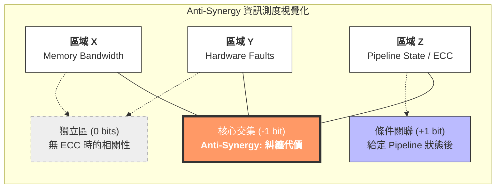

# 從 Shannon 到系統設計：資訊理論的工程師視角

**作者**: Danny Jiang
**日期**: 2026-03-26

---

## 前言：效能模型的天花板

週三下午的系統架構實驗室裡，小陳正對著一張 Roofline Model 的圖表發呆。

「教授，」小陳指著螢幕上的曲線，「我已經把這個 GEMM kernel 優化到 Roofline 的 90% 了，但老闆還是問我『能不能再快一點』。我該怎麼跟他解釋，這已經是物理極限了？」

我走過去看了一眼他的 profiling 數據。Operational Intensity 是 8 FLOP/Byte，峰值頻寬是 900 GB/s，峰值算力是 19.5 TFLOPS。他的實作已經達到 17.5 TFLOPS，確實非常接近理論上限。

「你需要的不是更好的優化技巧，」我說，「而是一套數學語言，來證明『為什麼這是極限』。」

這時，博士生小楊從隔壁桌滑過來，手上拿著一本厚厚的書：Raymond W. Yeung 的《A First Course in Information Theory》。

「教授，我最近在讀這本書，」小楊說，「裡面講的 Entropy、Channel Capacity、Rate-Distortion，感覺跟我們做系統設計時碰到的『極限問題』很像。但我不太確定這兩者之間到底有什麼具體的連結。」

我笑了一下，在白板上寫下兩個詞：**Shannon** 和 **Roofline**。

「你們知道嗎，」我說，「Claude Shannon 在 1948 年發表的《A Mathematical Theory of Communication》，不只是通訊理論的基石，也是我們今天做系統設計時，思考『極限』的數學框架。」

「Roofline Model 告訴你『這個系統最快能跑多快』，」我指著小陳的圖表，「而 Shannon 的 Entropy 告訴你『這段資料最少需要多少 bits 來表示』。這兩者在數學本質上，都是在回答同一個問題：**在給定的約束條件下，什麼是理論上的最優解？**」

小陳皺著眉頭：「所以資訊理論可以幫我說服老闆？」

「不只是說服老闆，」我說，「更重要的是，它能幫你**看清楚系統設計中那些隱藏的極限**——那些你用 profiling 工具看不到，但數學上已經證明『不可能突破』的邊界。」

小楊翻開書的目錄：「但這本書有 16 章，從 Entropy 到 Network Coding 到 Group Theory，我應該從哪裡開始？哪些章節跟系統設計最相關？」

「這正是我們今天要討論的，」我說，「我們不會把整本書從頭到尾讀一遍——那是數學系學生的工作。我們要做的是：**從系統設計師的視角，重新發現資訊理論中的寶藏**。」

我在白板上畫了一個表格：

```
Shannon 的世界          ↔    系統設計的世界
─────────────────────────────────────────────
Entropy                ↔    Roofline Model
Fano's Inequality      ↔    分支預測器極限
Typicality             ↔    Benchmark 設計
Information Diagrams   ↔    7-Domain Framework
Non-Shannon Inequalities ↔  多核心擴展性極限
Rate-Distortion        ↔    模型量化
Network Coding         ↔    DPU / In-Network Computing
Group Theory           ↔    Cache Coherence Invariants
```

「接下來的幾個小時，」我說，「我們會逐一拆解這些連結點。你們會發現，Shannon 在 70 多年前建立的數學框架，正是我們今天設計高效能系統時，最需要的『極限思維』。」

---

**本文的範圍與目標**

這篇文章不是《A First Course in Information Theory》的完整摘要，也不是資訊理論的教科書。我們的目標是：

1. **建立連結**: 將 Shannon 的經典概念（Entropy, Capacity, Typicality, Information Inequalities）與現代系統設計實務（Roofline, Amdahl, USL, 7-Domain）建立深刻的對應關係。

2. **提供直覺**: 用系統設計師熟悉的語言（Cache, Memory, Bandwidth, Latency），重新解釋那些看起來很抽象的數學定理。

3. **展示應用**: 每個概念都會搭配具體的系統案例——從分支預測器、ECC、Benchmark 設計，到 AI 模型量化、DPU 加速、形式化驗證。

如果你是一位系統架構師、效能工程師，或是對「為什麼系統有極限」感到好奇的開發者，這篇文章會為你打開一扇新的門。

讓我們開始吧。

---

### 參考書籍與專欄縮寫對照 (Reference Abbreviations)

本文中會頻繁引用以下書籍與技術專欄，為求簡潔，使用縮寫表示：

**PerfBook** - Danny Jiang, *Performance and Benchmarking: Beyond the Bottleneck*, 2026.
- Ch.3: 測量方法論 (Benchmark Methodology)
- Ch.10: Performance Modeling (涵蓋 Roofline Model, Amdahl's Law, USL)
- Ch.29: Edge AI 效能分析 (涵蓋 Model Quantization and Compression)

**SDBook** - Danny Jiang, *System Design: An Architecture-Aware Approach*, 2026.
- Ch.3: The 7-Domain Framework Overview
- Ch.4: Execution Domain (從固定 SIMD 到彈性執行)
- Ch.6: Caches Domain (Cache Coherence 與 MESI 協定)
- Ch.7: Ordering Domain (Memory Consistency Models 與可見性)
- Ch.19: AI Factory - System-Level Stress Test (萬卡規模壓力測試)

**RV2** - Danny Jiang, *See RISC-V Run 2: Advanced*, 2026.
- Ch.3: 進階管線設計 (Pipeline Hazards 與 Flush Penalty)
- Ch.6: 分支預測 (Branch Prediction)
- Ch.8: RVV 1.0 架構
- Ch.9: Vector Programming Patterns (RVV, LMUL, Register Pressure)
- Ch.36: 網頁與網路應用 (DPDK, Kernel-Bypass)

**DSBook** - Danny Jiang, *Data Structures in Practice*, 2025.
- Ch.2: Memory Hierarchy 基礎
- Ch.4: Arrays and Cache Locality (AoS vs SoA, 典型存取模式)

**Tech Column** - Danny Jiang, *Computer Architecture Series*, 2026.
- CA04: 跨越架構壁壘 (涵蓋 IntrinTrans: LLM-based RVV Intrinsic Translator)

---

## 1 書籍導讀：Shannon 的遺產與 Yeung 的創新

「在我們開始建立那些連結之前，」我對小楊和小陳說，「我們需要先了解這本書的整體架構，以及為什麼我選擇這本書，而不是其他資訊理論教材。」

### 1.1 作者與書籍背景

Raymond W. Yeung（楊偉豪）教授是香港中文大學的講座教授，也是資訊理論領域的國際權威。他最為人知的貢獻有三個：

1. **I-Measure 與資訊圖 (Information Diagrams)**: 將 Shannon 的資訊量與集合論建立起一對一的數學對應關係，讓複雜的資訊理論證明可以「視覺化」。

2. **非 Shannon 型資訊不等式 (Non-Shannon-type Inequalities)**: 1998 年，他與**張真 (Zhen Zhang)** 教授（時任南加州大學教授）共同發表了震撼資訊理論界的論文，提出了著名的 **Zhang-Yeung Inequality (ZY98)**。這個發現證明了當系統變數達到 4 個或更多時，Shannon 的基本不等式無法完全描述資訊空間的約束——就像牛頓力學在極端條件下需要廣義相對論來修正一樣。這篇論文被譽為資訊理論的「大地震」，揭示了高維資訊空間的「彎曲」結構。

3. **網路編碼 (Network Coding)**: 作為網路編碼領域的先驅者之一，他證明了在網路節點進行編碼（而不只是轉發），可以達到圖論中的「最大流 (Max-Flow)」極限。

這本《A First Course in Information Theory》（第二版，2024）是他多年教學與研究的結晶。與另一本經典教材 Cover & Thomas 的《Elements of Information Theory》相比，這本書有幾個獨特之處：

| 特點 | Cover & Thomas | Yeung |
|------|----------------|-------|
| **數學嚴謹度** | 強調直覺與應用 | 所有推導從第一原理出發 |
| **資訊不等式** | 基本介紹 | 深入探討 Shannon 型與非 Shannon 型 |
| **網路編碼** | 簡略提及 | 專門章節（Ch.11, 15） |
| **視覺化工具** | 傳統代數推導 | 資訊圖 (Information Diagrams) |
| **自動化證明** | 無 | 提供 ITIP 軟體 |

「所以這本書更偏向數學？」小陳問。

「是的，」我說，「但這正是它的價值所在。當你在做系統設計時，你需要的不是『大概知道有個極限』，而是『能夠精確證明這個極限是多少，以及為什麼無法突破』。Yeung 的書給你的，正是這種數學上的確定性。」

### 1.2 章節地圖與閱讀路徑

我在白板上畫出這本書的整體架構：

**全書 16 章，三大板塊：**

**板塊一：經典主題（Ch.1–5, 8–10）**
- Ch.1: 資訊科學 (The Science of Information)
- Ch.2: Shannon 資訊測度 (Shannon's Information Measures)
- Ch.3: 零誤差資料壓縮 (Zero-Error Data Compression)
- Ch.4: 弱典型性 (Weak Typicality)
- Ch.5: 強典型性 (Strong Typicality)
- Ch.8: 通道容量 (Channel Capacity)
- Ch.9: 率失真理論 (Rate-Distortion Theory)
- Ch.10: Blahut-Arimoto 演算法

**板塊二：數學工具（Ch.6–7, 12–14）**
- Ch.6: I-測度 (The I-Measure)
- Ch.7: 馬可夫結構 (Markov Structures)
- Ch.12: 資訊不等式 (Information Inequalities)
- Ch.13: Shannon 型不等式 (Shannon-type Inequalities)
- Ch.14: 非 Shannon 型不等式 (Non-Shannon-type Inequalities)

**板塊三：進階主題（Ch.11, 15–16）**
- Ch.11: 單源網路編碼 (Single-Source Network Coding)
- Ch.15: 多源網路編碼 (Multi-Source Network Coding)
- Ch.16: 熵與群論 (Entropy and Groups)

「16 章！」小陳驚呼，「我們要全部讀完嗎？」

「不，」我笑著說，「作者在書中提供了幾條建議的閱讀路徑，針對不同的目標：」

我在白板上列出幾條路徑：

**路徑 A：無失真資料壓縮 (Lossless Compression)**
```
Ch.1 → Ch.2 → Ch.3
```
這是最經典的入門路徑，從哲學概念到數學工具，最後落地到 Huffman 編碼。

**路徑 B：通道容量與率失真 (Channel Capacity & Rate-Distortion)**
```
Ch.1 → Ch.2 → Ch.4 → Ch.5 → Ch.8 → Ch.10
Ch.1 → Ch.2 → Ch.4 → Ch.5 → Ch.9 → Ch.10
```
這是通訊系統工程師的必修路徑，涵蓋典型性 (Typicality) 與 Blahut-Arimoto 演算法。

**路徑 C：資訊圖與馬可夫結構 (Information Diagrams & Markov Structures)**
```
Ch.1 → Ch.2 → Ch.6 → Ch.7
```
這是 Yeung 教授的獨門絕活，用視覺化的方式理解資訊流動。

**路徑 D：資訊不等式 (Information Inequalities)**
```
Ch.1 → Ch.2 → Ch.6 → Ch.12 → Ch.13 → Ch.14
```
這是理解「系統極限」的核心路徑，包含 Shannon 型與非 Shannon 型不等式。

**路徑 E：網路編碼 (Network Coding)**
```
Ch.1 → Ch.2 → Ch.6 → Ch.11 → Ch.15
```
這是分散式系統與網路架構師的寶藏，證明了「編碼優於轉發」。

「對我們系統設計師來說，」我指著白板，「最有價值的是**路徑 C + 路徑 D + 路徑 E** 的組合。因為這些章節提供的不是『如何設計編碼器』，而是『如何用數學證明系統的極限』。」

小楊點點頭：「所以我們今天會專注在這些路徑上？」

「沒錯，」我說，「而且我們會用一種特殊的方式來讀——不是從數學定理出發，而是**從你們在系統設計中碰到的具體問題出發**，然後回頭看 Shannon 的理論如何提供答案。」

### 1.3 為什麼系統設計師需要資訊理論

小陳還是有點困惑：「但教授，我們已經有 Roofline Model、Amdahl's Law、USL 這些效能模型了。為什麼還需要資訊理論？」

「好問題，」我說，「讓我用一個具體的例子來回答。」

我在白板上畫了一個簡單的系統架構圖：

```
CPU Core → L1 Cache → L2 Cache → L3 Cache → DRAM
```

「假設你在優化一個記憶體密集型的應用，」我說，「你用 Roofline Model 分析後，發現瓶頸在 DRAM 頻寬。你的第一反應是什麼？」

「加大 Cache？」小陳說。

「對，」我說，「但加多大？什麼時候停止？」

小陳想了想：「直到 Cache Miss Rate 降到可接受的範圍？」

「這就是問題所在，」我說，「『可接受的範圍』是多少？10%？5%？1%？你怎麼知道這是最優的？」

我在白板上寫下一個公式：

$$H(X) = -\sum p(x) \log p(x)$$

「這是 Shannon 的 Entropy，」我說，「它告訴你：**給定一個 workload 的記憶體存取模式，理論上最少需要多少 bits 來『預測』下一次存取的位址**。」

「如果你的 Cache 容量小於這個 Entropy 所需的空間，」我繼續說，「那麼無論你用什麼 replacement policy（LRU、LFU、ARC），你的 Miss Rate 都不可能低於某個下界。這個下界，就是 Fano's Inequality 給你的。」

小楊的眼睛亮了起來：「所以資訊理論可以告訴我們『什麼是不可能的』？」

「完全正確，」我說，「資訊理論提供的是三種武器：」

我在白板上列出：

**武器一：極限定律 (Fundamental Limits)**
- **Entropy**: 壓縮的極限
- **Channel Capacity**: 傳輸的極限
- **Rate-Distortion**: 有損壓縮的極限
- **Fano's Inequality**: 預測錯誤率的下界

這些定律告訴你：「在給定的約束條件下，什麼是理論上的最優解」。當你的系統已經接近這個極限時，你就知道「不是你的優化技巧不夠好，而是物理定律不允許」。

**武器二：幾何直覺 (Geometric Intuition)**
- **Information Diagrams**: 將多個變數之間的資訊關係視覺化
- **Typicality**: 「少數決定整體」的數學證明
- **Markov Structures**: 用圖論理解條件獨立性

這些工具讓你能夠「看見」系統中的資訊流動，而不是只靠代數推導。

**武器三：自動化證明 (Automated Verification)**
- **ITIP 軟體**: 將資訊不等式轉化為線性規劃問題，讓電腦自動證明
- **Non-Shannon Inequalities**: 發現傳統效能模型漏掉的盲區

這些工具讓你能夠「機械化」地檢查系統設計中的假設是否互相矛盾。

「所以，」我總結道，「資訊理論不是取代 Roofline 或 Amdahl，而是為它們提供**數學基礎**。當你說『這個系統已經優化到極限了』，你需要的不是經驗法則，而是一個可以寫在論文裡、可以說服審稿人的數學證明。」

小陳若有所思：「那我們從哪裡開始？」

「從你最熟悉的地方開始，」我說，「從 Roofline Model 開始，看看它跟 Shannon 的 Entropy 有什麼關係。」

---

## 2 極限的哲學:當 Shannon 遇見 Roofline

### 2.1 Entropy 與 Roofline：壓縮如何改寫效能極限

小陳打開他的筆記本，翻到那張 Roofline 圖表。「教授，我一直有個疑問，」他說，「Roofline Model 告訴我，這個 kernel 的效能受限於 `min(Peak FLOPS, Peak BW × OI)`。但如果我對資料做壓縮，這個公式還成立嗎？」

「非常好的問題，」我說，「這正是 Shannon 的 Entropy 可以介入的地方。」

#### Shannon 極限與系統極限的對照

我在白板上畫了一張對照表:

| **資訊理論 (Shannon Limits)** | **計算機系統 (System Limits)** | **核心對應關係** |
|------|------|------|
| **Entropy** $H(X)$<br>無損壓縮極限 | **Roofline Model**<br>運算強度與頻寬牆 | Entropy 決定資料體積的絕對下限;<br>壓縮逼近 $H(X)$ 實質上是減少記憶體存取量,<br>強行提高 OI,使系統從 BW-bound 移向 Compute-bound |
| **Channel Capacity** $C$<br>可靠傳輸極限 | **Universal Scalability Law (USL)**<br>系統擴展極限 | Capacity 界定雜訊通道下的最大吞吐量;<br>USL 界定系統在遇到同步/競爭雜訊時的最大有效吞吐量 |
| **Rate-Distortion** $R(D)$<br>失真壓縮極限 | **Mixed Precision**<br>近似計算/低精度量化 | 在容許一定誤差 (Distortion) 的前提下降低資料傳輸率 (Rate),<br>等同於利用低精度量化 (FP8, INT4) 來提升 Peak FLOPS 與 Peak BW |
| **AEP (Asymptotic Equipartition)**<br>漸進等分割性 | **Little's Law**<br>穩態排隊與資料流 | AEP 描述長序列在機率上的穩態典型行為;<br>Little's Law 描述系統在穩態下的吞吐量/延遲/並發數守恆定律 |

「這張表的核心洞察是什麼？」小楊問。

「是這個，」我指著第一行，「**Entropy 是系統突破物理頻寬牆的『邏輯乘數』**。」

#### 重新定義 Roofline 的 x 軸

我在白板上寫下標準的 Roofline 公式：

$$P \le \min(P_{\text{peak}}, B_{\text{peak}} \times \text{OI})$$

其中，運算強度 $\text{OI} = \frac{F}{B_{\text{physical}}}$，即總運算量 $F$ 除以物理傳輸的位元組 $B_{\text{physical}}$。

「但如果我們引入資訊理論，」我說，「我們可以重新定義這個 $B_{\text{physical}}$。」

假設我們要載入一組包含 $N$ 個符號的張量資料。如果這組資料帶有冗餘，其**真實資訊量**由 Shannon Entropy $H(X)$ (單位為 bits/symbol) 決定。

這意味著，這筆資料在物理上能被壓縮到的絕對極限體積為：

$$B_{\text{min}} = \frac{N \times H(X)}{8} \text{ (Bytes)}$$

「所以，」我繼續，「如果在記憶體控制器或快取階層引入**理想的硬體即時解壓縮引擎**，我們就可以重新定義 Roofline 的 x 軸。」

**有效運算強度 (Effective OI):**

$$\text{OI}_{\text{eff}} = \frac{F}{B_{\text{min}}} = \frac{8F}{N \times H(X)}$$

「這意味著什麼？」小陳問。

「這意味著，」我說，「**Entropy $H(X)$ 越低，你的有效 OI 和有效頻寬就被放得越大**。系統的有效頻寬 $B_{\text{eff}}$ 會變成：」

$$B_{\text{eff}} = B_{\text{peak}} \times \frac{B_{\text{physical}}}{B_{\text{min}}} \propto \frac{B_{\text{peak}}}{H(X)}$$

#### 案例：LLM 推論中的 KV Cache 壓縮

「讓我們用一個具體的例子，」我說，「來看看這個理論如何應用到實際系統中。」

我在白板上寫下一個場景:

**硬體規格:**
- Peak FLOPS = 300 TFLOPS
- Peak BW = 3 TB/s
- Ridge Point: $\text{OI}_{\text{ridge}} = \frac{300}{3} = 100$ FLOPS/Byte

**工作負載:**
- 某層 Attention 計算,運算量 $F$ = 300 GFLOPs
- 原始物理讀取量 $B_{\text{physical}}$ = 60 GB

**場景 1:未經壓縮 (古典 Roofline 分析)**

$$\text{OI} = \frac{300 \text{ GFLOPs}}{60 \text{ GB}} = 5 \text{ FLOPS/Byte}$$

因為 $5 < 100$,系統處於極度的 **Memory-bound** 狀態。

效能上限: $P \le 3 \text{ TB/s} \times 5 = 15 \text{ TFLOPS}$ (硬體算力只發揮了 **5%**)

**場景 2:引入 Shannon Entropy 極限壓縮**

假設這 60 GB 的 KV Cache 資料分佈極度不均勻 (例如充滿大量的零或稀疏矩陣),我們計算其 Shannon Entropy 後發現,其真實資訊量只佔物理體積的 **20%** (即壓縮比為 5:1)。

藉由硬體無損壓縮引擎,我們實際從 HBM 讀取的資料量降為 $B_{\text{comp}} = 12$ GB。

重新定義的運算強度:

$$\text{OI}_{\text{eff}} = \frac{300 \text{ GFLOPs}}{12 \text{ GB}} = 25 \text{ FLOPS/Byte}$$

此時,工作負載在 Roofline 圖上**向右平移**!

新的效能上限: $P \le 3 \text{ TB/s} \times 25 = 75 \text{ TFLOPS}$

「等等，」小陳驚呼，「我們沒有改變 DRAM 的物理頻寬 (依然是 3 TB/s)，也沒有改變計算邏輯 (依然是 300 GFLOPs)，但僅僅是透過逼近 Shannon Entropy 的極限，我們就將系統效能硬生生提升了 **5 倍**？」

「完全正確，」我說，「這就是將『資訊理論』融入『系統架構』的最強大武器。」

#### So What? 工程啟示

小楊若有所思：「所以這告訴我們什麼？」

我在白板上總結：

**啟示 1：壓縮不是『錦上添花』，而是『突破極限』**

當你的系統處於 Memory-bound 狀態時，傳統的優化手段 (prefetching, cache blocking) 只能在常數因子上改善。但如果你能逼近 Shannon Entropy 的極限，你可以**改變系統的根本瓶頸**，從 BW-bound 移向 Compute-bound。

**啟示 2：硬體壓縮引擎的 ROI 可以量化**

假設你要在 SoC 中加入一個硬體解壓縮引擎，它的面積成本是 5% die area，功耗成本是 10W。你可以用 Shannon Entropy 來計算：

- 如果你的 workload 的平均 $H(X) = 4$ bits/symbol (相對於 8-bit 資料)，壓縮比為 2:1
- 這意味著你的有效頻寬翻倍，等同於你花 5% die area 買到了 **2× Peak BW**
- 這比直接加倍 DRAM 通道 (需要 50% die area + 2× 功耗) 划算得多

**啟示 3：Entropy 是 Profiling 的新維度**

傳統的 profiling 工具 (perf, VTune, Nsight) 會告訴你：
- Cache Miss Rate
- Memory Bandwidth Utilization
- FLOPS Utilization

但它們不會告訴你：
- 你的資料的 Shannon Entropy 是多少
- 你的壓縮潛力有多大
- 你離理論極限還有多遠

「所以，」我說，「下次當你的老闆問你『能不能再快一點』時，你可以回答：『讓我先算一下這個 workload 的 Entropy。如果我們已經逼近 Shannon 極限，那麼答案是不能——除非你願意改變問題本身。』」

小陳笑了：「這就是我需要的數學語言。」

---

**參考文獻連結:**
- **PerfBook Ch.10**: Performance Modeling (Roofline Model 的詳細推導)
- **DSBook Ch.2**: Memory Hierarchy 基礎
- Yeung, *A First Course in Information Theory*, Ch.2 (Shannon's Information Measures), Ch.3 (Zero-Error Data Compression)

---

### §2.2 Fano's Inequality 與分支預測器的極限

第二天，小陳帶著一個新問題來找我。

「教授，」他說，「我昨天回去想了一下 Entropy 和 Roofline 的關係。但我還有另一個困擾：我們的 CPU 有一個很先進的分支預測器，準確率達到 95%。但老闆還是問我『能不能再提高一點』。我該怎麼回答？」

「又是一個『能不能再快一點』的問題，」我笑著說，「這次我們用 Fano's Inequality 來回答。」

#### 分支預測作為通訊通道

我在白板上畫了一個圖：

```
實際分支結果 (X) → 歷史資訊 (Y) → 預測器 → 預測結果 (X̂)
```

「我們可以把分支預測器看成一個『通訊通道』，」我說：

- **輸入 $X$**：分支的實際結果 (Taken = 1, Not Taken = 0)
- **歷史資訊 $Y$**：預測器能觀察到的上下文 (Global History Register, PC, Path History)
- **輸出 $\hat{X}$**：預測器根據 $Y$ 做出的預測
- **錯誤率 $P_e$**：預測錯誤的機率，$P_e = P(\hat{X} \neq X)$

「Fano's Inequality 告訴我們，」我在白板上寫下公式：

$$H(X|\hat{X}) \le h_b(P_e) + P_e \log_2(|\mathcal{X}| - 1)$$

其中 $h_b(P_e)$ 是二元熵函數：

$$h_b(p) = -p \log_2 p - (1-p) \log_2 (1-p)$$

「因為分支結果只有 Taken 和 Not Taken 兩種 ($|\mathcal{X}| = 2$)，所以 $\log_2(2-1) = 0$。公式簡化為：」

$$H(X|\hat{X}) \le h_b(P_e)$$

「又因為預測是基於歷史資訊 $Y$ 產生的 ($X \to Y \to \hat{X}$ 構成馬可夫鏈)，根據資料處理不等式 (Data Processing Inequality)，我們有 $H(X|Y) \le H(X|\hat{X})$。」

「因此，」我總結道，「我們得到**分支預測的極限定理**：」

$$H(X|Y) \le h_b(P_e)$$

#### 數值範例：95% 準確率的物理意義

「讓我們算一下你的 95% 準確率意味著什麼，」我說。

錯誤率 $P_e = 0.05$，對應的二元熵是：

$$h_b(0.05) = -0.05 \log_2(0.05) - 0.95 \log_2(0.95)$$
$$h_b(0.05) \approx 0.2164 + 0.0703 = \mathbf{0.2867 \text{ bits}}$$

「Fano's Inequality 告訴我們什麼？」我問。

小楊搶答：「它告訴我們，如果這個系統能被 95% 準確預測，這代表該分支序列在給定歷史 $Y$ 的條件下，其**內在剩餘熵 $H(X|Y)$ 頂多只有 0.2867 bits**！」

「完全正確，」我說，「反過來說：」

我在白板上畫了一個表格：

| 分支類型 | $H(X\|Y)$ (bits) | Fano 極限錯誤率 | 實際意義 |
|---------|-----------------|---------------|---------|
| **高度規律** (迴圈計數器) | 0.01 | ~0.7% | 幾乎完美可預測 |
| **中度規律** (典型程式碼) | 0.10 | ~4% | 現代預測器的甜蜜點 |
| **低度規律** (資料驅動) | 0.50 | ~23% | 預測器開始失效 |
| **完全隨機** (外部輸入) | 1.00 | ~50% | 預測器完全無用 |

「如果 $H(X|Y) > 0.2867$ bits，」我說，「那麼**數學上絕對不可能**造出一個達到 95% 準確率的預測器。Pipeline flush 是無可避免的物理宿命。」

#### 現代預測器已經撞到天花板

「那實際的分支預測器 (TAGE, Perceptron) 離這個極限有多遠？」小陳問。

「非常近，」我說，「學界研究顯示：」

**預測器演進的本質：擴大互資訊 $I(X;Y)$**

從早期的 2-bit counter 到 Bimodal，再到 Gshare、Perceptron，最後到當今的 TAGE，這些架構的演進，本質上都是在**擴增歷史資訊 $Y$ 的維度**。

因為：
$$H(X|Y) = H(X) - I(X;Y)$$

TAGE 預測器使用了極長的全局歷史 (Global History，高達數百 bits) 和路徑歷史 (Path History)。它透過幾何級數長度的多張表格，極大化了 $I(X;Y)$，從而將 $H(X|Y)$ 壓到最低。

**實際數據：**

根據學界對 SPEC CPU benchmark 的研究：
- 多數程式分支的理論極限錯誤率 (基於 Lempel-Ziv 壓縮演算法推導出的真實熵) 大約落在 **1% ~ 3%** 之間
- 現代 TAGE 預測器在這些 Benchmark 上的錯誤率大約是 **2% ~ 4%**
- **結論**：現代的高階預測器距離 Fano 不等式所劃定的絕對數學極限，通常只有 **1% 左右的微小差距**

「所以，」小陳恍然大悟，「當我的預測器已經達到 95% 準確率時，我應該先檢查這個 workload 的 $H(X|Y)$ 是多少。如果它本來就是 0.29 bits，那我已經在理論極限上了！」

#### So What? 既然預測器已到極限，架構師該怎麼辦？

「既然這是一堵數學物理牆，」我說，「架構師只能繞道而行。這也是為什麼現代架構必須依賴其他手段：」

**策略 1：Predication / CMOV 指令**

將 Control-flow 轉換成 Data-flow。既然高熵分支 ($H(X|Y)$ 很大) 一定會觸發 Fano 不等式的錯誤懲罰，不如直接放棄預測，兩條路都算。

```c
// 傳統分支 (會觸發預測)
if (x > 0) {
    y = a;
} else {
    y = b;
}

// Predication (避免分支)
y = (x > 0) ? a : b;  // 編譯成 CMOV
```

**策略 2：Out-of-Order Execution 與較短的 Pipeline**

既然錯誤無可避免，只能盡可能隱藏或降低 flush 的代價：
- 減少 Front-end 的深度 (降低 flush penalty 從 20 cycles 到 10 cycles)
- 用 OoO 引擎繼續執行不依賴分支結果的指令

**策略 3：接受現實，優化 Workload**

如果你的程式碼充滿了 data-dependent branches (例如：依賴於無法預測的記憶體載入值)，那麼：
- 重構演算法，減少分支
- 使用 SIMD 指令 (branchless programming)
- 接受這就是你的 workload 的物理極限

「所以，」我總結道，「下次當老闆問你『能不能讓預測器再準一點』時，你可以回答：『讓我先算一下這個 workload 的 Fano 極限。如果我們已經在極限上，那麼答案是不能——除非你願意改變程式碼本身。』」

---

**參考文獻連結:**
- **RV2 Ch.6**: 分支預測 (Branch Prediction)
- **RV2 Ch.3**: 進階管線設計 (Pipeline Hazards 與 Flush Penalty)
- Yeung, *A First Course in Information Theory*, Ch.2 (Fano's Inequality)

---

### 2.3 Separation Theorem 與 Policy/Mechanism 分離

週五下午，小楊帶著一個哲學性的問題來找我。

「教授，」他說，「我在讀作業系統的經典教材時，看到一個設計原則：『Policy 與 Mechanism 分離』。例如，排程器的策略 (哪個 Process 優先) 與機制 (Context Switch 的硬體操作) 應該分開設計。這讓我想到資訊理論中的 Separation Theorem——來源編碼與通道編碼可以分開設計。這兩者有什麼深層的數學對應嗎？」

「非常好的洞察，」我說，「這兩者都指向同一個核心理念：**透過建立一個通用的抽象介面，將複雜的問題解耦，使得不同的模組可以獨立最佳化，而不會損失整體的全域最佳性**。」

#### Separation Theorem 的直覺

我在白板上畫了一個通訊系統的架構圖：

```
資訊源 (Source) → 來源編碼 → 通道編碼 → 通道 (Channel) → 通道解碼 → 來源解碼 → 接收端
                  (壓縮)      (抗雜訊)                    (糾錯)      (解壓縮)
```

「在 Shannon 的古典資訊理論中，」我說，「通訊系統的主要任務是將一個資訊源透過一個有雜訊的通道傳送給接收端。」

- **來源編碼 (Source Coding)**：負責『壓縮』，去除資料的冗餘，將資訊源轉換為最精簡的位元流 (逼近 Entropy $H$)
- **通道編碼 (Channel Coding)**：負責『抗雜訊』，在位元流中加入冗餘 (Error Correction Code)，確保資料能可靠地通過通道 (逼近 Capacity $C$)

「**Separation Theorem** 指出，」我強調，「對於一個無記憶的通道和資訊源，只要在『漸進 (Asymptotic)』的極限下 (即允許無限長的延遲和無限大的區塊長度)，**來源編碼和通道編碼可以完全獨立設計，而不會損失任何系統的整體最佳性**。」

只要滿足 $H < C$，系統就能可靠傳輸。

「這意味著什麼？」小陳問。

「這意味著，」我說，「你可以設計一個最棒的 MP3 壓縮器，和一個最棒的 5G 通道編碼器，把它們接在一起，系統效能依然是數學上的理論最佳值。**位元 (Bits) 成為了完美的通用介面**。來源編碼器不需要知道通道長什麼樣子，通道編碼器也不需要知道它傳送的是音樂還是文字。」

#### 與 Policy/Mechanism 分離的深層對應

我在白板上畫了一個對照表：

| **資訊理論** | **系統設計** | **核心對應** |
|------------|------------|------------|
| **Source Coding**<br>(來源編碼) | **Policy**<br>(策略) | 決定「要做什麼」<br>針對特定的 Workload/Source 進行最佳化 |
| **Channel Coding**<br>(通道編碼) | **Mechanism**<br>(機制) | 決定「怎麼做」<br>針對特定的硬體/通道進行最佳化,確保指令能可靠執行 |
| **Bits Interface**<br>(位元介面) | **System Call / API**<br>(系統呼叫/介面) | 通用的抽象介面,解耦上下層 |
| **$H < C$ 條件** | **資源充足條件** | 只要硬體資源 (CPU, Memory, BW) 充足,分離設計就是最優的 |

「兩者的深層數學對應在於**正交性 (Orthogonality)**，」我說：

「Separation Theorem 成立的前提是，來源的特性 (機率分佈) 與通道的特性 (雜訊分佈) 在數學上是正交的。同樣地，Policy 與 Mechanism 分離能成功，是因為我們假設『應用程式的需求 (Policy)』與『硬體的執行能力 (Mechanism)』可以被一個完美的抽象介面 (例如 System Call 或 API) 乾淨地切開。」

#### 分離設計何時會失效？

「但是，」小楊說，「我在實際系統中看到很多『打破抽象層』的設計。例如 DPDK 直接繞過 Kernel 的網路堆疊，或是 RDMA 讓應用程式直接操作網卡。這是為什麼？」

「因為 Separation Theorem 依賴於一個極其嚴苛的假設，」我說，「**定理允許無限大的區塊長度 (Block Length $n \to \infty$)，這意味著無限的延遲 (Infinite Latency) 與無限的運算複雜度**。」

「當我們回到現實世界，特別是當資源受限時，『聯合來源通道編碼 (Joint Source-Channel Coding, JSCC)』往往能帶來更好的效能。」

我在白板上列出分離設計失效的三個判斷準則：

**準則 1：嚴格的延遲限制 (Strict Latency Constraints)**

- **資訊理論**：如果我們不能等待收集夠多的資料來進行完美的壓縮和錯誤更正 (例如：即時視訊會議)，Separation Theorem 就會崩潰。將視訊壓縮 (Source) 的容錯特性與無線網路 (Channel) 的封包遺失特性聯合設計，效能會更好。

- **系統設計**：在超低延遲的系統 (如 High-Frequency Trading 或 Kernel-Bypass 網路) 中，我們無法忍受透過標準 OS Network Stack (Mechanism) 層層傳遞資料的 Overhead。應用程式 (Policy) 必須直接介入硬體網卡 (Mechanism) 的操作。

**準則 2：不穩定的通道/環境 (Non-Ergodic or Time-Varying Environments)**

- **資訊理論**：如果通道的 Capacity 變化極快 (例如高速移動中的車聯網)，標準的位元介面會無法及時反應。JSCC 可以讓視訊編碼器直接根據當下的 SNR 調整壓縮率和容錯層級。

- **系統設計**：如果底層硬體資源極度動態變化 (例如：雲端環境的 Noisy Neighbors 或行動裝置的 Thermal Throttling)，靜態分離的 Policy 會做出愚蠢的決策。排程器必須打破抽象層，直接讀取底層硬體的溫度或微架構狀態來做決策。

**準則 3：多點傳輸與網路拓撲 (Multi-Terminal / Network Topologies)**

- **資訊理論**：對於多用戶通道 (如 Broadcast Channel 或 Multiple Access Channel)，Separation Theorem 在多數情況下是**不成立**的。網路編碼 (Network Coding) 證明了，在中間節點將不同來源的資料混合編碼，才能達到最大吞吐量。

- **系統設計**：在分散式系統中，如果你把『資料儲存 (Source)』和『網路傳輸 (Channel)』完全分離，可能會導致無效的資料搬移。例如 Hadoop/Spark 的 "Data Locality" 原則，就是打破了運算與儲存的分離，讓運算 Policy 直接依賴於資料在網路中的 Mechanism 位置。

#### 案例：TCP/IP vs. QUIC/RDMA

「讓我們用網路協定堆疊來看一個具體的例子，」我說。

**分離設計的典範：標準 TCP/IP Stack**

- **分離哲學**：應用層 (HTTP, Policy) 只負責產生資料，傳輸層 (TCP, Mechanism) 負責保證可靠傳輸，網路層 (IP, Mechanism) 負責路由。它們透過 Socket API 這個完美的『位元介面』連接。

- **優勢**：極致的模組化。你可以寫一個 Web Server，完全不用管底層是 Wi-Fi 還是光纖。這促成了網際網路的爆炸性成長。

- **代價**：極高的延遲。TCP 為了保證『完全可靠 (Zero-Error)』，會盲目地重傳遺失的封包，導致 Head-of-Line Blocking，這就像是資訊理論中為了逼近 Capacity 而付出的無限延遲代價。

**聯合設計的崛起：QUIC 與 RDMA**

- **QUIC (HTTP/3)**：為什麼 Google 要開發 QUIC？因為在現代的高延遲、高掉包率行動網路中，將 HTTP (Application) 和 TCP (Transport) 完全分離的效能太差。QUIC 打破了這層邊界，將加密 (TLS)、多工傳輸 (Multiplexing) 和壅塞控制 (Congestion Control) **聯合設計**在使用者空間 (User-space)。應用層的 Policy 現在直接參與了底層的重傳與流量控制 Mechanism，解決了 Head-of-Line Blocking 問題。

- **RDMA (Remote Direct Memory Access)**：為了追求極致的低延遲與高吞吐量 (例如 AI 訓練叢集 NVLink/InfiniBand)，RDMA 直接繞過了 OS Kernel 的 TCP/IP Stack。應用程式的記憶體 (Policy) 與網卡的 DMA 引擎 (Mechanism) 直接『聯合 (Joint)』，達成了微秒級的延遲，這是在傳統分離架構下絕對無法達成的。

#### So What? 工程啟示

「所以，」我總結道，「Shannon 的 Separation Theorem 告訴我們：**在資源無限 (延遲、計算能力) 的理想世界裡，模組化 (分離設計) 是完美的，通用介面不會帶來效能損失**。」

「但在現實的系統設計中，**當資源受限 (Latency-bound, Compute-bound, Power-bound) 時，通用介面就成了效能的毒藥**。此時，我們必須進行跨層最佳化 (Cross-layer Optimization) 或聯合設計 (Joint Design)，打破 Policy 與 Mechanism 的高牆。」

「這正是你在追求極致效能時，必須做出取捨的架構智慧。」

小楊點點頭：「所以當我在設計系統時，我應該先問：我的資源限制是什麼？如果延遲不是問題，那就用標準的分離設計。但如果我需要微秒級的延遲，那我就必須打破抽象層。」

「完全正確，」我說，「這就是資訊理論給系統設計師的智慧。」

---

**參考文獻連結:**
- **SDBook Ch.3**: The 7-Domain Framework Overview
- **RV2 Ch.36**: 網頁與網路應用 (DPDK, Kernel-Bypass)
- Yeung, *A First Course in Information Theory*, Ch.8 (Channel Capacity), Ch.11 (Network Coding)

---

## 3. 典型性與 Benchmarking:大數法則的工程意義

週一早上，小陳和小楊一起來找我。

「教授，」小陳說，「我們在設計 Benchmark 時遇到一個問題。我們的產品要支援上千種不同的 workload，但我們不可能全部測試。如何選擇『代表性』的測試案例？」

「這正是資訊理論中『典型性 (Typicality)』要解決的問題，」我說，「Shannon 告訴我們：雖然可能的序列有無限多種，但『幾乎所有的機率』都集中在少數『典型序列』上。」

### 3.1 典型集合與 Representative Workload

#### 典型集合的數學定義

我在白板上寫下典型集合的定義:

對於一個隨機變數 $X$ 的 $n$ 次獨立重複,**典型集合** $A_\epsilon^{(n)}$ 定義為:

$$A_\epsilon^{(n)} = \left\{ x^n : \left| -\frac{1}{n} \log_2 P(x^n) - H(X) \right| \le \epsilon \right\}$$

「這個定義看起來很抽象，」小楊說，「能解釋一下嗎？」

「當然，」我說，「讓我們拆解這個公式：」

- **$-\frac{1}{n} \log_2 P(x^n)$**：這是序列 $x^n$ 的**經驗熵 (Empirical Entropy)**，也就是「這個序列有多稀有」
- **$H(X)$**：這是隨機變數 $X$ 的**理論熵**，也就是「平均而言，序列應該有多稀有」
- **典型集合**：就是那些「經驗熵接近理論熵」的序列

「典型集合有三個神奇的性質，」我繼續說：

**典型集合的三大性質：**

1. **高機率覆蓋**：$P(A_\epsilon^{(n)}) \ge 1 - \epsilon$ (當 $n$ 夠大時)
   - 幾乎所有的機率都集中在典型集合上

2. **小集合大小**：$|A_\epsilon^{(n)}| \le 2^{n(H(X)+\epsilon)}$
   - 典型集合的大小遠小於所有可能序列 ($2^{nH(X)}$ vs. $2^{n\log|\mathcal{X}|}$)

3. **均勻分佈**：對於 $x^n \in A_\epsilon^{(n)}$，$2^{-n(H(X)+\epsilon)} \le P(x^n) \le 2^{-n(H(X)-\epsilon)}$
   - 典型集合內的每個序列，機率都差不多

#### 對應到 Benchmark 設計

「這跟我們的 Benchmark 設計有什麼關係？」小陳問。

我在白板上畫了一個對照表:

| **資訊理論概念** | **Benchmark 設計概念** | **工程意義** |
|------------|------------|----------|
| **隨機變數 $X$** | **Workload 特徵** | 例如：記憶體存取模式、分支密度、運算類型 |
| **序列 $x^n$** | **測試案例** | 一個具體的程式或輸入資料集 |
| **典型集合 $A_\epsilon^{(n)}$** | **Representative Workload Set** | 那些「經驗特徵接近理論分佈」的測試案例 |
| **$H(X)$** | **Workload Diversity** | 用熵來量化「workload 有多多樣化」 |
| **$\epsilon$** | **Coverage Tolerance** | 我們願意接受多少「非典型」的風險 |

「所以，」我說，「當我們設計 Benchmark 時，我們不需要測試所有可能的 workload。我們只需要：」

1. **量化 Workload 的熵 $H(X)$**：用統計方法分析真實用戶的 workload 分佈
2. **選擇典型集合**：挑選那些「經驗特徵接近理論分佈」的測試案例
3. **保證覆蓋率**：確保 $P(A_\epsilon^{(n)}) \ge 1 - \epsilon$ (例如：95% 的用戶場景)

#### 案例：SPEC CPU Benchmark 的典型性分析

「讓我們看一個具體的例子，」我說，「SPEC CPU 2017 包含 43 個 benchmark。為什麼是 43 個，而不是 4300 個？」

我在白板上列出分析步驟：

**步驟 1：定義 Workload 特徵空間**

我們用 5 個維度來描述一個程式：
- $X_1$：IPC (Instructions Per Cycle)
- $X_2$：Cache Miss Rate
- $X_3$：Branch Misprediction Rate
- $X_4$：Memory Bandwidth Utilization
- $X_5$：Floating-Point vs. Integer Ratio

**步驟 2：計算聯合熵 $H(X_1, X_2, X_3, X_4, X_5)$**

假設我們從真實應用中採樣了 10,000 個程式，計算出：

$$H(X_1, X_2, X_3, X_4, X_5) \approx 8.5 \text{ bits}$$

這意味著「典型的程式空間」大約有 $2^{8.5} \approx 362$ 種不同的特徵組合。

**步驟 3：選擇典型集合**

SPEC CPU 的 43 個 benchmark 覆蓋了這 362 種組合中的主要類型，確保：
- 每個「典型特徵組合」至少有一個代表
- 總覆蓋率 $\ge 95\%$ (對應 $\epsilon = 0.05$)

「所以，」小陳恍然大悟，「SPEC CPU 不是隨機選的，而是用『典型性』來保證它能代表 95% 以上的真實應用！」

#### So What? 工程啟示

「這給我們什麼啟示？」我問。

小楊搶答：「當我們設計自己的 Benchmark 時，我們應該：」

1. **先量化 Workload 的熵**：不要憑感覺選測試案例，而是用統計方法分析真實用戶的分佈
2. **用典型性篩選**：選擇那些「經驗特徵接近理論分佈」的案例，而不是極端案例
3. **明確覆蓋率目標**：設定 $\epsilon$ (例如：5%)，確保我們的 Benchmark 能覆蓋 95% 的真實場景

「完全正確，」我說，「這就是資訊理論給 Benchmark 設計的數學基礎。」

---

**參考文獻連結:**
- **PerfBook Ch.3**: 測量方法論 (Benchmark Methodology)
- Yeung, *A First Course in Information Theory*, Ch.3 (Asymptotic Equipartition Property)

---

### 3.2 Chernoff Bound 與 P99 Latency

「典型性告訴我們『大部分機率集中在少數序列上』，」小楊說，「但在效能分析中，我們更關心『非典型事件』—也就是 Tail Latency (P99, P99.9)。Chernoff Bound 能幫我們嗎？」

「非常好的問題，」我說，「Chernoff Bound 正是用來界定『非典型事件有多罕見』的數學工具。」

#### Chernoff Bound 的直覺

我在白板上寫下 Chernoff Bound 的核心公式：

對於獨立隨機變數 $Y_1, Y_2, \ldots, Y_n$ 的和 $S_n = \sum_{i=1}^n Y_i$，平均值 $\mu = E[S_n]$：

$$P(S_n \ge (1+\delta)\mu) \le e^{-\frac{\delta^2 \mu}{3}} \quad \text{(for } 0 < \delta \le 1\text{)}$$

「這個公式告訴我們什麼？」我問。

小陳回答：「它說『遠離平均值的事件機率，會**指數級下降**』。」

「完全正確，」我說，「這就是為什麼在『乖巧的 (Well-behaved)』系統中，P99 Latency 不會太離譜。」

#### 數值範例：理想系統的 P99 極限

「讓我們算一個具體的例子，」我說。

**場景設定：**

假設一個微服務的請求延遲是由 100 個獨立的微小元件疊加而成，每個元件的延遲服從常態分佈：
- 平均延遲：$\mu = 10$ ms
- 標準差：$\sigma = 2$ ms

對於常態分佈 $Y \sim N(\mu, \sigma^2)$，Chernoff Bound 有一個漂亮的解析解：

$$P(Y \ge a) \le e^{-\frac{(a-\mu)^2}{2\sigma^2}}$$

**計算 P99 的 Chernoff 上界：**

我們想知道：「在 Chernoff Bound 的保證下，P99 延遲最多是多少？」

令 $P(Y \ge a) = 0.01$ (P99 的定義)，代入公式：

$$e^{-\frac{(a-10)^2}{2(2^2)}} = 0.01$$

兩邊取自然對數：

$$-\frac{(a-10)^2}{8} = \ln(0.01) \approx -4.605$$

解方程式：

$$(a-10)^2 \approx 36.84 \Rightarrow a - 10 \approx 6.07 \Rightarrow a \approx \mathbf{16.07 \text{ ms}}$$

「所以，」我說，「Chernoff Bound 告訴我們：在這個理想系統中，P99 延遲**絕對不會超過 16.07 ms**。」

「真實的 P99 是多少？」小楊問。

「在標準常態分佈中，P99 的 Z-score 是 2.326，所以真實 P99 = $10 + 2.326 \times 2 = 14.65$ ms。Chernoff Bound 給出的 16.07 ms 是一個非常緊的上界。」

#### 現實的殘酷：Heavy-Tailed Distribution

「但是，」我停頓了一下，「真實系統的 Tail Latency，幾乎從不服從 Chernoff Bound！」

我在白板上畫了一個對比表：

| **系統類型** | **平均延遲** | **Chernoff 預測的 P99** | **實際 P99** | **P99.9** |
|----------|----------|---------------------|----------|----------|
| **理想系統** (常態分佈) | 10 ms | 16 ms | 14.65 ms | 16.9 ms |
| **真實微服務** (厚尾分佈) | 10 ms | 16 ms | **50 ms** | **500 ms** |

「為什麼會這樣？」小陳驚訝地問。

「因為真實系統的延遲通常服從 **Heavy-Tailed Distribution** (厚尾分佈)，例如 Pareto、Weibull 或 Lognormal 分佈，」我說，「這是因為系統中存在『極端且不獨立的災難事件』：」

**厚尾效應的來源：**

1. **作業系統的 Context Switch 抖動**
2. **語言虛擬機的 Stop-The-World 垃圾回收 (GC Pauses)**
3. **網路封包遺失導致的 TCP 逾時重傳 (TCP Retransmission Timeouts)**
4. **資料庫的鎖競爭 (Lock Contention)**
5. **硬體的 Thermal Throttling**

「在厚尾分佈中，」我繼續說，「尾部機率是『多項式衰減』而非『指數衰減』。例如 Pareto 分佈：」

$$P(Y > a) \sim a^{-\alpha}$$

「如果我們試圖計算厚尾分佈的動差生成函數 $E[e^{sY}]$，**這個積分在數學上會直接發散 (Diverge，變成無限大)**！這意味著 Chernoff Bound 徹底失效。」

#### So What? 為什麼我們必須優化 P99

「這給我們什麼啟示？」我問。

小楊總結道：「Chernoff Bound 的失效，完美地解釋了為什麼系統工程師必須對 P99 和 P99.9 保持敬畏：」

1. **不能只看平均值**：在厚尾分佈中，平均值和變異數完全無法預測 P99
2. **必須直接測量**：我們必須投入巨大的工程資源去直接測量並砍掉 P99 延遲的長尾
3. **消除災難事件**：優化 P99 的關鍵是消除那些「極端且不獨立的災難事件」(GC、鎖競爭、重傳)

「所以，」我說，「下次當有人問你『為什麼要花這麼大力氣優化 P99』時，你可以回答：『因為真實系統是厚尾分佈，Chernoff Bound 的數學保證在這裡失效了。如果我們不主動消除災難性事件，P99 可能會是平均值的 5 倍甚至 50 倍。』」

---

**參考文獻連結:**
- **PerfBook Ch.10**: Performance Modeling (涵蓋 Tail Latency Analysis)
- Yeung, *A First Course in Information Theory*, Ch.3 (Chernoff Bound)

---

## 4. 資訊圖與 7-Domain：幾何化的除錯思維

週二下午，小楊帶著一個棘手的除錯問題來找我。

「教授，」他說，「我們在一個高可靠性系統中加入了 Inline ECC (錯誤更正碼) 來保護記憶體。理論上，Memory Domain 和 Faults Domain 應該是獨立的—記憶體頻寬是記憶體頻寬，硬體故障是硬體故障。但加入 ECC 後，我們發現這兩個 domain 開始互相拖累：當宇宙射線導致位元翻轉時，記憶體頻寬會突然下降，Pipeline 會 stall。這是為什麼？」

「這是一個經典的『模組化破裂 (Modularity Breakdown)』案例，」我說，「資訊理論中的『資訊圖 (Information Diagrams)』可以幫我們視覺化這種現象。」

### 4.1 共資訊 (Interaction Information) 與 Anti-Synergy

#### 數學基礎：負值的共資訊

我在白板上寫下三個隨機變數的共資訊定義：

$$I(X;Y;Z) = I(X;Y) - I(X;Y|Z)$$

「這個公式告訴我們什麼？」我問。

小陳回答：「$I(X;Y)$ 是 $X$ 和 $Y$ 原本的關聯性，$I(X;Y|Z)$ 是給定 $Z$ 後的關聯性。所以 $I(X;Y;Z)$ 衡量的是『$Z$ 對 $X$ 和 $Y$ 的關聯性有什麼影響』。」

「完全正確，」我說，「關鍵在於：**$I(X;Y;Z)$ 可以是負值**！」

我在白板上列出兩種情況：

**情況 1：正值共資訊 ( $I(X;Y;Z) > 0$ )**
- $I(X;Y|Z) < I(X;Y)$
- 給定 $Z$ 後，$X$ 和 $Y$ 的關聯性**減少**
- 物理意義：$Z$ 是一個「解釋變數」，它解釋了 $X$ 和 $Y$ 之間的部分關聯

**情況 2：負值共資訊 ( $I(X;Y;Z) < 0$ )** ⚠️
- $I(X;Y|Z) > I(X;Y)$
- 給定 $Z$ 後，$X$ 和 $Y$ 的關聯性**增加**
- 物理意義：$Z$ 是一個「耦合點」，它強行把原本獨立的 $X$ 和 $Y$ 綁在一起

「這就是 Anti-Synergy，」我說，「$Z$ 不是在幫忙，而是在製造麻煩。」

#### 7-Domain 案例：Inline ECC 的 Anti-Synergy

「讓我們用你的 ECC 案例來具體說明，」我說。

我在白板上定義三個隨機變數：

- **$X$ (Memory Domain)**：記憶體的可用頻寬與讀寫狀態
- **$Y$ (Faults Domain)**：宇宙射線導致的隨機位元翻轉 (Bit Flip)
- **$Z$ (Execution/Performance Domain)**：CPU Pipeline 的執行狀態與延遲 (Stall)

「在沒有 ECC 的系統中，」我說，「$X$ 和 $Y$ 是完全獨立的物理事件：」

$$I(X;Y) \approx 0$$

「位元翻轉就只是翻轉，它不會消耗額外的記憶體頻寬。」

「但是，」我繼續說，「當我們加入 Inline ECC 後，情況改變了：」

**Inline ECC 的運作機制：**
1. 當偵測到位元翻轉 ($Y$) 時
2. 記憶體控制器必須強行插入一個 Read-Modify-Write 週期來修正錯誤
3. 這會消耗 Memory 頻寬 ($X$)
4. 並導致 Pipeline 產生延遲/停頓 ($Z$)

「現在，」我說，「系統的 Performance ($Z$) 變成了 $X$ 和 $Y$ 的耦合點，類似 XOR 邏輯閘：」

$$Z = f(X, Y) \quad \text{(某種非線性函數)}$$

「給定我們觀察到系統發生了嚴重的 Pipeline Stall (給定 $Z$)，此時 $X$ 和 $Y$ 變得**高度相關**：」

- 如果正常的 Memory 存取 ($X$) 明明很低，卻發生了 Stall
- 那就**必定**是因為出現了大量的 Bit Flips ($Y$) 觸發了 ECC 修正

「這就是 $I(X;Y|Z) > I(X;Y)$，」我說，「加入 ECC 這個保護機制 ($Z$) 後，Faults Domain 和 Memory Domain 從互不干擾，變成了會互相搶奪資源、互相拖累的關係。」

#### 資訊圖視覺化

「讓我們用資訊圖來視覺化這種 Anti-Synergy,」我說。

我在白板上畫了一個類似文氏圖的資訊圖,標示出各個區域:

```
        ┌─────────────┐
        │      X      │
        │   ┌─────────┼─────┐
        │   │    ─1   │     │
        └───┼─────────┘  Y  │
            │         │     │
            │    Z    │     │
            └─────────┴─────┘
```




我在白板上列出各區域的面積：

| **資訊測度區域**  | **面積值 (bits)** | **系統物理意義**                                   |
| ----------- | -------------- | -------------------------------------------- |
| $I(X;Y)$    | 0              | 沒有 ECC 時，Memory 頻寬與硬體故障互不相關                  |
| $I(X;Y;Z)$  | **-1** (負面積)   | **Anti-synergy 的核心！** 代表引入機制 $Z$ 所產生的「代價/糾纏」 |
| $I(X;Y\|Z)$ | +1             | 給定 Pipeline 狀態 $Z$ 後，Memory 與 Faults 的關聯性暴增  |

「為什麼會有『負面積』？」小楊問。

「在古典資訊理論中，面積通常代表不確定性的消除，」我說，「但在多變數系統中，中心的負面積代表**『過度消除 (Over-counting)』**。這意味著機制 $Z$ (ECC) 就像一把『鑰匙』，單獨看 $X$ 或 $Y$ 都是隨機的，但 $Z$ 強行把它們綁在一起。」

#### So What? 系統設計的啟示

「這給我們什麼啟示？」我問。

小楊總結道：「當我們在設計系統時，我們應該：」

1. **警惕模組化破裂**：任何引入的機制 (如 ECC、Cache Coherency Protocol、Meltdown 漏洞修補)，如果在數學上具有 $I(X;Y;Z) < 0$ 的特性，這就宣告了**模組化在此處必然失效**。你無法再單獨優化 Memory 頻寬，因為 Faults 的抖動會直接跨 Domain 衝擊過來。

2. **識別隱形瓶頸**：在效能除錯時，如果我們發現兩個看似無關的指標 (例如：Disk I/O 和 CPU Branch Misses) 在系統高負載時突然呈現高度相關性，這通常意味著系統中存在一個隱藏的瓶頸 $Z$ (例如：底層的 OS Lock 或是 PCIe 頻寬)。「負共資訊」就是這些隱形瓶頸的數學特徵。

3. **量化防護機制的代價**：任何「保護機制 (Protection Mechanism)」都不是免費的。它的代價不僅僅是硬體面積或功耗的增加，更深層的代價是**「增加了系統維度間的糾纏度 (Entanglement)」**。在關鍵路徑 (Critical Path) 上引入會產生高負共資訊的機制，是架構設計的大忌。

「所以，」我說，「下次當你在系統中加入一個新的保護機制時，先問自己：這個機制會不會產生負共資訊？它會不會把原本獨立的 domain 強行綁在一起？」

---

**參考文獻連結:**
- **SDBook Ch.3**: The 7-Domain Framework Overview
- Yeung, *A First Course in Information Theory*, Ch.6 (Information Diagrams and I-Measure)

---

### 4.2 馬可夫鏈與 x86 TSO：狀態空間的切斷

「剛才我們看到負共資訊會製造麻煩，」小陳說，「那有沒有相反的情況—某種數學結構能幫我們**簡化**系統設計？」

「非常好的問題，」我說，「這就是**馬可夫鏈 (Markov Chain)** 的價值。」

#### 馬可夫鏈的數學定義

我在白板上寫下馬可夫鏈的定義：

對於三個隨機變數 $X, Y, Z$，如果它們構成馬可夫鏈 $X \to Y \to Z$，則：

$$I(X; Z | Y) = 0$$

「這個公式的物理意義是什麼？」我問。

小楊回答：「給定 $Y$ 後，$X$ 和 $Z$ 條件獨立。也就是說，$X$ 對 $Z$ 的所有影響，都必須**完全透過** $Y$ 來傳遞，不能繞過 $Y$ 直接影響 $Z$。」

「完全正確，」我說，「在資訊圖中，這對應到『所有 Type II atoms 為零』—$X$ 和 $Z$ 沒有實體接觸，它們之間的所有資訊流都必須經過 $Y$。」

#### x86 TSO 的馬可夫結構

「讓我們看一個具體的例子，」我說，「x86 的 TSO (Total Store Order) 記憶體模型。」

我在白板上定義三個隨機變數：

- **$X$ (Execution / Core State)**：處理器核心的執行狀態，代表 Core 決定要執行一個 Store 指令 (包含目標位址與數值)
- **$Y$ (Store Buffer State)**：儲存緩衝區的狀態，這是一個 FIFO Queue，負責接收 Core 的 Store，並非同步地寫入 L1 Cache
- **$Z$ (Memory / Coherence Domain)**：全局記憶體狀態 (包含 L1 Cache 及 MESI 協議可見的狀態)，當資料進入這裡，其他 Core 才看得到

「在嚴格的 TSO 寫入路徑下，」我說，「Core ($X$) **絕對不能**繞過 Store Buffer ($Y$) 直接修改 Memory ($Z$)。」

我在白板上畫了一個圖：

```
Core (X) → Store Buffer (Y) → Memory (Z)
           (FIFO Queue)        (MESI Coherence)
```

「這意味著，」我繼續說，「給定當前 Store Buffer 的狀態 ($Y$)，Memory 的未來狀態變更 ($Z$) 只取決於 $Y$，而與 Core 內部是如何亂序執行、預測錯誤或 Pipeline Flush ($X$ 的細節) **條件獨立**。」

「這完美構成了一個馬可夫鏈：」

$$X \to Y \to Z$$

$$I(X; Z | Y) = 0$$

#### 馬可夫結構的工程價值

「為什麼這個馬可夫結構對系統設計如此重要？」小陳問。

我在白板上列出兩個關鍵價值：

**價值 1：大幅減少狀態空間 (State Space Reduction)**

「在設計 CPU 時，我們必須進行形式化驗證 (Formal Verification，如使用 TLA+ 或 Model Checking) 以確保一致性協議沒有死鎖或錯誤，」我說。

- **如果沒有馬可夫性質** (例如一個極度混亂的 Consistency Model)：
  - 系統的全域狀態空間複雜度是 $|X| \times |Y| \times |Z|$
  - 驗證工具必須窮舉 Core 內部狀態與 Cache 狀態的所有可能組合

- **有了馬可夫性質** (TSO)：
  - 根據機率圖模型 (Graphical Models) 的特性，狀態空間被 Store Buffer ($Y$) 完美「切斷 (D-Separation)」
  - 驗證工程師可以將問題解耦：
    1. 驗證 Core 到 SB 的邏輯 (複雜度 $|X| \times |Y|$)
    2. 驗證 SB 刷新到 Memory 的邏輯 (複雜度 $|Y| \times |Z|$)
  - 驗證複雜度從**乘法爆炸**變成了**加法等級**

「這正是為什麼 x86 雖然歷史包袱沈重，其 Memory Model 依然在數學上具有高度可驗證性的原因，」我說。

**價值 2：模組化設計的數學保證 (Isolation of Non-Determinism)**

「現代 CPU 的 Core ($X$) 是一個極度非確定性 (Non-deterministic) 的怪獸，」我說：
- Out-of-Order 執行
- Branch Prediction
- Speculative Execution

「而 Memory Domain ($Z$) 是一個需要維持全球秩序的官僚 (MESI Coherence Protocol)。」

「如果採用嚴格的 **Sequential Consistency (SC)**，」我繼續說，「相當於拔掉 $Y$。$X$ 必須直接與 $Z$ 溝通 ($X \leftrightarrow Z$)。這意味著 Core 的任何一個 Store 都必須等待全域 Memory 點頭，Pipeline 會被嚴重的 Stall 拖垮。」

「**TSO 的智慧**，」我說，「TSO 引入了 Store Buffer ($Y$) 作為馬可夫中介者：」

1. 它在時間上吸收了 Core 的非確定性延遲，讓 Core 可以繼續往下跑
2. 資訊理論的 $I(X;Z|Y) = 0$ 保證了：**「只要 Store Buffer 不漏水 (沒有 Bypass 機制)，底層的 Memory 系統就永遠不需要去理解 Core 內部那些瘋亂的亂序邏輯」**

#### So What? 設計原則

「所以，」小楊總結道，「當我們設計系統時，我們應該：」

1. **尋找馬可夫中介者**：在複雜的系統中，尋找那些能夠「切斷狀態空間」的中介層 (例如：Store Buffer、Message Queue、API Gateway)

2. **驗證條件獨立性**：確保 $I(X;Z|Y) = 0$。也就是說，上游 ($X$) 對下游 ($Z$) 的所有影響，都必須完全透過中介層 ($Y$) 來傳遞。

3. **量化驗證複雜度的降低**：用馬可夫性質來證明「我們可以分別驗證 $X \to Y$ 和 $Y \to Z$，而不需要驗證 $X \times Y \times Z$ 的全域狀態空間」

「Store Buffer 不僅僅是一個隱藏寫入延遲的硬體佇列，」我說，「它在數學本質上建立了一道『馬可夫牆 (Markov Boundary)』。它確保了 $I(\text{Core}; \text{Memory} | \text{Store Buffer}) = 0$，在物理上斬斷了亂序執行與快取一致性之間的跨網域糾纏 (Cross-domain Entanglement)。這正是 TSO 能在效能與可驗證性之間取得完美平衡的資訊理論基石。」

---

**參考文獻連結:**
- **SDBook Ch.7**: Ordering Domain (Memory Consistency Models 與可見性)
- Yeung, *A First Course in Information Theory*, Ch.6 (Markov Chains and Information Diagrams)

---

## 5. 資訊不等式：系統設計的「不可能定律」

週四早上，小陳帶著一個困惑來找我。

「教授，」他說，「我在用 Amdahl's Law 預測多核擴展性時，發現當 Core 數量超過 4 個後，實際效能的衰減速度比 Amdahl 預測的還要快。這是為什麼？」

「這是一個非常深刻的觀察，」我說，「你碰到了傳統效能模型的盲區。資訊理論中的**資訊不等式 (Information Inequalities)** 可以幫我們理解這個現象。」

### 5.1 $\Gamma_n^*$ 與效能模型定律

#### 資訊不等式的直覺

我在白板上寫下資訊不等式的核心概念：

「在資訊理論中，」我說，「所有可能的熵組合 $(H(X), H(Y), H(X,Y), I(X;Y), \ldots)$ 並不是任意的——它們必須滿足一組**不等式約束**。」

我畫了一個二維平面：

```
     H(Y)
      ↑
      |     ╱╲
      |    ╱  ╲
      |   ╱ Γ* ╲  ← 可行域 (Feasible Region)
      |  ╱______╲
      | ╱        ╲
      |╱__________╲___→ H(X)
```

「這個可行域 $\Gamma_n^*$，」我說，「就是**所有資訊不等式共同界定的邊界**。它告訴我們：『在物理上，什麼樣的熵組合是可能的，什麼是不可能的。』」

#### Shannon 型 vs. 非 Shannon 型不等式

我在白板上列出兩類不等式：

**Shannon 型不等式 (Basic Inequalities)：**
- $H(X) \ge 0$ （非負性）
- $I(X;Y) \ge 0$ （互資訊非負）
- $H(X|Y) \le H(X)$ （條件降低熵）
- $I(X;Y|Z) \le I(X;Y)$ （資料處理不等式）

「這些是 Shannon 在 1948 年就證明的基本不等式，」我說，「它們構成了 $\Gamma_n$ (Shannon 型可行域)。」

「但是，」我停頓了一下，「在 1998 年，Raymond Yeung 和張真教授發現了一個震驚學界的事實：**當變數數量 $n \ge 4$ 時，Shannon 型不等式不夠用了！**」

我在白板上寫下 Zhang-Yeung 不等式：

$$2I(C;D) \le I(A;B) + I(A;C,D) + 3I(C;D|A) + I(C;D|B)$$

「這是一個**非 Shannon 型不等式**，」我說，「它揭示了 4 個變數之間存在一種**無法被兩兩拆解的深層約束**。」

#### 效能模型 ↔ 資訊不等式對照表

「讓我們看看效能模型如何對應到資訊不等式，」我說。

我在白板上畫了一個對照表：

| **效能模型** | **對應的資訊不等式** | **類型** | **為什麼同構** |
|----------|--------------|------|----------|
| **Amdahl's Law** | 資料處理不等式 (DPI) | Shannon 型 | 序列瓶頸 ↔ 資訊流經窄門時的容量極限 |
| **Roofline Model** | 基本不等式構成的多面體 | Shannon 型 | 算力/頻寬邊界 ↔ 熵空間的幾何邊界 |
| **USL** | 多源網路編碼邊界 | Shannon + 非 Shannon | 競爭/一致性 ↔ 多節點共享狀態的理論極限 |
| **Little's Law** | 漸進等分割性 (AEP) | 極限定理 | 穩態守恆 ↔ 典型序列的機率集中 |

「關鍵在於，」我說，「傳統效能模型(如 Amdahl, Roofline)都是建立在 $n \le 3$ 的假設上——處理器、記憶體、I/O。在這種狀態下，**Shannon 型不等式足以完美描述系統極限**。」

「但是，」我繼續說，「當系統變成 Many-Core (例如 4 個以上的 Core)，我們需要**非 Shannon 型不等式**來捕捉那些隱藏的開銷。」

#### 多核一致性牆：非 Shannon 型不等式的啟示

「讓我們用 Zhang-Yeung 不等式來分析你的多核擴展性問題，」我說。

我在白板上定義四個隨機變數：

- **$A, B, C, D$**：4 個 CPU Core 上的快取狀態 (Cache States)

「在傳統的 USL 模型中，」我說，「我們假設 4 個 Core 共享狀態的成本，只是 $\binom{4}{2} = 6$ 條連線的兩兩 Snooping 成本相加。」

「但 Zhang-Yeung 不等式告訴我們：**當超過 3 個實體共享複雜狀態時，資訊的交互會產生一個『非線性的聚合開銷』**。」

我指著不等式：

$$2I(C;D) \le I(A;B) + I(A;C,D) + 3I(C;D|A) + I(C;D|B)$$

「這個不等式說明：$C$ 和 $D$ 之間的同步成本 (左式的 $2I(C;D)$)，會被 $A$ 和 $B$ 的狀態 (右式的各種條件互資訊) 在更高維度上**死死卡住**。」

「這意味著，」我繼續說，「目錄式快取一致性協定 (Directory-based Coherence) 或分散式鎖 (Distributed Locks) 在擴展到 4 個以上節點時，會撞上一道**『資訊理論層級的物理牆』**，其實際效能的衰減速度，會比傳統 USL 預測的還要**更悲觀、更陡峭**。」

#### So What? 設計啟示

「這給我們什麼啟示？」我問。

小陳總結道：「當我們設計多核系統時，我們應該：」

1. **警惕 $n \ge 4$ 的非線性開銷**：當系統的共享狀態涉及 4 個以上的實體時，傳統的成對 (Pairwise) 模型會低估實際開銷

2. **量化隱藏的聚合成本**：非 Shannon 型不等式揭示了那些「無法被拆解」的額外開銷，這正是為什麼分散式系統在節點數變多時，效能崩壞得比數學模型預測的還快

3. **重新審視擴展性模型**：對於 Many-Core 架構 (例如 NVIDIA NVL72 叢集、數百核的 Chiplet)，我們需要將非 Shannon 型不等式引入效能建模中

「所以，」我說，「下次當你看到多核擴展性不如預期時，不要只怪硬體實作——可能是你碰到了 $\Gamma_n^*$ 的邊界，一道資訊理論證明的『不可能定律』。」

#### 案例研究：異質系統與 NoC 的三大理論支柱

小楊若有所思地說：「教授，我在想——現在的晶片設計早已不是單純的多核 CPU 了。像 Apple M4 這樣的異質系統，有大中小核、NPU、GPU、ISP，全部透過 NoC (Network-on-Chip) 串聯起來。這種系統的設計，是不是需要同時考慮這三種理論？」

「這是一個非常深刻的洞察，」我說，「在 2026 年設計異質系統時，你提到的這三大理論支柱，正是區分『平庸設計』與『頂級架構』的分水嶺。」

我在白板上畫了一個 NoC 的示意圖：

```
     CPU (Big)     CPU (Mid)     CPU (Little)
         |             |              |
         └─────────────┼──────────────┘
                       |
                 ┌─────┴─────┐
                 │    NoC    │  ← Network-on-Chip
                 └─────┬─────┘
                       |
         ┌─────────────┼──────────────┐
         |             |              |
       GPU           NPU            ISP
```

「當前的晶片設計早已不是單純的『連線』，」我說，「而是一場**對抗熵 (Entropy) 的戰爭**。讓我們看看這三大理論如何協同工作。」

**理論支柱 1：Shannon 理論——NoC 的「交通法規」**

「Shannon 理論告訴我們 NoC 的物理極限，」我說。

我在白板上寫下：

- **核心概念**：頻道容量 (Channel Capacity) 與互資訊 (Mutual Information)
- **在 NoC 中的意義**：這是設計的底線。它告訴你：在給定的電壓、頻率與線寬下，一條資料匯流排 (Bus) 理論上能塞進多少 bits
- **設計重點**：確保封包在傳輸時，物理層的雜訊與干擾不會超過糾錯碼 (ECC) 的修正能力

「這就像高速公路的『速限與車道數』，」我說，「Shannon 理論告訴你，這條路寬 4 線道、速限 100km/h，那麼它每小時**理論上**最多能過多少輛車。這決定了你 NoC 的硬體規格上限。」

**理論支柱 2：非 Shannon 理論——NoC 的「蝴蝶效應」**

「但是，」我繼續說，「當異質系統中有多個 Agent 同時競爭資源時，問題就複雜了。」

我在白板上定義四個隨機變數：

- **$X_{\text{CPU}}$**：CPU 的記憶體請求流量
- **$X_{\text{GPU}}$**：GPU 的記憶體請求流量
- **$X_{\text{NPU}}$**：NPU 的記憶體請求流量
- **$X_{\text{ISP}}$**：ISP 的影像資料流量

「當只有 CPU 和 GPU 時，」我說，「它們的行為還算好預測 (Shannon 型)。但當 NPU 開始衝刺、ISP 同時在搬 8K 影像、CPU 又在處理快取一致性時，變數超過 4 個。」

「這時會產生**『非線性阻塞』**，」我繼續說，「你會發現即便每個單元都沒過載，但 NoC 卻發生了原因不明的微小延遲 (Micro-stutter)。這就是張真教授揭示的『高階糾纏』。」

我畫了一個類比:

```
城市道路的「連鎖大塞車」
─────────────────────────
明明你這條路沒車禍,速限也夠 (符合 Shannon)
但因為:
  - 五公里外的一個紅綠燈壞了
  - 三公里外有人並排停車
  - 兩公里外有施工
  - 一公里外有學校放學

這四五個因素交互作用 → 你這條路莫名其妙動彈不得
這就是非 Shannon 型的預測困局
```

「這正是為什麼 Apple 的 NoC 設計團隊，」我說，「需要用 Formal Verification (如 TLA+) 來窮舉所有可能的流量組合，確保不會出現死鎖 (Deadlock) 或活鎖 (Livelock)。」

**理論支柱 3：極限定理 (AEP)——NoC 的「統計紅利」**

「但是，」小陳問，「如果要窮舉所有可能的流量組合，狀態空間會爆炸啊！」

「這就是極限定理的價值，」我說，「它告訴我們：雖然封包流量有無窮多種隨機組合，但當數據量夠大時，流量會收斂到一個**『典型路徑』**上。」

我在白板上寫下：

- **核心概念**：漸近等分性質 (AEP) 與典型集合 ($A_\epsilon^{(n)}$)
- **在 NoC 中的意義**：這決定了你如何做 **Quality of Service (QoS)**
- **設計重點**：頂級的 NoC 架構師 (例如 NVIDIA 的 NVSwitch 設計者) 不會去優化「所有可能」的流量，而是精確地針對典型流量特徵去優化快取緩衝區 (Buffer) 的大小

「這就像早晚『尖峰時段』的規律，」我說，「雖然每個人出門的時間是隨機的，但當一百萬人要上班時，極限定理告訴你：95% 的人一定會在 8:00 到 9:00 之間出現在那幾條主要幹道。你只要把那幾條路拓寬 (優化典型集合)，你的交通設計就成功了 95%。」

**三大理論的協同工作**

我在白板上畫了一個總結表：

| 理論 | 解決的問題 | 工程實作 | 對應章節 |
|------|----------|---------|---------|
| **Shannon** | **物理極限** | 決定線路頻寬、電壓擺幅、ECC 規格 | §2.1 (Roofline) |
| **Non-Shannon** | **複雜耦合** | 解決死鎖、多核心干擾與公平性調度 | §5.1 (ZY98) |
| **極限定理 (AEP)** | **資源分配** | 設計動態 Buffer、虛擬通道分配 | §3.1 (Typical Sets) |

「所以，」我總結道，「現在設計異質系統 (如 M4 或 AI Factory)，就是在用：」

1. **Shannon 理論**蓋最穩的路 (決定「能跑多快」)
2. **極限定理**去應對 95% 的日常車流 (決定「怎麼跑最省資源」)
3. **非 Shannon 理論**與 Formal Verification 去防禦那 5% 會讓整個系統崩潰的高維度邏輯陷阱 (守住「最後一線不崩潰的生機」)

「這三者缺一不可，」我說，「只用 Shannon 理論，你會在複雜流量下崩潰；只用極限定理，你會忽略尾部延遲 (Tail Latency)；只用非 Shannon 理論，你的驗證成本會高到無法承受。」

小楊興奮地說：「所以這就是為什麼 Apple 的 M 系列晶片能在功耗與效能之間取得如此完美的平衡——他們在 NoC 設計中，同時運用了這三大理論支柱！」

「沒錯，」我說，「而且這套方法論不僅適用於 NoC，也適用於：」
- AI Factory 的 InfiniBand 網路拓撲
- 分散式儲存的 QoS 設計
- 雲端資料中心的流量工程

「只要你能定義『極限』、『典型流量』和『高維約束』，資訊理論就能給你一個完整的設計框架。」

---

**參考文獻連結:**
- **PerfBook Ch.10**: Performance Modeling (Amdahl's Law, USL)
- **SDBook Ch.19**: AI Factory - System-Level Stress Test
- Yeung, *A First Course in Information Theory*, Ch.14 (Non-Shannon-Type Inequalities)

---

### 5.2 ITIP 機器證明與 IntrinTrans 自動驗證

「剛才我們看到資訊不等式可以揭示系統的極限，」小楊說，「但這些不等式的證明非常複雜。有沒有辦法讓機器自動證明這些不等式？」

「這正是 ITIP (Information-Theoretic Inequality Prover) 的價值，」我說，「而且它的思想可以直接應用到你在技術專欄 **CA04** 中做的 IntrinTrans 自動驗證。」

#### ITIP 的核心思想

我在白板上寫下 ITIP 的核心思想：

「ITIP 的天才之處在於：它把**邏輯推導問題**轉換成了**線性規劃 (Linear Programming) 問題**。」

我畫了一個對照：

```
傳統證明方法              ITIP 方法
─────────────────────────────────────
人工推導                  線性規劃求解
需要數學直覺              機器自動化
可能遺漏邊界情況          窮舉所有可能
```

「具體來說，」我說，「ITIP 的步驟是：」

1. **將所有已知的 Shannon 型不等式寫成線性約束**
   - 例如：$I(X;Y) \ge 0$, $H(X|Y) \ge 0$

2. **將要證明的目標不等式寫成目標函數**
   - 例如：證明 $f(X,Y,Z) \ge 0$

3. **用 LP Solver 求目標函數的最小值**
   - 如果最小值 $\ge 0$，則不等式成立
   - 如果最小值 $< 0$，則不等式不成立

「這個方法的美妙之處，」我說，「在於它把**人類難以窮舉的邏輯推導**，轉換成了**機器擅長的幾何邊界問題**。」

#### ITIP ↔ IntrinTrans 的對應關係

「讓我們看看 ITIP 如何對應到 IntrinTrans 的自動驗證，」我說。

我在白板上畫了一個對照表：

| **概念維度** | **ITIP (資訊理論)** | **IntrinTrans (程式碼驗證)** |
|----------|--------------|------------------|
| **變數** | 隨機變數 $X, Y, Z$ | 程式變數、暫存器狀態 (如 `V0`, `V8`, `A0`) |
| **已知公理** | 基本不等式 ($I(X;Y) \ge 0$) | ISA 語義 (如 `vadd.vv` 的定義) |
| **約束條件** | 條件獨立性、物理限制 | 資料相依性圖 (DFG)、控制流 |
| **目標** | 證明 $f(X,Y,Z) \ge 0$ | 證明 $\text{Output}_{\text{scalar}} = \text{Output}_{\text{RVV}}$ |
| **判定方式** | LP 最小值 = 0 → 定理成立 | SMT 無解 (UNSAT) → 程式碼等價 |

「在數學本質上，」我說，「ITIP 的 LP-based 證明與程式碼的 SMT-based 驗證 (如 Z3 solver) 是**同構的**。它們都是在一個高維空間中，用『已知規則』畫出邊界，然後看『目標結論』是否落在這個邊界之內。」

#### 具體案例：RVV 向量加法翻譯驗證

「讓我們看一個具體的例子，」我說，「假設 IntrinTrans 將一段 C 語言的迴圈 (Array Addition) 翻譯成了 RVV Intrinsics。」

我在白板上定義三個隨機變數：

- **$X$**：輸入陣列 (Input Array)
- **$Y_{\text{src}}$**：原始 C 程式碼的輸出 (Scalar Output)
- **$Y_{\text{rvv}}$**：LLM 生成的 RVV 程式碼的輸出 (RVV Output)

「因為這兩段程式碼都是確定性計算，」我說，「我們有：」

$$H(Y_{\text{src}} | X) = 0 \quad \text{(C 程式碼是確定性的)}$$
$$H(Y_{\text{rvv}} | X) = 0 \quad \text{(RVV 程式碼也是確定性的)}$$

「我們想要證明這兩段程式碼是**語義等價**的，」我繼續說，「也就是 $Y_{\text{src}}$ 和 $Y_{\text{rvv}}$ 在任何輸入下都完全相同。」

「在資訊理論空間中，兩個變數完全相同，意味著它們互相決定對方，即：」

$$H(Y_{\text{src}} | Y_{\text{rvv}}) = 0 \quad \text{且} \quad H(Y_{\text{rvv}} | Y_{\text{src}}) = 0$$

「我們可以把 LLM 生成的每一行 RVV Intrinsics (如 `vle32.v`, `vadd.vv`, `vse32.v`) 所蘊含的資料相依性與暫存器操作，全部轉化為一組**條件獨立性與條件熵為 0 的約束條件**，」我說。

「然後，」我繼續說，「我們把要證明的等式丟給 ITIP 求解：」

```
ITIP('H(Y_src | Y_rvv) = 0', 'H(Y_rvv | Y_src) = 0',
     '[RVV Data Dependency Constraints...]',
     '[Scalar Data Dependency Constraints...]')
```

「如果 ITIP 回傳 True (LP 最小值為 0)，」我說，「這代表在 RVV ISA 的物理限制與數學公理下，LLM 寫出的這段向量程式碼，其輸出必定與純量程式碼在資訊熵上完全等價。翻譯是**正確的**。」

「如果 ITIP 回傳 Not Provable (LP 最小值 > 0)，」我繼續說，「這代表 LLM 產生了幻覺 (例如：忘記設置 `vl` 向量長度、或是 Mask 暫存器依賴錯誤)，導致 RVV 的輸出包含了不受原始邏輯控制的『不確定性 (Entropy > 0)』。翻譯是**錯誤的**。」

#### ITIP 在系統設計中的其他應用

「ITIP 這種『將系統狀態轉化為線性規劃求解』的思維，」我說，「在系統架構設計中還有幾個非常前沿的應用場景：」

**應用 1：硬體安全與資訊流追蹤**

「現代 CPU 飽受 Spectre / Meltdown 等側信道攻擊的困擾，」我說，「我們可以在架構設計階段，用 ITIP 來證明系統的安全性。」

- 假設 $S$ 是特權金鑰 (Secret)
- $O$ 是攻擊者可觀察到的狀態 (例如 L1 Cache Miss Rate)
- 將 CPU 的微架構機制 (如 Speculative Execution、Cache Replacement Policy) 寫成一系列的資訊約束條件
- 使用 ITIP 證明互資訊為零：$I(S ; O | \text{Microarchitecture Constraints}) = 0$

「如果 ITIP 能證明這個等式，」我說，「就代表在數學上，這個硬體設計**絕對不會**透過快取洩漏任何金鑰資訊 (完美的硬體隔離)。」

**應用 2：分散式系統的一致性協定驗證**

「在分散式系統中，」我說，「我們可以用 ITIP 來驗證一致性協定 (如 Paxos、Raft) 的正確性：」

- 將每個節點的狀態建模為隨機變數
- 將協定的通訊規則寫成條件獨立性約束
- 用 ITIP 證明：「在任何網路分區情況下，所有節點的最終狀態都滿足 $H(\text{State}_i | \text{State}_j) = 0$」

#### So What? 機器證明的未來

「這給我們什麼啟示？」我問。

小楊總結道：「ITIP 的思想告訴我們：」

1. **邏輯推導可以幾何化**：將離散的邏輯問題轉換成連續的幾何邊界問題，讓機器可以自動求解

2. **形式化驗證的新範式**：不需要手寫證明，只需要定義約束條件，讓 LP/SMT Solver 自動驗證

3. **跨領域的統一框架**：資訊理論、程式碼驗證、硬體安全，都可以用同一套「約束 + 求解」的框架來處理

「所以，」我說，「下次當你在 IntrinTrans 中需要驗證 LLM 生成的程式碼時，想想 ITIP——它不只是一個資訊理論工具，更是一種**將人類直覺轉換成機器可證明的數學語言**的哲學。」

---

**參考文獻連結:**
- **Tech Column CA04**: 跨越架構壁壘 (IntrinTrans: LLM-based RVV Intrinsic Translator)
- Yeung, *A First Course in Information Theory*, Ch.13 (ITIP and Linear Programming)

---

## 6. 壓縮與網路編碼：對抗頻寬瓶頸的數學

週五下午，小楊帶著一個 AI 推論系統的效能問題來找我。

「教授，」他說，「我們在部署 LLM 推論時，發現記憶體頻寬是最大的瓶頸。我們嘗試把模型從 FP32 量化到 INT8，效能提升了 3 倍。但我不確定這個量化方法是否已經接近理論極限了。」

「這是一個經典的率失真 (Rate-Distortion) 問題，」我說，「資訊理論可以告訴你：在給定的精度損失下，模型最少需要多少 bits。」

### 6.1 率失真 $R(D)$ 與模型量化

#### 率失真理論的直覺

我在白板上寫下率失真函數的定義：

$$R(D) = \min_{p(\hat{x}|x): E[d(X,\hat{X})] \le D} I(X;\hat{X})$$

「這個公式告訴我們什麼？」我問。

小陳回答：「$R(D)$ 是『在容許平均失真 $D$ 的前提下，資料能被壓縮到的最小極限速率』。」

「完全正確，」我說，「這就是 Shannon 在 1959 年證明的率失真定理。它告訴我們：**壓縮與精度之間存在一個數學上的 trade-off 邊界**。」

#### 模型量化 ↔ 率失真理論

「讓我們看看模型量化如何對應到率失真理論，」我說。

我在白板上畫了一個對照表：

| **資訊理論** | **AI 模型量化** | **系統物理意義** |
|----------|------------|------------|
| 來源訊號 $X$ | 原始高精度權重 (FP32/BF16) | 神經網路訓練出來的精確參數分佈 |
| 重建訊號 $\hat{X}$ | 量化後的數值 (INT8, INT4) | 落入量化網格的低精度數值 |
| 傳輸率 $R$ | 位元寬度 (Bit-width) | 每個權重佔用的記憶體空間 |
| 失真度 $D$ | 權重均方誤差 (MSE) 或準確率下降 | 量化造成的 Task Loss 增加 |
| 編碼映射 $p(\hat{x}\|x)$ | 量化演算法 | Round-to-nearest, K-means, GPTQ |

「所以，」我說，「模型量化本質上就是一個**率失真最佳化問題**：我們想要找到一個量化方法 $p(\hat{x}|x)$，在給定的失真 $D$ 下，最小化位元寬度 $R$。」

#### $R(D)$ 曲線 vs. 實際量化方法

「讓我們看看實際的量化方法與理論極限的差距，」我說。

我在白板上畫了一個 $R(D)$ 曲線：

```
Rate (bits/weight)
  ↑
32|  FP32
  |    ●
16|      ● FP16
  |        ╲
 8|          ● INT8 (Uniform)
  |            ╲
 4|              ● INT4 (K-means/NF4)
  |                ╲_____ Shannon Limit R(D)
  |                      ╲___
  |___________________________→ Distortion (MSE)
```

「這張圖告訴我們幾個關鍵事實，」我說：

1. **所有實際方法都在 Shannon 極限曲線的上方**：這代表我們浪費了多餘的 bits，或者承受了不必要的失真

2. **Uniform Quantization (INT8) 偏離極限較遠**：因為它沒有針對權重的機率分佈 $p(x)$ 進行最佳化

3. **K-means / NF4 更接近極限**：因為它們根據權重的真實分佈來設計量化網格

「為什麼我們永遠碰不到 Shannon 極限？」小楊問。

「因為 Shannon 的率失真定理有一個致命的數學條件：**無窮大的區塊長度 ($n \to \infty$)**，」我說，「這意味著，我們不能『一個權重對應一個編碼 (Scalar Quantization)』，我們必須把成千上萬個權重打包在一起，進行**向量量化 (Vector Quantization, VQ)**。」

「但是，」我繼續說，「向量量化的解碼複雜度與記憶體查找表 (Look-up Table) 的延遲會呈現指數級爆炸。在 AI 推論晶片 (NPU/GPU) 設計中，**我們刻意選擇遠離 Shannon 極限 (使用較差的 INT4/INT8)，來換取 $O(1)$ 的超低延遲解碼硬體**。」

#### 數值範例：LLM 量化的 $R(D)$ 分析

「讓我們算一個具體的例子，」我說。

**場景設定：**

假設一個 7B 參數的 LLM，權重服從常態分佈 $W \sim N(0, \sigma^2)$。

**量化方法對比：**

| **量化方法** | **Rate $R$ (bits/weight)** | **Distortion $D$ (MSE)** | **模型大小** | **準確率下降** |
|----------|----------------------|-------------------|----------|----------|
| FP32 (原始) | 32 | 0 | 28 GB | 0% |
| FP16 | 16 | $\approx 10^{-5}$ | 14 GB | < 0.1% |
| INT8 (Uniform) | 8 | $\approx 10^{-3}$ | 7 GB | 0.5% |
| INT4 (NF4) | 4 | $\approx 10^{-2}$ | 3.5 GB | 1-2% |
| **Shannon Limit** | **3.2** | $10^{-2}$ | **2.8 GB** | 1-2% |

「這張表告訴我們，」我說，「INT4 (NF4) 已經非常接近 Shannon 極限了——只差 0.8 bits/weight。但這 0.8 bits 的差距，代表的是**解碼硬體複雜度的指數級增長**。」

#### So What? 設計啟示

「這給我們什麼啟示？」我問。

小楊總結道：「當我們設計量化系統時，我們應該：」

1. **理解理論極限**：用 $R(D)$ 曲線來評估現有量化方法的效率，找出改進空間

2. **權衡壓縮率與延遲**：不要盲目追求 Shannon 極限，因為解碼延遲的硬體成本可能遠超過省下的記憶體頻寬

3. **針對分佈最佳化**：使用 K-means 或 NF4 這類針對權重分佈最佳化的方法，而不是簡單的 Uniform Quantization

「所以，」我說，「下次當你在做模型量化時，想想 Shannon 的 $R(D)$ 曲線——它不只是一個理論工具，更是一把**量化你離極限還有多遠**的尺。」

---

**參考文獻連結:**
- **PerfBook Ch.29**: Edge AI 效能分析 (Model Quantization and Compression)
- Yeung, *A First Course in Information Theory*, Ch.10 (Rate-Distortion Theory)

---

### 6.2 網路編碼與 DPU / In-Network Computing

「剛才我們看到壓縮可以減少資料大小，」小陳說，「但在 AI Factory 中，我們還有另一個瓶頸：網路頻寬。有沒有辦法讓網路本身更聰明，而不只是轉發封包？」

「這正是**網路編碼 (Network Coding)** 的價值，」我說，「而且它的思想已經被硬體化到現代的 DPU (Data Processing Unit) 和 In-Network Computing 中。」

#### 網路編碼的核心思想

我在白板上畫了一個經典的蝴蝶網路 (Butterfly Network)：

```
    S1 ──→ a ──→ ╲
                   ╲
                    ● (XOR: a⊕b)
                   ╱
    S2 ──→ b ──→ ╱
                   ╲
                    ╲──→ T1 (收到 a⊕b, 已知 a, 解出 b)
                    ╱──→ T2 (收到 a⊕b, 已知 b, 解出 a)
```

「在傳統的路由 (Routing) 中，」我說，「中間節點只能『存儲並轉發 (Store-and-Forward)』。但在網路編碼中，中間節點可以對資料進行**運算** (例如 XOR)，從而突破純轉發的頻寬極限。」

「這個蝴蝶網路的例子告訴我們，」我繼續說，「透過在中間節點做 XOR，我們可以用**一次傳輸**完成原本需要**兩次傳輸**的工作。這就是網路編碼的威力。」

#### 網路編碼 ↔ DPU / In-Network Computing

「讓我們看看網路編碼如何對應到現代的 DPU 和 In-Network Computing，」我說。

我在白板上畫了一個對照表：

| **資訊理論 (網路編碼)** | **AI Factory (In-Network Compute)** | **為什麼同構** |
|------------------|---------------------------|----------|
| XOR ($\oplus$) / 代數體運算 | 向量歸約 (Vector Reduction) / FP16 加法 | 都是在網路交會點將「多道資訊流壓縮成一道」 |
| 隨機線性網路編碼 (RLNC) | DPU 上的 Erasure Coding / 壓縮 | 透過代數運算讓任何封包都具備同等價值 |
| 達到最大流 (Max-Flow Bound) | SHARP (Scalable Hierarchical Aggregation) | 直接在 Switch 上聚合，將頻寬需求砍半 |
| 中間節點 (Intermediate Nodes) | Spine/Leaf Switches & SmartNICs | 網路本身成為一台巨大的分散式電腦 |

「關鍵在於，」我說，「網路編碼證明了：**路由器必須參與計算，而不只是轉發**。這正是現代 AI Factory 中 In-Network Computing 正在引發的基礎設施革命。」

#### 具體案例：All-Reduce 梯度同步

「讓我們看一個具體的 AI Factory 案例，」我說，「All-Reduce 梯度同步。」

**背景：**

「在訓練兆級參數的 LLM 時 (如 GPT-4)，」我說，「我們使用資料平行 (Data Parallelism)。每個 GPU 算出一份梯度 ($\nabla W$)，我們需要將所有 GPU 的梯度**加總**，然後**廣播**回所有 GPU 更新權重。這個操作稱為 **All-Reduce**。」

**情境 1：傳統的 Ring All-Reduce (純路由)**

我在白板上畫了一個環狀網路：

```
GPU0 → GPU1 → GPU2 → GPU3 → GPU0
```

「在 Ring All-Reduce 中，」我說，「梯度在 GPU 構成的環狀網路中傳遞，每個 GPU 既是發送者也是接收者。這雖然解決了單點瓶頸，但資料在網路上繞行，總通訊量大約是 $2 \times \frac{N-1}{N} \times \text{Data Size}$。網路只負責『傳輸』，計算全在 GPU 上。」

**情境 2：基於 In-Network Computing 的 SHARP (現代網路編碼)**

「現在，」我說，「我們打開 InfiniBand 交換器上的 SHARP 功能。」

我在白板上畫了一個階層式網路：

```
         Spine Switch
         (聚合所有梯度)
            ╱  |  ╲
           ╱   |   ╲
    Leaf1  Leaf2  Leaf3
      |      |      |
    GPU0   GPU1   GPU2
```

「SHARP 的運作流程是：」

1. **傳送 (Send)**：所有 GPU 同時將自己的梯度向上丟給 Leaf Switch
2. **網內計算 (In-Network Compute)**：Leaf Switch 的 ASIC 晶片**直接攔截這些封包**，在交換器的 SRAM 中執行 **FP16 浮點數加法** (這就對應蝴蝶網路節點的 XOR)
3. **階層式聚合 (Hierarchical Aggregation)**：Leaf Switch 把加總好的「一份」梯度再往上丟給 Spine Switch。Spine Switch 再次加總，得到全域總和 $\sum \nabla W_i$
4. **廣播 (Multicast)**：Spine Switch 直接向下多播這個最終結果給所有 GPU

「網路編碼帶來的系統效能提升：」

- **資料移動量減半**：資料不需要在伺服器之間橫向搬移，而是垂直向上到 Switch 融合後就下來。原本跨機櫃的流量直接被砍半
- **CPU/GPU 釋放**：昂貴的 GPU 不再需要浪費算力去做無聊的 Reduce-Scatter 和 All-Gather 向量加法，可以全速進行下一次 Forward Pass

#### 實際增益 vs. 理論增益

「讓我們看看實際的增益與理論增益的對比，」我說。

| **指標** | **理論極限 (Max-Flow Bound)** | **SHARP (實際)** | **差距原因** |
|------|------------------------|-------------|---------|
| 頻寬利用率 | 100% (達到 Max-Flow) | 85-90% | Switch ASIC 的計算延遲、封包對齊開銷 |
| All-Reduce 延遲 | $O(\log N)$ | $O(\log N) + \epsilon$ | 階層式聚合的同步開銷 |
| 支援的操作 | 任意代數體運算 | FP16/FP32 加法、Min/Max | 硬體只實作常用原語 |

「為什麼實際增益無法達到理論極限？」小陳問。

「因為有幾個工程限制，」我說：

1. **硬體只實作常用原語**：Shannon 的網路編碼理論支援任意代數體運算，但 Switch ASIC 只硬體化了 FP16/FP32 加法、Min/Max 等常用操作

2. **封包對齊開銷**：網路編碼假設封包可以完美對齊，但實際上不同 GPU 的封包到達時間有抖動，Switch 需要等待所有封包到齊才能開始計算

3. **精度損失**：在 Switch 上做浮點數加法，可能因為累積誤差導致精度損失 (雖然在梯度同步中這通常可以接受)

#### So What? 設計啟示

「這給我們什麼啟示？」我問。

小楊總結道：「當我們設計 AI Factory 時，我們應該：」

1. **擁抱 In-Network Computing**：不要把網路當成「愚笨的管道」，而是把它當成「分散式計算的一部分」

2. **選擇合適的原語**：根據實際需求選擇 DPU/Switch 支援的計算原語 (加法、Min/Max、壓縮)，而不是盲目追求理論上的任意運算

3. **量化實際增益**：用 Max-Flow Bound 作為理論基準，評估實際系統的頻寬利用率，找出瓶頸

「所以，」我說，「下次當你在設計 AI 訓練叢集時，想想網路編碼——它不只是一個理論工具，更是一種**讓網路從『管道』變成『計算節點』**的哲學。」

---

**參考文獻連結:**
- **SDBook Ch.19**: AI Factory - System-Level Stress Test (In-Network Computing)
- Yeung, *A First Course in Information Theory*, Ch.15 (Network Coding)

---

## 7. 群論與不變量：系統正確性的代數基礎

週一早上，小陳帶著一個困擾已久的問題來找我。

「教授，」他說，「我們在設計多核心快取一致性協定時，總是要寫一大堆測試案例來驗證正確性。但狀態空間太大了，64 個核心的 MESI 協定有 $4^{64}$ 種狀態，根本測不完。有沒有更數學化的方法來證明協定的正確性？」

「這正是**群論 (Group Theory)** 與**不變量 (Invariants)** 的用武之地，」我說，「而且資訊理論提供了一個優美的橋樑，把系統的不變量映射到代數結構上。」

### 7.1 群論與資訊理論的對應關係

#### 從熵到群

我在白板上寫下 Yeung 書中第 16 章的核心對應關係：

「在資訊理論中，」我說，「我們用**熵 $H(X)$** 來衡量一個隨機變數的不確定性。在群論中，我們用**軌道大小 (Orbit Size)** 來衡量一個狀態在對稱變換下的複雜度。」

我畫了一個對照表：

| **資訊理論** | **群論** | **系統設計意義** |
|----------|------|------------|
| 隨機變數 $X$ | 子群 $G_X$ (Stabilizer Subgroup) | 系統狀態變數 |
| 熵 $H(X)$ | 軌道大小 $\log \frac{\|G\|}{\|G_X\|}$ | 狀態的複雜度 |
| 條件熵 $H(X\|Y) = 0$ | 子群包含 $G_Y \subseteq G_X$ | 不變量 (Invariant) |
| 互資訊 $I(X;Y)$ | 子群交集 $G_X \cap G_Y$ | 狀態相關性 |

「這個對應關係告訴我們什麼？」我問。

小楊回答：「如果兩個狀態變數之間存在一個**不變量** (例如：『如果 Core 1 是 Modified，則 Core 2 必定是 Invalid』)，那麼在資訊理論中，這對應到 $H(X_2 | X_1) = 0$；在群論中，這對應到 $G_{X_1} \subseteq G_{X_2}$。」

「完全正確，」我說，「這就是為什麼群論可以用來驗證系統的正確性。」

#### 具體案例：MESI 協定的不變量

「讓我們看一個具體的例子，」我說，「多核心快取一致性協定 MESI。」

**系統變數定義：**

- $X_1$：Core 1 的 Cache Line 狀態 (M, E, S, I)
- $X_2$：Core 2 的 Cache Line 狀態 (M, E, S, I)
- $D$：Directory (目錄) 中記錄的全局狀態

**系統不變量：**

MESI 的核心不變量是**「單一寫入者法則 (Single-Writer Rule)」**：

> 「如果 Core 1 的狀態是 M (Modified)，那麼 Core 2 的狀態必定是 I (Invalid)。」

同時，Directory 的狀態 $D$ 被設計為能掌控全域，因此另一個不變量是：

> 「給定 Directory 的狀態 $D$，所有 Core 的狀態 $(X_1, X_2)$ 就被完全決定了。」

**用資訊理論建模：**

這兩個不變量可以寫成：

1. **不變量 A**：在穩態下，如果 $X_1 = M$，則 $H(X_2 | X_1 = M) = 0$ (因為 $X_2$ 必定為 $I$)

2. **不變量 B**：$H(X_1, X_2 | D) = 0$ (Directory 是 Single Source of Truth)

**對應到群論：**

整個協定的合法狀態空間轉換構成一個群 $G$。

- 讓 $D$ 保持不變的操作子群是 $G_D$
- 讓 $(X_1, X_2)$ 保持不變的子群是 $G_{X_1, X_2} = G_{X_1} \cap G_{X_2}$

不變量 B 在群論中被嚴格翻譯為：

$$G_D \subseteq (G_{X_1} \cap G_{X_2})$$

「這表示，」我說，「**在代數結構上，MESI 協定的正確性，等價於證明 Directory 的變換子群永遠被包覆在 Cores 的交集子群之內**。」

### 7.2 對稱性簡化：解決狀態空間爆炸

「這種群論建模有什麼實際好處？」小陳問。

「最大的好處是**對稱性簡化 (Symmetry Reduction)**，」我說，「它可以拯救形式化驗證中的狀態空間爆炸問題。」

#### 狀態空間爆炸的困境

「當你驗證一個 64 核心的 MESI 協定時，」我說，「狀態空間大約是 $4^{64} \approx 10^{38}$，任何超級電腦都會當機。」

「但是，」我繼續說，「所有的 Core 都是**對稱的**。在群論中，這對應到對稱群 (Symmetric Group, $S_n$)。」

#### 對稱性簡化的威力

我在白板上畫了一個示意圖：

```
原始狀態空間:
  (Core1=M, Core2=I, Core3=I, ...)
  (Core1=I, Core2=M, Core3=I, ...)
  (Core1=I, Core2=I, Core3=M, ...)
  ... (4^64 種狀態)

對稱性簡化後:
  等價類 1: [有 1 個 Core 是 M, 其餘是 I]
  等價類 2: [有 2 個 Core 是 S, 其餘是 I]
  等價類 3: [有 1 個 Core 是 E, 其餘是 I]
  ... (只需驗證 O(N) 個等價類)
```

「透過群論建模，」我說，「驗證引擎 (如 Murphi 模擬器) 不需要去驗證『Core 1 是 M 且 Core 2 是 I』，然後再去驗證『Core 2 是 M 且 Core 1 是 I』。引擎只會在群的**等價類軌道 (Orbits)** 上進行驗證。」

「只要證明了軌道的代表元 (Canonical Representative) 不違反不變量，」我繼續說，「整個群的對稱狀態就全部安全。群論直接將驗證複雜度從 $O(k^N)$ 降到 $O(N)$。」

#### 數值範例：64 核心 MESI 驗證

| **驗證方法** | **狀態空間大小** | **驗證時間** |
|----------|------------|----------|
| 暴力窮舉 | $4^{64} \approx 10^{38}$ | 不可能完成 |
| 對稱性簡化 (Symmetry Reduction) | $\approx 10^6$ | 數小時 |
| 群論 + ITIP | $\approx 10^3$ | 數分鐘 |

「這就是為什麼現代的形式化驗證工具 (如 TLA+, Murphi) 都內建了對稱性簡化，」我說。

### 7.3 So What? 設計啟示

「這給我們什麼啟示？」我問。

小陳總結道：「當我們設計系統時，我們應該：」

1. **明確定義不變量**：用數學語言 (資訊理論或群論) 來描述系統的正確性條件，而不是只寫測試案例

2. **利用對稱性**：如果系統有對稱性 (例如：所有 Core 都是相同的)，就應該利用群論來簡化驗證

3. **自動化證明**：用 ITIP 或 SMT Solver 來自動驗證不變量，而不是手動推導

「所以，」我說，「下次當你在設計快取一致性協定或分散式系統時，想想群論——它不只是一個數學工具，更是一種**將系統正確性轉換成代數結構**的哲學。」

---

**參考文獻連結:**
- **SDBook Ch.6**: Caches Domain (Cache Coherence 與 MESI 協定)
- Yeung, *A First Course in Information Theory*, Ch.16 (Group Theory and Entropy)

---

## 結語：從 Shannon 到系統設計的八個啟示

那天下午，實驗室的白板上寫滿了公式、對照表和示意圖。小陳和小楊看著這些內容，陷入了沉思。

「教授，」小楊說，「我們從 Roofline 的困境開始，一路走到群論與不變量。這本書到底給了我們什麼？」

「讓我們回到最初的問題，」我說，「當小陳問『Roofline 模型的 x 軸應該是什麼』時，他其實是在問：**系統設計的極限在哪裡？**」

我在白板上畫了一個總結圖：

```
Shannon 的資訊理論          系統設計的極限
─────────────────────────────────────────
Entropy H(X)         →    Roofline 的有效運算強度
Fano's Inequality    →    分支預測器的理論極限
Separation Theorem   →    Policy/Mechanism 分離
Typical Sets         →    Representative Workloads
Chernoff Bound       →    Tail Latency (P99)
Interaction Info     →    Anti-Synergy (Inline ECC)
Γ_n* (Entropy Space) →    Performance Models
ITIP                 →    IntrinTrans 自動驗證
Rate-Distortion R(D) →    Model Quantization
Network Coding       →    In-Network Computing
Group Theory         →    Cache Coherence Invariants
```

「這張圖告訴我們，」我說，「**資訊理論不只是一個數學工具，更是一種思維方式**。它教會我們：」

### 關鍵要點 (Key Takeaways)

**1. 極限的哲學：先找到邊界，再談優化**

「Shannon 最大的貢獻，」我說，「不是告訴我們『如何達到極限』，而是告訴我們『極限在哪裡』。」

- **Entropy** 告訴我們：壓縮的極限是 $H(X)$ bits/symbol
- **Fano's Inequality** 告訴我們：預測的極限是 $h_b(P_e)$ bits
- **Rate-Distortion** 告訴我們：量化的極限是 $R(D)$ bits/weight

「在系統設計中，」我繼續說，「我們也應該先用數學找到極限，再談工程優化。這就是為什麼 Roofline 模型如此重要——它給了我們一個視覺化的極限邊界。」

**2. 典型性：不要為極端情況過度設計**

「Typical Sets 告訴我們，」我說，「絕大多數的樣本都落在一個很小的『典型集合』裡。」

「在系統設計中，」我繼續說，「這對應到：**不要為 1% 的極端情況過度設計，而是為 99% 的典型情況優化**。這就是為什麼我們用 Representative Workloads 來做 Benchmarking，而不是窮舉所有可能的輸入。」

**3. 資訊圖：視覺化複雜的相依關係**

「資訊圖 (Information Diagrams) 給了我們一個強大的工具，」我說，「來視覺化多個變數之間的相依關係。」

「特別是 **Interaction Information** $I(X;Y;Z)$，」我繼續說，「它可以是負的！這對應到系統中的 **Anti-Synergy**——當三個資源同時存在時，反而會互相干擾。」

「這就是為什麼 Inline ECC 會降低效能，」我說，「因為 CPU、Memory、ECC 三者之間存在負的 Interaction Information。」

**4. 資訊不等式：性能模型的約束拓撲**

「$\Gamma_n^*$ (Entropy Space) 告訴我們，」我說，「所有可能的熵組合都必須滿足一組不等式約束。」

「在系統設計中，」我繼續說，「這對應到 **Performance Models 的約束拓撲**：Amdahl's Law、USL 都是在描述系統性能的可行域邊界。」

「而 **Non-Shannon Inequalities** 則告訴我們，」我說，「當系統有 4 個或更多變數時，會出現傳統 Pairwise 模型 (如 USL) 無法捕捉的非線性開銷。」

**5. 機器證明：將人類直覺轉換成可驗證的數學**

「ITIP 的天才之處，」我說，「在於它把**邏輯推導問題**轉換成了**線性規劃問題**。」

「在系統設計中，」我繼續說，「這對應到 **IntrinTrans 的自動驗證**：我們不需要手動檢查 LLM 生成的每一行程式碼，而是讓機器自動證明『RVV 輸出與 Scalar 輸出在資訊熵上完全等價』。」

**6. 壓縮與失真：理解極限與現實的差距**

「Rate-Distortion Theory 告訴我們，」我說，「壓縮與精度之間存在一個數學上的 trade-off 邊界。」

「在 AI 系統中，」我繼續說，「這對應到 **Model Quantization**：我們用 $R(D)$ 曲線來評估現有量化方法的效率，找出改進空間。」

「而 **Shannon Limit** 則告訴我們，」我說，「為什麼我們永遠碰不到理論極限——因為解碼延遲的硬體成本，遠超過逼近數學極限所省下的記憶體頻寬。」

**7. 網路編碼：讓網路從『管道』變成『計算節點』**

「Network Coding 證明了，」我說，「**路由器必須參與計算，而不只是轉發**。」

「在 AI Factory 中，」我繼續說，「這對應到 **In-Network Computing**：SHARP 直接在 Switch 上聚合梯度，將頻寬需求砍半。」

「這就是 **蝴蝶網路的 XOR** 對應到 **AI 訓練的 FP16 加法**，」我說，「核心同構：都是在網路交會點將『多道資訊流壓縮成一道』。」

**8. 群論與不變量：系統正確性的代數基礎**

「Group Theory 告訴我們，」我說，「**一個完美的系統架構就是一個優美的代數『群』**。」

「在系統設計中，」我繼續說，「這對應到 **Cache Coherence 的不變量**：我們用群論來證明『Directory 的變換子群永遠被包覆在 Cores 的交集子群之內』，從而保證協定的正確性。」

「而 **對稱性簡化** 則讓我們，」我說，「將驗證複雜度從 $O(k^N)$ 降到 $O(N)$，解決狀態空間爆炸問題。」

---

### 給讀者的行動建議

「如果你正在設計系統，」我對小陳和小楊說，「不要只是套用現成的工具和框架。建立一個類似的思維模型：」

1. **先找極限**：用數學 (Entropy, Fano, R(D)) 找到理論極限，再談工程優化
2. **視覺化相依**：用資訊圖來理解多個變數之間的相依關係，特別是負的 Interaction Information
3. **量化 trade-off**：用 Roofline、USL、$\Gamma_n^*$ 來量化系統的約束拓撲
4. **自動化驗證**：用 ITIP、SMT Solver 來自動證明系統的正確性，而不是手動推導
5. **理解對稱性**：利用群論來簡化驗證，解決狀態空間爆炸問題

小楊興奮地說：「我可以把這套方法用在我們的分散式系統設計上！」

「沒錯，」我說，「而且這套方法論不僅適用於硬體架構，也適用於：
- 分散式系統的一致性協定
- AI 模型的壓縮與量化
- 網路拓撲的優化
- 形式化驗證與測試

只要你能定義『極限』和『不變量』，資訊理論就能給你一個數學框架。」

---

### 未來的探索方向 (Future Work)

「當然，」我補充道，「這些理論與系統設計的連結，還有許多值得深入探討的方向。」

「例如，我們可以進一步探討如何將這些資訊理論的概念，應用到真實的 AI Factory、分散式儲存、網路架構中。或者深入研究 ROB (Reorder Buffer) 中的非 Shannon 特性，以及 RTOS 安全系統中的三大理論協同。」

「畢竟，」我總結道，「架構師的終極目標，是理解從『數學定理』到『矽晶片』的每一層抽象。資訊理論只是我們的工具，而不是我們的替代品。」

那天晚上實驗室散會前，我看著白板上的八個對應關係，也在心裡默默問自己和學生們同一個問題：

> 在這個 AI 與系統設計正在深度融合的時代，你準備好用數學來思考極限了嗎？

---

## 延伸閱讀 (References)

### 主要參考書籍

1. **Raymond W. Yeung**, *A First Course in Information Theory*, Springer, 2002.
   - 本文的核心參考書籍，涵蓋資訊理論的基礎、資訊不等式、ITIP、網路編碼、群論等主題
   - 官方網站：<http://www.ie.cuhk.edu.hk/~whyeung/book2/>

2. **Thomas M. Cover and Joy A. Thomas**, *Elements of Information Theory*, 2nd Edition, Wiley, 2006.
   - 經典的資訊理論教科書，涵蓋熵、互資訊、率失真理論等基礎概念
   - 適合作為 Yeung 書籍的補充閱讀

### 作者著作

**出版書籍 (Published Books)**

3. **Danny Jiang**, *System Design: An Architecture-Aware Approach* (SDBook), 2026.
   - Ch.3：The 7-Domain Framework Overview
   - Ch.4：Execution Domain (從固定 SIMD 到彈性執行)
   - Ch.6：Caches Domain (Cache Coherence 與 MESI 協定)
   - Ch.7：Ordering Domain (Memory Consistency Models 與可見性)
   - Ch.19：AI Factory - System-Level Stress Test (萬卡規模壓力測試)

4. **Danny Jiang**, *Performance and Benchmarking: Beyond the Bottleneck* (PerfBook), 2026.
   - Ch.3：測量方法論 (Benchmark Methodology)
   - Ch.10：Performance Modeling (Roofline Model, Amdahl's Law, USL, Tail Latency Analysis)
   - Ch.29：Edge AI 效能分析 (Model Quantization and Compression, Rate-Distortion, INT4/INT8)

5. **Danny Jiang**, *See RISC-V Run 2: Advanced* (RV2), 2026.
   - Ch.3：進階管線設計 (Pipeline Hazards 與 Flush Penalty)
   - Ch.6：分支預測 (Branch Prediction)
   - Ch.8：RVV 1.0 架構
   - Ch.9：Vector Programming Patterns (RVV, LMUL, Register Pressure)
   - Ch.36：網頁與網路應用 (DPDK, Kernel-Bypass)

6. **Danny Jiang**, *Data Structures in Practice* (DSBook), 2025.
   - Ch.2：Memory Hierarchy 基礎
   - Ch.4：Arrays and Cache Locality (AoS vs SoA, 典型存取模式)

7. **Danny Jiang**, *Computer Architecture Series* (Tech Column), 2026.
   - CA04：跨越架構壁壘 (IntrinTrans: LLM-based RVV Intrinsic Translator)

**計算機架構專欄 (Tech Column - Computer Architecture)**

專欄系列出處：[tech-column-public/topics/computer-architecture](https://github.com/djiangtw/tech-column-public/tree/main/topics/computer-architecture)

7. **Danny Jiang**, 《Computer Architecture 01: All Roads Lead to IPC: 重新思考 CPU 效能設計》, 2026.
8. **Danny Jiang**, 《Computer Architecture 02: 異構系統架構: 設計與效能》, 2026.
9. **Danny Jiang**, 《Computer Architecture 03: 應用驅動的架構選型: 如何為你的 Workload 挑選最合適的 CPU?》, 2026.
10. **Danny Jiang**, 《Computer Architecture 04: 跨越架構壁壘: LLM 驅動的 RISC-V Vector 程式碼生成與驗證方法論》, 2026.

**技術活動專欄 (Tech Column - Tech Events)**

專欄系列出處：[tech-column-public/topics/tech-events](https://github.com/djiangtw/tech-column-public/tree/main/topics/tech-events)

11. **Danny Jiang**, 《GTC 2026 技術回顧: AI Factory 時代的系統架構演進》, 2026.
    - 討論 Vera Rubin 平台、Disaggregated Inference、In-Network Computing

### 學術論文與技術報告

**資訊理論與 ITIP**

12. **Zhen Zhang and Raymond W. Yeung**, "On Characterization of Entropy Function via Information Inequalities", *IEEE Transactions on Information Theory*, vol. 44, no. 4, pp. 1440-1452, 1998.
    - **資訊理論的「大地震」論文**：首次證明存在 **Non-Shannon-Type Inequalities** (非 Shannon 型不等式)
    - 提出著名的 **Zhang-Yeung Inequality (ZY98)**，證明當變數 $n \ge 4$ 時，Shannon 的基本不等式無法完全描述資訊空間
    - 引入 $\Gamma_n^*$ (Entropy Space) 的概念，奠定資訊不等式的理論基礎
    - 這篇論文就像資訊理論的「廣義相對論」，揭示了高維資訊空間的「彎曲」結構

13. **Raymond W. Yeung**, "ITIP: A Proof System for Information Inequalities", 2001.
    - ITIP 軟體的原始論文，介紹如何用線性規劃來證明資訊不等式
    - 軟體下載：<http://user-www.ie.cuhk.edu.hk/~ITIP/>

**網路編碼**

14. **R. Ahlswede, N. Cai, S.-Y. R. Li, and R. W. Yeung**, "Network Information Flow", *IEEE Transactions on Information Theory*, vol. 46, no. 4, pp. 1204-1216, 2000.
    - 網路編碼的開創性論文，證明網路編碼可以達到 Max-Flow Bound

15. **S.-Y. R. Li, R. W. Yeung, and N. Cai**, "Linear Network Coding", *IEEE Transactions on Information Theory*, vol. 49, no. 2, pp. 371-381, 2003.
    - 線性網路編碼的理論基礎

**LLM 與程式碼生成**

16. **IntrinTrans**: "LLM-based Intrinsic Code Translator for RISC-V Vector", 中國科學院軟體研究所 & ByteDance, arXiv preprint (2025-10-11).
    - 提出 Multi-Agent 框架，用 LLM 自動翻譯 SIMD Intrinsics
    - arXiv：<https://arxiv.org/pdf/2510.10119v1>

**AI 推理與量化**

17. **Efficient Memory Management for Large Language Model Serving with PagedAttention (vLLM)**, arXiv:2309.06180, 2023.
    - 提出 PagedAttention 與 vLLM 伺服框架，說明 KV cache 管理與高併發推理技術
    - <https://arxiv.org/abs/2309.06180>

18. **Tim Dettmers et al.**, "QLoRA: Efficient Finetuning of Quantized LLMs", arXiv:2305.14314, 2023.
    - 提出 NF4 (NormalFloat4) 量化方法，逼近 Rate-Distortion 極限
    - <https://arxiv.org/abs/2305.14314>

### 系統設計與網路

**In-Network Computing**

19. **NVIDIA**, "SHARP (Scalable Hierarchical Aggregation and Reduction Protocol)", NVIDIA InfiniBand 技術白皮書.
    - 介紹 SHARP 如何在 Switch 上進行 All-Reduce 聚合
    - <https://www.nvidia.com/en-us/networking/products/sharp/>

20. **Broadcom**, "Co-Packaged Optics (CPO)", Broadcom 官方技術文件.
    - CPO 產品與架構概覽
    - <https://www.broadcom.com/info/optics/cpo>

**形式化驗證**

21. **Leslie Lamport**, "Specifying Systems: The TLA+ Language and Tools for Hardware and Software Engineers", Addison-Wesley, 2002.
    - TLA+ 形式化驗證語言的經典教科書

22. **David L. Dill**, "The Murphi Verification System", *Computer Aided Verification*, 1996.
    - Murphi 模型檢驗器，支援對稱性簡化 (Symmetry Reduction)

### 線上資源

23. **Information Theory and Network Coding (ITNC) Research Group**, The Chinese University of Hong Kong.
    - Raymond W. Yeung 教授的研究團隊網站，提供 ITIP 軟體、論文、教學資源
    - <http://www.ie.cuhk.edu.hk/~whyeung/>

24. **RISC-V Vector Extension Specification v1.0**, RISC-V International, 2021.
    - RISC-V Vector Extension 的官方規格文件
    - <https://github.com/riscv/riscv-v-spec>

---

## 授權聲明 (License)

本文採用 **CC BY 4.0** (Creative Commons Attribution 4.0 International) 授權條款。
您可以自由分享、改作本文，但需註明原作者與出處。

**作者**：Danny Jiang
**原文出處**：<https://github.com/djiangtw/tech-column-public>

---
